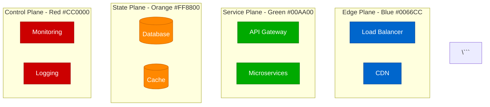

# CLAUDE.md

This file provides guidance to Claude Code (claude.ai/code) when working with code in this repository.

## Project Overview

This is the **Atlas Distributed Systems Architecture Framework** - a production-focused documentation system designed to create **900 battle-tested Mermaid diagrams** documenting distributed systems patterns, guarantees, and mechanisms that help engineers debug issues at 3 AM.

**Key Principle**: Every diagram must help someone fix a production issue. If it doesn't help during an incident, during debugging, during capacity planning, or during architecture decisions - it doesn't belong here.

## Execution Strategy

> **📊 Live Metrics**: All project metrics are maintained in `/site/data/CENTRAL_METRICS.json`
>
> Run `python scripts/unified_status_tracker.py --dashboard` for current status
>
> Run `python scripts/unified_status_tracker.py --update-central` to update metrics

### Philosophy
- **Production reality over academic theory**
- **Quality Gate**: "Does this help at 3 AM?"
- **Focus**: Real incidents, actual metrics, production configs

### Primary Execution Documents
- **EXECUTION_MASTER.md**: Main guide with 9-12 month realistic timeline and team of 3-4 engineers
- **execution/EXECUTION.md**: Daily workflow and weekly checklist system
- **execution/DIAGRAM_STRATEGY.md**: Comprehensive strategy for creating 900-1500 diagrams

## Project Structure

The codebase has two main components:

1. **Site Documentation** (`/site/`): MkDocs-based documentation site for the Distributed Systems Framework
2. **Atlas Specifications** (`/readonly-spec/`): Ultra-detailed specifications for building the 900+ diagram system

### Site Directory Structure
```
site/
├── docs/                    # Markdown documentation with embedded Mermaid
│   ├── guarantees/         # System guarantees
│   ├── mechanisms/         # Implementation mechanisms
│   ├── patterns/           # Architecture patterns
│   ├── systems/            # Architecture Deep-Dives (30 companies)
│   │   ├── netflix/        # 8 Netflix diagrams
│   │   ├── uber/           # 8 Uber diagrams
│   │   └── [28 more]       # 8 diagrams each
│   ├── incidents/          # Incident Anatomies (100)
│   ├── performance/        # Performance Profiles (80)
│   ├── costs/              # Cost Breakdowns (60)
│   ├── scaling/            # Scale Journeys (80)
│   ├── migrations/         # Migration Playbooks (60)
│   ├── debugging/          # Debugging Guides (100)
│   ├── capacity/           # Capacity Models (60)
│   └── comparisons/        # Technology Comparisons (40)
├── scripts/                # Automation tools
├── data/                   # Progress tracking
├── EXECUTION_MASTER.md     # Primary execution guide
├── execution/              # Daily execution workflow
└── .github/workflows/      # CI/CD automation
```

## Content Distribution (900 Total Diagrams)

| Category | Count | Purpose | Timeline |
|----------|-------|---------|----------|
| **Architecture Deep-Dives** | 240 | 30 systems × 8 diagrams | Weeks 7-9 |
| **Incident Anatomies** | 100 | Learn from real failures | Weeks 9-10 |
| **Debugging Guides** | 100 | Troubleshooting maps | Weeks 9-10 |
| **Scale Journeys** | 80 | Evolution with growth | Weeks 7-8 |
| **Performance Profiles** | 80 | Real bottlenecks & metrics | Weeks 5-6 |
| **Pattern Implementations** | 80 | Patterns in production | Weeks 1-2 |
| **Cost Breakdowns** | 60 | Infrastructure economics | Weeks 5-6 |
| **Migration Playbooks** | 60 | Transformation strategies | Weeks 7-8 |
| **Capacity Models** | 60 | Planning for scale | Weeks 11-12 |
| **Technology Comparisons** | 40 | Real trade-offs | Weeks 11-12 |

## The 30 Must-Document Systems

### Tier 1: The Giants (8 diagrams each = 80 diagrams)
1. **Netflix** - Microservices, Chaos Engineering
2. **Uber** - Real-time matching, Geo-distributed
3. **Amazon** - Everything (DynamoDB, S3, Lambda)
4. **Google** - Spanner, BigTable, Borg
5. **Meta/Facebook** - TAO, Social Graph
6. **Microsoft** - Azure, Cosmos DB, Teams
7. **LinkedIn** - Kafka creators, Professional network
8. **Twitter/X** - Timeline generation, Real-time
9. **Stripe** - Payment processing, Financial consistency
10. **Spotify** - Music streaming, Discovery algorithms

### Tier 2: The Innovators (8 diagrams each = 80 diagrams)
11. **Airbnb** - Search, Pricing, Booking systems
12. **Discord** - Real-time chat/voice at scale
13. **Cloudflare** - Edge computing, DDoS protection
14. **GitHub** - Git at scale, Actions CI/CD
15. **Shopify** - E-commerce platform, Black Friday
16. **DoorDash** - Logistics, Real-time tracking
17. **Slack** - Enterprise messaging, Search
18. **Pinterest** - Visual discovery, Image serving
19. **Twitch** - Live streaming, Chat scale
20. **Coinbase** - Crypto exchange, Matching engine

### Tier 3: The Specialists (8 diagrams each = 80 diagrams)
21. **Reddit** - Comment trees, Voting system
22. **Datadog** - Metrics ingestion, Time series
23. **Robinhood** - Stock trading, Market data
24. **Zoom** - Video conferencing, WebRTC
25. **TikTok** - Recommendation algorithm, CDN
26. **Square** - Payment processing, Hardware
27. **Snap** - Ephemeral messaging, Stories
28. **Dropbox** - File sync, Storage optimization
29. **Instacart** - Grocery logistics, Inventory
30. **OpenAI** - LLM serving, ChatGPT scale

## Mandatory 8 Diagrams Per System

For each of the 30 systems, these 8 diagrams are REQUIRED:

### 1. Complete Architecture - "The Money Shot"
- Every component with AWS/GCP instance types
- Real production numbers (not estimates)
- Connection timeouts and retry configs
- Actual costs per component

### 2. Request Flow - "The Golden Path"
- User request traversal through system
- Latency budget at each hop
- Fallback paths for failures
- SLO/SLA annotations (p50, p99, p999)

### 3. Storage Architecture - "The Data Journey"
- Every database with size and type
- Consistency boundaries clearly marked
- Replication lag measurements
- Backup and recovery strategy

### 4. Failure Domains - "The Incident Map"
- Blast radius of each component failure
- Cascading failure paths
- Circuit breakers and bulkheads
- Actual incidents that occurred

### 5. Scale Evolution - "The Growth Story"
- Architecture at 1K, 10K, 100K, 1M, 10M users
- What broke at each level
- How they fixed it
- Cost at each scale point

### 6. Cost Breakdown - "The Money Graph"
- Infrastructure spend by component
- Cost per transaction/request
- Optimization opportunities
- Reserved vs on-demand split

### 7. Novel Solutions - "The Innovation"
- Problems unique to their scale
- Solutions they invented
- Open source contributions
- Patents filed

### 8. Production Operations - "The Ops View"
- Deployment pipeline
- Monitoring and alerting setup
- On-call procedures
- Chaos engineering practices

## Core Architectural Concepts

### 4-Plane Architecture (MANDATORY)
All diagrams MUST use these exact colors:

- **Edge Plane** (Blue #0066CC): CDN, WAF, Load Balancers
- **Service Plane** (Green #00AA00): API Gateway, Business Logic
- **State Plane** (Orange #FF8800): Databases, Caches, Storage
- **Control Plane** (Red #CC0000): Monitoring, Config, Automation

**Note**: The "Stream Plane" has been removed from specifications.

### Content Organization
- **Guarantees**: What the system promises (consistency, availability, etc.)
- **Mechanisms**: How guarantees are implemented (consensus, replication, etc.)
- **Patterns**: Complete architectural solutions combining mechanisms
- **Systems**: Real-world implementations (Netflix, Uber, etc.)

## Common Commands

### Quick Start
```bash
cd site
make serve    # Start development server at http://127.0.0.1:8000
make test     # Run all validations
make build    # Build static site
make clean    # Clean generated files
```

### Development Workflow
```bash
# Install dependencies
make install  # or: pip install mkdocs-material mkdocs-mermaid2-plugin

# Start development
make serve    # Live reload at http://127.0.0.1:8000

# Validate content
make test     # Runs Mermaid and link validation

# Build for deployment
make build    # Generates ./site/ directory

# Deploy to GitHub Pages
make deploy   # Publishes to GitHub Pages
```

### Weekly Execution Scripts
```bash
# Weekly source discovery and prioritization
python scripts/manual_source_discovery.py

# Progress tracking and dashboard generation
python scripts/progress_tracker.py

# Validate mermaid syntax and rendering
python scripts/validate_mermaid.py

# Check for broken links in documentation
python scripts/check_links.py
```

## Working with Mermaid Diagrams

### Direct Markdown Approach
Write Mermaid diagrams directly in markdown files - no intermediate formats needed:

```markdown
# Production Architecture

## Complete System Overview



### Best Practices for Diagrams
1. **Use 4-plane colors** consistently
2. **Include SLO labels** on edges (e.g., "p99: 10ms")
3. **Add real production metrics** with sources
4. **Keep diagrams focused** - one concept per diagram
5. **Use specific technologies** with versions (not "Database")

## Quality Gates

### The 3 AM Test
- [ ] Shows exact error messages to look for
- [ ] Indicates which logs to check
- [ ] Specifies metrics that indicate the issue
- [ ] Includes runbook link or inline instructions
- [ ] Shows recovery procedures

### The New Hire Test
- [ ] No unexplained acronyms
- [ ] Technologies are versioned
- [ ] Data flow is directional
- [ ] Dependencies are explicit
- [ ] Scale metrics are included

### The CFO Test
- [ ] Infrastructure costs are shown
- [ ] ROI of optimizations calculated
- [ ] Cost per user/transaction included
- [ ] Reserved vs on-demand indicated
- [ ] Growth projections costed

### The Incident Test
- [ ] Failure modes documented
- [ ] Blast radius indicated
- [ ] Recovery time specified
- [ ] Data loss potential marked
- [ ] Rollback procedure shown

## Critical Requirements

### Every Diagram Must Include:
- **Real company/system names** (not "Service A")
- **Actual metrics** (not "high performance")
- **Specific technologies** with versions
- **Failure scenarios** and recovery procedures
- **Cost information** where applicable
- **4-plane color scheme** (no exceptions)

### Example: GOOD vs BAD

❌ **BAD - Academic Theory**
```
Client → API Gateway → Microservice → Database
```

✅ **GOOD - Production Reality**
```
iPhone App (2M DAU) → Kong Gateway (p99: 10ms) →
Order Service (Java 17, 200 threads) →
PostgreSQL 14 (db.r6g.2xlarge, 1000 connections)
```

## Weekly Team Workflow (60-80 hours/week combined)

### Monday - Planning & Research (8-10 hours team total)
**Morning (4 hours)**
1. Team sync and weekly planning (1 hour all-hands)
2. Review previous week's diagrams (1 hour)
3. Assign ownership for this week's targets (1 hour)
4. Run `python scripts/manual_source_discovery.py`

**Afternoon (4-6 hours)**
1. Research incident reports and postmortems
2. Interview on-call engineers
3. Collect production metrics from engineering blogs
4. Verify data sources and cross-reference

### Tuesday-Thursday - Creation Sprint (36-48 hours team total)
**Per Engineer Daily (12-16 hours/day team combined)**
1. **Morning (2 hours/engineer)**:
   - Research and data collection for assigned diagrams
   - Verify production metrics and sources
   - Draft initial diagram structures

2. **Afternoon (2-3 hours/engineer)**:
   - Create 1-2 complete diagrams with all annotations
   - Follow 4-plane architecture standards
   - Include real production metrics with sources
   - Add failure scenarios and recovery procedures

**Daily Output**: 3-6 complete diagrams (team total)

### Friday - Validation & Publishing (16-20 hours team total)
**Morning (8-10 hours team combined)**
1. Quality gate reviews for all week's diagrams
2. Revisions based on review feedback
3. Run `python scripts/validate_mermaid.py`

**Afternoon (8-10 hours team combined)**
1. Final reviews and approvals
2. Commit to repository with proper documentation
3. Update tracking with `python scripts/progress_tracker.py`
4. Test rendering with `mkdocs serve`
5. Team retrospective and next week planning

## Success Metrics

### Realistic Velocity Targets (Team Combined)
- **Month 1-2**: 19 diagrams/week (Emergency response focus)
- **Month 3-4**: 25 diagrams/week (Core concepts)
- **Month 5-6**: 19 diagrams/week (Pattern library)
- **Month 7-9**: 20 diagrams/week (Case studies)
- **Month 10-12**: 13 diagrams/week (Polish and gaps)
- **Overall Average**: 19-20 diagrams/week

### Quality Metrics
- **100%** follow 4-plane architecture
- **100%** include real production metrics with sources
- **100%** show failure scenarios and recovery
- **100%** pass all 4 quality gates
- **100%** validated by automated tools
- **0** placeholder or example data

## Dependencies

The project uses minimal dependencies:
- `mkdocs` - Static site generator
- `mkdocs-material` - Material theme
- `mkdocs-mermaid2-plugin` - Mermaid diagram support
- `pymdownx-extensions` - Markdown extensions

Install with: `pip install mkdocs-material mkdocs-mermaid2-plugin`

## Philosophy

This implementation follows the principle of **production reality over academic theory**:
- **Real metrics**: Actual production data from engineering blogs
- **Real incidents**: Learn from actual outages and failures
- **Real costs**: Infrastructure spend and optimization opportunities
- **Real teams**: How actual companies solve problems at scale
- **Fast iteration**: Instant feedback with live reload
- **3 AM value**: Every diagram must help during production incidents

The focus is on **creating battle-tested production wisdom**, not maintaining academic documentation.

## Final Reminder

**This is not documentation. This is collective production wisdom.**

Every diagram represents:
- Hours of debugging at 3 AM
- Millions in infrastructure spend
- Hard-won lessons from operating at scale
- Real incidents and their solutions

We're building an atlas of **battle-tested production architectures** that actually work, actually scale, and actually help engineers build better systems.

*"In production, there are no theoretical problems - only real incidents at 3 AM."*

**The Atlas v4.0 - Where Production Reality Lives**