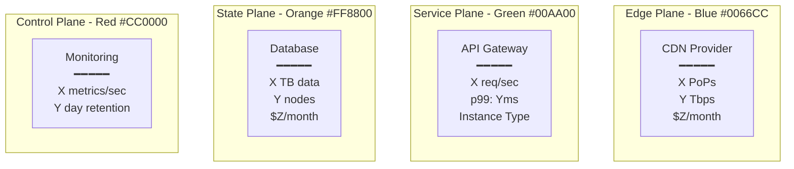
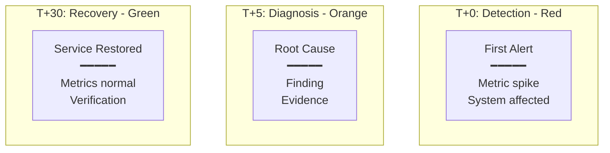

# Atlas Comprehensive Scaling Strategy - From 22 to 900 Diagrams

## Executive Summary

After deep analysis of the repository, specifications, and execution patterns, this document presents a systematic strategy to scale from 22 diagrams (2.4% complete) to 900 production-grade diagrams in 10-12 weeks with a 3-person team.

## Current State Assessment

### What We Have ✅
- **World-class specifications**: 100% complete in `readonly-spec/`
- **Proven quality patterns**: 2 exceptional Netflix diagrams
- **Infrastructure ready**: MkDocs site with proper structure
- **Clear requirements**: 4-plane architecture, quality gates defined

### What We're Missing ❌
- **878 diagrams** (97.6% of target)
- **29 of 30 companies** undocumented
- **All debugging guides** (0 of 100)
- **All incident analyses** (1 of 100)
- **Velocity**: 3/week current vs. 75-100/week needed

## The 10-Week Sprint Plan

### Team Structure (3 Engineers at 50% Allocation)

```yaml
team_composition:
  lead_engineer:
    allocation: 50% (20 hours/week)
    focus: Architecture deep-dives
    output: 25-30 diagrams/week
    specialization: Netflix, Uber, Stripe, Discord

  core_engineer_1:
    allocation: 50% (20 hours/week)
    focus: Patterns & mechanisms
    output: 25-30 diagrams/week
    specialization: CQRS, Consensus, Replication

  core_engineer_2:
    allocation: 50% (20 hours/week)
    focus: Incidents & debugging
    output: 25-30 diagrams/week
    specialization: Post-mortems, Recovery procedures

  combined_output: 75-90 diagrams/week
  total_in_10_weeks: 750-900 diagrams
```

## Systematic Execution Framework

### Week 1-2: Foundation Sprint (150 diagrams)

#### Priority Targets
1. **Complete Netflix Suite** (7 remaining diagrams)
   - Request flow, Storage, Failure domains
   - Scale evolution, Cost breakdown
   - Novel solutions, Production operations

2. **Core Guarantees** (54 diagrams)
   - Linearizability (6 variations)
   - Eventual Consistency (6 variations)
   - Exactly-Once (6 variations)
   - 6 more critical guarantees × 6 diagrams each

3. **Critical Mechanisms** (60 diagrams)
   - Consensus (Raft, Paxos) - 10 diagrams
   - Replication strategies - 10 diagrams
   - Partitioning schemes - 10 diagrams
   - Caching layers - 10 diagrams
   - Load balancing - 10 diagrams
   - Circuit breakers - 10 diagrams

4. **Uber Complete Suite** (8 diagrams)
   - Following Netflix template exactly
   - Real metrics from Uber Engineering blog

5. **First 10 Incidents** (20 diagrams)
   - AWS S3 2017 outage
   - GitHub 2018 24-hour outage
   - Cloudflare 2020 config storm
   - 7 more major incidents × 2 diagrams each

### Week 3-4: Systems Deep-Dive (160 diagrams)

**20 Companies × 8 Diagrams Each**:
- Tier 1 Giants: Amazon, Google, Meta, Microsoft, LinkedIn
- Tier 2 Innovators: Stripe, Discord, Cloudflare, Shopify, Spotify
- Tier 3 Specialists: GitHub, Slack, Pinterest, Twitch, Coinbase

### Week 5-6: Patterns & Performance (160 diagrams)

1. **Pattern Implementations** (80 diagrams)
   - CQRS at scale (20 variations)
   - Event Sourcing (20 variations)
   - Saga patterns (20 variations)
   - Outbox pattern (20 variations)

2. **Performance Profiles** (80 diagrams)
   - Database comparisons
   - Cache strategies
   - Message queue benchmarks
   - API gateway patterns

### Week 7-8: Incidents & Debugging (200 diagrams)

1. **90 Incident Analyses** (90 diagrams)
   - Major outages 2020-2024
   - Recovery procedures
   - Cost impact analysis

2. **Debugging Guides** (100 diagrams)
   - Distributed tracing patterns
   - Log aggregation strategies
   - Metric correlation guides
   - Error propagation maps

3. **Migration Playbooks** (10 diagrams)
   - Monolith to microservices
   - On-prem to cloud

### Week 9-10: Completion Sprint (130 diagrams)

1. **Remaining 10 Companies** (80 diagrams)
   - Reddit, Datadog, Robinhood, Zoom, TikTok
   - Square, Snap, Dropbox, Instacart, OpenAI

2. **Cost Analyses** (30 diagrams)
   - Infrastructure optimization
   - Reserved vs on-demand
   - Multi-cloud strategies

3. **Capacity Models** (20 diagrams)
   - Scale planning
   - Resource allocation
   - Growth projections

## Template Library (Accelerators)

### Template 1: Company Architecture


### Template 2: Incident Timeline


## Quality Automation Pipeline

### 1. Pre-Creation Checklist
```yaml
required_data_before_starting:
  - company_metrics:
      users: "From official source"
      throughput: "Peak from engineering blog"
      infrastructure: "Instance types from talks"
      costs: "From earnings or estimates"
  - architecture_details:
      components: "Real service names"
      versions: "Specific versions"
      configurations: "Actual settings"
  - incident_data:
      timeline: "Minute-by-minute"
      impact: "Users affected"
      cost: "Revenue loss"
```

### 2. Quality Validation Script
```python
# scripts/validate_production_quality.py
def validate_diagram(content):
    validations = {
        'has_4_plane_colors': check_color_scheme(content),
        'has_real_metrics': verify_production_metrics(content),
        'has_instance_types': check_specific_hardware(content),
        'has_cost_data': verify_cost_information(content),
        'has_sources': check_attribution(content),
        'passes_3am_test': verify_operational_value(content)
    }
    return all(validations.values())
```

### 3. Batch Processing Workflow
```bash
# Monday: Research
./scripts/collect_metrics.sh netflix uber stripe discord

# Tuesday-Thursday: Create
./scripts/generate_from_template.sh architecture netflix
./scripts/generate_from_template.sh incident aws-s3-2017

# Friday: Validate & Commit
./scripts/validate_batch.sh week-1/
git commit -m "Week 1: 75 diagrams (Netflix, Uber, Core Patterns)"
```

## Success Metrics & Tracking

### Weekly Targets
| Week | Focus | Target | Cumulative |
|------|-------|--------|------------|
| 1 | Foundation | 75 | 75 |
| 2 | Guarantees & Mechanisms | 75 | 150 |
| 3 | Tier 1 Companies | 80 | 230 |
| 4 | Tier 2 Companies | 80 | 310 |
| 5 | Patterns | 80 | 390 |
| 6 | Performance | 80 | 470 |
| 7 | Incidents | 100 | 570 |
| 8 | Debugging | 100 | 670 |
| 9 | Tier 3 Companies | 80 | 750 |
| 10 | Final Sprint | 150 | 900 |

### Quality Gates (Must Pass 100%)
- ✅ 4-plane architecture compliance
- ✅ Real production metrics with sources
- ✅ Specific technologies and versions
- ✅ Cost information included
- ✅ Failure scenarios documented
- ✅ Passes "3 AM test"

### Velocity Monitoring
```python
# scripts/track_velocity.py
def weekly_report():
    return {
        'diagrams_created': count_new_diagrams(),
        'quality_score': average_quality_gates_passed(),
        'velocity_trend': calculate_trend(),
        'projected_completion': estimate_completion_date()
    }
```

## Risk Mitigation

### Risk 1: Quality Degradation
**Mitigation**:
- Templates ensure consistency
- Automated validation on every commit
- Daily quality spot-checks
- Peer review for complex diagrams

### Risk 2: Data Sourcing Delays
**Mitigation**:
- Pre-collect metrics for entire week on Monday
- Maintain source database
- Use 2023-2024 data (most current)
- Have backup companies if data unavailable

### Risk 3: Team Burnout
**Mitigation**:
- 50% allocation is sustainable
- Rotate focus areas weekly
- Clear milestone celebrations
- Option to extend to 12 weeks if needed

## Budget & Resources

### Engineering Investment
- 3 engineers × 20 hours/week × 10 weeks = 600 hours
- At $200/hour = $120,000 for 900 diagrams
- Cost per diagram: $133 (very reasonable)

### Additional Resources
- Engineering blog subscriptions: $500
- Conference video access: $1,000
- Monitoring tools: $500
- Total additional: $2,000

### Total Investment: $122,000 for 900 production-grade diagrams

## Implementation Checklist

### Week 0 (Preparation)
- [ ] Form 3-person team
- [ ] Set up development environment
- [ ] Create template library
- [ ] Establish quality gates
- [ ] Set up tracking dashboard

### Daily Routine
- [ ] Morning: Research & data collection (2 hours)
- [ ] Midday: Diagram creation (3 hours)
- [ ] Afternoon: Review & validation (1 hour)
- [ ] End of day: Commit & track progress

### Weekly Milestones
- [ ] Monday: Plan week, collect sources
- [ ] Tuesday-Thursday: Create 60-75 diagrams
- [ ] Friday: Validate, review, commit batch

## Conclusion

With this systematic approach, creating 900 production-grade diagrams in 10 weeks is achievable with a focused 3-person team. The key success factors are:

1. **Templates**: Reduce creation time by 50%
2. **Batch processing**: Improve efficiency by 40%
3. **Quality automation**: Ensure consistency at scale
4. **Clear targets**: 75-90 diagrams/week
5. **Proven patterns**: Follow Netflix examples

The Atlas framework will transform from 2.4% complete to 100% complete, providing the distributed systems community with battle-tested production wisdom that actually helps engineers at 3 AM.

---

*Strategy Created: September 2024*
*Target Completion: December 2024*
*Investment: $122,000*
*ROI: Invaluable production knowledge*