# Architecture Contribution Guide
## Adding New Company Architectures to Atlas

### Purpose

This guide enables community members to contribute high-quality company architecture case studies that meet Atlas production standards. Every contribution should help engineers make better design decisions, debug production issues, and understand trade-offs at scale.

### The 8 Mandatory Diagrams

For each company, you MUST create all 8 diagrams. Incomplete submissions will not be accepted.

## 1. COMPLETE ARCHITECTURE - "The Money Shot"

### Purpose
Show every component in the production system with specific technologies, instance types, and real metrics.

### Requirements
- [ ] All services named and versioned
- [ ] Infrastructure specified (AWS m5.2xlarge, GCP n2-standard-16)
- [ ] Connection patterns (REST, gRPC, async)
- [ ] Network topology (VPCs, subnets, zones)
- [ ] 4-plane color coding (Edge, Service, State, Control)

### Template

```mermaid
graph TB
    subgraph "Edge Plane"
        CDN[Cloudflare CDN<br/>2000 POPs worldwide<br/>$50K/month]
        LB[AWS ALB<br/>10 instances<br/>500K req/sec]
    end

    subgraph "Service Plane"
        API[API Gateway<br/>Kong 3.2<br/>c5.4xlarge × 20<br/>$12K/month]
        AUTH[Auth Service<br/>Go 1.21<br/>Istio mesh<br/>$8K/month]
        CORE[Core Service<br/>Java 17 Spring<br/>200 threads<br/>$15K/month]
    end

    subgraph "State Plane"
        PG[(PostgreSQL 14<br/>db.r6g.8xlarge<br/>Multi-AZ<br/>$25K/month)]
        REDIS[(Redis 7<br/>cache.r6g.2xlarge<br/>3 replicas<br/>$8K/month)]
    end

    subgraph "Control Plane"
        MON[Datadog<br/>Full stack monitoring<br/>$20K/month]
        LOG[Splunk<br/>200GB/day<br/>$15K/month]
    end

    %% Apply colors
    classDef edgeStyle fill:#3B82F6,stroke:#2563EB,color:#fff
    classDef serviceStyle fill:#10B981,stroke:#059669,color:#fff
    classDef stateStyle fill:#F59E0B,stroke:#D97706,color:#fff
    classDef controlStyle fill:#8B5CF6,stroke:#7C3AED,color:#fff

    class CDN,LB edgeStyle
    class API,AUTH,CORE serviceStyle
    class PG,REDIS stateStyle
    class MON,LOG controlStyle
```

### Sources Needed
- Engineering blog architecture posts
- Conference presentations (QCon, Strange Loop)
- Infrastructure diagrams from talks
- GitHub repositories (if open source)
- Job postings (tech stack mentions)

## 2. REQUEST FLOW - "The Golden Path"

### Purpose
Trace a typical user request through the system with latency budgets at each hop.

### Requirements
- [ ] User action to response path
- [ ] Latency at each step (p50, p99, p999)
- [ ] Timeout configurations
- [ ] Retry logic
- [ ] Fallback mechanisms
- [ ] SLO annotations

### Template

### Key Metrics to Include
- Request rate (req/sec)
- Latency percentiles (p50, p95, p99, p999)
- Timeout settings
- Retry policies
- Circuit breaker thresholds
- Cache hit rates
- Connection pool sizes

## 3. STORAGE ARCHITECTURE - "The Data Journey"

### Purpose
Show every data store, consistency model, replication strategy, and data flow.

### Requirements
- [ ] All databases with type and size
- [ ] Replication topology
- [ ] Consistency guarantees
- [ ] Backup strategy
- [ ] Data retention policies
- [ ] Migration paths

### Template

### Consistency Levels to Document
- Strong consistency: Which operations?
- Eventual consistency: Typical lag?
- Read-your-writes: Guaranteed where?
- Monotonic reads: Implemented how?
- Causal consistency: Which scenarios?

## 4. FAILURE DOMAINS - "The Incident Map"

### Purpose
Show what fails when each component goes down, blast radius, and recovery procedures.

### Requirements
- [ ] Failure scenarios for each component
- [ ] Blast radius visualization
- [ ] Cascading failure paths
- [ ] Circuit breakers and bulkheads
- [ ] Auto-recovery mechanisms
- [ ] Manual recovery procedures

### Template

### Real Incidents to Reference
For each failure domain, cite actual incidents:
- "Similar to AWS S3 outage 2017-02-28"
- "Comparable to GitHub database failover 2018-10-21"
- "Pattern seen in Cloudflare routing issue 2020-07-17"

## 5. SCALE EVOLUTION - "The Growth Story"

### Purpose
Show how architecture changed at 1K, 10K, 100K, 1M, 10M users.

### Requirements
- [ ] Architecture at each scale milestone
- [ ] What broke at each level
- [ ] How it was fixed
- [ ] Cost at each milestone
- [ ] Team size at each milestone

### Template

### Key Transitions to Document
1. **Monolith → Microservices**: Which service split first?
2. **Single DB → Sharded**: What was the sharding key?
3. **Single Region → Multi-Region**: Why the second region?
4. **Synchronous → Asynchronous**: Which operations first?
5. **Manual → Automated**: When did DevOps mature?

## 6. COST BREAKDOWN - "The Money Graph"

### Purpose
Show infrastructure spend by component and optimization opportunities.

### Requirements
- [ ] Cost per component per month
- [ ] Cost per user/transaction
- [ ] Reserved vs. on-demand split
- [ ] Optimization opportunities identified
- [ ] Cost trend over time
- [ ] ROI of optimizations

### Template

### Cost Data Sources
- AWS Cost Explorer screenshots
- GCP billing reports
- Azure cost management
- Engineering blog cost analyses
- Investor presentations (public companies)
- Job postings mentioning budget

## 7. NOVEL SOLUTIONS - "The Innovation"

### Purpose
Highlight unique problems and solutions invented by this company.

### Requirements
- [ ] Problems unique to their scale
- [ ] Novel solutions they created
- [ ] Open source contributions
- [ ] Patents or papers published
- [ ] Industry influence

### Template

### Innovation Categories
- **Algorithms**: Novel distributed algorithms
- **Protocols**: Custom network protocols
- **Data Structures**: Specialized structures
- **Deployment**: Infrastructure innovations
- **Observability**: Monitoring breakthroughs
- **Resilience**: Failure handling techniques

## 8. PRODUCTION OPERATIONS - "The Ops View"

### Purpose
Show how the system is deployed, monitored, and maintained.

### Requirements
- [ ] CI/CD pipeline
- [ ] Deployment strategy (blue-green, canary, etc.)
- [ ] Monitoring and alerting
- [ ] On-call procedures
- [ ] Chaos engineering practices
- [ ] Incident response process

### Template

### Operations Metrics to Include
- Deployment frequency: Daily? Weekly?
- Lead time: Commit to production?
- MTTR: Mean time to recovery?
- Change failure rate: Percentage?
- On-call load: Pages per week?
- Incident frequency: Count per month?

---

## RESEARCH METHODOLOGY

### Finding Information

**Primary Sources** (Best)
1. Official engineering blogs
2. Conference presentations
3. Academic papers by engineers
4. Open-source repositories
5. Official documentation

**Secondary Sources** (Good)
1. Tech interview podcasts
2. Engineering job postings
3. LinkedIn posts by engineers
4. Twitter threads from insiders
5. Startup showcase presentations

**Tertiary Sources** (Use Cautiously)
1. News articles (verify claims)
2. Industry analyst reports
3. Third-party case studies
4. Forum discussions
5. Speculation posts

### Verification Process

**Cross-Reference Everything**
- Minimum 3 independent sources per major claim
- Check publication dates (recent preferred)
- Verify author credentials
- Look for corroborating evidence

**Red Flags**
- Single source for major claims
- Outdated information (>3 years for architecture)
- Vague language ("high performance", "scales well")
- Missing specifics (instance types, metrics)
- Marketing language without technical depth

### Ethical Research

**Respect Boundaries**
- Use only publicly available information
- Don't reverse engineer closed systems
- Don't share confidential information
- Don't contact engineers for proprietary details
- Attribute all sources properly

**When Uncertain**
- Mark as "estimated" or "approximate"
- Explain reasoning and assumptions
- Invite corrections from insiders
- Update when better information available

---

## SUBMISSION CHECKLIST

Before submitting your PR:

### Completeness
- [ ] All 8 diagrams created
- [ ] Each diagram follows template structure
- [ ] 4-plane colors applied consistently
- [ ] Real metrics included (not placeholders)
- [ ] Failure scenarios documented

### Quality
- [ ] Passes 3 AM Test (helps in production)
- [ ] Passes New Hire Test (understandable)
- [ ] Passes CFO Test (costs included)
- [ ] Passes Incident Test (failures documented)

### Sources
- [ ] Minimum 10 sources cited
- [ ] Each major claim has 3+ sources
- [ ] All links work and are archived
- [ ] Publication dates within 3 years (preferred)
- [ ] Author credentials verified

### Technical Accuracy
- [ ] Mermaid syntax validated
- [ ] Instance types are real (not generic)
- [ ] Metrics are realistic for scale
- [ ] Architecture is feasible
- [ ] Costs align with industry norms

### Documentation
- [ ] README updated with company addition
- [ ] Navigation updated in mkdocs.yml
- [ ] Related diagrams linked
- [ ] Tags and categories assigned

---

**Remember**: Quality over speed. One excellent company architecture is worth ten mediocre ones. Take time to research thoroughly, verify claims, and create diagrams that truly help engineers at 3 AM.

**🚀 [START YOUR RESEARCH →](./research-template.md)**
**📝 [SUBMIT YOUR ARCHITECTURE →](https://github.com/atlas-community/atlas-framework/issues/new?template=new-company.md)**