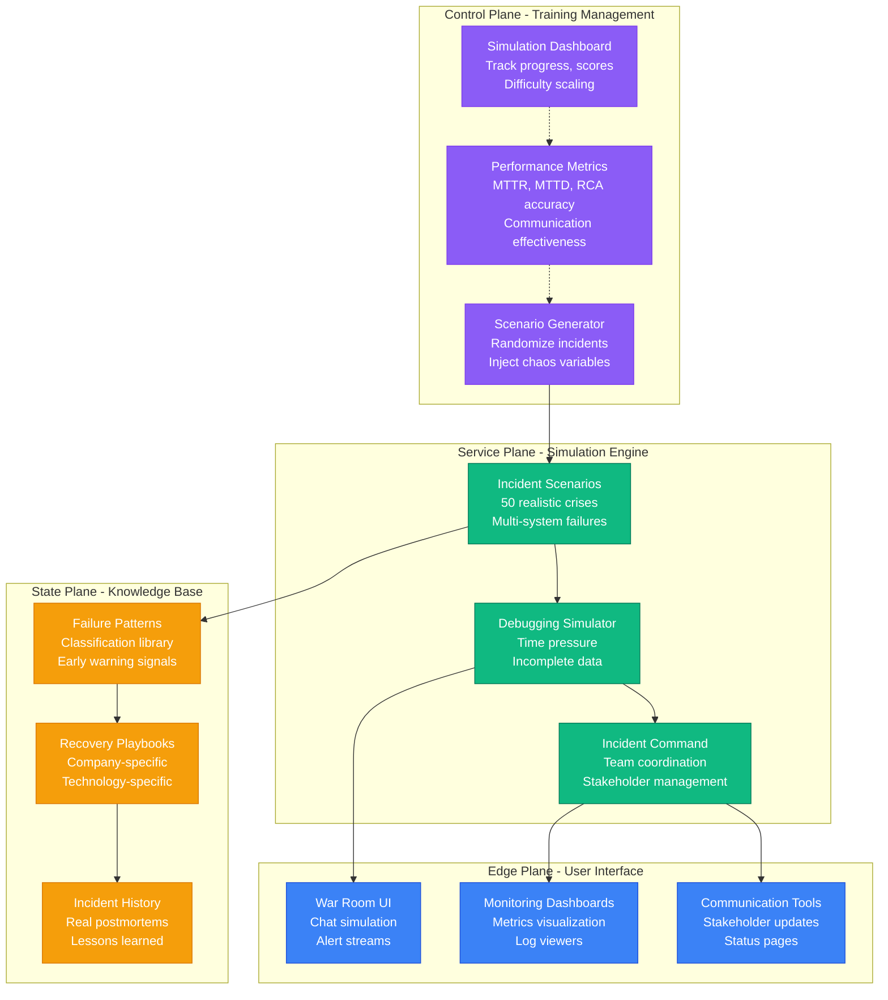

# Production Incident Simulation System
## Immersive Training for Real-World Crisis Management

### Overview

This simulation system prepares distributed systems engineers for the reality of production incidents through immersive, stress-tested scenarios based on actual outages from the 30 companies documented in the Atlas framework.

**Core Philosophy**: You can't learn to handle 3 AM production crises by reading theory. You need to simulate the chaos, the pressure, the incomplete information, and the stakeholder demands.

### System Components



### Training Pathways

| Level | Duration | Scenarios | Success Criteria |
|-------|----------|-----------|------------------|
| **Junior (L3-L4)** | 40 hours | 15 scenarios | MTTR <60min, 70% RCA accuracy |
| **Mid-Level (L5)** | 60 hours | 25 scenarios | MTTR <45min, 85% RCA accuracy |
| **Senior (L6+)** | 80 hours | 35 scenarios | MTTR <30min, 95% RCA accuracy |
| **Incident Commander** | 100 hours | 50 scenarios | MTTR <20min, leadership eval |

### Key Features

#### 1. Realistic Time Pressure
- Clock starts immediately when scenario loads
- Real-time alerts continue to fire
- Stakeholders demand updates every 15 minutes
- Performance degrades if not mitigated quickly

#### 2. Incomplete Information
- Monitoring gaps (some metrics missing)
- Conflicting data from different sources
- Red herrings that waste investigation time
- Delayed availability of critical logs

#### 3. Multi-System Complexity
- Cascading failures across services
- Multiple potential root causes
- Cross-team coordination required
- Competing priorities and trade-offs

#### 4. Communication Challenges
- Write status updates for non-technical executives
- Balance transparency with accuracy
- Manage customer expectations
- Coordinate with distributed teams

#### 5. Real-World Constraints
- Budget limits on scaling decisions
- SLA obligations and penalties
- On-call engineer fatigue modeling
- Limited access to production systems

### Directory Structure

```
incident-simulations/
├── scenarios/                    # 50 detailed incident scenarios
│   ├── tier1-giants/            # Netflix, Uber, Amazon, etc. (16 scenarios)
│   ├── tier2-innovators/        # Airbnb, Discord, GitHub, etc. (17 scenarios)
│   └── tier3-specialists/       # Reddit, Datadog, Robinhood, etc. (17 scenarios)
├── frameworks/                   # Simulation frameworks
│   ├── 3am-debugging-simulator.md
│   ├── stress-testing-protocol.md
│   └── performance-evaluation.md
├── command-training/            # Incident command scenarios
│   ├── team-coordination.md
│   ├── stakeholder-management.md
│   ├── decision-making.md
│   └── postmortem-writing.md
├── failure-patterns/            # Comprehensive failure library
│   ├── cascading-failures.md
│   ├── data-corruption.md
│   ├── performance-degradation.md
│   ├── security-breaches.md
│   └── capacity-exhaustion.md
├── war-room-exercises/          # Team collaboration drills
│   ├── distributed-debugging.md
│   ├── information-sharing.md
│   ├── escalation-procedures.md
│   └── multi-team-coordination.md
└── README.md                    # This file
```

### How to Use This System

#### Solo Practice Mode
1. Choose a scenario based on your level
2. Set a timer and start the simulation
3. Work through the incident using available tools
4. Document your decisions and rationale
5. Compare your approach to the expert solution
6. Review lessons learned and patterns identified

#### Team Practice Mode
1. Assign roles (Incident Commander, Engineers, Communications)
2. Run the scenario with simulated time pressure
3. Practice real-time communication and coordination
4. Make trade-off decisions as a team
5. Conduct blameless postmortem
6. Rotate roles and repeat

#### Assessment Mode
1. Random scenario selection (no preview)
2. Timed performance evaluation
3. Multiple metrics tracked (MTTR, accuracy, communication)
4. Peer review of incident response
5. Certification upon passing all levels

### Success Metrics

#### Technical Metrics
- **MTTD** (Mean Time To Detection): How quickly you identify the root cause
- **MTTR** (Mean Time To Recovery): How quickly you restore service
- **RCA Accuracy**: Correctness of root cause analysis
- **Prevention Quality**: Effectiveness of proposed improvements

#### Operational Metrics
- **Communication Clarity**: Quality of status updates
- **Decision Speed**: Time to make critical decisions
- **Collaboration Effectiveness**: Team coordination quality
- **Stakeholder Management**: Executive satisfaction scores

#### Learning Metrics
- **Pattern Recognition**: Ability to identify known failure modes
- **Cross-System Thinking**: Connecting failures across services
- **Debugging Methodology**: Systematic vs random investigation
- **Prevention Mindset**: Proactive improvements suggested

### Integration with Atlas Framework

Each simulation directly references:
- **Architecture Diagrams**: From `/site/docs/systems/[company]/`
- **Real Incidents**: From `/site/docs/incidents/`
- **Debugging Guides**: From `/site/docs/debugging/`
- **Failure Domains**: From company-specific failure analysis
- **Recovery Procedures**: From production operations docs

### Getting Started

1. **Assess Your Level**: Start with the self-assessment quiz
2. **Pick Your First Scenario**: Choose based on comfort level
3. **Set Up Your Environment**: Prepare monitoring dashboards and tools
4. **Run the Simulation**: Follow the scenario instructions
5. **Review and Learn**: Compare your approach to expert solution
6. **Iterate**: Move to more complex scenarios

### Certification Levels

- **Bronze**: Complete 15 Junior scenarios with 70%+ scores
- **Silver**: Complete 25 Mid-level scenarios with 85%+ scores
- **Gold**: Complete 35 Senior scenarios with 95%+ scores
- **Platinum**: Complete all 50 scenarios + Incident Commander assessment

---

*"The best engineers aren't the ones who've never faced production issues. They're the ones who've learned from every incident they've handled."*

**Your Mission**: Master production incident response through deliberate practice with realistic, high-pressure simulations.