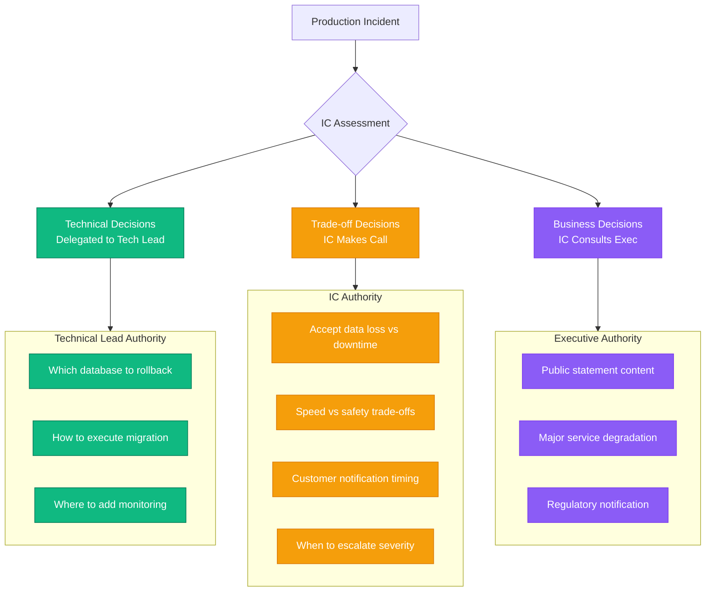

# Incident Commander Handbook
## Leadership Training for Production Crises

### Overview

Being an Incident Commander (IC) is fundamentally different from being an engineer debugging a problem. As IC, your job is to coordinate people, make decisions with incomplete information, manage stakeholders, and maintain calm when everyone else is panicking.

**Core Truth**: Technical skills get you 40% of the way. Leadership, communication, and decision-making under pressure are the other 60%.

---

## The Incident Commander Role

### What an IC Does (vs What They Don't Do)

```yaml
IC Primary Responsibilities:
  ✅ Coordinate response team
  ✅ Make go/no-go decisions
  ✅ Manage stakeholder communication
  ✅ Maintain incident timeline
  ✅ Ensure documentation
  ✅ Decide when to escalate
  ✅ Call incident resolved

IC Does NOT:
  ❌ Debug the technical issue (delegates this)
  ❌ Write code or execute commands
  ❌ Get into technical weeds
  ❌ Compete with technical leads
  ❌ Make unilateral technical decisions
  ❌ Disappear to investigate alone
```

### Decision Authority Framework



---

## Training Exercise 1: Multi-Team Coordination

### Scenario: Database Migration Gone Wrong

**Context**: Saturday 2 AM migration to new Cassandra cluster version caused data corruption affecting 5% of users.

**Your Team**:
- **You**: Incident Commander
- **Database Team** (3 engineers): Can restore from backup but takes 4 hours
- **Application Team** (2 engineers): Can deploy workaround in 30 minutes but degrades performance
- **SRE Team** (4 engineers): Can failover to old cluster immediately but loses recent data
- **Product Manager**: Wants minimal customer impact
- **VP Engineering**: Wants to know costs and timeline

### Exercise: Navigate the Coordination

#### T+5 minutes: War Room Opens

```
[02:05] sarah-db: Corruption detected in users table. Affects 5% of records.
[02:05] mike-app: Seeing failed logins for those users. Customer tickets spiking.
[02:06] lisa-sre: Old cluster still available. Can failover but lose last 2 hours of data.
[02:06] david-product: How many users affected? What's the customer experience?
[02:07] jane-vp: What are our options? How long for each? I need numbers.

[02:07] YOU (IC): [Your response here - coordinate the chaos]
```

**Your Actions**:

**Step 1: Establish Order (2 minutes)**
```
Your Message:
━━━━━━━━━━━━━━━━━━━━━━━━━━━━━━━━━━━
Everyone, thank you for joining quickly.

INCIDENT DECLARED: SEV-1
Impact: 5% users cannot login (data corruption)

ROLES:
@sarah-db - Technical Lead (DB recovery)
@lisa-sre - Infrastructure Lead (failover options)
@mike-app - Application Lead (workarounds)
@david-product - Business Impact assessment
@jane-vp - Executive stakeholder

COMMUNICATION:
- Updates: Every 15 minutes
- Technical discussion: #incident-tech thread
- This channel: Decisions and coordination only

Stand by for options assessment.
━━━━━━━━━━━━━━━━━━━━━━━━━━━━━━━━━━━
```

**Step 2: Gather Options (5 minutes)**
```
Your Questions:
━━━━━━━━━━━━━━━━━━━━━━━━━━━━━━━━━━━
@sarah-db: Backup restore option
- Time to complete?
- Data loss window?
- Risk level?

@lisa-sre: Failover option
- Time to complete?
- Data loss amount?
- Can we sync later?

@mike-app: Application workaround
- Time to deploy?
- Performance impact?
- User experience?

I need answers in 5 minutes. Go.
━━━━━━━━━━━━━━━━━━━━━━━━━━━━━━━━━━━
```

**Step 3: Decision Matrix (3 minutes)**

Responses come in:
```yaml
Option A - Full Backup Restore:
  Time: 4 hours
  Data Loss: None
  Risk: Medium (restore might fail)
  User Impact: 4 hours downtime for affected users

Option B - Failover to Old Cluster:
  Time: 10 minutes
  Data Loss: 2 hours of all users' data
  Risk: Low
  User Impact: 10 min downtime, lost recent actions

Option C - Application Workaround:
  Time: 30 minutes
  Data Loss: None
  Risk: Medium (performance degradation)
  User Impact: Slow login (5s → 15s), no data loss

Option D - Hybrid (C then A):
  Time: 30 min + 4 hours
  Data Loss: None
  Risk: Medium
  User Impact: Degraded for 30 min, then normal
```

**Your Decision** (choose and justify):

```
IC DECISION:
━━━━━━━━━━━━━━━━━━━━━━━━━━━━━━━━━━━
We're going with Option D (Hybrid):

IMMEDIATE (next 30 min):
@mike-app: Deploy workaround NOW. This gives us breathing room.

PARALLEL WORK:
@sarah-db: Start backup restore process immediately.
@lisa-sre: Keep old cluster ready as Plan B.

RATIONALE:
- Workaround stops the bleeding fast (30 min)
- Full restore preserves all data (4 hours)
- Zero data loss acceptable for extra time
- Old cluster failover remains our emergency escape hatch

STAKEHOLDERS:
@david-product: Prepare customer communication (degraded performance incoming)
@jane-vp: 30 min to workaround, 4 hours to full resolution, zero data loss

Questions? Concerns? Speak now or forever hold your peace.
Time is 02:15. Next update 02:30.
GO GO GO.
━━━━━━━━━━━━━━━━━━━━━━━━━━━━━━━━━━━
```

#### Evaluation Criteria

**Coordination (30 points)**:
- [ ] Established clear roles (5 pts)
- [ ] Maintained single source of truth (5 pts)
- [ ] Kept technical discussion organized (5 pts)
- [ ] Ensured all voices heard (5 pts)
- [ ] Prevented chaos/overlap (5 pts)
- [ ] Documented decisions clearly (5 pts)

**Decision-Making (40 points)**:
- [ ] Gathered all options quickly (10 pts)
- [ ] Assessed trade-offs systematically (10 pts)
- [ ] Made timely decision (10 pts)
- [ ] Justified reasoning clearly (10 pts)

**Communication (30 points)**:
- [ ] Clear, concise updates (10 pts)
- [ ] Appropriate detail level (10 pts)
- [ ] Managed stakeholder expectations (10 pts)

---

## Training Exercise 2: Stakeholder Management

### Scenario: CEO in the War Room

**Context**: Major outage during product launch. CEO joins war room 10 minutes in. You're IC.

```
[14:10] @ceo: What the hell is going on? This is our biggest launch of the year!
[14:10] @ceo: How long until we're back up?
[14:10] @ceo: Who's responsible for this?
[14:11] @ceo: The press is already calling. What do I tell them?

[Meanwhile in tech thread]
[14:11] sarah-tech: Still investigating. Could be database, could be cache...
[14:11] mike-tech: I'm seeing weird patterns in logs. Need 10 more minutes.
```

**Your Challenge**:
- Keep CEO informed without technical jargon
- Don't let CEO derail technical investigation
- Maintain calm and confidence
- Provide honest assessment with uncertainty

**Bad Response** (loses control):
```
[14:11] YOU: @ceo Uh, we're looking into it. The engineers are investigating.
                There's something weird with the logs. We're not sure yet.

[14:12] @ceo: "Not sure"? That's not acceptable. Get me answers NOW.
[14:12] @ceo: Pull everyone in. I want all hands on deck.

[Result: CEO micromanaging, team distracted, chaos ensues]
```

**Good Response** (maintains control):
```
[14:11] YOU: @ceo Understood. Here's where we are:

IMPACT: Product launch page not loading. 100% of users affected.
TIMELINE: Issue started 14:03. Currently 8 minutes in.
INVESTIGATION: Technical team is systematically ruling out causes.
           We'll have root cause in 10-15 minutes.
MITIGATION: If we don't identify cause by 14:25, we'll execute
           emergency rollback to previous version.

PRESS STATEMENT (suggested):
"We're experiencing technical difficulties with our launch.
 Our team is actively working to resolve this. We'll provide
 updates within the hour."

I'll update you every 15 minutes. Next update: 14:25.
War room focused on resolution. Let me do my job.

[14:12] @ceo: Thank you. Keep me posted. What do you need from me?

[14:13] YOU: Clear the path if we need emergency approvals.
           Otherwise, let the team work. We've got this.

[Result: CEO confident, team uninterrupted, control maintained]
```

### Key Principles

```yaml
Executive Communication Rules:
  1. Lead with impact and timeline
  2. Show you have a plan
  3. Acknowledge their concerns
  4. Set boundaries professionally
  5. Provide specific next update time
  6. Never say "I don't know" without "but here's what we're doing to find out"

What Executives Need:
  ✅ Confidence you're in control
  ✅ Clear timeline (even if estimate)
  ✅ Business impact assessment
  ✅ What they should tell customers
  ✅ When they'll hear from you again

What They Don't Need:
  ❌ Technical details
  ❌ Play-by-play debugging
  ❌ Speculation
  ❌ Excuses or blame
  ❌ Uncertainty without plan
```

---

## Training Exercise 3: The Impossible Decision

### Scenario: Data Loss vs Downtime

**Context**: Critical database corruption detected. You have two options, both terrible.

```yaml
Current State:
  - 18% of user data corrupted (not critical data yet)
  - Corruption spreading: 3% per hour
  - System still running, most users unaffected

Option A - Immediate Shutdown:
  Action: Stop all writes, prevent further corruption
  Upside: Caps corruption at 18%, saves 82% of data
  Downside: Complete service outage for 6-8 hours during recovery
  Business Impact: $8M revenue loss, major customer churn

Option B - Keep Running:
  Action: Let system run while we fix corruption
  Upside: No downtime, users can keep working
  Downside: Corruption spreads to 100% by tomorrow
  Business Impact: Catastrophic data loss, company reputation destroyed

Time to Decide: 10 minutes before corruption reaches critical systems
```

**The Decision Process**:

```
IC DECISION FRAMEWORK:
━━━━━━━━━━━━━━━━━━━━━━━━━━━━━━━━━━━

STEP 1: Clarify the Stakes (2 minutes)
Questions to Engineering:
- How certain are we about corruption spread rate?
- Is there Option C we haven't thought of?
- Can we isolate corrupted data?
- What's the worst case if we wait 30 more minutes?

STEP 2: Consult Stakeholders (3 minutes)
Questions to Product:
- Which user data is most critical?
- What's worse: downtime or data loss?
- Can users work offline during fix?

Questions to Legal:
- Regulatory implications of data corruption?
- Customer contract obligations?
- Data breach notification requirements?

STEP 3: Make the Call (2 minutes)
Decision Matrix:
                    Option A      Option B
Likelihood of success:  85%          20%
User impact:           High          Catastrophic
Revenue impact:        $8M           $50M+
Recovery time:         8 hours       Weeks
Reputation damage:     Moderate      Severe
Legal risk:            Low           High

DECISION: Option A (Immediate Shutdown)

STEP 4: Communicate Decision (3 minutes)
To Team: Clear action plan, roles, timeline
To Executives: Rationale, alternatives considered, timeline
To Customers: Transparent explanation, what to expect
To Legal: Documentation for compliance

STEP 5: Own the Outcome
If it works: Team gets credit
If it fails: You take responsibility
━━━━━━━━━━━━━━━━━━━━━━━━━━━━━━━━━━━
```

### Post-Decision: Owning the Outcome

**Scenario Continues**: Your decision causes 6 hours of downtime. Customers are angry.

**Bad Response** (defensive):
```
"We made the only reasonable decision given the circumstances.
 The alternatives were worse. Not our fault the corruption happened."
```

**Good Response** (ownership):
```
"I made the call to shut down immediately. Given what we knew,
 it was the right decision to prevent catastrophic data loss.
 But I own the impact: 6 hours down, $8M revenue loss, angry customers.

 What we're doing to make this right:
 1. SLA credits for all affected customers
 2. Root cause analysis to prevent recurrence
 3. Better monitoring to catch corruption early
 4. Improved backup procedures

 This happened on my watch as IC. I take full responsibility
 for the outcome, good and bad."
```

---

## Training Exercise 4: Postmortem Leadership

### Writing a Blameless Postmortem

**Bad Example** (blame-focused):
```markdown
# Incident Postmortem: Production Outage

## What Went Wrong
Engineer Mike deployed code without proper testing, which caused
the database to fail. This led to a 4-hour outage affecting all users.

## Root Cause
Human error. Mike didn't follow the deployment checklist.

## Action Items
- Remind engineers to follow procedures
- Add more approval gates
- Mike to receive additional training
```

**Good Example** (systems-focused):
```markdown
# Incident Postmortem: Production Outage

## Timeline
- 14:03: Deployment initiated by Engineer Mike
- 14:05: Database connection pool exhausted
- 14:12: Incident detected via monitoring
- 14:15: Incident Commander assigned
- 14:35: Root cause identified
- 18:10: Service restored

## Impact
- Duration: 4 hours 7 minutes
- Users affected: 100% (450K users)
- Revenue loss: $1.2M
- Customer tickets: 8,400

## Root Cause Analysis (5 Whys)
1. Why did the outage occur?
   → Database connection pool exhausted

2. Why was the connection pool exhausted?
   → New code created 10x more connections per request

3. Why didn't we catch this in testing?
   → Staging environment has 1/100th production load

4. Why don't we load test before deployment?
   → No automated load testing in deployment pipeline

5. Why isn't load testing automated?
   → Team prioritized feature velocity over safety mechanisms

## What Went Well
- Monitoring detected issue within 9 minutes
- War room assembled quickly
- Rollback executed safely
- Communication clear and timely
- No data loss occurred

## What Went Poorly
- Deployment lacked load testing
- No connection pool monitoring
- Rollback took longer than optimal
- Customer communication delayed 30 minutes

## Action Items (Prioritized)

### Immediate (This Week)
- [ ] Add connection pool monitoring and alerting
- [ ] Implement automated rollback triggers
- [ ] Create customer communication templates

### Short-term (This Month)
- [ ] Add load testing to deployment pipeline
- [ ] Scale staging to 10% of production size
- [ ] Implement gradual rollout for all deployments

### Long-term (This Quarter)
- [ ] Build automated canary analysis
- [ ] Implement feature flags for risky changes
- [ ] Create deployment confidence scoring

## Lessons Learned
This incident revealed gaps in our deployment safety net.
The engineer followed our documented procedures correctly.
The procedures themselves were insufficient.

We're addressing this systemically, not punitively.
```

### Facilitation Skills

```yaml
Postmortem Meeting (60 minutes):

Introduction (5 min):
  - Set tone: Blameless, learning-focused
  - State goal: Prevent recurrence, not assign blame
  - Ground rules: No interrupting, assume positive intent

Timeline Review (10 min):
  - Walk through events factually
  - Let participants correct/add details
  - Note emotions/stress points

Root Cause Analysis (20 min):
  - Use 5 Whys technique
  - Encourage multiple perspectives
  - Look for systemic causes

What Went Well (10 min):
  - Celebrate good responses
  - Identify strengths to maintain
  - Give specific praise

Action Items (15 min):
  - Brainstorm improvements
  - Prioritize by impact
  - Assign owners and deadlines
  - Make commitments realistic
```

---

## Certification Assessment

### Final Exercise: Complex Multi-Incident

**Scenario**: Friday evening, three simultaneous issues:

```yaml
Incident 1: Database Performance Degradation
  Severity: SEV-2
  Impact: 20% of users experiencing slow page loads
  Team: 3 database engineers available

Incident 2: Payment Processing Failure
  Severity: SEV-1
  Impact: All payments failing (100% error rate)
  Team: 2 payment engineers available

Incident 3: CDN Certificate Expiring
  Severity: SEV-2
  Impact: Will affect 100% users in 3 hours
  Team: 1 infra engineer available

Available: You (IC), 1 other IC, 6 engineers total
Decision: How do you orchestrate response?
```

**Your Assessment**:

1. **Triage and Prioritize** (5 minutes)
2. **Assign Resources** (3 minutes)
3. **Coordinate Across Incidents** (Ongoing)
4. **Communicate to Stakeholders** (Every 15 min)
5. **Make Trade-off Decisions** (As needed)
6. **Document Everything** (Continuous)

**Success Criteria**:
- All incidents resolved within acceptable time
- Resources used efficiently
- No secondary incidents created
- Stakeholders kept informed
- Team morale maintained
- Blameless postmortem produced

---

## Key Competencies

```yaml
Technical Skills (30%):
  - Understand system architecture
  - Read metrics and logs
  - Assess technical proposals
  - Recognize patterns

Leadership Skills (40%):
  - Coordinate multiple teams
  - Make decisions under uncertainty
  - Manage conflicts and stress
  - Maintain team morale

Communication Skills (30%):
  - Translate technical → business
  - Manage stakeholder expectations
  - Write clear status updates
  - Facilitate postmortems
```

---

*"An Incident Commander's job is not to be the smartest person in the room. It's to make the room work together effectively toward resolution."*

**Great ICs make everyone around them better under pressure.**