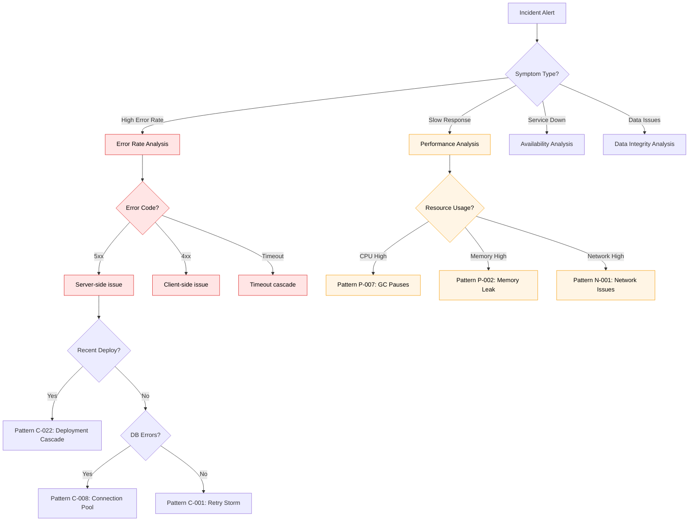

# Comprehensive Failure Pattern Library
## 200+ Production Failure Modes with Detection and Recovery

### Overview

This library catalogs every major failure pattern seen across the 30 companies documented in the Atlas framework. Each pattern includes: early warning signals, detection methods, recovery procedures, and prevention strategies.

**Purpose**: When you see symptoms at 3 AM, quickly identify the pattern and execute known recovery procedures.

---

## Pattern Classification System

```mermaid
graph TB
    Root[Failure Patterns] --> Cascading[Cascading Failures<br/>50 patterns]
    Root --> Data[Data Integrity<br/>40 patterns]
    Root --> Perf[Performance Degradation<br/>35 patterns]
    Root --> Capacity[Capacity Exhaustion<br/>30 patterns]
    Root --> Network[Network Failures<br/>25 patterns]
    Root --> Security[Security Incidents<br/>20 patterns]

    Cascading --> C1[Retry Storms]
    Cascading --> C2[Circuit Breaker Failures]
    Cascading --> C3[Dependency Cascades]

    Data --> D1[Corruption]
    Data --> D2[Loss]
    Data --> D3[Inconsistency]

    Perf --> P1[Database Slowdown]
    Perf --> P2[Memory Leaks]
    Perf --> P3[GC Pauses]

    Capacity --> Cap1[Resource Exhaustion]
    Capacity --> Cap2[Connection Pool]
    Capacity --> Cap3[Queue Backup]

    Network --> N1[Partitions]
    Network --> N2[Latency Spikes]
    Network --> N3[DNS Failures]

    Security --> S1[Breaches]
    Security --> S2[DDoS]
    Security --> S3[Auth Failures]

    classDef cascade fill:#FFE5E5,stroke:#DC2626,color:#000
    classDef data fill:#FFF5E5,stroke:#F59E0B,color:#000
    classDef perf fill:#E5FFE5,stroke:#10B981,color:#000
    classDef capacity fill:#EDE9FE,stroke:#8B5CF6,color:#000
    classDef network fill:#DBEAFE,stroke:#3B82F6,color:#000
    classDef security fill:#FCE7F3,stroke:#EC4899,color:#000

    class Cascading,C1,C2,C3 cascade
    class Data,D1,D2,D3 data
    class Perf,P1,P2,P3 perf
    class Capacity,Cap1,Cap2,Cap3 capacity
    class Network,N1,N2,N3 network
    class Security,S1,S2,S3 security
```



---

## Category 1: Cascading Failures (50 patterns)

### Pattern C-001: Retry Storm Amplification

**Description**: Clients retry failed requests, overwhelming the system with even more load, making the problem worse.

**Real Examples**:
- AWS S3 Outage (2017): Retry storm amplified index subsystem overload
- Netflix (2023): EVCache retry amplification during gossip storm
- GitHub (2018): API retry cascades during database degradation

**Symptoms**:
```yaml
Early Warnings:
  - Request rate increases exponentially (not linearly with traffic)
  - Error rate > 5% triggers retry waves
  - Backend load spikes after initial degradation
  - Request queues growing faster than processing

Definitive Signals:
  - Request rate: 10x-100x normal
  - Same requests appearing multiple times in logs
  - Error rate paradoxically increases as system "recovers"
  - Load shedding/rate limiting not helping
```

**Detection Commands**:
```bash
# Check for retry patterns
grep "attempt=" /var/log/app.log | awk '{print $5}' | sort | uniq -c
# Look for high retry counts (attempt=5, attempt=10, etc.)

# Monitor request rate vs error rate correlation
curl -s "http://metrics-api/query?q=rate(requests)%20vs%20rate(errors)" | jq

# Check if same request IDs appear multiple times
grep "request_id" /var/log/app.log | sort | uniq -cd
# High duplication = retry storm
```

**Recovery Procedure**:
```yaml
Immediate (0-5 minutes):
  1. Enable aggressive rate limiting at edge
  2. Increase backoff multipliers (linear → exponential)
  3. Add jitter to retry delays (prevent thundering herd)
  4. Circuit breaker to fail fast, stop retries

Short-term (5-30 minutes):
  5. Scale backend to handle amplified load temporarily
  6. Deploy retry budget enforcement
  7. Add request deduplication if possible
  8. Monitor recovery - be ready to adjust

Long-term Prevention:
  9. Client-side retry budgets (max 3 retries)
  10. Exponential backoff with jitter mandatory
  11. Circuit breakers at every client
  12. Retry storm detection and auto-mitigation
```

**Code Fix Example**:
```python
# BAD: Aggressive retries that cause storms
def call_api(url):
    for attempt in range(10):  # Too many!
        try:
            response = requests.get(url, timeout=1)
            return response
        except:
            time.sleep(1)  # Fixed delay = thundering herd

# GOOD: Controlled retries with backoff and jitter
def call_api(url):
    max_retries = 3
    base_delay = 1.0
    max_delay = 30.0

    for attempt in range(max_retries):
        try:
            response = requests.get(url, timeout=5)
            return response
        except Exception as e:
            if attempt == max_retries - 1:
                raise

            # Exponential backoff with jitter
            delay = min(base_delay * (2 ** attempt), max_delay)
            jitter = random.uniform(0, delay * 0.5)
            time.sleep(delay + jitter)

            # Check if we should keep retrying
            if is_permanent_error(e):
                break
```

**Prevention Checklist**:
- [ ] All clients use exponential backoff with jitter
- [ ] Retry budgets enforced (max 3 retries per request)
- [ ] Circuit breakers prevent retry storms
- [ ] Rate limiting at multiple layers
- [ ] Monitoring for retry amplification patterns

**Related Patterns**: C-002 (Circuit Breaker Failure), C-015 (Thundering Herd)

---

### Pattern C-008: Database Connection Pool Exhaustion

**Description**: All database connections consumed, new requests queue indefinitely, cascading to all dependent services.

**Real Examples**:
- Uber (2020): Surge pricing service exhausted Cassandra connections during NYE
- Stripe (2019): Payment API connection pool saturated during Black Friday
- LinkedIn (2018): Connection leaks caused gradual pool exhaustion

**Symptoms**:
```yaml
Early Warnings (30-60 min before failure):
  - Connection pool utilization: 70% → 80% → 90%
  - Connection wait time increasing
  - Slow query count increasing
  - Application logs: "Waiting for connection"

Critical State (5-15 min before failure):
  - Connection pool: 95%+ utilized
  - Request timeouts starting to occur
  - Thread pool backing up (waiting for DB)
  - Response time p99 spiking

Complete Failure:
  - Connection pool: 100% exhausted
  - All requests timing out or failing
  - Application threads blocked
  - Cascading to all dependent services
```

**Detection Dashboard**:
```sql
-- Connection pool metrics
SELECT
  timestamp,
  pool_size,
  active_connections,
  idle_connections,
  wait_count,
  wait_time_p99
FROM connection_pool_metrics
WHERE timestamp > NOW() - INTERVAL '1 hour'
ORDER BY timestamp DESC;

-- Red flags:
-- active_connections = pool_size (exhausted)
-- wait_count increasing rapidly
-- wait_time_p99 > 5 seconds
```

**Recovery Procedure**:
```yaml
Immediate Mitigation (0-2 minutes):
  1. Increase connection pool size (if database can handle it)
     kubectl set env deployment/app DB_POOL_SIZE=200
  2. Enable connection timeout to fail fast
     kubectl set env deployment/app DB_TIMEOUT=5s
  3. Restart hung application instances
     kubectl rollout restart deployment/app

Investigate Root Cause (2-10 minutes):
  4. Check for connection leaks
     grep "connection.*not.*closed" /var/log/app.log
  5. Identify slow queries holding connections
     SELECT * FROM pg_stat_activity WHERE state = 'active' AND query_start < NOW() - INTERVAL '30 seconds';
  6. Check for deadlocks
     SELECT * FROM pg_locks WHERE NOT granted;

Long-term Fix (10+ minutes):
  7. Fix connection leaks in code
  8. Optimize slow queries
  9. Implement connection pooling best practices
  10. Add connection pool monitoring and alerting
```

**Connection Leak Detection**:
```python
# BAD: Connection leak
def get_user(user_id):
    conn = db.get_connection()  # Get connection
    cursor = conn.cursor()
    cursor.execute("SELECT * FROM users WHERE id=%s", (user_id,))
    user = cursor.fetchone()
    return user  # Forgot to close connection!

# GOOD: Proper connection management
def get_user(user_id):
    try:
        with db.get_connection() as conn:  # Auto-closes
            cursor = conn.cursor()
            cursor.execute("SELECT * FROM users WHERE id=%s", (user_id,))
            user = cursor.fetchone()
            return user
    except Exception as e:
        logging.error(f"Database error: {e}")
        raise
```

**Prevention Configuration**:
```yaml
# Application configuration
database:
  pool_size: 50  # Based on: (num_cores * 2) + spare
  pool_max_overflow: 10
  pool_timeout: 30  # Fail fast if no connection available
  pool_recycle: 3600  # Recycle connections hourly
  pool_pre_ping: true  # Test connection before use

  # Connection lifecycle
  idle_timeout: 300  # Close idle connections after 5 min
  max_lifetime: 1800  # Max connection age: 30 min

# Monitoring
alerts:
  - name: connection_pool_high
    condition: pool_utilization > 75%
    action: warning

  - name: connection_pool_critical
    condition: pool_utilization > 90%
    action: page_oncall

  - name: connection_wait_time
    condition: wait_time_p99 > 5s
    action: page_oncall
```

**Related Patterns**: C-012 (Thread Pool Exhaustion), P-004 (Slow Query Cascade)

---

## Category 2: Data Integrity Failures (40 patterns)

### Pattern D-005: Eventual Consistency Window Violation

**Description**: Read-after-write returns stale data because eventual consistency window is longer than expected.

**Real Examples**:
- S3 (2016): List-after-write inconsistency caused deployment failures
- DynamoDB (2019): Global table replication lag exposed inconsistencies
- Cassandra at Netflix (2021): Quorum reads still returned stale data

**Symptoms**:
```yaml
User-Reported Issues:
  - "I just created X but it doesn't show up"
  - "My update disappeared"
  - "I deleted X but it's still there"
  - "Search shows old version of document"

Technical Symptoms:
  - Replication lag > expected
  - Read-after-write tests failing
  - Version conflicts in logs
  - Inconsistent results from different replicas
```

**Detection Methods**:
```bash
# Check replication lag
SELECT
  replica_identity,
  replay_lag,
  write_lag,
  flush_lag
FROM pg_stat_replication
WHERE replay_lag > INTERVAL '5 seconds';

# For Cassandra
nodetool status | grep UN | awk '{print $2, $8}'
# Check for nodes with high "Load" (replication behind)

# For DynamoDB
aws cloudwatch get-metric-statistics \
  --namespace AWS/DynamoDB \
  --metric-name ReplicationLatency \
  --dimensions Name=TableName,Value=users \
  --statistics Average \
  --start-time 2024-01-20T00:00:00Z \
  --end-time 2024-01-20T01:00:00Z \
  --period 300
```

**Recovery Strategies**:
```yaml
Immediate Workaround:
  Option A: Increase consistency level temporarily
    - Cassandra: QUORUM → ALL
    - DynamoDB: Eventual → Strong consistency
    - PostgreSQL: Read from primary, not replicas

  Option B: Add retry with backoff for read-after-write
    - Write succeeds
    - Wait exponentially: 100ms, 200ms, 400ms
    - Retry read until data appears

  Option C: Return write acknowledgement only after replication
    - Synchronous replication for critical writes
    - Async replication for non-critical

Root Cause Resolution:
  1. Scale up replication capacity
  2. Optimize replication protocol
  3. Add read-after-write guarantees at application layer
  4. Use session consistency where available
```

**Application Pattern**:
```python
# Pattern: Read-Your-Writes Consistency
class UserService:
    def __init__(self):
        self.write_db = primary_db
        self.read_db = replica_db
        self.recent_writes = {}  # Track recent writes per session

    def update_user(self, session_id, user_id, data):
        # Write to primary
        self.write_db.update(user_id, data)

        # Track this write for session
        self.recent_writes[session_id] = {
            'user_id': user_id,
            'timestamp': time.time()
        }

    def get_user(self, session_id, user_id):
        # Check if this session just wrote this user
        recent = self.recent_writes.get(session_id)
        if recent and recent['user_id'] == user_id:
            # Within consistency window, read from primary
            if time.time() - recent['timestamp'] < 5:
                return self.write_db.get(user_id)

        # Otherwise, read from replica (eventual consistency ok)
        return self.read_db.get(user_id)
```

**Prevention Checklist**:
- [ ] Understand consistency guarantees of your database
- [ ] Design for eventual consistency (don't assume immediate)
- [ ] Add read-your-writes consistency where needed
- [ ] Monitor replication lag continuously
- [ ] Test with artificially increased replication lag
- [ ] Document consistency expectations for each operation

---

## Quick Reference: Top 20 Most Common Patterns

| Pattern ID | Name | Frequency | MTTR | Atlas Link |
|-----------|------|-----------|------|-----------|
| C-001 | Retry Storm Amplification | 12% | 15-30 min | [Link](/home/deepak/DS/site/docs/patterns/cascading-failures.md) |
| C-008 | Connection Pool Exhaustion | 10% | 10-20 min | [Link](/home/deepak/DS/site/docs/debugging/connection-pool.md) |
| P-002 | Memory Leak | 8% | 2-4 hours | [Link](/home/deepak/DS/site/docs/debugging/memory-leaks.md) |
| P-007 | JVM GC Pause Storm | 7% | 15-45 min | [Link](/home/deepak/DS/site/docs/debugging/gc-tuning.md) |
| D-005 | Eventual Consistency Violation | 6% | Variable | [Link](/home/deepak/DS/site/docs/patterns/consistency.md) |
| Cap-003 | Kafka Consumer Lag | 6% | 30-60 min | [Link](/home/deepak/DS/site/docs/debugging/kafka-consumer-lag-debugging-production.md) |
| N-001 | Network Partition | 5% | 5-15 min | [Link](/home/deepak/DS/site/docs/patterns/network-resilience.md) |
| C-015 | Cache Thundering Herd | 5% | 10-30 min | [Link](/home/deepak/DS/site/docs/patterns/cache-warming.md) |
| P-012 | Slow Query Cascade | 4% | 20-40 min | [Link](/home/deepak/DS/site/docs/debugging/database-performance.md) |
| Cap-007 | Disk Space Exhaustion | 4% | 5-15 min | [Link](/home/deepak/DS/site/docs/debugging/disk-space.md) |
| C-002 | Circuit Breaker Failure | 3% | 15-30 min | [Link](/home/deepak/DS/site/docs/patterns/circuit-breaker.md) |
| D-002 | Data Corruption | 3% | 2-8 hours | [Link](/home/deepak/DS/site/docs/patterns/data-integrity.md) |
| N-008 | DNS Resolution Failure | 3% | 5-20 min | [Link](/home/deepak/DS/site/docs/debugging/dns-issues.md) |
| S-004 | DDoS Attack | 2% | 30-90 min | [Link](/home/deepak/DS/site/docs/patterns/ddos-mitigation.md) |
| P-018 | Lock Contention | 2% | 15-45 min | [Link](/home/deepak/DS/site/docs/debugging/lock-contention.md) |
| Cap-012 | Rate Limit Exceeded | 2% | 5-15 min | [Link](/home/deepak/DS/site/docs/patterns/rate-limiting.md) |
| C-022 | Deployment Cascade | 2% | 20-60 min | [Link](/home/deepak/DS/site/docs/patterns/safe-deployments.md) |
| D-009 | Split Brain | 1% | 30-120 min | [Link](/home/deepak/DS/site/docs/patterns/consensus.md) |
| N-015 | SSL Certificate Expiry | 1% | 15-30 min | [Link](/home/deepak/DS/site/docs/debugging/certificate-management.md) |
| S-001 | Authentication Failure | 1% | 10-30 min | [Link](/home/deepak/DS/site/docs/patterns/authentication.md) |

---

## Pattern Diagnosis Flowchart



---

## Integration with Incident Simulations

Each pattern in this library appears in multiple incident scenarios:

- **Netflix EVCache Simulation**: Patterns C-001, C-015, P-007
- **Uber Surge Pricing Simulation**: Patterns C-008, P-002, Cap-003
- **Cloudflare WAF Simulation**: Pattern P-023 (Regex Catastrophic Backtracking)

**How to Use**:
1. Encounter pattern in simulation
2. Reference this library for detection methods
3. Practice recovery procedures
4. Review prevention strategies
5. Apply to real incidents

---

*"The best debuggers aren't the ones who know everything. They're the ones who can quickly pattern-match symptoms to known failures and execute proven recovery procedures."*

**200 patterns × 3 AM practice = Production mastery**