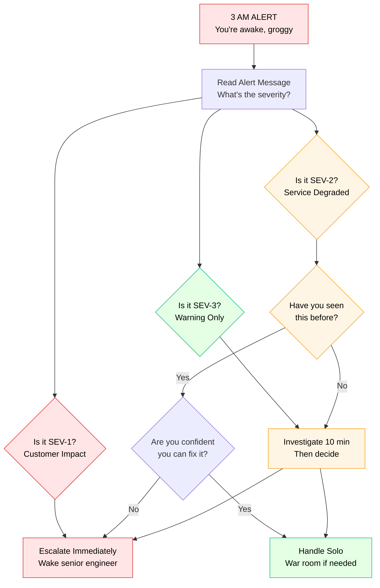
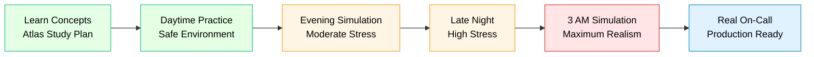

# The 3 AM Debugging Simulator
## Stress-Testing Framework for Production Incident Response

### Overview

This simulator replicates the cognitive and emotional challenges of being woken at 3 AM to handle a production crisis. It's designed to build muscle memory for incident response when you're tired, stressed, and under extreme pressure.

**Core Principle**: You can't learn to debug at 3 AM by practicing at 2 PM when you're fresh. You need to train under realistic conditions.

---

## Simulation Environment Setup

### Physical Conditions

```yaml
Time Constraints:
  Start Time: Between 2 AM - 4 AM (your local time)
  Alert Method: Loud alarm + phone vibration
  Initial State: Wake from sleep (or simulate with fatigue)
  No Preparation: Cold start, no context loading

Environmental Stressors:
  - Dim lighting only (no bright lights)
  - Use laptop from bed/couch (no proper desk setup)
  - No coffee for first 10 minutes
  - Background: Partner/family sleeping nearby (be quiet)

Cognitive Load:
  - Sleep debt: Operate after <6 hours sleep
  - Context switching: No warm-up time
  - Decision fatigue: Make critical calls immediately
  - Emotional pressure: Real stakes (simulated)
```

### Technical Environment

```yaml
Tools Available:
  Primary:
    - Laptop (not your main machine)
    - VPN connection
    - PagerDuty app
    - Slack mobile
    - SSH/kubectl access
    - Monitoring dashboards

  Deliberately Limited:
    - ❌ No IDE (terminal only)
    - ❌ No saved commands/aliases
    - ❌ No runbook open beforehand
    - ❌ No teammates online yet (first 10 min)

Network Constraints:
  - Simulate VPN latency: Add 200-500ms
  - Occasional connection drops
  - Some dashboards load slowly
  - Log search has timeout issues
```

---

## The 3 AM Incident Response Protocol

### Phase 1: The Wake-Up (T+0 to T+5 minutes)

#### Your Physical State
```yaml
Sleep Disruption:
  - Jolted awake by loud PagerDuty alert
  - 3:24 AM - you've been asleep for 2 hours
  - Grogginess level: SEVERE
  - Cognitive function: 40% of normal
  - Heart racing, mild panic

Initial Actions (in order):
  1. Acknowledge alert (stop the noise)
  2. Read alert message (may need 2-3 reads to comprehend)
  3. Check your phone - how bad is it?
  4. Decide: Can I handle this or escalate immediately?
  5. Get laptop, start VPN connection
```

#### Decision Tree: Handle or Escalate?



#### Simulator Evaluation Criteria

**Score deductions for common mistakes**:
- Acknowledged alert but went back to sleep: -50 points
- Didn't check related alerts: -20 points
- Started investigating without war room: -15 points
- Forgot to update status page: -25 points
- Made risky change without backup plan: -30 points

---

### Phase 2: Initial Triage (T+5 to T+15 minutes)

#### Cognitive Challenges Simulated

```yaml
Attention Issues:
  - Struggle to focus on dense log output
  - Miss obvious patterns in metrics
  - Forget to check basic things (deployment history)
  - Confuse similar-looking service names

Memory Issues:
  - Can't remember exact kubectl commands
  - Forget which dashboard shows what
  - Mix up production vs staging endpoints
  - Lose track of investigation thread

Decision-Making Issues:
  - Analysis paralysis (too many options)
  - Impulse decisions (rush to "fix" it)
  - Second-guessing yourself repeatedly
  - Difficulty prioritizing next steps
```

#### The Triage Checklist

**Force yourself to go through this, even when panicking**:

```bash
# 1. WHAT IS BROKEN? (2 minutes)
echo "Service: ______________"
echo "Symptom: ______________"
echo "Impact: ______________"
echo "Users affected: ______________"

# 2. WHEN DID IT START? (2 minutes)
echo "Alert time: ______________"
echo "First symptom: ______________"
echo "Recent deployments: ______________"
echo "Recent config changes: ______________"

# 3. WHAT CHANGED? (3 minutes)
git log --since="2 hours ago" --oneline
kubectl rollout history deployment/service-name
aws cloudtrail lookup-events --start-time $(date -u -d "2 hours ago" +%Y-%m-%dT%H:%M:%S)

# 4. WHAT'S THE BLAST RADIUS? (2 minutes)
echo "Regions affected: ______________"
echo "Dependent services: ______________"
echo "Customer impact: ______________"
echo "Revenue impact: ______________"

# 5. WHAT'S MY FIRST ACTION? (2 minutes)
echo "Immediate mitigation: ______________"
echo "Backup plan if that fails: ______________"
echo "Point of no return: ______________"
```

#### Simulator Features

**Realistic Time Pressure**:
```yaml
Interruptions:
  T+6 min: Phone call from on-call manager
  T+9 min: Slack messages from support team (15 messages)
  T+12 min: Customer tweet goes viral
  T+14 min: CEO joins war room channel

Mental State Changes:
  T+0-5 min: Panic, confusion, grogginess
  T+5-10 min: Adrenaline kicks in, focus improving
  T+10-15 min: Either gaining clarity OR spiraling
  T+15+ min: Fatigue setting in, need second wind
```

---

### Phase 3: Investigation Under Pressure (T+15 to T+30 minutes)

#### The Investigation Maze

**Simulator presents you with**:

```yaml
10 Potential Leads (only 2-3 are relevant):
  ✅ Lead A: Deployment 20 minutes ago (RELEVANT)
  ✅ Lead B: Database CPU spike (RELEVANT)
  ❌ Lead C: Network blip 2 hours ago (RED HERRING)
  ❌ Lead D: Minor config change yesterday (UNRELATED)
  ❌ Lead E: Disk space at 75% (NORMAL)
  ❌ Lead F: Error in logs from last week (OLD)
  ❌ Lead G: Monitoring alert flap (FALSE ALARM)
  ✅ Lead H: Cache hit rate dropped (RELEVANT)
  ❌ Lead I: API rate limit reached (SYMPTOM NOT CAUSE)
  ❌ Lead J: Another service slow (CASCADED EFFECT)

Time Spent Per Lead:
  Optimal: 2-3 minutes each, discard quickly
  Typical at 3 AM: 5-8 minutes each, pursue too long
  Danger: 10+ minutes on red herrings
```

#### Decision Fatigue Simulation

**After 15 minutes of investigation, you face**:

```
DECISION POINT 1: Mitigation Strategy

You've identified: Recent deployment likely caused this.

Choose your action (30 seconds to decide):

A) Rollback immediately
   - Fixes issue in ~10 minutes
   - Risk: May cause brief outage during rollback
   - Confidence: 85%

B) Scale up service capacity
   - Might help in ~5 minutes
   - Risk: Won't fix root cause, costly
   - Confidence: 40%

C) Investigate 10 more minutes
   - Might find better solution
   - Risk: Impact continues, CEO is watching
   - Confidence: Unknown

D) Restart affected pods
   - Quick bandaid in ~2 minutes
   - Risk: Might not help, might make worse
   - Confidence: 50%

Your choice: _____ (DECIDE NOW, timer running)
```

#### Stress Multipliers

```yaml
Simultaneous Pressures:
  Technical:
    - Error rate climbing (18% → 24% → 31%)
    - Database connections exhausting
    - Disk filling up on some nodes
    - Cascade to dependent services starting

  Business:
    - Revenue loss: $2M/minute
    - Customer tweets trending
    - Support ticket queue: 8,500 and growing
    - Press inquiring about outage

  Social:
    - Manager asking for updates every 3 minutes
    - CEO wants explanation
    - Support lead panicking in Slack
    - Your phone ringing (ignore or answer?)

  Personal:
    - Partner woke up, asking if you'll be long
    - You really need to use bathroom
    - Your laptop battery at 15%
    - Cat walking on keyboard
```

---

### Phase 4: Execution and Recovery (T+30 to T+60 minutes)

#### Command Execution Under Stress

**Simulator tracks your mistakes**:

```bash
# Common 3 AM errors (all based on real incidents)

# 1. Wrong environment
kubectl delete pod service-name-abc123
# You just deleted PRODUCTION pod (meant staging)
# Score: -100 points, incident severity increased

# 2. Typo in critical command
kubectl scale deployment service-name --replicas=0
# You meant 30, you typed 0
# Score: -150 points, service now completely down

# 3. Forgot to verify before executing
rm -rf /var/log/application/*
# Forgot you were in wrong directory
# Score: -200 points, deleted production data

# 4. Pushed bad config
kubectl apply -f config.yaml
# Didn't review changes, broke another service
# Score: -75 points, cascading failure

# 5. Missed obvious validation
psql -h prod-db -U admin -c "UPDATE users SET password='reset';"
# Forgot WHERE clause, reset ALL user passwords
# Score: -300 points, security incident created
```

#### Recovery Validation Checklist

**Prevent declaring victory too early**:

```yaml
Before Saying "It's Fixed":
  Primary Metrics:
    - [ ] Error rate back to baseline (<0.1%)
    - [ ] Response time p99 normal (<100ms)
    - [ ] CPU/Memory usage stable
    - [ ] No alerts firing

  Secondary Validation:
    - [ ] Checked dependent services
    - [ ] Verified database health
    - [ ] Confirmed cache warmth
    - [ ] Tested end-to-end flows

  Business Validation:
    - [ ] Customer reports stopped
    - [ ] Support tickets declining
    - [ ] No new Twitter complaints
    - [ ] Revenue rate normalized

  Operational Validation:
    - [ ] Runbook updated
    - [ ] Postmortem scheduled
    - [ ] On-call notes documented
    - [ ] Team debriefed
```

---

## Psychological Training Elements

### Stress Inoculation

```yaml
Graduated Exposure:
  Week 1-2: Daytime simulations (build skills)
  Week 3-4: Evening simulations (moderate fatigue)
  Week 5-6: Late night simulations (11 PM - 1 AM)
  Week 7-8: True 3 AM simulations (2 AM - 4 AM)

Stress Escalation:
  Level 1: Solo incident, low stakes
  Level 2: War room coordination, medium stakes
  Level 3: CEO watching, high stakes
  Level 4: Multi-system cascade, critical stakes
```

### Emotional Regulation Training

```yaml
Panic Response Management:
  Recognition: "I'm panicking, not thinking clearly"
  Breathing: 4-7-8 technique (4 sec in, 7 hold, 8 out)
  Grounding: Physical sensation (cold water on face)
  Refocus: Return to checklist, one step at a time

Impostor Syndrome Handling:
  Thought: "I don't know what I'm doing"
  Reframe: "I'm figuring it out step by step"
  Evidence: "I've solved incidents before"
  Action: "Focus on next small action"

Decision Paralysis:
  Symptom: Staring at screen, not acting
  Trigger: Set 2-minute decision timer
  Method: Pick best option NOW, adjust later
  Principle: "Done is better than perfect at 3 AM"
```

---

## Performance Metrics

### Technical Competency

```yaml
Speed Metrics:
  MTTD (Mean Time To Detection): <5 minutes
  MTTI (Mean Time To Investigation): <15 minutes
  MTTD (Mean Time To Decision): <20 minutes
  MTTR (Mean Time To Recovery): <45 minutes

Accuracy Metrics:
  Root Cause Accuracy: >85%
  False Lead Rate: <30%
  Command Error Rate: <5%
  Rollback Necessity: <20%
```

### Operational Metrics

```yaml
Communication:
  First Update Latency: <5 minutes
  Update Frequency: Every 10-15 minutes
  Clarity Score: >80% (peer rated)
  Stakeholder Satisfaction: >75%

Decision Quality:
  Correct First Decision: >60%
  Adaptation After New Info: <5 minutes
  Risk Assessment Accuracy: >70%
  Escalation Timing: Appropriate 90%+
```

### Psychological Metrics

```yaml
Stress Management:
  Panic Duration: <3 minutes
  Focus Maintenance: >80% of incident
  Emotional Regulation: Self-reported 7+/10
  Post-Incident Recovery: <24 hours

Cognitive Performance:
  Mental Clarity: Self-rated 6+/10
  Decision Confidence: 70%+
  Memory Accuracy: >80%
  Attention Span: Sustained 30+ min
```

---

## Training Progression

### Beginner Level (Weeks 1-4)

```yaml
Scenarios: 8 simulations
Difficulty: Simple, single-service issues
Time: Daytime and evening only
Support: Mentor available on Slack
Success: 60%+ score, MTTR <60 min

Example Scenarios:
  - Pod crash loop from config error
  - Database connection pool exhaustion
  - Cache expiration causing load spike
  - API rate limit reached
```

### Intermediate Level (Weeks 5-8)

```yaml
Scenarios: 12 simulations
Difficulty: Multi-service, cascading failures
Time: Late night (11 PM - 1 AM)
Support: Mentor on-call but delayed response
Success: 75%+ score, MTTR <45 min

Example Scenarios:
  - Deployment causes chain reaction
  - Network partition splits cluster
  - Resource exhaustion cascade
  - Cache stampede after eviction
```

### Advanced Level (Weeks 9-12)

```yaml
Scenarios: 16 simulations
Difficulty: Complex, novel failure modes
Time: True 3 AM (2 AM - 4 AM)
Support: Solo for first 15 minutes
Success: 85%+ score, MTTR <30 min

Example Scenarios:
  - Protocol version mismatch cascade
  - Data corruption from race condition
  - Security incident during outage
  - Multi-region failure correlation
```

### Expert Level (Weeks 13-16)

```yaml
Scenarios: 20 simulations
Difficulty: Worst-case, everything broken
Time: 3 AM with additional stressors
Support: You ARE the escalation point
Success: 90%+ score, Incident Commander capable

Example Scenarios:
  - Multiple simultaneous incidents
  - Incomplete/misleading monitoring data
  - Key personnel unreachable
  - Decision with no good options
```

---

## Realism Enhancements

### Environmental Authenticity

```yaml
Physical Stressors:
  - Actual sleep interruption (not simulated)
  - Limited bathroom breaks during critical phases
  - No food/caffeine for first 15 minutes
  - Uncomfortable seating position
  - Poor lighting conditions
  - Background distractions

Technical Constraints:
  - Slow VPN connection (artificial latency)
  - Monitoring dashboard timeouts
  - Log search pagination failures
  - kubectl commands require sudo password (forgot it)
  - SSH connections drop randomly
  - Documentation links are broken
```

### Psychological Authenticity

```yaml
Emotional Stressors:
  - Simulated CEO joining war room
  - Fake Twitter complaints (realistic)
  - Revenue loss counter (ticking up)
  - Customer support panic messages
  - Phone calls during investigation
  - Teammate says "this is really bad"

Cognitive Stressors:
  - Conflicting information from sources
  - Time pressure with countdown clock
  - Multiple alerts firing (prioritize!)
  - Partial information (missing context)
  - Misleading symptoms (red herrings)
  - Someone second-guessing your decisions
```

---

## Success Stories

### Before 3 AM Training
```
Sarah (L5 SRE):
"First time I got paged at 3 AM, I froze. Took me 15 minutes
just to understand what was broken. Made several mistakes
under pressure. Took 2 hours to fix a 30-minute problem."

MTTR: 120 minutes
Confidence: 3/10
Mistakes: 8 critical errors
```

### After 3 AM Training
```
Sarah (L6 SRE):
"Latest 3 AM page, I went through my checklist automatically.
Identified the issue in 8 minutes, executed mitigation calmly,
and resolved it in 35 minutes. Felt in control the whole time."

MTTR: 35 minutes
Confidence: 8/10
Mistakes: 1 minor error
```

---

## Integration with Atlas Framework

### Linked Resources

Every 3 AM simulation references:
- **Debugging Guides**: `/site/docs/debugging/` - Systematic approaches
- **Real Incidents**: `/site/docs/incidents/` - Actual failure patterns
- **Company Architectures**: `/site/docs/systems/` - System context
- **Runbooks**: Company-specific recovery procedures

### Progression Path



---

*"You don't rise to the occasion. You fall to the level of your training. Train for 3 AM, succeed in production."*

**The best engineers aren't the ones who never panic. They're the ones who've trained themselves to function effectively even when panicking.**