# Interactive Diagram System - Technical Specifications
## Transform Static Mermaid Diagrams into Explorable Learning Experiences

### Executive Summary

The Interactive Diagram System converts 900 static Mermaid diagrams into rich, explorable visualizations that enable deep learning through interaction. Users can click, zoom, animate, and simulate failures to understand distributed systems architecture at a visceral level.

**Key Innovation**: Every diagram becomes a mini-simulation environment where learners can experiment with system behavior, visualize data flows, and understand failure modes through direct manipulation.

---

## 🎯 System Objectives

### Core Goals
1. **Clickable Exploration**: Every component reveals detailed specifications on click
2. **Visual Clarity**: Maintain 4-plane color scheme with enhanced interactivity
3. **Performance**: Smooth interactions even with complex 50+ node diagrams
4. **Accessibility**: Full keyboard navigation and screen reader support
5. **Responsive**: Adapt to mobile, tablet, and desktop layouts

### User Experience Goals
- **Discovery**: Encourage exploration through intuitive interactions
- **Understanding**: Visual feedback reinforces learning
- **Retention**: Interactive engagement increases memory formation
- **Confidence**: Hands-on manipulation builds mental models

---

## 🏗️ Architecture Overview

### Component Hierarchy

```
InteractiveDiagramSystem/
├── DiagramViewer/              # Main container component
│   ├── SVGCanvas/             # Rendered diagram surface
│   ├── InteractionLayer/      # Click, hover, drag handlers
│   ├── ZoomPanController/     # Viewport management
│   └── AnimationEngine/       # Data flow animations
│
├── NodeComponents/             # Interactive diagram nodes
│   ├── ServiceNode/           # Microservice components
│   ├── DatabaseNode/          # Data storage nodes
│   ├── LoadBalancerNode/      # Traffic distribution
│   └── QueueNode/             # Message queues
│
├── EdgeComponents/             # Connection visualizations
│   ├── RequestFlow/           # HTTP/RPC connections
│   ├── DataStream/            # Data replication flows
│   └── MetricAnnotation/      # SLO/latency labels
│
├── InteractionModules/         # User interaction features
│   ├── ClickDetails/          # Component info panels
│   ├── HoverTooltips/         # Quick reference popups
│   ├── FlowAnimator/          # Animated data paths
│   └── FailureSimulator/      # Interactive chaos testing
│
└── DataProviders/              # Content management
    ├── DiagramLoader/         # Fetch diagram definitions
    ├── MetadataProvider/      # Component specifications
    └── AnalyticsTracker/      # Interaction telemetry
```

---

## 📐 Technical Design

### 1. Diagram Rendering Pipeline

#### Input: Mermaid Diagram

```mermaid
graph TB
    subgraph EdgePlane["🌐 Edge"]
        CDN["Cloudflare CDN<br/>150+ locations"]
    end

    subgraph ServicePlane["⚙️ Service"]
        API["API Gateway<br/>Kong<br/>p99: 10ms"]
    end

    subgraph StatePlane["💾 State"]
        DB[("PostgreSQL 14<br/>db.r6g.2xlarge<br/>1000 conn")]
    end

    CDN --> API
    API --> DB
```


#### Output: Interactive React Component
```typescript
interface InteractiveDiagram {
  // Diagram metadata
  id: string;
  title: string;
  category: 'systems' | 'patterns' | 'incidents';
  complexity: 'basic' | 'intermediate' | 'advanced';

  // Visual structure
  nodes: InteractiveNode[];
  edges: InteractiveEdge[];
  planes: Plane[];

  // Interactive features
  animations: Animation[];
  simulations: FailureScenario[];
  drillDowns: ComponentDetails[];
}

interface InteractiveNode {
  id: string;
  type: 'service' | 'database' | 'queue' | 'loadbalancer';
  label: string;
  plane: 'edge' | 'service' | 'state' | 'control';

  // Visual properties
  position: { x: number; y: number };
  color: string;
  icon: string;

  // Interactive data
  details: ComponentSpecification;
  metrics: RealTimeMetrics;
  incidents: RelatedIncidents[];

  // Behavior
  onClick: () => void;
  onHover: () => void;
  onDoubleClick: () => void;
}

interface InteractiveEdge {
  id: string;
  source: string;
  target: string;
  type: 'sync' | 'async' | 'streaming';

  // Visual properties
  style: 'solid' | 'dashed' | 'dotted';
  thickness: number;

  // Annotations
  slo: { p50: string; p99: string; p999: string };
  protocol: 'HTTP' | 'gRPC' | 'Kafka' | 'WebSocket';

  // Animation
  flowAnimation: AnimationConfig;
  activeState: boolean;
}
```

### 2. Rendering Strategy

#### Approach 1: Mermaid-to-React Transformation (RECOMMENDED)
**Pros**:
- Maintains Mermaid syntax for content authoring
- Full control over interactivity
- Better performance for complex diagrams

**Implementation**:
```typescript
class MermaidToReactTransformer {
  async transform(mermaidSource: string): Promise<InteractiveDiagram> {
    // Step 1: Parse Mermaid syntax
    const ast = this.parseMermaid(mermaidSource);

    // Step 2: Extract nodes and edges
    const nodes = this.extractNodes(ast);
    const edges = this.extractEdges(ast);

    // Step 3: Enrich with metadata
    const enrichedNodes = await this.enrichNodes(nodes);
    const enrichedEdges = await this.enrichEdges(edges);

    // Step 4: Generate React components
    return this.generateInteractiveComponent({
      nodes: enrichedNodes,
      edges: enrichedEdges,
      metadata: this.extractMetadata(ast)
    });
  }

  private parseMermaid(source: string): AST {
    // Use mermaid parser library
    return mermaid.parse(source);
  }

  private async enrichNodes(nodes: Node[]): Promise<EnrichedNode[]> {
    return Promise.all(nodes.map(async node => {
      // Fetch component specifications from API
      const details = await this.fetchComponentDetails(node.id);

      // Load related incidents
      const incidents = await this.fetchRelatedIncidents(node.type);

      // Get real-time metrics (if available)
      const metrics = await this.fetchMetrics(node.id);

      return {
        ...node,
        details,
        incidents,
        metrics,
        interactive: true
      };
    }));
  }
}
```

#### Approach 2: Enhanced Mermaid Renderer
**Pros**:
- Faster initial development
- Maintains Mermaid ecosystem compatibility

**Cons**:
- Limited customization
- Performance issues with complex interactions

---

### 3. Interactive Features Implementation

#### Feature 1: Clickable Component Details

**Interaction Flow**:
1. User clicks on any diagram node
2. Side panel slides in from right
3. Display detailed specifications
4. Show related diagrams and incidents

**Component Implementation**:
```typescript
const ComponentDetailsPanel: React.FC<ComponentDetailsPanelProps> = ({
  node,
  onClose
}) => {
  const [activeTab, setActiveTab] = useState('specifications');

  return (
    <Panel position="right" width={480} onClose={onClose}>
      <PanelHeader>
        <ComponentIcon type={node.type} />
        <h2>{node.label}</h2>
        <PlaneTag plane={node.plane} />
      </PanelHeader>

      <TabNavigation
        tabs={['specifications', 'metrics', 'incidents', 'references']}
        active={activeTab}
        onChange={setActiveTab}
      />

      <PanelContent>
        {activeTab === 'specifications' && (
          <SpecificationView>
            <Section title="Technology">
              <TechStack>
                {node.details.technology.map(tech => (
                  <TechBadge key={tech.name} {...tech} />
                ))}
              </TechStack>
            </Section>

            <Section title="Configuration">
              <ConfigTable data={node.details.configuration} />
            </Section>

            <Section title="Scaling">
              <ScalingInfo
                current={node.details.scaling.current}
                max={node.details.scaling.max}
                strategy={node.details.scaling.strategy}
              />
            </Section>

            <Section title="Cost">
              <CostBreakdown
                monthly={node.details.cost.monthly}
                perRequest={node.details.cost.perRequest}
                breakdown={node.details.cost.breakdown}
              />
            </Section>
          </SpecificationView>
        )}

        {activeTab === 'metrics' && (
          <MetricsView>
            <MetricChart
              title="Request Rate"
              data={node.metrics.requestRate}
              unit="req/s"
            />
            <MetricChart
              title="Latency Distribution"
              data={node.metrics.latency}
              unit="ms"
            />
            <MetricChart
              title="Error Rate"
              data={node.metrics.errors}
              unit="%"
            />
          </MetricsView>
        )}

        {activeTab === 'incidents' && (
          <IncidentsView>
            {node.incidents.map(incident => (
              <IncidentCard
                key={incident.id}
                title={incident.title}
                date={incident.date}
                severity={incident.severity}
                summary={incident.summary}
                link={incident.postmortem}
              />
            ))}
          </IncidentsView>
        )}

        {activeTab === 'references' && (
          <ReferencesView>
            <RelatedDiagrams diagrams={node.related.diagrams} />
            <ExternalLinks links={node.related.links} />
            <Documentation docs={node.related.docs} />
          </ReferencesView>
        )}
      </PanelContent>
    </Panel>
  );
};
```

#### Feature 2: Hover Tooltips

**Quick Reference Without Clicks**:
```typescript
const InteractiveNode: React.FC<InteractiveNodeProps> = ({ node }) => {
  const [showTooltip, setShowTooltip] = useState(false);
  const [tooltipPosition, setTooltipPosition] = useState({ x: 0, y: 0 });

  const handleMouseEnter = (event: React.MouseEvent) => {
    setTooltipPosition({ x: event.clientX, y: event.clientY });
    setShowTooltip(true);
  };

  return (
    <>
      <g
        onMouseEnter={handleMouseEnter}
        onMouseLeave={() => setShowTooltip(false)}
        onClick={() => onNodeClick(node)}
      >
        {/* Node SVG rendering */}
      </g>

      {showTooltip && (
        <Tooltip position={tooltipPosition}>
          <TooltipContent>
            <h3>{node.label}</h3>
            <Metrics>
              <Metric label="Requests" value={node.metrics.requestRate} />
              <Metric label="P99 Latency" value={node.metrics.p99} />
              <Metric label="Error Rate" value={node.metrics.errorRate} />
            </Metrics>
            <QuickActions>
              <Action>View Details</Action>
              <Action>See Incidents</Action>
            </QuickActions>
          </TooltipContent>
        </Tooltip>
      )}
    </>
  );
};
```

#### Feature 3: Animated Data Flows

**Visualize Request Paths**:
```typescript
const FlowAnimator: React.FC<FlowAnimatorProps> = ({ diagram, scenario }) => {
  const [animationState, setAnimationState] = useState<AnimationState>('idle');
  const [currentStep, setCurrentStep] = useState(0);

  const animateScenario = async (scenario: Scenario) => {
    setAnimationState('playing');

    for (let i = 0; i < scenario.steps.length; i++) {
      const step = scenario.steps[i];
      setCurrentStep(i);

      // Highlight source node
      await highlightNode(step.source, 'active');

      // Animate edge
      await animateEdge(step.edge, {
        duration: step.duration,
        style: step.style
      });

      // Highlight target node
      await highlightNode(step.target, 'receiving');

      // Show step details
      showStepDetails(step);

      // Wait for step duration
      await delay(step.duration);
    }

    setAnimationState('completed');
  };

  const animateEdge = (edgeId: string, config: AnimationConfig) => {
    return new Promise<void>(resolve => {
      const edge = document.getElementById(edgeId);
      if (!edge) return resolve();

      // Create moving dot animation
      const dot = document.createElementNS('http://www.w3.org/2000/svg', 'circle');
      dot.setAttribute('r', '4');
      dot.setAttribute('fill', '#3B82F6');

      // Animate along path
      const animation = dot.animate(
        [
          { offsetDistance: '0%' },
          { offsetDistance: '100%' }
        ],
        {
          duration: config.duration,
          easing: 'ease-in-out',
          fill: 'forwards'
        }
      );

      animation.onfinish = () => {
        dot.remove();
        resolve();
      };

      edge.appendChild(dot);
    });
  };

  return (
    <AnimationController>
      <Timeline
        steps={scenario.steps}
        currentStep={currentStep}
        onStepClick={(index) => setCurrentStep(index)}
      />

      <Controls>
        <Button onClick={() => animateScenario(scenario)}>
          {animationState === 'playing' ? 'Pause' : 'Play'}
        </Button>
        <Button onClick={() => setCurrentStep(0)}>Reset</Button>
        <SpeedControl />
      </Controls>

      <StepDetails step={scenario.steps[currentStep]} />
    </AnimationController>
  );
};
```

#### Feature 4: Failure Simulation

**Interactive Chaos Engineering**:
```typescript
const FailureSimulator: React.FC<FailureSimulatorProps> = ({ diagram }) => {
  const [activeFailures, setActiveFailures] = useState<Failure[]>([]);

  const injectFailure = (failure: Failure) => {
    setActiveFailures([...activeFailures, failure]);

    // Visual changes
    highlightAffectedComponents(failure.blastRadius);
    showFailurePropagation(failure.cascadePath);
    updateSystemMetrics(failure.impact);

    // Educational content
    showFailureExplanation(failure);
    suggestMitigations(failure);
  };

  const availableFailures: FailureScenario[] = [
    {
      id: 'database-down',
      title: 'Primary Database Failure',
      description: 'Simulates complete database outage',
      blastRadius: ['api-gateway', 'auth-service', 'user-service'],
      cascadePath: [
        'database -> api-gateway (connection errors)',
        'api-gateway -> load-balancer (health check fails)',
        'load-balancer -> users (503 errors)'
      ],
      mitigations: [
        'Fail over to read replica',
        'Serve stale data from cache',
        'Enable circuit breaker'
      ],
      impact: {
        availability: -95,
        latency: +10000,
        errors: +98
      }
    },
    {
      id: 'network-partition',
      title: 'Network Partition',
      description: 'Split-brain scenario between data centers',
      blastRadius: ['all-services'],
      visualEffect: 'split-diagram',
      educationalContent: {
        concept: 'CAP Theorem in action',
        explanation: 'When P occurs, choose between C and A',
        realIncident: 'GitHub October 2018 outage'
      }
    }
  ];

  return (
    <SimulatorPanel>
      <FailureScenarioList>
        {availableFailures.map(scenario => (
          <ScenarioCard
            key={scenario.id}
            scenario={scenario}
            onInject={() => injectFailure(scenario)}
            active={activeFailures.some(f => f.id === scenario.id)}
          />
        ))}
      </FailureScenarioList>

      <ActiveFailures>
        {activeFailures.map(failure => (
          <FailureIndicator
            key={failure.id}
            failure={failure}
            onResolve={() => resolveFailure(failure.id)}
          />
        ))}
      </ActiveFailures>

      <ImpactDashboard
        metrics={{
          availability: calculateAvailability(activeFailures),
          latency: calculateLatency(activeFailures),
          throughput: calculateThroughput(activeFailures)
        }}
      />
    </SimulatorPanel>
  );
};
```

---

### 4. Zoom and Pan Implementation

**Smooth Navigation for Complex Diagrams**:
```typescript
const ZoomPanController: React.FC<ZoomPanControllerProps> = ({ children }) => {
  const [transform, setTransform] = useState({
    scale: 1,
    translateX: 0,
    translateY: 0
  });

  const [isDragging, setIsDragging] = useState(false);
  const [dragStart, setDragStart] = useState({ x: 0, y: 0 });

  // Zoom with mouse wheel
  const handleWheel = (event: WheelEvent) => {
    event.preventDefault();

    const zoomDelta = event.deltaY > 0 ? 0.9 : 1.1;
    const newScale = Math.max(0.5, Math.min(4, transform.scale * zoomDelta));

    // Zoom toward mouse position
    const rect = event.currentTarget.getBoundingClientRect();
    const mouseX = event.clientX - rect.left;
    const mouseY = event.clientY - rect.top;

    setTransform({
      scale: newScale,
      translateX: mouseX - (mouseX - transform.translateX) * (newScale / transform.scale),
      translateY: mouseY - (mouseY - transform.translateY) * (newScale / transform.scale)
    });
  };

  // Pan with mouse drag
  const handleMouseDown = (event: React.MouseEvent) => {
    if (event.button === 0) { // Left click
      setIsDragging(true);
      setDragStart({ x: event.clientX, y: event.clientY });
    }
  };

  const handleMouseMove = (event: React.MouseEvent) => {
    if (!isDragging) return;

    const deltaX = event.clientX - dragStart.x;
    const deltaY = event.clientY - dragStart.y;

    setTransform({
      ...transform,
      translateX: transform.translateX + deltaX,
      translateY: transform.translateY + deltaY
    });

    setDragStart({ x: event.clientX, y: event.clientY });
  };

  const handleMouseUp = () => {
    setIsDragging(false);
  };

  // Programmatic zoom controls
  const zoomIn = () => setTransform({ ...transform, scale: transform.scale * 1.2 });
  const zoomOut = () => setTransform({ ...transform, scale: transform.scale * 0.8 });
  const resetZoom = () => setTransform({ scale: 1, translateX: 0, translateY: 0 });
  const fitToScreen = () => {
    // Calculate optimal zoom to fit diagram
    const optimalTransform = calculateFitTransform();
    setTransform(optimalTransform);
  };

  return (
    <div
      className="zoom-pan-container"
      onWheel={handleWheel}
      onMouseDown={handleMouseDown}
      onMouseMove={handleMouseMove}
      onMouseUp={handleMouseUp}
      onMouseLeave={handleMouseUp}
    >
      <ZoomControls>
        <Button onClick={zoomIn} icon="plus" />
        <Button onClick={zoomOut} icon="minus" />
        <Button onClick={fitToScreen} icon="fit" />
        <Button onClick={resetZoom} icon="reset" />
        <ZoomLevel>{Math.round(transform.scale * 100)}%</ZoomLevel>
      </ZoomControls>

      <svg
        style={{
          transform: `scale(${transform.scale}) translate(${transform.translateX}px, ${transform.translateY}px)`,
          transformOrigin: '0 0',
          transition: isDragging ? 'none' : 'transform 0.2s ease'
        }}
      >
        {children}
      </svg>
    </div>
  );
};
```

---

## 🎨 Visual Design Specifications

### 4-Plane Color Scheme (Interactive Enhanced)

```typescript
const PLANE_COLORS = {
  edge: {
    base: '#3B82F6',      // Blue-500
    hover: '#2563EB',     // Blue-600
    active: '#1D4ED8',    // Blue-700
    glow: 'rgba(59, 130, 246, 0.3)'
  },
  service: {
    base: '#10B981',      // Emerald-500
    hover: '#059669',     // Emerald-600
    active: '#047857',    // Emerald-700
    glow: 'rgba(16, 185, 129, 0.3)'
  },
  state: {
    base: '#F59E0B',      // Amber-500
    hover: '#D97706',     // Amber-600
    active: '#B45309',    // Amber-700
    glow: 'rgba(245, 158, 11, 0.3)'
  },
  control: {
    base: '#8B5CF6',      // Violet-500
    hover: '#7C3AED',     // Violet-600
    active: '#6D28D9',    // Violet-700
    glow: 'rgba(139, 92, 246, 0.3)'
  }
};
```

### Interactive States

```css
/* Node States */
.node-default {
  opacity: 1;
  filter: none;
  cursor: pointer;
  transition: all 0.2s ease;
}

.node-hover {
  opacity: 1;
  filter: drop-shadow(0 0 8px var(--plane-glow));
  transform: scale(1.05);
}

.node-active {
  opacity: 1;
  filter: drop-shadow(0 0 12px var(--plane-glow));
  stroke-width: 3px;
  animation: pulse 1.5s ease-in-out infinite;
}

.node-dimmed {
  opacity: 0.3;
  filter: grayscale(50%);
}

.node-error {
  stroke: #EF4444;
  stroke-width: 3px;
  animation: shake 0.5s ease-in-out;
}

/* Edge States */
.edge-default {
  stroke-width: 2px;
  opacity: 0.7;
}

.edge-hover {
  stroke-width: 3px;
  opacity: 1;
}

.edge-animated {
  stroke-dasharray: 10 5;
  animation: dash 1s linear infinite;
}

@keyframes dash {
  to {
    stroke-dashoffset: -15;
  }
}

@keyframes pulse {
  0%, 100% {
    filter: drop-shadow(0 0 8px var(--plane-glow));
  }
  50% {
    filter: drop-shadow(0 0 16px var(--plane-glow));
  }
}

@keyframes shake {
  0%, 100% { transform: translateX(0); }
  25% { transform: translateX(-5px); }
  75% { transform: translateX(5px); }
}
```

---

## 📊 Performance Optimization

### Lazy Loading Strategy
```typescript
class DiagramLoader {
  private cache = new Map<string, InteractiveDiagram>();

  async loadDiagram(diagramId: string): Promise<InteractiveDiagram> {
    // Check cache first
    if (this.cache.has(diagramId)) {
      return this.cache.get(diagramId)!;
    }

    // Load from API
    const diagram = await this.fetchDiagram(diagramId);

    // Lazy load heavy features
    const enhancedDiagram = {
      ...diagram,
      animations: this.lazyLoadAnimations(diagramId),
      simulations: this.lazyLoadSimulations(diagramId),
      metrics: this.lazyLoadMetrics(diagramId)
    };

    // Cache for reuse
    this.cache.set(diagramId, enhancedDiagram);

    return enhancedDiagram;
  }

  private lazyLoadAnimations(diagramId: string) {
    // Return placeholder that loads on demand
    return new Proxy({}, {
      get: async (target, prop) => {
        if (!target[prop]) {
          target[prop] = await this.fetchAnimations(diagramId);
        }
        return target[prop];
      }
    });
  }
}
```

### Rendering Optimization
- Use React virtualization for large node lists
- Implement canvas fallback for 100+ node diagrams
- Throttle animation frames to 60 FPS
- Debounce zoom/pan updates

---

## 🔌 API Integration

### Diagram Data API
```typescript
interface DiagramAPI {
  // Fetch diagram definition
  GET /api/diagrams/:id

  // Fetch component metadata
  GET /api/components/:type/:id

  // Fetch real-time metrics
  GET /api/metrics/:componentId

  // Fetch related incidents
  GET /api/incidents/related/:componentId

  // Track interactions
  POST /api/analytics/interaction
}
```

---

## 🎯 Success Metrics

### User Engagement
- **Time on Diagram**: Average 5+ minutes (vs. 30 seconds static)
- **Interaction Rate**: 80%+ users click/explore components
- **Feature Usage**: 60%+ use animations, 40%+ try simulations

### Learning Outcomes
- **Retention**: 95%+ recall after 1 week (vs. 70% static)
- **Understanding**: 85%+ can explain system behavior
- **Application**: 75%+ apply patterns to new problems

---

## 🚀 Implementation Roadmap

### Phase 1: Basic Interactivity (Month 1)
- Click to reveal details
- Hover tooltips
- Basic zoom/pan
- 50 pilot diagrams

### Phase 2: Advanced Features (Month 2)
- Animated data flows
- Failure simulations
- All 900 diagrams
- Performance optimization

### Phase 3: Polish (Month 3)
- Mobile optimization
- Accessibility compliance
- Analytics integration
- User testing feedback

---

## 📖 Related Documentation

- [02-INTERACTION-PATTERNS.md](./02-INTERACTION-PATTERNS.md) - UX design patterns
- [03-VISUALIZATION-ENGINE.md](./03-VISUALIZATION-ENGINE.md) - Rendering architecture
- [04-ANIMATION-SYSTEM.md](./04-ANIMATION-SYSTEM.md) - Animation framework
- [05-FAILURE-SIMULATOR.md](./05-FAILURE-SIMULATOR.md) - Chaos engineering integration

---

*"Make diagrams come alive. Transform understanding through interaction."*