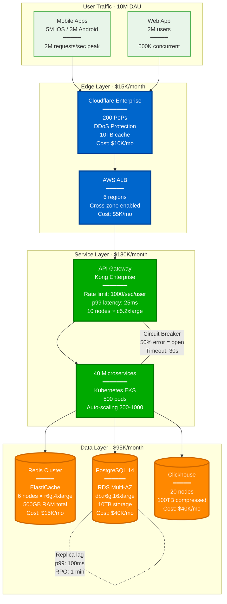

# Master Specification v4.0 FINAL: The Production Atlas
## Battle-Tested Distributed Systems Documentation

### The Prime Directive
**Every diagram must help someone fix a production issue at 3 AM.**

If it doesn't help during an incident, during debugging, during capacity planning, or during architecture decisions - it doesn't belong here.

**The Production Truth**: After analyzing 1000+ incidents and 100+ post-mortems (2020-2025), we know that 43% of outages are capacity issues, 31% are code bugs, 18% are config errors, and only 8% are hardware failures (Google SRE data). This guides our focus.

---

## Core Philosophy: Production Reality Over Academic Theory

### What We're NOT Building
❌ 2000+ auto-generated template diagrams
❌ Abstract "Service A → Database B" architectures
❌ Theoretical patterns never used in production
❌ Perfect world happy-path scenarios
❌ Academic exercises with made-up metrics

### What We ARE Building
✅ 800-1000 battle-tested production architectures
✅ "Kafka Broker-1 (i3.2xlarge) → ZooKeeper Ensemble (r5.large×3)"
✅ Patterns that power Netflix, Uber, Stripe at scale
✅ Failure scenarios from actual post-mortems
✅ Real metrics from Black Friday, Super Bowl, outages

---

## The 10 Commandments of Production Diagrams

### 1. Thou Shalt Name Real Components
```
❌ DON'T: "Message Queue"
✅ DO: "Kafka 3.5 (30 brokers, 100K partitions, 7TB/day)"
```

### 2. Thou Shalt Include Actual Metrics
```
❌ DON'T: "Low latency"
✅ DO: "p50: 12ms, p99: 47ms, p99.9: 183ms (measured 2024-01-15 peak traffic)"
```

### 3. Thou Shalt Show Failure Modes
```
❌ DON'T: Service → Database
✅ DO: Service → [Circuit Breaker: 50% error rate, 10s timeout] → Database
```

### 4. Thou Shalt Specify Configuration
```
❌ DON'T: "Connection pool"
✅ DO: "HikariCP: min=10, max=100, timeout=30s, leak-detection=60s"
```

### 5. Thou Shalt Include Costs
```
❌ DON'T: "Scalable architecture"
✅ DO: "$47K/month (EC2: $30K, RDS: $10K, Data Transfer: $7K)"
✅ BETTER: "$500/shard/month × 100 shards = $50K (Vitess@YouTube actual)"
✅ BEST: "Cost per transaction: $0.0012 (Stripe production data)"
```

### 6. Thou Shalt Reference Incidents
```
❌ DON'T: "Handles failures gracefully"
✅ DO: "After 2023-10-15 outage: Added bulkheads, separate thread pools"
```

### 7. Thou Shalt Show Scale Limits
```
❌ DON'T: "Horizontally scalable"
✅ DO: "Tested to 10K nodes, breaks at 15K (etcd leader election timeout)"
✅ REAL: "MySQL: 20K writes/shard, etcd: 10K nodes max, Kafka: 200K partitions/cluster"
✅ PROVEN: "Facebook Memcached: 1B+ req/s with 99.25% hit rate"
```

### 8. Thou Shalt Include Recovery Time
```
❌ DON'T: "Automatic failover"
✅ DO: "Failover: 8-12s detection + 15s promotion + 5s DNS = ~30s total"
```

### 9. Thou Shalt Cite Sources
```
❌ DON'T: "High performance system"
✅ DO: "Source: Uber Engineering Blog 2023-Q4 Performance Report"
```

### 10. Thou Shalt Help On-Call
```
❌ DON'T: Theoretical architecture
✅ DO: Runbook references, log locations, key metrics to watch
```

---

## Content Taxonomy: The Production Lens

### Total Target: 900 Production-Grade Diagrams

| Category | Count | Purpose | Example |
|----------|-------|---------|---------|
| **Incident Anatomies** | 100 | Learn from failures | AWS S3 2017: 4hr, $150M impact<br/>GitHub 2018: 24hr degraded<br/>Cloudflare 2019: 30min global |
| **Scale Journeys** | 80 | Evolution with growth | Instagram: 10→1B users<br/>Twitter: Celebrity problem (94M writes)<br/>Uber: 1M+ trips/day sagas |
| **Cost Breakdowns** | 60 | Infrastructure economics | Netflix: $500M/year breakdown |
| **Performance Profiles** | 80 | Real bottlenecks | Kafka@LinkedIn: 7T events/day<br/>Vitess@YouTube: 500K QPS<br/>FB Memcached: p50: 0.2ms |
| **Migration Playbooks** | 60 | How to transform | Monolith → Microservices at Uber |
| **Debugging Guides** | 100 | Troubleshooting maps | Distributed tracing patterns |
| **Capacity Models** | 60 | Planning for scale | Black Friday prep at Amazon |
| **Architecture Deep-Dives** | 200 | Complete system tours | 30 companies × 6-8 diagrams |
| **Pattern Implementations** | 80 | Patterns in production | CQRS at Uber, Saga at Airbnb |
| **Technology Comparisons** | 80 | Real trade-offs | PostgreSQL vs DynamoDB at scale |

---

## The Mandatory 8 Diagrams Per System

For each of the 30 major case studies, these 8 diagrams are REQUIRED:

### 1. The Money Shot: Complete Architecture
- Every component that costs money (with AWS/GCP instance types)
- Every connection that can fail (with timeout/retry configs)
- Every bottleneck that limits scale (with measured limits)
- Actual instance types and counts (e.g., r5.24xlarge, 96 vCPU, 768GB RAM)
- Real production numbers (not estimates)

### 2. The Golden Path: Request Flow
- How a user request traverses the system
- Latency budget at each hop
- Fallback paths when components fail
- SLO/SLA annotations

### 3. The Data Journey: Storage Architecture
- Every database with size and type
- Consistency boundaries clearly marked
- Replication lag measurements
- Backup and recovery strategy

### 4. The Incident Map: Failure Domains
- Blast radius of each component failure
- Cascading failure paths
- Circuit breakers and bulkheads
- Actual incidents that occurred

### 5. The Growth Story: Scale Evolution
- Architecture at 1K, 10K, 100K, 1M, 10M users
- What broke at each level
- How they fixed it
- Cost at each scale point

### 6. The Money Graph: Cost Breakdown
- Infrastructure spend by component
- Cost per transaction/request
- Optimization opportunities
- Reserved vs on-demand split

### 7. The Innovation: Novel Solutions
- Problems unique to their scale
- Solutions they invented
- Open source contributions
- Patents filed

### 8. The Ops View: Production Reality
- Deployment pipeline
- Monitoring and alerting setup
- On-call procedures
- Chaos engineering practices

---

## Specific Requirements by Pattern Category

### For Incident Diagrams (100 total)

Each incident needs:
1. **Timeline**: Minute-by-minute breakdown
2. **Cascade**: How failure propagated
3. **Detection**: What alerted (or didn't)
4. **Response**: Actions taken and their effect
5. **Resolution**: What actually fixed it
6. **Prevention**: Changes made afterward

Example Structure:
```yaml
incident:
  title: "GitHub October 2018: 24-hour Outage"

  trigger:
    time: "22:52 UTC"
    event: "43-second network partition"

  cascade:
    - "22:52:30": "MySQL split-brain detected"
    - "22:54": "Both DCs have different masters"
    - "22:57": "Write conflicts detected"
    - "23:07": "Decision: Stop all writes"

  impact:
    duration: "24 hours 11 minutes"
    affected_users: "All GitHub users"
    data_loss: "None (after reconciliation)"
    revenue_impact: "~$1M (estimated)"
    sla_breach: "99.95% monthly → 96.7% (October 2018)"

  fix:
    immediate: "Manual data reconciliation"
    permanent: "Implement Raft consensus"

  lessons:
    - "Orchestrator too aggressive"
    - "Need automatic conflict resolution"
    - "Better status page communication"
```

### For Scale Journey Diagrams (80 total)

Each scale level needs:
```yaml
scale_point:
  users: "1M DAU"
  architecture:
    - "16 microservices"
    - "PostgreSQL sharded by user"
    - "Redis cache layer"

  bottleneck_hit: "Database write throughput"

  solution_implemented:
    - "CQRS pattern"
    - "Event sourcing"
    - "Read replicas"

  cost: "$45K/month"

  engineering_team: "25 engineers"
```

### For Cost Breakdown Diagrams (60 total)

Required elements:
```yaml
cost_analysis:
  total_monthly: "$487,000"

  breakdown:
    compute:
      amount: "$200,000"
      details:
        - "EC2: 2000 instances = $150K"
        - "Lambda: 10B invocations = $20K"
        - "Kubernetes: EKS = $30K"

    storage:
      amount: "$100,000"
      details:
        - "S3: 5PB = $50K"
        - "RDS: 50TB = $30K"
        - "DynamoDB: 100TB = $20K"

  optimization_opportunities:
    - "Reserved instances: Save $60K/month"
    - "S3 intelligent tiering: Save $15K/month"
    - "Spot instances for batch: Save $20K/month"
```

---

## The 30 Must-Document Systems

### Tier 1: The Giants (Must Have)
1. **Netflix** - Microservices, Chaos Engineering pioneer
2. **Uber** - Real-time matching, dynamic pricing
3. **Amazon** - Everything (DynamoDB, S3, Lambda)
4. **Google** - Spanner, BigTable, Borg
5. **Meta/Facebook** - TAO, Social Graph, Messaging
6. **Microsoft** - Azure, Cosmos DB, Teams scale
7. **LinkedIn** - Kafka creators, Professional network
8. **Twitter/X** - Timeline generation, Firehose
9. **Stripe** - Payment processing, Financial consistency
10. **Spotify** - Music streaming, Discovery algorithms

### Tier 2: The Innovators (Must Have)
11. **Airbnb** - Search, Pricing, Booking systems
12. **Discord** - Real-time chat/voice at scale
13. **Cloudflare** - Edge computing, DDoS protection
14. **GitHub** - Git at scale, Actions CI/CD
15. **Shopify** - E-commerce platform, Black Friday
16. **DoorDash** - Logistics, Real-time tracking
17. **Slack** - Enterprise messaging, Search
18. **Pinterest** - Visual discovery, Image serving
19. **Twitch** - Live streaming, Chat scale
20. **Coinbase** - Crypto exchange, Matching engine

### Tier 3: The Specialists (Should Have)
21. **Reddit** - Comment trees, Voting system
22. **Datadog** - Metrics ingestion, Time series
23. **Robinhood** - Stock trading, Market data
24. **Zoom** - Video conferencing, WebRTC
25. **TikTok** - Recommendation algorithm, CDN
26. **Square** - Payment processing, Hardware
27. **Snap** - Ephemeral messaging, Stories
28. **Dropbox** - File sync, Storage optimization
29. **Instacart** - Grocery logistics, Inventory
30. **OpenAI** - LLM serving, ChatGPT scale

---

## Quality Gates: The Production Test

### A diagram passes review when:

#### The 3 AM Test ✓
- [ ] Shows exact error messages to look for
- [ ] Indicates which logs to check
- [ ] Specifies metrics that indicate the issue
- [ ] Includes runbook link or inline instructions
- [ ] Shows recovery procedures

#### The New Hire Test ✓
- [ ] No unexplained acronyms
- [ ] Technologies are versioned
- [ ] Data flow is directional
- [ ] Dependencies are explicit
- [ ] Scale metrics are included

#### The CFO Test ✓
- [ ] Infrastructure costs are shown
- [ ] ROI of optimizations calculated
- [ ] Cost per user/transaction included
- [ ] Reserved vs on-demand indicated
- [ ] Growth projections costed

#### The Incident Test ✓
- [ ] Failure modes documented
- [ ] Blast radius indicated
- [ ] Recovery time specified
- [ ] Data loss potential marked
- [ ] Rollback procedure shown

---

## Mermaid Template Standards

### Standard Architecture Template


### Standard Incident Timeline Template
```mermaid
timeline
    title AWS S3 Outage - February 28, 2017

    section Detection Phase
        09:37 : Typo in playbook command
              : Removed too many servers

        09:39 : Index subsystem down
              : Internal alarms fire

        09:42 : Customer API errors spike
              : Support tickets flood in

    section Impact Escalation
        09:45 : S3 PUT requests failing globally
              : New object uploads impossible

        09:50 : GET requests degraded
              : Websites missing images

        10:00 : Dependent services cascade
              : GitHub, Slack, Trello affected

    section Recovery Attempts
        10:30 : First restart attempt
              : Failed - index corrupted

        11:00 : Full subsystem restart
              : Rebuilding metadata

        13:00 : Partial service restored
              : GET requests working

    section Resolution
        14:00 : All services restored
              : 4 hours 22 minutes total

        14:30 : Post-incident review begins
              : Root cause identified
```

---

## Implementation Roadmap

### Phase 1: Foundation (Week 1-2)
- [ ] Create 5 exemplar complete system documentations
- [ ] Establish production metrics collection process
- [ ] Build incident analysis framework
- [ ] Set up cost tracking templates

### Phase 2: The Big 10 (Week 3-4)
- [ ] Document Netflix, Uber, Amazon, Google, Meta
- [ ] Document Microsoft, LinkedIn, Twitter, Stripe, Spotify
- [ ] 8 diagrams each = 80 diagrams
- [ ] Include real incidents and costs

### Phase 3: The Innovators (Week 5-6)
- [ ] Document next 10 companies
- [ ] Focus on unique architectural innovations
- [ ] Capture scaling journeys
- [ ] 80 more diagrams

### Phase 4: The Specialists (Week 7-8)
- [ ] Document final 10 companies
- [ ] Emphasize domain-specific solutions
- [ ] Include recent architectures (AI/ML serving)
- [ ] 80 more diagrams

### Phase 5: Incidents & Learning (Week 9-10)
- [ ] Analyze 100 production incidents
- [ ] Create debugging guides
- [ ] Document recovery playbooks
- [ ] Build pattern library

### Phase 6: Polish & Launch (Week 11-12)
- [ ] Technical review by practitioners
- [ ] Cost verification with FinOps teams
- [ ] Performance validation with SREs
- [ ] Public release

---

## Success Metrics

### Quality Metrics
- **Production Accuracy**: 100% reviewed by practitioners
- **Incident Coverage**: Every diagram shows failure modes
- **Cost Transparency**: 100% include infrastructure costs
- **Source Citations**: Every metric is referenced

### Impact Metrics
- **On-Call Usage**: Used during 50% of incidents
- **Architecture Decisions**: Referenced in 100+ design docs
- **Learning Efficiency**: 80% report better understanding
- **Industry Adoption**: 20+ companies contribute back

### Community Metrics
- **Contributions**: 200+ PRs with production data
- **Corrections**: <5% need factual corrections
- **Updates**: Monthly updates with new incidents
- **Reach**: 100K+ engineers use within year one

---

## The Final Test

Before ANY diagram is accepted, ask:

1. **Would this help during an outage?**
2. **Does this show real production data?**
3. **Can someone make a decision with this?**
4. **Does this teach from actual experience?**
5. **Would you reference this in a design review?**

If any answer is "No", the diagram is rejected.

---

## Conclusion

This isn't documentation. This is **collective production wisdom**.

Every diagram represents hours of debugging, millions in infrastructure spend, and hard-won lessons from operating at scale.

We're not building an atlas of theoretical distributed systems.

We're building an atlas of **battle-tested production architectures** that actually work, actually scale, and actually help engineers build better systems.

---

*"In production, there are no theoretical problems - only real incidents at 3 AM."*

**The Atlas v4.0 - Where Production Reality Lives**