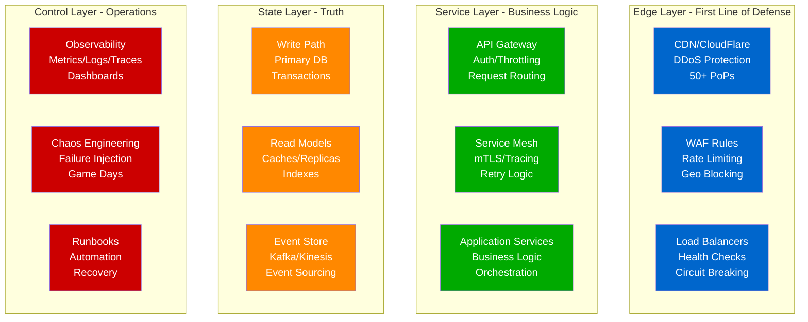
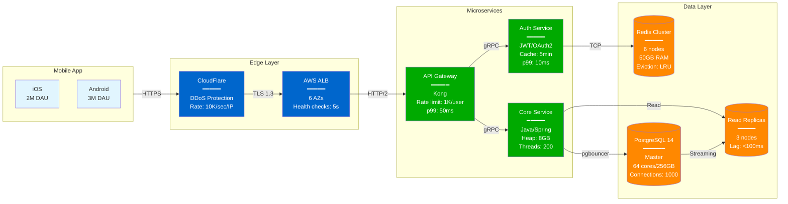
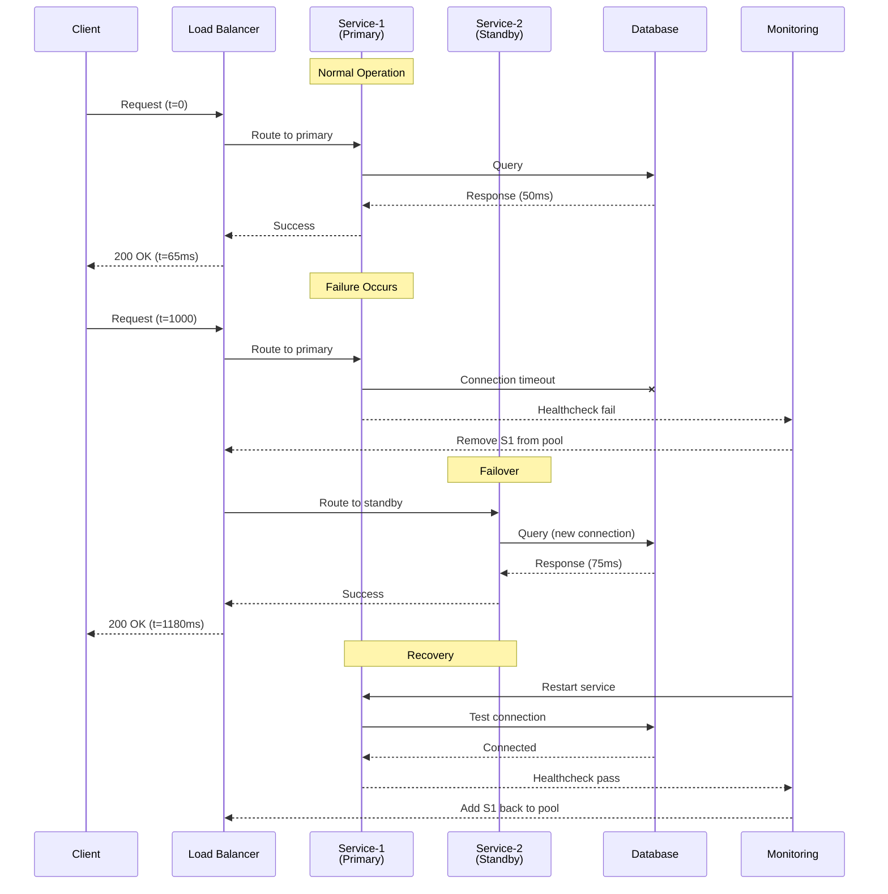
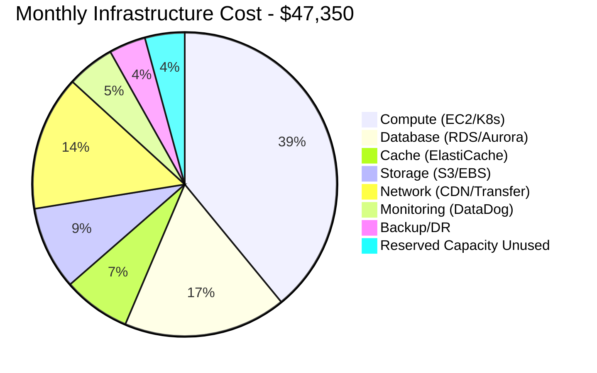

# Diagram Specifications v3.0.0
## Production-First, Reality-Based Distributed Systems Documentation

### Core Manifesto
Every diagram must answer: **"What would I need to know at 3 AM when this breaks?"**

No abstract concepts. No theoretical models. Real systems, real failures, real solutions.

---

## The Universal Production Stack Template

Every production system diagram MUST follow this layered architecture:



---

## Diagram Categories with Production Focus

### 1. ARCHITECTURE DIAGRAMS - "How It's Actually Built"

**Requirements:**
- Real company names and scale metrics
- Actual technology choices with versions
- Specific configuration values that matter
- Cost implications at scale

**Template Example: Netflix Streaming Architecture**
```yaml
diagram:
  type: architecture
  title: "Netflix Video Streaming: 200M+ Subscribers"

  scale_metrics:
    daily_active_users: 100M
    peak_bandwidth: 200Tbps
    regions: 190
    edge_locations: 8000+

  critical_path:
    1_request:
      component: "AWS CloudFront"
      latency: "1ms"
      purpose: "CDN cache hit for video chunks"

    2_miss:
      component: "Netflix Open Connect"
      latency: "10ms"
      purpose: "ISP-embedded cache"

    3_origin:
      component: "S3 Multi-Region"
      latency: "50ms"
      purpose: "Origin storage"

  technologies:
    edge:
      - CloudFront: "8000+ edge locations"
      - Open_Connect: "ISP partnerships"

    compute:
      - EC2: "100K+ instances"
      - Titus: "Container platform"

    data:
      - Cassandra: "10K nodes, 100PB"
      - EVCache: "Memcached wrapper, 30TB RAM"

    streaming:
      - Kafka: "4000 brokers, 7 trillion events/day"

  cost_breakdown:
    cdn: "$50M/year"
    compute: "$100M/year"
    storage: "$20M/year"
    network: "$200M/year"
```

### 2. FAILURE SCENARIO DIAGRAMS - "What Happens at 3 AM"

**Requirements:**
- Specific failure modes (not generic "node fails")
- Detection time and mechanism
- Automated vs manual recovery
- Customer impact metrics
- Post-mortem learnings

**Template Example: AWS S3 Outage Pattern**
```yaml
diagram:
  type: failure_cascade
  title: "S3 Outage 2017: How a typo took down the internet"

  initial_failure:
    time: "09:37 PST"
    cause: "Engineer typo in playbook command"
    impact: "Removed too many servers from index subsystem"

  cascade:
    phase_1:
      time: "+0 min"
      event: "S3 index subsystem goes down"
      detection: "Internal monitoring alerts"
      customer_impact: "None yet"

    phase_2:
      time: "+2 min"
      event: "New object PUTs start failing"
      detection: "Customer tickets spike"
      customer_impact: "Cannot upload new objects"

    phase_3:
      time: "+5 min"
      event: "GET requests slow down"
      detection: "Latency alarms"
      customer_impact: "Website images not loading"

    phase_4:
      time: "+10 min"
      event: "Dependent services fail"
      services_affected:
        - "GitHub (images/downloads)"
        - "Slack (file uploads)"
        - "Trello (attachments)"
        - "IFTTT (applets)"
      customer_impact: "Major internet services degraded"

  recovery:
    detection_to_resolution: "4 hours 22 minutes"
    steps:
      1: "Restart index subsystem"
      2: "Rebuild metadata"
      3: "Validate consistency"
      4: "Gradual traffic ramp"

  lessons_learned:
    - "Playbook commands need safeguards"
    - "Subsystem restart was too slow"
    - "Need better bulkheads between systems"

  changes_made:
    - "Added input validation to tools"
    - "Partitioned index subsystem"
    - "Faster restart procedures"
```

### 3. PERFORMANCE DIAGRAMS - "Where Money Goes"

**Requirements:**
- Real benchmark data with methodology
- Cost per transaction/request
- Resource utilization heat maps
- Optimization opportunities with ROI

**Template Example: DynamoDB vs PostgreSQL Cost**
```yaml
diagram:
  type: performance_comparison
  title: "DynamoDB vs PostgreSQL: Real Cost at Scale"

  workload:
    read_qps: 100000
    write_qps: 10000
    item_size: 1KB
    total_data: 10TB

  dynamodb:
    configuration:
      mode: "On-Demand"
      global_tables: 3 regions
      point_in_time_recovery: enabled

    performance:
      read_latency_p99: 10ms
      write_latency_p99: 15ms
      availability: 99.999%

    monthly_cost:
      reads: "$3,240"  # $0.25 per million
      writes: "$3,240"  # $1.25 per million
      storage: "$2,500"  # $0.25 per GB
      backup: "$1,000"
      total: "$9,980"

  postgresql_rds:
    configuration:
      instance: "db.r6g.8xlarge"
      replicas: 2
      multi_az: true

    performance:
      read_latency_p99: 5ms
      write_latency_p99: 20ms
      availability: 99.95%

    monthly_cost:
      primary: "$2,400"
      replicas: "$4,800"
      storage: "$1,000"  # GP3 SSD
      backup: "$500"
      total: "$8,700"

    hidden_costs:
      dba_time: "40 hours/month = $8,000"
      downtime: "4 hours/year = $40,000"

  recommendation:
    below_10k_qps: "PostgreSQL (if you have DBAs)"
    above_100k_qps: "DynamoDB (operational simplicity)"
    cost_conscious: "PostgreSQL with good automation"
    velocity_focused: "DynamoDB (no maintenance)"
```

### 4. MIGRATION DIAGRAMS - "How to Get There"

**Requirements:**
- Step-by-step migration plan
- Rollback strategy at each step
- Data consistency guarantees during migration
- Real timeline from actual migrations

**Template Example: Monolith to Microservices**
```yaml
diagram:
  type: migration_strategy
  title: "Uber: Monolith to 4000 Microservices"

  phase_0_baseline:
    name: "Python Monolith (2012)"
    characteristics:
      loc: "450K lines"
      deploy_time: "1 hour"
      rollback_time: "1 hour"
      developers: 50

  phase_1_strangler:
    name: "Edge Services (2013)"
    duration: "6 months"
    changes:
      - extract: "API Gateway"
      - extract: "Auth Service"
      - pattern: "Strangler Fig"
    rollback: "Route back to monolith"

  phase_2_data:
    name: "Data Layer Split (2014)"
    duration: "12 months"
    changes:
      - extract: "User Service + DB"
      - extract: "Trip Service + DB"
      - pattern: "Dual writes for migration"
    data_migration:
      strategy: "Write to both, read from old"
      validation: "Compare outputs"
      cutover: "Gradual % rollout"

  phase_3_async:
    name: "Event Driven (2015)"
    duration: "6 months"
    changes:
      - add: "Kafka event bus"
      - pattern: "Event sourcing"
      - decouple: "Service communication"
    benefits:
      - "Loose coupling"
      - "Audit trail"
      - "Time travel debugging"

  phase_4_platform:
    name: "Platform Services (2016+)"
    changes:
      - add: "Service mesh"
      - add: "Observability platform"
      - add: "CI/CD automation"

  current_state:
    services: 4000+
    deploys_per_day: 5000+
    developers: 3000+

  lessons:
    - "Start with edge services"
    - "Data migration is hardest"
    - "Invest in platform early"
    - "Culture change > technology"
```

### 5. DECISION DIAGRAMS - "Which One and Why"

**Requirements:**
- Clear decision criteria with thresholds
- Cost implications of each choice
- Migration cost if you choose wrong
- Real examples of companies at each choice

**Template Example: Database Selection**
```yaml
diagram:
  type: decision_matrix
  title: "Choosing Your Primary Database"

  start_questions:
    q1:
      question: "What's your consistency requirement?"
      critical: true

  if_strong_consistency:
    q2:
      question: "Scale requirement?"

      if_single_region:
        q3: "Transaction complexity?"

        if_complex_transactions:
          answer: PostgreSQL
          examples:
            - "Stripe (payments)"
            - "Square (point of sale)"
          config:
            - "Use serializable isolation"
            - "Connection pooling required"
          monthly_cost: "$5K-50K"

        if_simple_transactions:
          answer: "MySQL/Aurora"
          examples:
            - "GitHub (code hosting)"
            - "Shopify (e-commerce)"
          config:
            - "Row-based replication"
            - "Read replicas for scale"
          monthly_cost: "$3K-30K"

      if_global_scale:
        answer: "Spanner or CockroachDB"
        examples:
          - "Google (AdWords)"
          - "DoorDash (delivery)"
        config:
          - "3+ regions minimum"
          - "Automatic sharding"
        monthly_cost: "$50K+"

  if_eventual_consistency:
    q2:
      question: "Access pattern?"

      if_key_value:
        answer: "DynamoDB"
        examples:
          - "Netflix (viewing history)"
          - "Lyft (user sessions)"
        config:
          - "Partition key design critical"
          - "GSIs for queries"
        monthly_cost: "$1K-100K"

      if_document:
        answer: "MongoDB"
        examples:
          - "eBay (listings)"
          - "Forbes (content)"
        config:
          - "Sharding strategy"
          - "Index planning"
        monthly_cost: "$5K-50K"

      if_wide_column:
        answer: "Cassandra"
        examples:
          - "Netflix (time series)"
          - "Discord (messages)"
        config:
          - "Replication factor 3"
          - "Consistency level tuning"
        monthly_cost: "$10K-100K"
```

### 6. INCIDENT DIAGRAMS - "Learning from Failures"

**Requirements:**
- Actual incident timeline
- Multiple contributing factors
- Why monitoring missed it
- Why automation didn't help
- Human factors involved

**Template Example: GitHub Outage October 2018**
```yaml
diagram:
  type: incident_analysis
  title: "GitHub Oct 2018: 24 Hours Down"

  timeline:
    22:52_UTC:
      event: "Routine maintenance replaces network equipment"
      status: "Normal operation"

    22:54_UTC:
      event: "Network partition between East/West coast DCs"
      duration: "43 seconds"
      impact: "MySQL clusters split"

    22:54:30_UTC:
      event: "Orchestrator promotes MySQL replicas in both DCs"
      problem: "Now have 2 masters (split brain)"

    23:00_UTC:
      event: "Engineers paged"
      detection: "Write conflicts detected"

    23:07_UTC:
      event: "Decision: Stop writes to prevent corruption"
      impact: "GitHub goes read-only"

    23:11_UTC:
      event: "Status page updated"
      message: "Investigating database issues"

    next_24_hours:
      challenge: "Reconcile diverged data"
      approach:
        - "Compare both masters"
        - "Identify conflicts"
        - "Manual resolution"
        - "Validate consistency"

    recovery:
      started: "Day 2, 00:00 UTC"
      completed: "Day 2, 23:00 UTC"
      data_loss: "None"

  root_causes:
    1:
      cause: "Network equipment config error"
      fix: "Review change procedures"

    2:
      cause: "Orchestrator too aggressive"
      fix: "Add partition detection"

    3:
      cause: "No automatic reconciliation"
      fix: "Build conflict resolution"

  improvements:
    - "Raft consensus for orchestration"
    - "Improved network monitoring"
    - "Automated data reconciliation"
    - "Better status communication"
```

---

## Quality Standards for Production Diagrams

### The 3 AM Test
Ask yourself: "If someone is woken at 3 AM to fix this, does the diagram help them?"

✅ **PASS Examples:**
- Shows exact configuration parameters
- Indicates which logs to check
- Highlights common failure points
- Includes runbook references

❌ **FAIL Examples:**
- Generic architecture boxes
- No metric values
- Happy path only
- Missing failure modes

### The New Hire Test
Ask yourself: "Can a new engineer understand our system from this diagram?"

✅ **PASS Examples:**
- Uses actual service names
- Shows data flow direction
- Indicates synchronous vs async
- Marks critical paths

❌ **FAIL Examples:**
- Assumes prior knowledge
- Undefined acronyms
- Abstract patterns
- Missing dependencies

### The Cost Justification Test
Ask yourself: "Can I justify our infrastructure spend with this diagram?"

✅ **PASS Examples:**
- Shows resource utilization
- Indicates cost per component
- Highlights optimization opportunities
- Compares alternatives

❌ **FAIL Examples:**
- No scale metrics
- Missing resource specs
- No cost breakdown
- Theoretical performance

---

## Required Diagrams Per Entity

### For Each System Pattern (CQRS, Event Sourcing, etc.)
1. **ARCHITECTURE**: Production implementation with real components
2. **FAILURE**: What breaks and how to detect/fix
3. **PERFORMANCE**: Actual metrics and bottlenecks
4. **MIGRATION**: How to adopt incrementally
5. **ANTI-PATTERN**: Common mistakes and their cost

### For Each Technology (Kafka, PostgreSQL, etc.)
1. **DEPLOYMENT**: Production topology and configuration
2. **OPERATIONS**: Day-2 operations and maintenance
3. **SCALING**: Limits and how to expand
4. **FAILURE**: Recovery procedures and timelines
5. **COST**: TCO breakdown and optimization

### For Each Case Study (Netflix, Uber, etc.)
1. **GLOBAL**: Complete architecture with scale metrics
2. **CRITICAL PATH**: Request flow for main use case
3. **FAILURE DOMAINS**: Blast radius and bulkheads
4. **EVOLUTION**: How they got here and where they're going
5. **INNOVATIONS**: What they built that didn't exist
6. **INCIDENTS**: Major outages and learnings
7. **COSTS**: Infrastructure spend and optimization
8. **TEAM**: Organizational structure and ownership

---

## Mermaid Production Templates

### Template 1: Service Communication Pattern


### Template 2: Failure and Recovery Flow


### Template 3: Cost Breakdown


---

## Anti-Patterns - Never Do This

### ❌ Abstract Theoretical Diagrams
```
DON'T: Client → Service → Database
DO: iPhone App → Kong API Gateway → PostgreSQL 14 (db.r6g.2xlarge)
```

### ❌ Missing Failure Scenarios
```
DON'T: Show only success path
DO: Show timeout, retry, circuit breaker, fallback
```

### ❌ Fake Metrics
```
DON'T: "Low latency", "High throughput"
DO: "p50: 10ms, p99: 47ms", "10,000 req/sec"
```

### ❌ Ignoring Costs
```
DON'T: "Scalable architecture"
DO: "Scales to 100K users at $50K/month"
```

### ❌ Perfect World Assumptions
```
DON'T: "Services communicate"
DO: "gRPC with 30s timeout, 3 retries, circuit breaker at 50% error rate"
```

---

## Validation Checklist

Before any diagram is accepted:

### Technical Accuracy
- [ ] Real component names and versions
- [ ] Actual metrics from production
- [ ] Genuine config values
- [ ] Verified by someone who operates this

### Failure Coverage
- [ ] Shows what breaks
- [ ] Shows how to detect
- [ ] Shows how to fix
- [ ] Shows customer impact

### Cost Awareness
- [ ] Infrastructure costs shown
- [ ] Human costs considered
- [ ] Optimization opportunities marked
- [ ] ROI of improvements estimated

### Operational Reality
- [ ] Monitoring/alerts indicated
- [ ] Runbook references included
- [ ] On-call procedures noted
- [ ] Recovery time objectives stated

### Educational Value
- [ ] Junior engineer can understand
- [ ] Senior engineer learns something
- [ ] Executives can justify cost
- [ ] On-call can fix issues

---

## Implementation Priority

### Phase 1: Core Patterns (Month 1)
Create production diagrams for:
- CQRS with real example (e.g., Uber rides)
- Event Sourcing with costs (e.g., bank ledger)
- Saga Pattern with failure handling
- Circuit Breaker with actual thresholds

### Phase 2: Major Technologies (Month 2)
Document production usage of:
- Kafka at scale (LinkedIn: 7 trillion events/day)
- PostgreSQL limits (When to shard)
- Redis patterns (Cache vs Session vs Queue)
- Kubernetes reality (Complexity vs Benefits)

### Phase 3: Case Studies (Month 3-4)
Deep dive into:
- Netflix: Resilience and chaos engineering
- Uber: Real-time geo-distributed systems
- Stripe: Financial consistency requirements
- Discord: Scaling real-time communication

### Phase 4: Incident Library (Month 5-6)
Analyze and document:
- AWS outages and cascading failures
- GitHub split-brain incidents
- Facebook BGP route leak
- Cloudflare memory leak

---

## Success Metrics

A diagram is successful when:
1. **On-call engineers** reference it during incidents
2. **New hires** use it to understand the system
3. **Architects** use it for decision making
4. **Finance** uses it for cost planning
5. **Everyone** learns something new from it

---

## Final Words

**Build diagrams for the engineer debugging production at 3 AM, not for the architect in an ivory tower.**

Every box should be something you can SSH into.
Every arrow should be something you can trace.
Every metric should be something you can alert on.
Every failure should be something that has happened.

This is not documentation. This is **operational reality**.