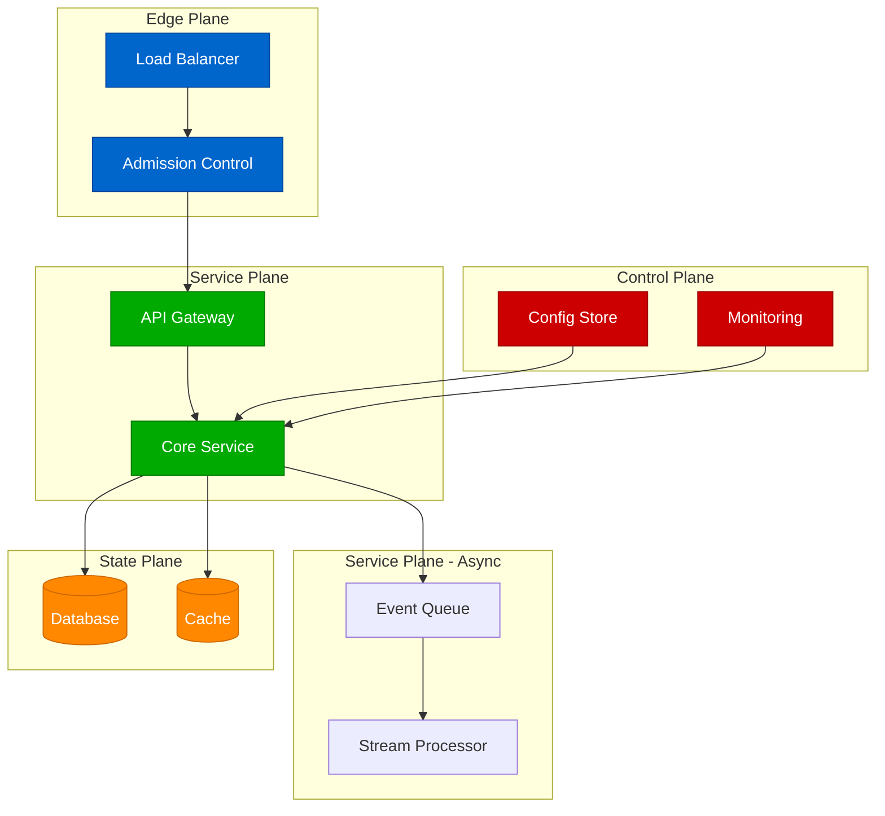
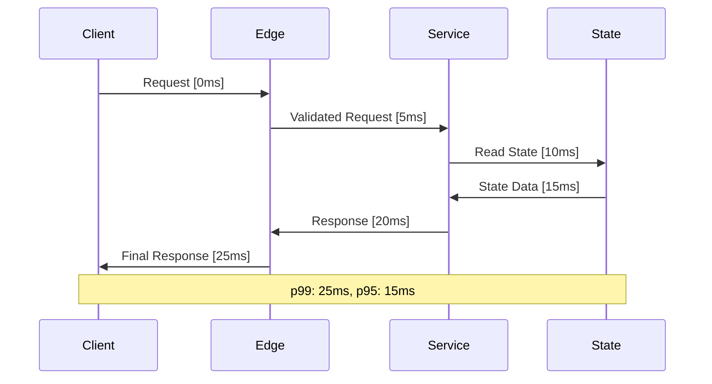
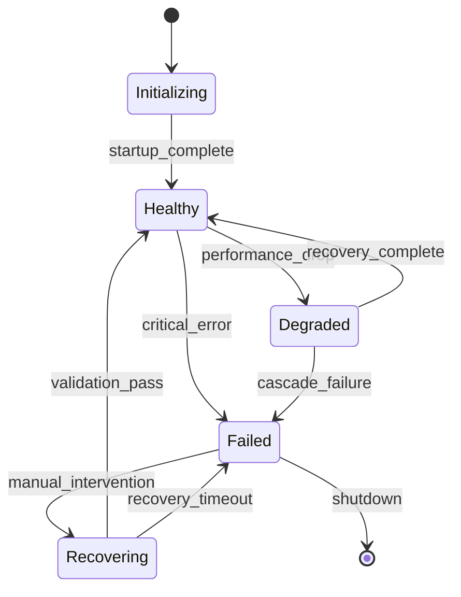
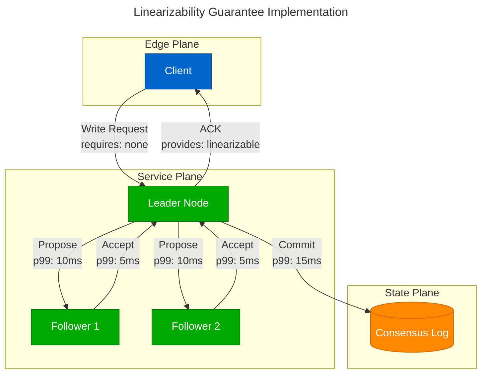

# Content Organization and Mermaid Standards v2.0.0
## Direct Markdown Authoring with Embedded Diagrams

### Overview

This document defines the simplified content organization and Mermaid diagram standards for the Atlas Distributed Systems Framework. The architecture focuses on **direct markdown authoring** with **embedded Mermaid diagrams** rather than complex YAML-to-diagram generation pipelines.

---

## Core Architecture Philosophy

### Direct Authoring Approach

Instead of complex YAML schemas and transformation pipelines, we use:

- **Markdown files** with embedded Mermaid diagrams
- **MkDocs** for site generation
- **Simple validation scripts** (2 scripts total)
- **Production-first tooling**

### Content Structure

```
site/docs/
├── foundation/              # Core concepts
│   ├── primitives.md       # Basic building blocks
│   ├── capabilities.md     # System capabilities
│   └── universal-laws.md   # Fundamental laws
├── patterns/               # Architecture patterns
│   ├── micro-patterns.md   # Atomic patterns
│   ├── system-patterns.md  # Composite patterns
│   └── decision-engine.md  # Pattern selection
├── examples/               # Real-world implementations
│   ├── case-studies.md     # Production systems
│   ├── implementation.md   # Code examples
│   └── pitfalls.md        # Common mistakes
└── production/             # Operational concerns
    ├── best-practices.md   # Production guidelines
    ├── proof-obligations.md # Verification methods
    └── reality.md          # Real-world constraints
```

---

## Mermaid Diagram Standards

### Five-Plane Color Scheme

All diagrams must use the consistent color scheme:

```yaml
planes:
  edge: "#0066CC"      # Blue - Request routing, admission control
  service: "#00AA00"   # Green - Business logic, orchestration
  state: "#FF8800"     # Orange - Persistence, consistency
  control: "#CC0000"   # Red - Configuration, monitoring, chaos
```

### Diagram Types and Templates

#### Flow Diagrams (Primary)



#### Sequence Diagrams (Interactions)



#### State Diagrams (System States)



### Required Diagram Elements

Every diagram must include:

1. **Plane Classification**: Use color-coded subgraphs
2. **SLO Labels**: Latency/throughput on edges (e.g., "p99: 10ms")
3. **Capability Labels**: requires/provides at boundaries
4. **Accessibility**: Title and description
5. **Size Limit**: Stay under 500KB when rendered

### Example with All Elements



---

## Content Organization Standards

### File Naming Convention

- Use kebab-case: `micro-patterns.md`, `system-patterns.md`
- Be descriptive: `decision-engine.md` not `decisions.md`
- Group related content in subdirectories

### Markdown Structure

Each content file follows this template:

```markdown
# Title

## Overview
Brief description of the content and its purpose.

## Core Concepts
Key definitions and explanations.

## Diagrams

### Primary Flow
```mermaid
[Mermaid diagram here]
```

### Alternative Approaches
```mermaid
[Alternative diagram here]
```

## Real-World Examples
Concrete implementations and case studies.

## Production Considerations
Operational concerns, monitoring, troubleshooting.

## Related Patterns
Links to related content with brief explanations.
```

### Cross-Reference Standards

- Use relative links: `[Micro Patterns](micro-patterns.md#atomic-composition)`
- Include brief context: `[CQRS Pattern](system-patterns.md#cqrs) - separates reads from writes`
- Link to specific sections with anchors

---

## Configuration Examples

### MkDocs Configuration

```yaml
# mkdocs.yml
site_name: Atlas Distributed Systems Framework
theme:
  name: material
  palette:
    - scheme: default
      primary: blue
      accent: blue
  features:
    - navigation.tabs
    - navigation.sections
    - navigation.expand
    - navigation.indexes

plugins:
  - search
  - mermaid2:
      arguments:
        theme: default
        themeCSS: |
          .edge { fill: #0066CC !important; }
          .service { fill: #00AA00 !important; }
          .service { fill: #00AA00 !important; }
          .state { fill: #FF8800 !important; }
          .control { fill: #CC0000 !important; }

nav:
  - Home: index.md
  - Getting Started:
    - Overview: getting-started/overview.md
    - Quick Start: getting-started/quick-start.md
    - Concepts: getting-started/concepts.md
  - Foundation:
    - Primitives: foundation/primitives.md
    - Capabilities: foundation/capabilities.md
    - Universal Laws: foundation/universal-laws.md
  - Patterns:
    - Micro Patterns: patterns/micro-patterns.md
    - System Patterns: patterns/system-patterns.md
    - Decision Engine: patterns/decision-engine.md
  - Examples:
    - Case Studies: examples/case-studies.md
    - Implementation: examples/implementation.md
    - Pitfalls: examples/pitfalls.md
  - Production:
    - Best Practices: production/best-practices.md
    - Proof Obligations: production/proof-obligations.md
    - Reality: production/reality.md
  - Reference:
    - API: reference/api.md
    - Glossary: reference/glossary.md
    - Reading: reference/reading.md

markdown_extensions:
  - admonition
  - codehilite
  - toc:
      permalink: true
  - pymdownx.superfences:
      custom_fences:
        - name: mermaid
          class: mermaid
          format: !!python/name:mermaid2.fence_mermaid
```

### Validation Scripts

#### Mermaid Validation

```python
# scripts/validate_mermaid.py
def extract_mermaid_blocks(content: str) -> List[Tuple[int, str]]:
    """Extract all mermaid code blocks from markdown content."""
    pattern = r'```mermaid\n(.*?)\n```'
    blocks = []
    for match in re.finditer(pattern, content, re.DOTALL):
        line_num = content[:match.start()].count('\n') + 1
        blocks.append((line_num, match.group(1)))
    return blocks

def validate_mermaid_syntax(diagram: str) -> List[str]:
    """Basic validation of Mermaid diagram syntax."""
    errors = []

    # Check for diagram type declaration
    diagram_types = ['graph', 'flowchart', 'sequenceDiagram', 'stateDiagram']
    first_line = diagram.strip().split('\n')[0] if diagram.strip() else ''
    has_valid_type = any(dtype in first_line for dtype in diagram_types)

    if not has_valid_type:
        errors.append("Missing or invalid diagram type declaration")

    # Check bracket matching
    if diagram.count('[') != diagram.count(']'):
        errors.append("Mismatched square brackets")

    return errors
```

#### Link Validation

```python
# scripts/check_links.py
def extract_links(content: str) -> List[str]:
    """Extract all markdown links from content."""
    pattern = r'\[([^\]]+)\]\(([^)]+)\)'
    links = []

    for match in re.finditer(pattern, content):
        link = match.group(2)
        # Only check internal links
        if not link.startswith(('http://', 'https://', '#', 'mailto:')):
            links.append(link)

    return links

def validate_link(link: str, current_file: Path, docs_dir: Path) -> bool:
    """Check if a link points to an existing file."""
    # Remove anchor if present
    if '#' in link:
        link = link.split('#')[0]

    if not link:  # Was just an anchor
        return True

    # Resolve the link relative to current file
    if link.startswith('/'):
        target = docs_dir / link.lstrip('/')
    else:
        target = (current_file.parent / link).resolve()

    # Check if file exists
    return target.exists() or target.with_suffix('.md').exists()
```

---

## Build and Deployment

### Simple Makefile

```makefile
# Makefile
.PHONY: serve build test deploy

serve:
	@echo "🚀 Starting development server..."
	@mkdocs serve --dev-addr=127.0.0.1:8000

build: test
	@echo "🏗️  Building static site..."
	@mkdocs build --clean --quiet

test:
	@echo "🔍 Validating content..."
	@python3 scripts/validate_mermaid.py
	@python3 scripts/check_links.py

deploy: build
	@echo "📤 Deploying to GitHub Pages..."
	@mkdocs gh-deploy --force --clean
```

### GitHub Actions

```yaml
# .github/workflows/ci.yml
name: CI Pipeline
on:
  push:
    branches: [ main ]
  pull_request:
    branches: [ main ]

jobs:
  test:
    runs-on: ubuntu-latest
    steps:
    - uses: actions/checkout@v4

    - name: Set up Python
      uses: actions/setup-python@v4
      with:
        python-version: '3.11'
        cache: 'pip'

    - name: Install dependencies
      run: |
        pip install mkdocs-material mkdocs-mermaid2-plugin

    - name: Validate diagrams
      run: python scripts/validate_mermaid.py

    - name: Check links
      run: python scripts/check_links.py

    - name: Build site
      run: mkdocs build --strict

    - name: Deploy to GitHub Pages
      if: github.ref == 'refs/heads/main'
      run: mkdocs gh-deploy --force
```

---

## Migration from Complex Schemas

### What We Removed

1. **Complex YAML Schemas**: 19+ Python generation scripts
2. **Multi-stage Pipelines**: YAML → Mermaid → SVG transformations
3. **Schema Validation**: JSON Schema validation for 8+ entity types
4. **Batch Generation**: Parallel processing with 4+ workers
5. **Complex Relationships**: Cross-reference validation systems

### What We Kept

1. **Five-plane Architecture**: Core color-coded plane system
2. **Diagram Standards**: Consistent visual language
3. **Accessibility**: Title, description, and SLO labels
4. **Size Limits**: 500KB diagram constraint
5. **Quality Gates**: Basic validation and link checking

### Benefits of Simplification

- **Faster Development**: Direct editing instead of schema authoring
- **Lower Complexity**: 2 scripts vs 19+ scripts
- **Better Maintainability**: Standard markdown tools and workflows
- **Easier Contribution**: No learning curve for complex schemas
- **Production Focus**: Real validation needs vs theoretical completeness

---

## Quality Standards

### Required Elements

Every diagram must include:

1. **Accessibility Elements**:
   ```mermaid
   ---
   title: "Clear descriptive title"
   ---
   ```

2. **SLO Labels** on critical paths:
   ```mermaid
   A -->|"p99: 10ms, 1K QPS"| B
   ```

3. **Capability Boundaries**:
   ```mermaid
   A -->|"requires: linearizable"| B
   B -->|"provides: strong_consistency"| C
   ```

4. **Color-coded Planes**: Use consistent subgraph styling

### Validation Criteria

- Mermaid syntax validation passes
- All internal links resolve
- Diagrams render without errors
- File sizes under limits
- Accessibility elements present

---

*Version: 2.0.0 | Document 07 of 16 | Last Updated: 2025-03-15*
*Simplified for direct markdown authoring and production deployment*