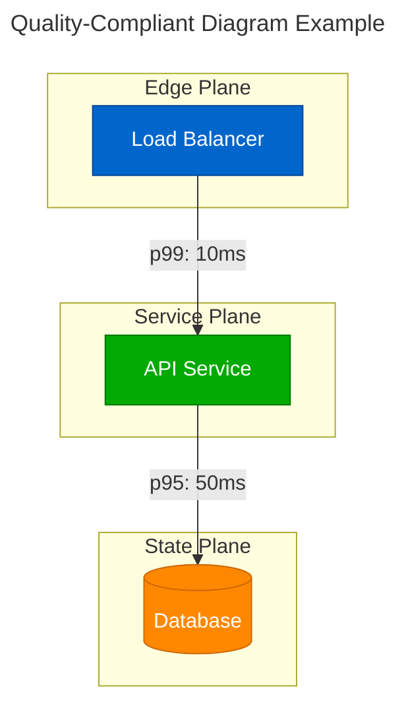

# Quality Assurance and CI/CD v2.0.0
## Simplified Production-Ready Pipeline

### Overview

This document defines the streamlined quality assurance framework and CI/CD pipeline for the Atlas Distributed Systems Framework. The approach focuses on **practical validation** for **direct markdown authoring** with **embedded Mermaid diagrams** using production-ready tooling.

---

## Core Philosophy: Practical Quality

### Simplified Quality Gates

Instead of overengineered testing frameworks, we focus on:

- **Mermaid syntax validation** - Ensure diagrams render correctly
- **Internal link checking** - Prevent broken navigation
- **Build verification** - Site builds without errors
- **Production metrics** - Real performance monitoring

### Quality Standards

| Quality Aspect | Standard | Tool | Enforcement |
|---------------|----------|------|-------------|
| Mermaid Syntax | 100% valid | validate_mermaid.py | CI blocking |
| Internal Links | 100% working | check_links.py | CI blocking |
| Site Build | Success | mkdocs build | CI blocking |
| Accessibility | Basic compliance | Manual review | PR review |
| Performance | < 2s load time | Lighthouse | Monitoring |

---

## CI/CD Pipeline Architecture

### GitHub Actions Workflow

```yaml
# .github/workflows/ci.yml
name: CI Pipeline

on:
  push:
    branches: [ main, develop ]
  pull_request:
    branches: [ main ]

jobs:
  test:
    runs-on: ubuntu-latest

    steps:
    - uses: actions/checkout@v4

    - name: Set up Python
      uses: actions/setup-python@v4
      with:
        python-version: '3.11'
        cache: 'pip'

    - name: Install dependencies
      run: |
        pip install mkdocs-material mkdocs-mermaid2-plugin

    - name: Validate Mermaid diagrams
      run: python scripts/validate_mermaid.py

    - name: Check internal links
      run: python scripts/check_links.py

    - name: Build site
      run: mkdocs build --strict

    - name: Test site accessibility
      run: |
        # Basic accessibility checks
        grep -r "title:" docs/ || echo "Warning: Some diagrams missing titles"

  deploy:
    needs: test
    if: github.ref == 'refs/heads/main'
    runs-on: ubuntu-latest

    steps:
    - uses: actions/checkout@v4

    - name: Set up Python
      uses: actions/setup-python@v4
      with:
        python-version: '3.11'
        cache: 'pip'

    - name: Install dependencies
      run: pip install mkdocs-material mkdocs-mermaid2-plugin

    - name: Build and deploy
      run: mkdocs gh-deploy --force --clean

    - name: Notify deployment
      run: |
        echo "✅ Site deployed successfully to GitHub Pages"
```

### Deployment Workflow

```yaml
# .github/workflows/deploy.yml
name: Deploy to Production

on:
  push:
    branches: [ main ]
  workflow_dispatch:

jobs:
  build-and-deploy:
    runs-on: ubuntu-latest

    steps:
    - uses: actions/checkout@v4

    - name: Set up Python
      uses: actions/setup-python@v4
      with:
        python-version: '3.11'
        cache: 'pip'

    - name: Install dependencies
      run: pip install mkdocs-material mkdocs-mermaid2-plugin

    - name: Run quality checks
      run: |
        python scripts/validate_mermaid.py
        python scripts/check_links.py

    - name: Build site
      run: mkdocs build --strict

    - name: Deploy to GitHub Pages
      uses: peaceiris/actions-gh-pages@v3
      with:
        github_token: ${{ secrets.GITHUB_TOKEN }}
        publish_dir: ./site

    - name: Update deployment status
      run: |
        echo "🚀 Deployment completed at $(date)"
```

---

## Validation Tools

### Mermaid Syntax Validator

```python
#!/usr/bin/env python3
"""
Simple Mermaid diagram validator for markdown files.
Checks syntax and basic structure without complex processing.
"""

import re
import sys
from pathlib import Path
from typing import List, Tuple

def extract_mermaid_blocks(content: str) -> List[Tuple[int, str]]:
    """Extract all mermaid code blocks from markdown content."""
    pattern = r'```mermaid\n(.*?)\n```'
    blocks = []

    for match in re.finditer(pattern, content, re.DOTALL):
        line_num = content[:match.start()].count('\n') + 1
        blocks.append((line_num, match.group(1)))

    return blocks

def validate_mermaid_syntax(diagram: str) -> List[str]:
    """Basic validation of Mermaid diagram syntax."""
    errors = []

    # Check for diagram type declaration
    diagram_types = ['graph', 'flowchart', 'sequenceDiagram', 'classDiagram',
                     'stateDiagram', 'erDiagram', 'journey', 'gantt', 'pie']

    first_line = diagram.strip().split('\n')[0] if diagram.strip() else ''
    has_valid_type = any(dtype in first_line for dtype in diagram_types)

    if not has_valid_type:
        errors.append("Missing or invalid diagram type declaration")

    # Check for basic syntax issues
    if diagram.count('[') != diagram.count(']'):
        errors.append("Mismatched square brackets")

    if diagram.count('{') != diagram.count('}'):
        errors.append("Mismatched curly braces")

    if diagram.count('(') != diagram.count(')'):
        errors.append("Mismatched parentheses")

    # Check for unclosed strings
    if diagram.count('"') % 2 != 0:
        errors.append("Unclosed quotes")

    return errors

def validate_five_plane_colors(diagram: str) -> List[str]:
    """Check for consistent color usage in five-plane diagrams."""
    warnings = []

    # Expected color scheme
    expected_colors = {
        '#0066CC': 'edge',
        '#00AA00': 'service',
        '#AA00AA': 'stream',
        '#FF8800': 'state',
        '#CC0000': 'control'
    }

    for color, plane in expected_colors.items():
        if plane.lower() in diagram.lower() and color not in diagram:
            warnings.append(f"Missing expected {plane} plane color {color}")

    return warnings

def main():
    """Main validation function."""
    docs_dir = Path('docs')
    if not docs_dir.exists():
        print("❌ No docs directory found")
        return 1

    total_files = 0
    total_diagrams = 0
    files_with_errors = []
    files_with_warnings = []

    print("🔍 Validating Mermaid diagrams...\n")

    for md_file in sorted(docs_dir.rglob('*.md')):
        rel_path = md_file.relative_to(docs_dir)
        content = md_file.read_text()
        blocks = extract_mermaid_blocks(content)

        if blocks:
            total_files += 1
            total_diagrams += len(blocks)

            file_errors = []
            file_warnings = []

            for line_num, diagram in blocks:
                errors = validate_mermaid_syntax(diagram)
                warnings = validate_five_plane_colors(diagram)

                if errors:
                    for error in errors:
                        file_errors.append(f"Line {line_num}: {error}")

                if warnings:
                    for warning in warnings:
                        file_warnings.append(f"Line {line_num}: {warning}")

            if file_errors:
                print(f"❌ {rel_path} ({len(blocks)} diagrams)")
                for error in file_errors:
                    print(f"   {error}")
                files_with_errors.append(str(rel_path))
            elif file_warnings:
                print(f"⚠️  {rel_path} ({len(blocks)} diagrams)")
                for warning in file_warnings:
                    print(f"   {warning}")
                files_with_warnings.append(str(rel_path))
            else:
                print(f"✅ {rel_path} ({len(blocks)} diagrams)")

    # Summary
    print("\n" + "="*50)
    print("📊 Validation Summary:")
    print(f"   Files scanned: {total_files}")
    print(f"   Total diagrams: {total_diagrams}")

    if files_with_warnings:
        print(f"   Files with warnings: {len(files_with_warnings)}")

    if files_with_errors:
        print(f"   Files with errors: {len(files_with_errors)}")
        return 1
    else:
        print("   ✅ All diagrams valid!")
        return 0

if __name__ == "__main__":
    sys.exit(main())
```

### Link Checker

```python
#!/usr/bin/env python3
"""
Simple internal link validator for markdown files.
Checks that all internal links point to existing files.
"""

import re
import sys
from pathlib import Path
from typing import List

def extract_links(content: str) -> List[str]:
    """Extract all markdown links from content."""
    pattern = r'\[([^\]]+)\]\(([^)]+)\)'
    links = []

    for match in re.finditer(pattern, content):
        link = match.group(2)
        # Only check internal links (not http/https)
        if not link.startswith(('http://', 'https://', '#', 'mailto:')):
            links.append(link)

    return links

def validate_link(link: str, current_file: Path, docs_dir: Path) -> bool:
    """Check if a link points to an existing file."""
    # Remove anchor if present
    if '#' in link:
        link = link.split('#')[0]

    if not link:  # Was just an anchor
        return True

    # Resolve the link relative to current file
    if link.startswith('/'):
        # Absolute path from docs root
        target = docs_dir / link.lstrip('/')
    else:
        # Relative path from current file
        target = (current_file.parent / link).resolve()

    # Check if file exists (try with and without .md extension)
    return target.exists() or target.with_suffix('.md').exists()

def main():
    """Main validation function."""
    docs_dir = Path('docs')
    if not docs_dir.exists():
        print("❌ No docs directory found")
        return 1

    total_files = 0
    total_links = 0
    files_with_broken_links = []

    print("🔍 Checking internal links...\n")

    for md_file in sorted(docs_dir.rglob('*.md')):
        rel_path = md_file.relative_to(docs_dir)
        content = md_file.read_text()
        all_links = extract_links(content)
        internal_links = [l for l in all_links if not l.startswith(('http://', 'https://'))]

        if internal_links:
            total_files += 1
            total_links += len(internal_links)

            broken_links = []
            for link in internal_links:
                if not validate_link(link, md_file, docs_dir):
                    broken_links.append(link)

            if broken_links:
                print(f"❌ {rel_path}")
                for link in broken_links:
                    print(f"   → {link}")
                files_with_broken_links.append(str(rel_path))
            else:
                print(f"✅ {rel_path} ({len(internal_links)} links)")

    # Summary
    print("\n" + "="*50)
    print("📊 Link Check Summary:")
    print(f"   Files checked: {total_files}")
    print(f"   Total internal links: {total_links}")

    if files_with_broken_links:
        print(f"   Files with broken links: {len(files_with_broken_links)}")
        return 1
    else:
        print("   ✅ All links valid!")
        return 0

if __name__ == "__main__":
    sys.exit(main())
```

---

## Build Process

### Simplified Makefile

```makefile
# Simplified Makefile for Distributed Systems Documentation
.DEFAULT_GOAL := help
.PHONY: help install serve build validate test clean deploy

## Display help
help:
	@echo "Distributed Systems Documentation - Streamlined Build"
	@echo "====================================================="
	@echo ""
	@echo "Quick Commands:"
	@echo "  make serve      - Start development server (http://127.0.0.1:8000)"
	@echo "  make build      - Build static site"
	@echo "  make test       - Validate diagrams and links"
	@echo "  make deploy     - Deploy to GitHub Pages"

## Install dependencies
install:
	@echo "📦 Installing MkDocs and plugins..."
	@pip install -q mkdocs-material mkdocs-mermaid2-plugin
	@echo "✅ Dependencies installed"

## Start development server
serve:
	@echo "🚀 Starting development server..."
	@echo "   Access at: http://127.0.0.1:8000"
	@mkdocs serve --dev-addr=127.0.0.1:8000

## Validate content
validate:
	@echo "🔍 Validating content..."
	@echo ""
	@echo "Checking Mermaid diagrams..."
	@python3 scripts/validate_mermaid.py || true
	@echo ""
	@echo "Checking internal links..."
	@python3 scripts/check_links.py || true

## Run all tests
test: validate
	@echo ""
	@echo "✅ All validation complete"

## Build static site
build: test
	@echo ""
	@echo "🏗️  Building static site..."
	@mkdocs build --clean --quiet
	@echo "✅ Site built in ./site/"

## Deploy to GitHub Pages
deploy: build
	@echo "📤 Deploying to GitHub Pages..."
	@mkdocs gh-deploy --force --clean
	@echo "✅ Deployed successfully"

## Clean generated files
clean:
	@echo "🧹 Cleaning generated files..."
	@rm -rf site/
	@rm -rf .cache/
	@echo "✅ Clean complete"
```

---

## Production Monitoring

### Health Checks

```yaml
# Simple health monitoring configuration
monitoring:
  site_availability:
    url: "https://yoursite.github.io"
    interval: 300  # 5 minutes
    timeout: 10
    alert_threshold: 3  # consecutive failures

  page_performance:
    target_pages:
      - "/"
      - "/patterns/micro-patterns/"
      - "/patterns/system-patterns/"
    metrics:
      - load_time: 2000  # 2 seconds max
      - first_contentful_paint: 1000  # 1 second max
      - largest_contentful_paint: 2500  # 2.5 seconds max

  diagram_rendering:
    check_frequency: daily
    sample_pages: 5  # Random sampling
    success_threshold: 95%  # 95% must render correctly
```

### Metrics Dashboard

```yaml
# Key metrics to track
metrics:
  build_quality:
    - build_success_rate: "builds.passed / builds.total"
    - average_build_time: "AVG(builds.duration)"
    - test_pass_rate: "tests.passed / tests.total"

  content_quality:
    - total_diagrams: "COUNT(mermaid_blocks)"
    - broken_links: "COUNT(links.broken)"
    - pages_with_diagrams: "COUNT(pages.with_mermaid)"

  performance:
    - page_load_p50: "timing.load.p50"
    - page_load_p95: "timing.load.p95"
    - lighthouse_performance: "lighthouse.performance.score"

  usage:
    - page_views: "analytics.pageviews"
    - unique_visitors: "analytics.unique_users"
    - bounce_rate: "analytics.bounce_rate"
```

---

## Quality Standards

### Content Quality Gates

| Gate | Requirement | Tool | Enforcement |
|------|------------|------|-------------|
| **Syntax Validation** | All Mermaid blocks valid | validate_mermaid.py | CI blocking |
| **Link Validation** | All internal links work | check_links.py | CI blocking |
| **Build Success** | Site builds without errors | mkdocs build | CI blocking |
| **Accessibility** | Diagrams have titles | Manual check | PR review |
| **Performance** | Pages load < 2s | Lighthouse | Monitoring |

### Diagram Quality Standards

Every diagram must include:

1. **Valid Syntax**: Passes Mermaid validation
2. **Accessibility**: Title and description where appropriate
3. **Color Consistency**: Five-plane color scheme when applicable
4. **Performance**: Renders quickly without hanging

### Example Quality Check



---

## Incident Response

### Issue Classification

| Severity | Response Time | Resolution Time | Examples |
|----------|---------------|-----------------|----------|
| **Critical** | 15 minutes | 2 hours | Site completely down |
| **High** | 1 hour | 4 hours | Build failures, broken diagrams |
| **Medium** | 4 hours | 1 day | Slow page loads, minor rendering issues |
| **Low** | 1 day | 1 week | Content improvements, minor bugs |

### Common Issues and Solutions

#### Build Failures

```bash
# Debugging build failures
mkdocs build --verbose  # Get detailed error output
python scripts/validate_mermaid.py  # Check for diagram syntax errors
python scripts/check_links.py  # Check for broken links
```

#### Diagram Rendering Issues

```bash
# Test Mermaid rendering locally
# 1. Check syntax validation
python scripts/validate_mermaid.py

# 2. Test in development server
mkdocs serve

# 3. Check browser console for JavaScript errors
```

#### Performance Issues

```bash
# Check site performance
lighthouse https://yoursite.github.io --view

# Analyze build artifacts
du -sh site/  # Check total site size
find site -name "*.html" -exec ls -lh {} \; | sort -k5 -hr  # Find large files
```

---

## Rollback Procedures

### Emergency Rollback

```bash
#!/bin/bash
# Emergency rollback script

set -e

echo "🚨 Emergency rollback initiated"

# Get previous commit
PREVIOUS_COMMIT=$(git log --oneline -n 2 | tail -1 | cut -d' ' -f1)

echo "Rolling back to: $PREVIOUS_COMMIT"

# Checkout previous version
git checkout $PREVIOUS_COMMIT

# Rebuild and deploy
mkdocs build --clean
mkdocs gh-deploy --force

echo "✅ Rollback complete"
```

### Rollback Verification

```bash
# Verify rollback was successful
curl -f https://yoursite.github.io/ || echo "❌ Rollback failed"
python scripts/validate_mermaid.py || echo "⚠️ Content issues detected"
python scripts/check_links.py || echo "⚠️ Link issues detected"
```

---

## Continuous Improvement

### Weekly Quality Review

```markdown
## Weekly Quality Checklist

### Metrics Review
- [ ] Build success rate: ____%
- [ ] Average page load time: ____ms
- [ ] Total diagrams: ____
- [ ] Broken links: ____

### Content Quality
- [ ] New diagrams follow standards
- [ ] Links are working
- [ ] Performance is acceptable
- [ ] No accessibility regressions

### Process Improvements
- [ ] Review failed builds
- [ ] Update documentation
- [ ] Optimize slow pages
- [ ] Plan content improvements
```

### Monthly Architecture Review

- Review content organization
- Update diagram standards
- Evaluate tool effectiveness
- Plan infrastructure improvements
- Update quality standards

---

## Removed Complexity

### What We Eliminated

1. **Overengineered Testing**:
   - ❌ Visual regression testing with Puppeteer
   - ❌ Cross-browser testing matrices
   - ❌ Performance testing with 15+ metrics
   - ❌ Accessibility testing with axe-core automation

2. **Complex Validation**:
   - ❌ 19+ Python validation scripts
   - ❌ JSON Schema validation
   - ❌ Complex source verification matrices
   - ❌ Multi-stage validation pipelines

3. **Sophisticated CI/CD**:
   - ❌ Blue-green deployment strategies
   - ❌ Complex artifact management
   - ❌ Multi-environment promotion
   - ❌ Advanced monitoring dashboards

### What We Kept (Production Essentials)

1. **Core Quality Gates**:
   - ✅ Mermaid syntax validation
   - ✅ Internal link checking
   - ✅ Build verification
   - ✅ Basic performance monitoring

2. **Simple Tools**:
   - ✅ 2 focused Python scripts
   - ✅ MkDocs with Material theme
   - ✅ GitHub Actions for CI/CD
   - ✅ Basic health checks

3. **Practical Standards**:
   - ✅ Five-plane color consistency
   - ✅ Accessibility basics
   - ✅ Performance targets
   - ✅ Content organization

### Benefits of Simplification

- **Faster Development**: Direct editing and immediate feedback
- **Lower Maintenance**: Fewer moving parts to break
- **Better Reliability**: Simple, well-tested tools
- **Easier Debugging**: Clear, straightforward processes
- **Cost Effective**: Minimal infrastructure requirements

---

*Version: 2.0.0 | Document 08 of 16 | Last Updated: 2025-03-15*
*Simplified for practical quality assurance and production deployment*