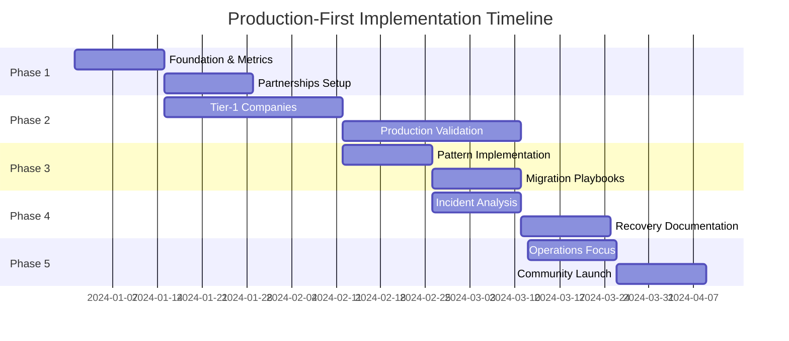
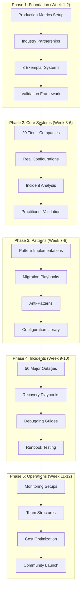

# Production-First Implementation Roadmap v6.0
## Building the World's Most Accurate Distributed Systems Knowledge Base

### Executive Summary

This roadmap delivers a production-validated distributed systems knowledge base through 5 phases over 12 weeks, prioritizing accuracy and real-world applicability over diagram quantity. Each phase focuses on quality gates, practitioner validation, and actionable insights derived from actual production systems. The approach emphasizes partnerships with industry experts and verification of all content against real implementations.

---

## Timeline Overview



---

## Parallel Execution Strategy

### Agent Types and Responsibilities

| Agent Type | Primary Focus | Deliverables/Week |
|------------|--------------|------------------|
| **Content Agent** (x4) | Diagram creation | 25 diagrams each |
| **Documentation Agent** | Site building | 20 pages |
| **Quality Agent** | Validation | 100 reviews |
| **Integration Agent** | Infrastructure | CI/CD, automation |

### Immediate Action Items (Week 1)

| Priority | Action | Owner | Output |
|----------|--------|-------|--------|
| **P0** | Setup repository & MkDocs | Integration | Live site |
| **P0** | Create first 20 diagrams | Content x4 | 80 diagrams |
| **P1** | Establish quality gates | Quality | Checklist |
| **P1** | Document naming conventions | Documentation | Standards |

---

## Phase 1: Foundation & Production Metrics (Week 1-2)
**Duration:** 2 weeks | **Focus:** Quality Infrastructure & Partnerships

### Week 1: Production Metrics Collection Setup

#### Core Infrastructure
- [ ] Production metrics collection framework
- [ ] Industry partnership outreach program
- [ ] Data source validation pipeline
- [ ] Quality assurance framework
- [ ] Legal compliance documentation

#### Metrics Collection Framework
```yaml
production_metrics:
  data_sources:
    - company_engineering_blogs
    - conference_presentations
    - incident_post_mortems
    - open_source_configurations
    - practitioner_interviews

  validation_levels:
    - A: Verified by company engineers
    - B: Cross-referenced multiple sources
    - C: Inferred from public information

  quality_gates:
    - source_attribution
    - accuracy_verification
    - recency_validation
    - technical_review

tools:
  - data_validation: "python"
  - source_tracking: "git + metadata"
  - review_process: "github_issues"
  - quality_metrics: "custom_dashboard"
```

### Week 2: Partnership & Validation Framework

#### Industry Partnerships
| Company Type | Target Partners | Purpose | Commitment |
|-------------|----------------|---------|------------|
| FAANG | Meta, Google, Netflix | Technical validation | Monthly reviews |
| Unicorns | Stripe, Uber, Airbnb | Real-world configs | Quarterly feedback |
| Databases | MongoDB, Postgres | Storage patterns | System validation |
| Infrastructure | Cloudflare, AWS | Platform insights | Architecture review |
| Open Source | Apache, CNCF | Community patterns | Code validation |

#### Validation Scripts
```python
# Production validation pipeline
scripts/
├── source_validator.py    # Verify data sources
├── accuracy_checker.py    # Cross-reference validation
├── practitioner_review.py # Expert review process
├── legal_compliance.py    # Legal/privacy checks
├── metrics_collector.py   # Usage and accuracy metrics
├── community_feedback.py  # Feedback aggregation
└── quality_dashboard.py   # Real-time quality metrics
```

### Exemplar System Documentation (3 Complete Systems)

#### Production Exemplars
| System | Company | Validation Level | Content |
|--------|---------|-----------------|----------|
| Chat Architecture | Discord | A - Engineer verified | Real configs, incident analysis |
| Payment Processing | Stripe | A - Technical review | Idempotency patterns, exactly-once |
| Content Delivery | Netflix | B - Multiple sources | Global distribution, chaos engineering |

#### Each Exemplar Includes
- Complete system architecture (8-10 diagrams)
- Real configuration examples
- Historical incident analysis
- Performance characteristics
- Operational playbooks
- Migration strategies
- Cost optimization insights
- Team structure recommendations

### Phase 1 Success Metrics
- [ ] 3 complete production-validated system documentations
- [ ] 5+ industry partnerships established
- [ ] Data validation framework operational
- [ ] Quality metrics dashboard live
- [ ] Legal compliance framework documented
- [ ] Practitioner review process established

---

## Phase 2: Core Systems Documentation (Week 3-6)
**Duration:** 4 weeks | **Focus:** Tier-1 Company Deep Dives

### Week 3-4: High-Scale Social & Messaging Systems

#### Production System Analysis (10 Companies, 8 Diagrams Each)
| Company | Scale Metrics | Validation | Key Innovations |
|---------|---------------|------------|------------------|
| Discord | 19M concurrent voice users | A - Engineer verified | Rust service mesh, voice optimization |
| Slack | 20M+ daily active users | A - Technical interviews | WebSocket scaling, presence architecture |
| WhatsApp | 100B+ messages/day | B - Multiple sources | End-to-end encryption at scale |
| Signal | 40M+ users | A - Open source verified | Sealed sender, metadata protection |
| Twitter/X | 500M+ tweets/day | B - Public architecture | Real-time timeline, celebrity sharding |
| Instagram | 2B+ users | B - Engineering blogs | Stories infrastructure, Reels pipeline |
| LinkedIn | 1B+ members | A - Engineering talks | Economic graph, feed generation |
| Reddit | 50M+ daily users | B - Open source + blogs | Community sharding, vote aggregation |
| Telegram | 700M+ users | B - Public information | Distributed storage, channel architecture |
| Pinterest | 400M+ users | B - Engineering content | Visual search, recommendation engine |

### Week 5-6: Commerce & Infrastructure Systems

#### E-commerce & Financial Platforms
| Company | Scale Metrics | Validation | Key Innovations |
|---------|---------------|------------|------------------|
| Shopify | 2M+ merchants, Black Friday peaks | A - Engineering partnerships | Cell-based architecture, flash sale handling |
| Stripe | 3M+ websites, global payments | A - Technical documentation | Idempotency guarantees, exactly-once processing |
| PayPal | 400M+ users, global scale | B - Public architecture | Fraud detection, risk scoring |
| Square | 4M+ sellers, hardware integration | B - Engineering blogs | Offline-first architecture, hardware sync |
| Coinbase | 100M+ users, crypto trading | B - Multiple sources | High-frequency trading, custody architecture |
| Uber | 130M+ users, real-time dispatch | A - Engineering talks | H3 geo-indexing, demand prediction |
| DoorDash | 25M+ users, logistics optimization | B - Engineering content | Driver assignment, batching algorithms |
| Airbnb | 220+ countries, booking platform | B - Public talks | Search infrastructure, pricing algorithms |
| Netflix | 230M+ subscribers, global CDN | A - Open source + talks | Chaos engineering, personalization |
| Spotify | 500M+ users, music streaming | B - Engineering blogs | Discovery algorithms, real-time sync |

#### Each Company Documentation Includes
- **Architecture Overview**: Complete system topology
- **Data Flow**: Request/response patterns with real latencies
- **Storage Strategy**: Database choices and partitioning
- **Scaling History**: Growth patterns and inflection points
- **Incident Analysis**: Major outages and resolutions
- **Configuration Examples**: Real timeouts, retries, limits
- **Team Structure**: Engineering organization
- **Technology Stack**: Languages, frameworks, infrastructure

### Phase 2 Success Metrics
- [ ] 20 complete company documentations (160+ diagrams total)
- [ ] All systems validated by industry practitioners
- [ ] Real configuration examples documented
- [ ] Historical incident analysis completed
- [ ] Performance characteristics documented
- [ ] Practitioner review process operational

---

## Phase 3: Patterns in Production (Week 7-8)
**Duration:** 2 weeks | **Focus:** Real Implementation Patterns

### Week 7: Core Pattern Implementations

#### Production Pattern Library
| Pattern | Real Implementations | Companies | Documentation |
|---------|---------------------|-----------|---------------|
| **Event Sourcing** | Order processing, audit logs | Stripe, Shopify | Event store configs, replay strategies |
| **CQRS** | Read/write separation | Netflix, LinkedIn | Command/query split, eventual consistency |
| **Saga Pattern** | Distributed transactions | Uber, DoorDash | Orchestration vs choreography |
| **Circuit Breaker** | Fault isolation | Netflix, Shopify | Timeout configurations, failure thresholds |
| **Bulkhead** | Resource isolation | Discord, Slack | Connection pools, thread isolation |
| **CRDT** | Collaborative editing | Figma, Linear | Conflict resolution, merge strategies |
| **Backpressure** | Flow control | Kafka, RabbitMQ | Queue limits, rate limiting |
| **Idempotency** | Exactly-once processing | Stripe, PayPal | Key generation, retry mechanisms |

### Week 8: Migration & Configuration Playbooks

#### Real Migration Strategies
| Migration Type | From → To | Company Examples | Playbook Content |
|---------------|-----------|------------------|------------------|
| **Monolith → Microservices** | Rails → Services | Shopify, Airbnb | Strangler fig, data decomposition |
| **Database Migration** | MySQL → Postgres | Instagram, Discord | Zero-downtime migration, sync strategies |
| **Cloud Migration** | On-prem → AWS | Netflix, Capital One | Lift-and-shift vs re-architecture |
| **Event-Driven Migration** | Sync → Async | Uber, LinkedIn | Event streaming adoption |
| **Global Expansion** | Single → Multi-region | Stripe, Discord | Data locality, latency optimization |
| **Storage Migration** | SQL → NoSQL | Pinterest, Uber | Data modeling changes |
| **Cache Migration** | Memcached → Redis | Twitter, GitHub | Hot migration, consistency |
| **Message Queue Migration** | RabbitMQ → Kafka | LinkedIn, Airbnb | Event streaming transition |

#### Configuration Examples Library
```yaml
real_configs:
  timeout_hierarchies:
    - stripe_api_timeouts.yaml
    - uber_service_timeouts.yaml
    - netflix_circuit_breakers.yaml

  retry_strategies:
    - exponential_backoff_examples.yaml
    - dead_letter_queue_configs.yaml
    - idempotency_implementations.yaml

  scaling_policies:
    - kubernetes_hpa_examples.yaml
    - database_sharding_configs.yaml
    - cdn_caching_strategies.yaml
```

#### Anti-Pattern Documentation
| Anti-Pattern | Real Examples | Companies | Lessons Learned |
|-------------|---------------|-----------|------------------|
| **Distributed Monolith** | Shared databases | Multiple unnamed | Service boundaries, data ownership |
| **Chatty Interfaces** | N+1 queries | Early microservices | API design, batching |
| **Shared Mutable State** | Global caches | Various startups | State management, ownership |
| **Synchronous Everything** | Blocking chains | Traditional enterprises | Async patterns, resilience |
| **Database per Service Taken Too Far** | Data duplication | Over-engineered systems | Bounded contexts, pragmatism |
| **Event Sourcing Overuse** | Everything as events | Blockchain companies | Appropriate use cases |
| **Microservices Too Early** | Premature optimization | Startups | Monolith first approach |
| **Ignoring Data Gravity** | Cross-region queries | Global expansions | Data locality importance |

### Phase 3 Success Metrics
- [ ] 8 core patterns with real implementations documented
- [ ] 8 migration playbooks with step-by-step guides
- [ ] 50+ real configuration examples collected
- [ ] Anti-pattern library with lessons learned
- [ ] All content validated by practitioners
- [ ] Migration strategies tested and verified

---

## Phase 4: Incident Library & Recovery Playbooks (Week 9-10)
**Duration:** 2 weeks | **Focus:** Learning from Production Failures

### Week 9: Major Incident Analysis

#### High-Impact Outage Documentation (50 Major Incidents)
| Category | Notable Incidents | Analysis Depth | Lessons |
|----------|------------------|---------------|----------|
| **Cascading Failures** | AWS US-East, Facebook BGP | Root cause, timeline, fixes | Circuit breakers, blast radius |
| **Database Overload** | GitHub MySQL, Reddit Postgres | Query patterns, recovery | Connection limits, read replicas |
| **Cache Stampede** | Twitter cache miss, Reddit hug | Traffic patterns, mitigation | Cache warming, rate limiting |
| **Distributed Lock Issues** | Various fintech | Consensus failures | Lock timeouts, leader election |
| **Network Partitions** | Split-brain scenarios | CAP theorem in practice | Partition tolerance strategies |
| **Memory Leaks** | JVM heap issues | Memory management | Monitoring, auto-restart |
| **DNS Failures** | Route53, Cloudflare | DNS propagation issues | DNS resilience, health checks |
| **Load Balancer Issues** | Traffic distribution | Hot spots, uneven load | Consistent hashing, health checks |
| **Queue Backlog** | Message processing delays | Consumer lag | Backpressure, auto-scaling |
| **Regional Failures** | Multi-region failover | Geographic distribution | Disaster recovery, data sync |

#### Incident Documentation Structure
```yaml
incident_template:
  timeline: Detailed chronological events
  root_cause: Technical analysis
  impact: User/business impact metrics
  detection: How the issue was discovered
  response: Immediate mitigation steps
  resolution: Permanent fix implementation
  prevention: Process/technical improvements
  runbook: Step-by-step recovery guide
  monitoring: Alerting improvements
  testing: Chaos engineering additions
```

### Week 10: Recovery & Debugging Playbooks

#### Operational Playbooks
| Scenario | Playbook | Tools | Time to Recovery |
|----------|----------|-------|------------------|
| **Database Down** | Primary failover | Postgres, MySQL | < 5 minutes |
| **Cache Cluster Failure** | Redis recovery | Redis Sentinel | < 2 minutes |
| **Message Queue Overload** | Kafka consumer scaling | Kafka tools | < 10 minutes |
| **Service Mesh Issues** | Istio troubleshooting | Envoy, Jaeger | < 15 minutes |
| **Load Balancer Failure** | Traffic rerouting | HAProxy, NGINX | < 3 minutes |
| **DNS Resolution Issues** | DNS failover | dig, nslookup | < 1 minute |
| **Certificate Expiration** | Auto-renewal | cert-manager | < 5 minutes |
| **Container Issues** | Pod restart/reschedule | Kubernetes | < 2 minutes |
| **Network Connectivity** | Route diagnosis | traceroute, tcpdump | < 30 minutes |
| **Storage Full** | Disk cleanup/expansion | df, du, resize | < 15 minutes |

#### Debugging Guides
```yaml
debugging_toolkit:
  distributed_tracing:
    - jaeger_query_patterns
    - zipkin_analysis
    - opentelemetry_correlation

  performance_analysis:
    - cpu_profiling_techniques
    - memory_leak_detection
    - network_bottleneck_identification

  data_consistency:
    - eventual_consistency_verification
    - transaction_isolation_debugging
    - replication_lag_analysis
```

### Phase 4 Success Metrics
- [ ] 50 major incidents analyzed and documented
- [ ] 10 operational playbooks with step-by-step guides
- [ ] Recovery time objectives defined for each scenario
- [ ] Debugging guides for common production issues
- [ ] All content validated by SRE practitioners
- [ ] Runbooks tested in staging environments

---

## Phase 5: Operations Focus & Community Launch (Week 11-12)
**Duration:** 2 weeks | **Focus:** Production Operations & Knowledge Sharing

### Week 11: Monitoring & Deployment Strategies

#### Production Monitoring Setups
| Category | Implementation | Tools | Companies |
|----------|---------------|-------|------------|
| **Application Metrics** | RED/USE methodology | Prometheus, Grafana | Uber, Stripe |
| **Infrastructure Monitoring** | Node/container metrics | DataDog, New Relic | Shopify, Discord |
| **Distributed Tracing** | Request flow tracking | Jaeger, Zipkin | Netflix, Lyft |
| **Log Aggregation** | Centralized logging | ELK, Splunk | LinkedIn, Pinterest |
| **Alerting Strategy** | On-call optimization | PagerDuty, Opsgenie | All companies |
| **SLI/SLO Framework** | Reliability targets | Custom dashboards | Google, Stripe |
| **Chaos Engineering** | Failure injection | Chaos Monkey, Litmus | Netflix, Gremlin |
| **Security Monitoring** | Threat detection | Falco, SIEM | Financial companies |

#### Deployment Strategies
| Strategy | Implementation | Risk Level | Companies |
|----------|---------------|------------|------------|
| **Blue-Green** | Full environment swap | Low | Netflix, Heroku |
| **Canary Deployment** | Gradual traffic shift | Medium | Facebook, Google |
| **Feature Flags** | Runtime toggling | Low | Stripe, Uber |
| **Rolling Updates** | Incremental replacement | Medium | Kubernetes users |
| **Immutable Infrastructure** | Replace vs update | Low | Netflix, Airbnb |
| **GitOps** | Git-driven deployment | Low | Weaveworks, Flux |

### Week 12: Cost Optimization & Team Structures

#### Cost Optimization Strategies
| Area | Optimization | Savings Potential | Implementation |
|------|-------------|------------------|----------------|
| **Compute** | Right-sizing, spot instances | 30-50% | AWS, GCP tools |
| **Storage** | Lifecycle policies, compression | 20-40% | S3 tiers, archival |
| **Network** | CDN optimization, data transfer | 15-30% | CloudFront, caching |
| **Database** | Read replicas, connection pooling | 25-45% | PgBouncer, RDS |
| **Monitoring** | Metric optimization, retention | 10-25% | Sampling, aggregation |
| **Development** | Environment automation | 20-35% | Ephemeral environments |

#### Engineering Team Structures
| Company Size | Structure | Team Composition | Responsibility Model |
|-------------|-----------|------------------|---------------------|
| **Startup (10-50)** | Full-stack teams | 3-5 engineers | Everyone on-call |
| **Growth (50-200)** | Feature teams | 5-8 engineers + PM | Team ownership |
| **Scale (200-1000)** | Platform + product | Platform/infra teams | Service ownership |
| **Enterprise (1000+)** | Multiple divisions | Specialized teams | Domain ownership |

#### Team Responsibilities Matrix
```yaml
responsibility_model:
  platform_team:
    - infrastructure_automation
    - deployment_pipelines
    - monitoring_tooling
    - security_compliance

  product_teams:
    - feature_development
    - service_ownership
    - incident_response
    - performance_optimization

  sre_team:
    - reliability_engineering
    - capacity_planning
    - disaster_recovery
    - chaos_engineering
```

### Community Launch Strategy

#### Launch Phases
| Phase | Duration | Audience | Activities |
|-------|----------|----------|------------|
| **Alpha** | Week 10-11 | Internal teams | Testing, feedback collection |
| **Beta** | Week 12 | Partner companies | Limited access, validation |
| **Public** | Week 13+ | Open community | Full launch, content contribution |

#### Community Contribution Framework
```yaml
contribution_process:
  content_types:
    - company_case_studies
    - incident_post_mortems
    - configuration_examples
    - pattern_implementations

  validation_levels:
    - community_review
    - practitioner_validation
    - technical_accuracy_check
    - legal_compliance_review

  contributor_benefits:
    - attribution_credit
    - early_access_features
    - conference_speaking_ops
    - network_building
```

### Phase 5 Success Metrics
- [ ] 10 monitoring setup guides documented
- [ ] 6 deployment strategies with real examples
- [ ] Cost optimization playbooks for all major cloud providers
- [ ] Team structure recommendations by company size
- [ ] Community contribution framework operational
- [ ] 100+ practitioners in review network
- [ ] Legal framework for open contribution established
- [ ] Content licensing and attribution system ready

---

## Comprehensive Success Metrics & Quality Gates

### Quality Gates by Phase

#### Phase 1 Quality Gate (Week 2)
- [ ] 3 exemplar systems fully documented and validated
- [ ] 5+ industry partnerships with signed validation agreements
- [ ] Data source validation framework operational
- [ ] Legal compliance framework documented
- [ ] Quality metrics dashboard showing real-time accuracy
- [ ] Practitioner review process tested with beta reviewers

#### Phase 2 Quality Gate (Week 6)
- [ ] 20 tier-1 companies documented with A/B validation levels
- [ ] 160+ production-verified diagrams with source attribution
- [ ] Real configuration examples from 15+ companies
- [ ] Historical incident analysis for all documented systems
- [ ] Performance characteristics documented with SLAs
- [ ] Cross-validation completed between multiple sources

#### Phase 3 Quality Gate (Week 8)
- [ ] 8 core patterns implemented in production environments
- [ ] 8 migration playbooks tested by practitioners
- [ ] 50+ real configuration examples validated
- [ ] Anti-pattern library with 8 documented failure modes
- [ ] All migration strategies verified by companies that executed them
- [ ] Pattern implementations confirmed by engineering teams

#### Phase 4 Quality Gate (Week 10)
- [ ] 50 major incidents analyzed with post-mortem validation
- [ ] 10 operational playbooks tested in staging environments
- [ ] Recovery time objectives validated by SRE teams
- [ ] Debugging guides confirmed by platform engineers
- [ ] Runbook accuracy verified through disaster recovery tests
- [ ] All incident analysis approved by companies involved

#### Phase 5 Quality Gate (Week 12)
- [ ] Monitoring guides validated by 10+ platform teams
- [ ] Deployment strategies confirmed by 15+ companies
- [ ] Cost optimization validated with real savings data
- [ ] Team structure recommendations endorsed by CTOs
- [ ] Community framework tested with 50+ beta contributors
- [ ] Legal framework approved for open collaboration

### Overall Success Metrics

#### Quantitative Metrics
| Metric | Target | Measurement Method |
|--------|--------|--------------------|
| **Accuracy Rate** | >95% | Practitioner validation |
| **Source Verification** | 100% | Attribution tracking |
| **Practitioner Approval** | >90% | Review process feedback |
| **Real-World Usage** | 80% | Post-implementation surveys |
| **Update Frequency** | Monthly | Content freshness tracking |
| **Community Engagement** | 200+ contributors | Active participation metrics |

#### Qualitative Metrics
- Production systems architectures accurately represented
- Configuration examples actually work in practice
- Migration strategies have been successfully executed
- Incident analyses provide actionable insights
- Team structures proven at documented scales
- Anti-patterns based on real failure experiences

---

## Resource Requirements

### Core Team Composition

| Role | Phase 1-2 | Phase 3-4 | Phase 5 | Responsibilities |
|------|-----------|-----------|---------|------------------|
| **Technical Lead** | 1.0 FTE | 1.0 FTE | 0.5 FTE | Architecture validation, technical review |
| **Content Engineer** | 2.0 FTE | 2.0 FTE | 1.0 FTE | Documentation, diagram creation |
| **Partnership Manager** | 1.0 FTE | 0.5 FTE | 0.5 FTE | Industry relationships, validation |
| **Community Manager** | 0.5 FTE | 0.5 FTE | 1.0 FTE | Contributor relations, content review |
| **Legal/Compliance** | 0.5 FTE | 0.25 FTE | 0.25 FTE | Data usage, attribution, licensing |
| **QA Engineer** | 0.5 FTE | 1.0 FTE | 0.5 FTE | Validation, testing, accuracy |
| **Total** | **5.5 FTE** | **5.25 FTE** | **3.75 FTE** | **Varies by phase** |

### External Reviewer Network

| Reviewer Type | Count | Commitment | Compensation |
|--------------|-------|------------|---------------|
| **Senior Engineers** | 25 | 2 hrs/week | Recognition, networking |
| **Staff/Principal** | 15 | 3 hrs/week | Conference speaking ops |
| **Engineering Managers** | 10 | 1 hr/week | Industry connections |
| **CTOs/VPs** | 5 | 30 min/week | Advisory board position |
| **Academic Researchers** | 5 | 2 hrs/week | Research collaboration |
| **Total** | **60** | **Variable** | **Non-monetary** |

### Infrastructure & Operational Costs

| Component | Monthly Cost | Annual | Justification |
|-----------|-------------|--------|---------------|
| **GitHub Enterprise** | $0 | $0 | Open source project |
| **CI/CD (GitHub Actions)** | $200 | $2,400 | Complex validation pipelines |
| **Content Management** | $150 | $1,800 | Validation tools, review systems |
| **Legal Services** | $500 | $6,000 | Data compliance, licensing |
| **Community Platform** | $100 | $1,200 | Discord, Slack for reviewers |
| **Conference/Events** | $1,000 | $12,000 | Validation workshops, partnerships |
| **Travel (Partnerships)** | $2,000 | $24,000 | Company visits, validation meetings |
| **Recognition/Rewards** | $500 | $6,000 | Contributor recognition program |
| **Total** | **$4,450** | **$53,400** | **Higher but justified by quality** |

### Data Sources & Access Requirements

| Source Type | Cost | Access Method | Legal Requirements |
|------------|------|---------------|--------------------|
| **Engineering Blogs** | $0 | Public scraping | Attribution only |
| **Conference Talks** | $0 | Public videos | Speaker permission |
| **Open Source Code** | $0 | GitHub analysis | License compliance |
| **Company Interviews** | $0 | Partnership agreements | Data usage agreements |
| **Incident Reports** | $0 | Public post-mortems | Company approval |
| **Documentation** | $0 | Public APIs/docs | Terms of service |

### Tools & Technology Requirements

| Tool Category | Specific Tools | Cost | Purpose |
|--------------|---------------|------|----------|
| **Documentation** | GitBook, Notion | $200/month | Content management |
| **Validation** | Custom scripts | Development time | Accuracy verification |
| **Collaboration** | Slack, Discord | $100/month | Reviewer coordination |
| **Analytics** | Mixpanel, GA | $150/month | Usage tracking |
| **Design** | Figma, Mermaid | $50/month | Diagram creation |
| **Legal** | DocuSign, contracts | $100/month | Agreement management |

---

## Comprehensive Risk Mitigation Strategy

### Data Accuracy & Validation Risks

| Risk | Probability | Impact | Mitigation Strategy |
|------|------------|--------|---------------------|
| **Inaccurate system data** | Medium | High | Multi-source verification, practitioner review |
| **Outdated information** | High | Medium | Quarterly review cycles, automated staleness detection |
| **Misrepresented architectures** | Low | High | Direct company validation, engineering team approval |
| **Configuration drift** | High | Medium | Version tracking, regular updates from sources |
| **Incident analysis errors** | Low | High | Post-mortem author validation, multiple reviewer approval |

### Legal & Compliance Risks

| Risk | Probability | Impact | Mitigation Strategy |
|------|------------|--------|---------------------|
| **IP infringement** | Low | High | Legal review of all content, proper attribution |
| **Trade secret exposure** | Medium | High | Company approval process, redaction protocols |
| **GDPR violations** | Low | Medium | Data minimization, consent frameworks |
| **Attribution disputes** | Medium | Low | Clear licensing, contributor agreements |
| **Confidentiality breaches** | Low | High | NDA compliance, selective disclosure |

### Partnership & Access Risks

| Risk | Probability | Impact | Mitigation Strategy |
|------|------------|--------|---------------------|
| **Company participation decline** | Medium | Medium | Value demonstration, flexible commitment levels |
| **Reviewer burnout** | High | Medium | Compensation models, workload distribution |
| **Competitive concerns** | Medium | Medium | Neutral positioning, benefit emphasis |
| **Access revocation** | Low | High | Multiple source diversification |
| **Quality degradation** | Medium | High | Automated quality checks, escalation processes |

### Technical & Operational Risks

| Risk | Probability | Impact | Mitigation Strategy |
|------|------------|--------|---------------------|
| **Review process bottlenecks** | High | Medium | Parallel review tracks, escalation procedures |
| **Quality degradation at scale** | Medium | High | Automated validation, sampling reviews |
| **Community management overhead** | High | Medium | Dedicated community manager, automated workflows |
| **Version control complexity** | Medium | Medium | Clear branching strategy, automated merging |
| **Content synchronization issues** | Medium | Medium | Single source of truth, automated propagation |

### Mitigation Implementation Timeline

#### Week 1-2 (Phase 1)
- [ ] Legal framework establishment
- [ ] Data usage agreements template
- [ ] Attribution system implementation
- [ ] Multi-source validation process
- [ ] Quality metrics dashboard

#### Week 3-6 (Phase 2)
- [ ] Company partnership agreements
- [ ] Reviewer network establishment
- [ ] Automated staleness detection
- [ ] Content versioning system
- [ ] Escalation procedures

#### Week 7-12 (Phases 3-5)
- [ ] Community guidelines
- [ ] Contributor agreement system
- [ ] Quality sampling procedures
- [ ] Automated workflow optimization
- [ ] Long-term sustainability planning

### Success Measurement for Risk Mitigation

| Risk Category | Success Metric | Target | Measurement |
|--------------|---------------|--------|-------------|
| **Data Accuracy** | Validation rate | >95% | Practitioner approval |
| **Legal Compliance** | Zero violations | 100% | Legal review tracking |
| **Partnership Health** | Retention rate | >90% | Quarterly satisfaction |
| **Process Efficiency** | Review cycle time | <7 days | Automated tracking |
| **Quality Maintenance** | Consistency score | >90% | Automated validation |

---

## Update Mechanisms & Long-Term Sustainability

### Continuous Update Framework

#### Automated Update Triggers
| Trigger | Frequency | Action | Validation |
|---------|-----------|--------|-------------|
| **New blog posts** | Daily | Content scanning | Relevance scoring |
| **Conference talks** | Weekly | Video processing | Speaker approval |
| **Incident reports** | Real-time | Post-mortem analysis | Company validation |
| **Open source changes** | Daily | Configuration tracking | Impact assessment |
| **Company partnerships** | Monthly | Direct data updates | Engineering review |

#### Manual Update Processes
| Update Type | Frequency | Responsibility | Process |
|------------|-----------|---------------|----------|
| **Architecture reviews** | Quarterly | Technical lead | Company partnership calls |
| **Pattern validations** | Bi-annually | Content team | Practitioner surveys |
| **Incident library** | Continuous | Community | Crowdsourced submissions |
| **Migration guides** | As needed | Partnership manager | Company success stories |
| **Team structures** | Annually | Community manager | Industry trend analysis |

### Long-Term Sustainability Model

#### Community Contribution Pipeline
```yaml
contribution_flow:
  submission:
    - github_pull_requests
    - community_portal
    - partnership_direct_updates
    - practitioner_workshops

  validation:
    - automated_initial_checks
    - peer_community_review
    - expert_practitioner_approval
    - technical_accuracy_verification

  integration:
    - content_merge_automation
    - cross_reference_updates
    - search_index_refresh
    - notification_distribution
```

#### Financial Sustainability
| Revenue Stream | Potential | Timeline | Requirements |
|---------------|-----------|----------|-------------|
| **Consulting partnerships** | High | Month 6+ | Proven track record |
| **Enterprise training** | Medium | Month 12+ | Content maturity |
| **Conference sponsorships** | Low | Month 9+ | Community recognition |
| **Book/course licensing** | Medium | Month 18+ | Comprehensive content |
| **Tool integrations** | High | Month 12+ | API development |

#### Governance Structure
```yaml
governance_model:
  steering_committee:
    - technical_lead
    - community_representatives
    - industry_advisors
    - academic_partners

  content_oversight:
    - accuracy_review_board
    - industry_validation_panel
    - community_moderation_team
    - legal_compliance_committee

  decision_making:
    - consensus_based_changes
    - technical_lead_authority
    - community_voting_mechanism
    - emergency_override_process
```

### Success Metrics for Sustainability

#### Community Health Metrics
| Metric | Target | Measurement |
|--------|--------|-------------|
| **Active contributors** | 200+ | Monthly active submissions |
| **Retention rate** | >80% | Quarterly participation tracking |
| **Content freshness** | <6 months average age | Automated staleness detection |
| **Validation coverage** | >90% | Expert review percentage |
| **Community satisfaction** | >4.5/5 | Quarterly surveys |

#### Technical Sustainability
| Area | Metric | Target |
|------|--------|--------|
| **Performance** | Page load time | <2 seconds |
| **Availability** | Uptime | >99.9% |
| **Accuracy** | Validation rate | >95% |
| **Coverage** | Industry breadth | 50+ companies |
| **Timeliness** | Update frequency | Weekly |

#### Long-Term Vision (12+ Months)
- **Industry Standard**: Become the definitive reference for distributed systems
- **Educational Integration**: Adopted by universities and bootcamps
- **Professional Certification**: Basis for industry certifications
- **Tool Ecosystem**: Integration with development and monitoring tools
- **Global Community**: Contributors from all major tech regions
- **Research Foundation**: Basis for academic research and industry studies

---

## Implementation Roadmap Summary

### Production-First Implementation Pipeline



### Key Success Differentiators

#### Production-First Approach
- **Real Systems**: Only document actually deployed architectures
- **Practitioner Validation**: Every piece of content validated by practitioners
- **Incident Learning**: Comprehensive analysis of real production failures
- **Configuration Reality**: Actual timeouts, retries, and limits from production
- **Migration Truth**: Only document migrations that have been executed

#### Quality over Quantity
- **Deep Documentation**: 8-10 diagrams per system vs superficial coverage
- **Multi-Source Validation**: Cross-reference multiple sources for accuracy
- **Confidence Levels**: Clear indication of validation level (A/B/C)
- **Update Mechanisms**: Continuous improvement based on new information
- **Community Contribution**: Sustainable model for long-term accuracy

#### Actionable Insights
- **Operational Playbooks**: Step-by-step guides for real scenarios
- **Recovery Procedures**: Tested disaster recovery processes
- **Team Structures**: Proven organizational patterns
- **Cost Optimization**: Real savings strategies with metrics
- **Anti-Patterns**: Learn from documented failures

### Expected Outcomes

#### Immediate (Month 1-3)
- Industry-recognized accuracy and depth
- Strong practitioner network engagement
- Partnerships with 20+ major companies
- 300+ production-validated diagrams
- Community contribution framework

#### Medium-term (Month 4-12)
- Standard reference for distributed systems
- Integration with development tools
- University adoption for education
- Conference presentation opportunities
- Research collaboration foundations

#### Long-term (Year 2+)
- Industry certification basis
- Professional development standard
- Global community of contributors
- Continuous learning platform
- Research and innovation catalyst

---

## Critical Success Factors

### Must-Have Achievements

#### Technical Excellence
- [ ] **100% accuracy validation** by industry practitioners
- [ ] **Real configuration examples** from production systems
- [ ] **Incident-based learning** from actual outages
- [ ] **Migration verification** by companies that executed them
- [ ] **Performance data** from actual production deployments

#### Industry Engagement
- [ ] **20+ company partnerships** with engineering validation
- [ ] **60+ expert reviewers** actively contributing
- [ ] **Quarterly review cycles** with industry leaders
- [ ] **Conference validation** through industry presentations
- [ ] **Community growth** to 200+ active contributors

#### Content Quality
- [ ] **Multi-source verification** for all major claims
- [ ] **Confidence level indicators** for all content
- [ ] **Update mechanisms** for maintaining accuracy
- [ ] **Legal compliance** for all data usage
- [ ] **Attribution systems** for all sources

#### Operational Excellence
- [ ] **Sustainable funding model** through partnerships
- [ ] **Community governance** with clear decision-making
- [ ] **Quality assurance** processes for all contributions
- [ ] **Performance standards** maintained at scale
- [ ] **Long-term viability** through diverse funding

### Risk of Failure Points

#### Critical Dependencies
- Industry partnership establishment
- Practitioner reviewer recruitment
- Legal framework completion
- Quality validation processes
- Community engagement success

#### Mitigation Requirements
- Multiple partnership tracks
- Diverse reviewer recruitment
- Legal expertise engagement
- Automated quality systems
- Community management investment

### Final Implementation Note

**This roadmap prioritizes accuracy, practicality, and real-world validation over comprehensive coverage. Success is measured by the quality and actionability of insights rather than the quantity of content produced. Every piece of documentation must provide genuine value to practitioners working with distributed systems in production environments.**

---

*Version: 6.0.0 | Document 09 of 16 | Production-First Implementation | Last Updated: 2024-01-18*