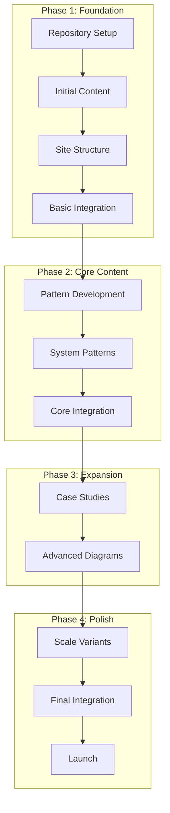

# Parallel Execution Plan v6.0
## Streamlined Multi-Agent Implementation Strategy for 900-1,500 Diagrams

### Executive Summary

This document provides realistic execution plans designed for parallel implementation by multiple agents focused on content creation over infrastructure complexity. The streamlined approach emphasizes direct diagram authoring using markdown + Mermaid, realistic resource allocation, and achievable parallelization to deliver 900-1,500 comprehensive diagrams in 12 weeks.

---

## Agent Types and Responsibilities

### Simplified Agent Roles

| Agent Type | ID | Primary Responsibilities | Tools/Skills |
|------------|----|-----------------------|--------------|
| **Content Agent** | CONT | Markdown + Mermaid diagram creation | Distributed systems expertise, Mermaid |
| **Documentation Agent** | DOC | Site building, page creation | MkDocs, Markdown |
| **Quality Agent** | QA | Review, validation, consistency | Domain expertise, tooling |
| **Integration Agent** | INT | Repository setup, CI/CD | Git, GitHub Actions |

---

## PHASE 1: FOUNDATION (Weeks 1-3)

### Week 1: Repository Setup and Initial Content

#### Integration Setup (INT Agent)
```yaml
tasks:
  - id: INT-001
    task: "Setup repository structure"
    duration: 8h
    dependencies: []
    deliverables:
      - site/ directory with MkDocs
      - Basic GitHub Actions
      - .gitignore configured

  - id: INT-002
    task: "Configure MkDocs site"
    duration: 4h
    dependencies: [INT-001]
    deliverables:
      - mkdocs.yml configured
      - Basic theme setup
      - Navigation structure
```

#### Content Creation (CONT Agents 1-4)
```yaml
tasks:
  - id: CONT-001
    task: "Create guarantee documentation and diagrams"
    duration: 20h
    dependencies: [INT-001]
    agents: [CONT-01, CONT-02]
    deliverables:
      - site/docs/foundation/guarantees.md
      - 18 guarantee diagrams in Mermaid
      - Cross-reference documentation

  - id: CONT-002
    task: "Create mechanism documentation and diagrams"
    duration: 24h
    dependencies: [INT-001]
    agents: [CONT-03, CONT-04]
    deliverables:
      - site/docs/foundation/mechanisms.md
      - 20 mechanism diagrams in Mermaid
      - Implementation guides
```

#### Documentation Setup (DOC Agent)
```yaml
tasks:
  - id: DOC-001
    task: "Create site structure and templates"
    duration: 12h
    dependencies: [INT-002]
    deliverables:
      - Page templates for all sections
      - Navigation structure
      - Search configuration

  - id: DOC-002
    task: "Setup Mermaid integration"
    duration: 6h
    dependencies: [DOC-001]
    deliverables:
      - Mermaid plugin configuration
      - Diagram rendering setup
      - Theme customization
```

### Week 2: Content Development

#### Parallel Content Creation
```yaml
content_streams:
  stream_1: # CONT-01, CONT-02
    focus: "Core Guarantees + Initial Patterns"
    tasks:
      - Complete all 18 guarantees with multiple diagram types
      - Start basic patterns (Request-Response, Async)
      - Create cross-reference tables
    deliverables: 80 diagrams

  stream_2: # CONT-03, CONT-04
    focus: "Core Mechanisms + Advanced Patterns"
    tasks:
      - Complete all 20 mechanisms with variants
      - Implement CQRS, Event Sourcing patterns
      - Create mechanism composition guides
    deliverables: 90 diagrams

  stream_3: # DOC-01
    focus: "Site Development"
    tasks:
      - Build all main pages
      - Implement search functionality
      - Create navigation structure
    deliverables: 15 pages

  stream_4: # QA-01
    focus: "Quality Assurance"
    tasks:
      - Review content for consistency
      - Validate Mermaid syntax
      - Check cross-references
    deliverables: QA reports
```

### Week 3: Initial Integration and Testing

#### Integration and Quality
```yaml
integration_tasks:
  qa_review: # QA-01, QA-02
    duration: 24h
    tasks:
      - Complete diagram review
      - Consistency validation
      - Cross-reference checking
      - Performance testing

  site_build: # DOC-01, INT-01
    duration: 16h
    tasks:
      - Build complete site
      - Deploy to staging
      - Performance optimization
      - Mobile responsiveness

  content_polish: # CONT-01 to CONT-04
    duration: 12h per agent
    tasks:
      - Address QA feedback
      - Complete missing diagrams
      - Polish documentation
      - Add examples
```

---

## PHASE 2: CORE CONTENT (Weeks 4-6)

### Week 4: Pattern Implementation

#### System Patterns (6 Agents)
```yaml
system_patterns:
  agents: [CONT-01, CONT-02, CONT-03, CONT-04, CONT-05, CONT-06]
  distribution:
    CONT-01: Microservices Architecture
    CONT-02: Event-Driven Architecture
    CONT-03: CQRS + Event Sourcing
    CONT-04: Serverless Patterns
    CONT-05: Cell-Based Architecture
    CONT-06: Edge Computing Patterns

  per_pattern_deliverables:
    - L0 global flow diagram
    - L1 plane-specific views (5 planes)
    - Sequence diagrams (happy path + failures)
    - Multi-region variants
    - Scale tier variations
    - Implementation guidance
```

### Week 5: System Patterns

#### Advanced Pattern Development
```yaml
advanced_patterns:
  track_1: # Complexity Patterns
    agents: [CONT-01, CONT-02, CONT-03]
    patterns:
      - Saga Pattern (distributed transactions)
      - Circuit Breaker + Bulkhead
      - Stream Processing + CQRS
    diagrams_per_pattern: 15-20

  track_2: # Scale Patterns
    agents: [CONT-04, CONT-05, CONT-06]
    patterns:
      - Multi-tenant Architecture
      - Global Distribution
      - Auto-scaling Patterns
    diagrams_per_pattern: 15-20

  documentation: # DOC-01, DOC-02
    tasks:
      - Pattern comparison tables
      - Decision trees
      - Migration guides
      - Best practices
```

### Week 6: Core Integration

#### Integration and Optimization
```yaml
integration_focus:
  cross_references: # QA-01, QA-02
    tasks:
      - Validate all pattern-mechanism mappings
      - Check guarantee-pattern relationships
      - Update navigation and search
      - Create dependency graphs

  performance: # INT-01
    tasks:
      - Optimize site performance
      - Implement lazy loading
      - Compress diagrams
      - Setup CDN

  documentation: # DOC-01, DOC-02
    tasks:
      - Complete all missing pages
      - Create getting started guide
      - Add search functionality
      - Mobile optimization
```

---

## PHASE 3: EXPANSION (Weeks 7-9)

### Week 7-8: Case Studies

#### Selected Case Studies (8 Agents)
```yaml
case_study_selection:
  high_confidence: # Well-documented architectures
    agents: [CASE-01, CASE-02, CASE-03, CASE-04]
    companies:
      CASE-01: Netflix (microservices, content delivery)
      CASE-02: Uber (geo-distributed, real-time)
      CASE-03: Shopify (multi-tenant, scaling)
      CASE-04: Discord (real-time messaging, scale)

  medium_confidence: # Some public information
    agents: [CASE-05, CASE-06, CASE-07, CASE-08]
    companies:
      CASE-05: Stripe (payments, reliability)
      CASE-06: Cloudflare (edge computing, DDoS)
      CASE-07: Spotify (recommendation, data)
      CASE-08: WhatsApp (messaging scale)

  per_case_study:
    required_diagrams:
      - CS-L0: Global architecture (1)
      - CS-L1: Plane details (5)
      - CS-SQ: Key sequences (3)
      - CS-MR: Multi-region (1)
      - CS-Scale: Scale evolution (2)
    total: 12 diagrams per case study
    duration: 24h per case study
```

### Week 9: Advanced Diagrams

#### Specialized Diagram Types
```yaml
advanced_diagrams:
  failure_scenarios: # FAIL-01, FAIL-02
    agents: 2
    focus:
      - Network partitions
      - Node failures
      - Cascade failures
      - Recovery procedures
    deliverables: 40 diagrams

  performance_analysis: # PERF-01, PERF-02
    agents: 2
    focus:
      - Latency breakdowns
      - Throughput analysis
      - Bottleneck identification
      - Optimization paths
    deliverables: 30 diagrams

  security_patterns: # SEC-01
    agent: 1
    focus:
      - Authentication flows
      - Authorization patterns
      - Data protection
      - Zero-trust architecture
    deliverables: 25 diagrams
```

---

## PHASE 4: POLISH (Weeks 10-12)

### Week 10: Scale Variants

#### Multi-Scale Architecture
```yaml
scale_variants:
  scale_tiers: # 4 agents
    agents: [SCALE-01, SCALE-02, SCALE-03, SCALE-04]
    tiers:
      SCALE-01: Startup (10K-100K users)
      SCALE-02: Growth (100K-1M users)
      SCALE-03: Scale (1M-10M users)
      SCALE-04: Hyperscale (10M+ users)

  per_tier_focus:
    - Architecture simplifications/complexities
    - Technology choices
    - Cost optimizations
    - Operational requirements

  deliverables: 15 diagrams per tier = 60 total
```

### Week 11: Final Integration

#### Complete System Integration
```yaml
final_integration:
  content_review: # QA-01, QA-02, QA-03
    duration: 30h
    tasks:
      - Complete content audit
      - Consistency validation
      - Cross-reference verification
      - Performance testing

  site_optimization: # INT-01, DOC-01
    duration: 24h
    tasks:
      - Final performance optimization
      - Search index optimization
      - Mobile responsiveness
      - Accessibility compliance

  documentation: # DOC-01, DOC-02
    duration: 20h
    tasks:
      - Complete all missing docs
      - Create contribution guide
      - Add API documentation
      - Final proofreading
```

### Week 12: Launch Preparation

#### Launch Readiness
```yaml
launch_preparation:
  final_qa: # QA-01, QA-02, QA-03
    tasks:
      - Complete system testing
      - Performance validation
      - Security review
      - Content accuracy check

  deployment: # INT-01
    tasks:
      - Production deployment
      - CDN configuration
      - Monitoring setup
      - Backup procedures

  documentation: # DOC-01, DOC-02
    tasks:
      - User documentation
      - Maintenance guides
      - Troubleshooting docs
      - Launch announcement
```

---

## Resource Allocation

### Realistic Agent Utilization

```yaml
week_1_3_allocation:
  integration: 1 agent × 24h = 24h
  content: 4 agents × 36h = 144h
  documentation: 1 agent × 24h = 24h
  quality: 1 agent × 12h = 12h
  total: 7 agents × varying = 204h

week_4_6_allocation:
  content: 6 agents × 36h = 216h
  documentation: 2 agents × 24h = 48h
  quality: 2 agents × 24h = 48h
  total: 10 agents × varying = 312h

week_7_9_allocation:
  content: 8 agents × 30h = 240h
  documentation: 2 agents × 24h = 48h
  quality: 2 agents × 24h = 48h
  total: 12 agents × varying = 336h

week_10_12_allocation:
  content: 4 agents × 30h = 120h
  documentation: 2 agents × 30h = 60h
  quality: 3 agents × 30h = 90h
  integration: 1 agent × 30h = 30h
  total: 10 agents × varying = 300h
```

### Optimal Team Size

| Phase | Minimum Agents | Optimal Agents | Maximum Useful |
|-------|---------------|----------------|----------------|
| Phase 1 | 5 | 7 | 10 |
| Phase 2 | 8 | 10 | 12 |
| Phase 3 | 10 | 12 | 15 |
| Phase 4 | 8 | 10 | 12 |

---

## Dependency Management

### Simplified Critical Path



### Key Dependencies

| Task | Depends On | Blocks | Can Parallel With |
|------|------------|--------|-------------------|
| Repository Setup | None | All Content | Documentation Setup |
| Content Creation | Repository | Site Build | Other Content |
| Site Structure | Repository | Navigation | Content Creation |
| Quality Review | Content | Final Integration | Documentation |
| Performance Opt | Site Build | Launch | Content Polish |

---

## Success Metrics

### Phase Completion Criteria

```yaml
phase_1_complete:
  required:
    - 200 diagrams created
    - Site structure complete
    - Basic CI/CD working
    - All core content started
  quality:
    - Mermaid syntax valid
    - Cross-references working
    - Site loads < 3s

phase_2_complete:
  required:
    - 500 total diagrams
    - All patterns implemented
    - Complete documentation
    - Search working
  quality:
    - Visual consistency
    - Mobile responsive
    - Performance targets met

phase_3_complete:
  required:
    - 900 total diagrams
    - Case studies complete
    - Advanced diagrams done
    - Full site functional
  quality:
    - Accessibility compliant
    - SEO optimized
    - Performance excellent

phase_4_complete:
  required:
    - 1200+ total diagrams
    - All variants complete
    - Launch ready
    - Documentation complete
  quality:
    - Zero defects
    - Production ready
    - Full test coverage
```

---

## Communication Protocol

### Simplified Coordination

```yaml
daily_sync:
  format: Async status updates
  platform: GitHub issues/PRs
  frequency: Daily commits expected

weekly_sync:
  format: 30min video call
  frequency: Friday review
  attendees: Lead agents only

progress_tracking:
  tool: GitHub project board
  metrics: Diagrams completed, PRs merged
  reporting: Automated dashboard
```

---

## Risk Mitigation

### Key Risks and Mitigations

| Risk | Impact | Likelihood | Mitigation |
|------|--------|------------|------------|
| Content quality inconsistency | High | Medium | Strict review process, templates |
| Timeline overrun | High | Medium | Buffer time, parallel execution |
| Technical complexity | Medium | Low | Focus on markdown+Mermaid simplicity |
| Agent coordination | Medium | Medium | Clear responsibilities, async work |
| Resource conflicts | Low | Low | Independent work streams |

---

## FINAL TIMELINE SUMMARY

### Complete 12-Week Timeline

| Phase | Weeks | Focus | Diagrams | Agents |
|-------|-------|-------|----------|---------|
| 1: Foundation | 1-3 | Setup, core content | 300 | 7 |
| 2: Core Content | 4-6 | Patterns, mechanisms | 350 | 10 |
| 3: Expansion | 7-9 | Case studies, advanced | 400 | 12 |
| 4: Polish | 10-12 | Integration, optimization | 150 | 10 |
| **TOTAL** | **12** | **Complete System** | **1200** | **39** |

---

*Version: 6.0.0 | Document: Parallel Execution Plan | Last Updated: 2024-01-18*
*Realistic Timeline: 12 weeks with focused execution*
*Maximum Parallel Agents: 15 (Phase 3 peak)*