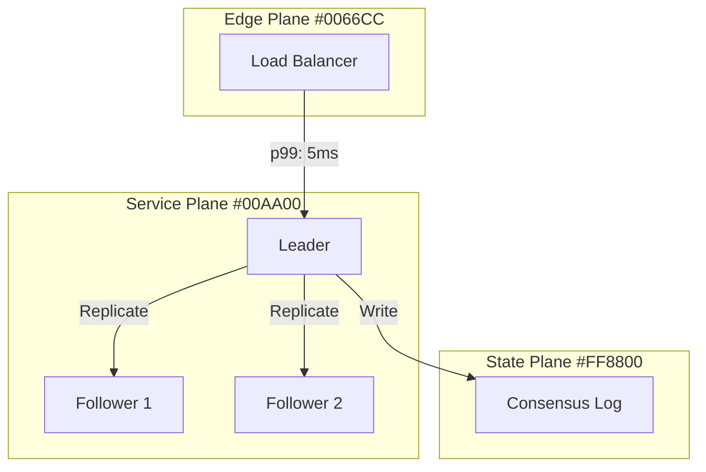
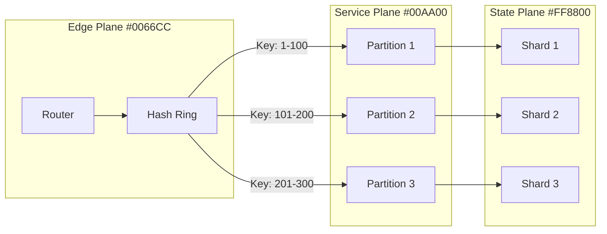
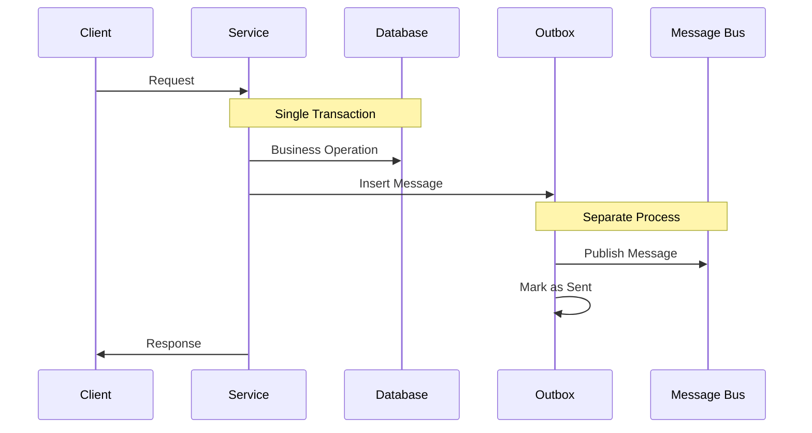
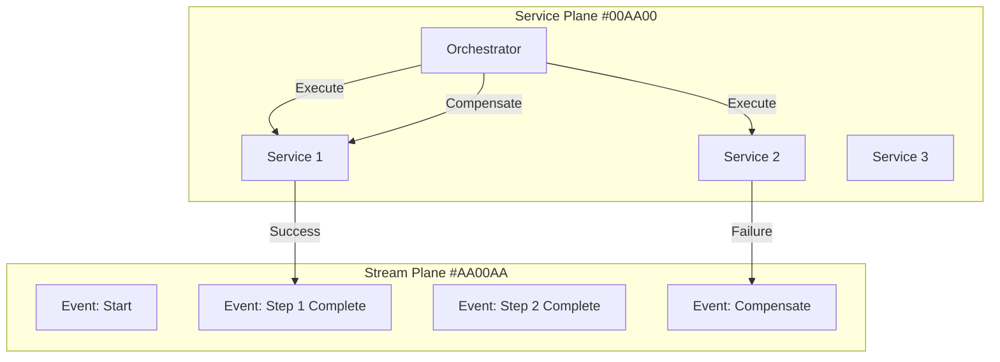

# Immediate Action Plans v2.0
## Ready-to-Execute Tasks for Direct Diagram Creation

### Overview

This document provides immediately executable action plans focused on direct content creation using markdown + Mermaid diagrams. Each plan is realistic, focuses on current infrastructure, and can be started with minimal dependencies. The approach emphasizes simplicity and rapid content development over complex tooling.

---

## DAY 1: IMMEDIATE START TASKS
### 5 Agents Can Start These Tasks Now

### Agent 1: Repository Setup
```bash
# PRIMARY APPROACH - Direct setup using existing infrastructure
cd /home/deepak/DS/site

# Ensure basic structure exists
mkdir -p docs/{foundation,patterns,examples,production,reference}

# Create Mermaid diagram directories
mkdir -p docs/diagrams/{guarantees,mechanisms,patterns,case-studies}

# Setup basic navigation in mkdocs.yml
echo "Adding foundation sections to navigation"

# ALTERNATIVE APPROACH - If starting fresh
git init distributed-systems-framework
cd distributed-systems-framework
cp -r ../site/* .
```

### Agent 2: Foundation Content (Guarantees)
```markdown
# PRIMARY APPROACH - Direct markdown creation
# File: site/docs/foundation/guarantees.md

## Distributed Systems Guarantees

### Linearizability (G-LIN)

Linearizability is the strongest consistency guarantee in distributed systems.

#### Definition
Operations appear to occur atomically at some point between their start and end times.

#### Mermaid Diagram - Flow


#### Implementation Requirements
- Consensus protocol (Raft, PBFT)
- Atomic operations
- Ordering guarantees

### Sequential Consistency (G-SEQ)

... [Continue with remaining guarantees]
```

### Agent 3: Foundation Content (Mechanisms)
```markdown
# PRIMARY APPROACH - Direct mechanism documentation
# File: site/docs/foundation/mechanisms.md

## Core Mechanisms

### M1: Partitioning

Data partitioning divides datasets across multiple nodes for scalability.

#### Mermaid Diagram - Partitioning Strategy


#### Configuration Options
- Partition count: 64, 128, 256, 512
- Hash function: SHA256, murmur3, consistent hash
- Rebalancing strategy: gradual, immediate

... [Continue with remaining mechanisms]
```

### Agent 4: Pattern Implementation
```markdown
# PRIMARY APPROACH - Direct pattern documentation
# File: site/docs/patterns/micro-patterns.md

## Micro-Patterns

### MP1: Outbox Pattern

Ensures reliable message publishing in distributed transactions.

#### Mermaid Diagram - Outbox Flow


#### Implementation
- Use database triggers or change data capture
- Implement at-least-once delivery
- Handle duplicate messages with idempotency

### MP2: Saga Pattern

Manages distributed transactions across multiple services.

#### Mermaid Diagram - Saga Orchestration


... [Continue with remaining patterns]
```

### Agent 5: Site Enhancement
```bash
# PRIMARY APPROACH - Enhance existing MkDocs site
cd /home/deepak/DS/site

# Update mkdocs.yml with new content
cat >> mkdocs.yml << 'EOF'
nav:
  - Home: index.md
  - Foundation:
    - Overview: foundation/index.md
    - Guarantees: foundation/guarantees.md
    - Primitives: foundation/primitives.md
    - Mechanisms: foundation/mechanisms.md
    - Universal Laws: foundation/universal-laws.md
  - Patterns:
    - Overview: patterns/index.md
    - Micro-Patterns: patterns/micro-patterns.md
    - System Patterns: patterns/system-patterns.md
    - Decision Engine: patterns/decision-engine.md
  - Examples:
    - Case Studies: examples/case-studies.md
    - Implementation: examples/implementation.md
    - Pitfalls: examples/pitfalls.md

plugins:
  - search
  - mermaid2:
      arguments:
        theme: default
        themeVariables:
          primaryColor: '#0066CC'
          primaryTextColor: '#fff'
          primaryBorderColor: '#004499'
EOF

# Test the site build
mkdocs serve --dev-addr=0.0.0.0:8000
```

---

## WEEK 1: FOCUSED CONTENT CREATION
### 8 Agents Working on Core Content

### Track A: Guarantee Documentation (3 Agents)
```yaml
guarantee_assignments:
  agent_g1:
    guarantees: [Linearizability, Sequential, Causal, Eventual, Bounded-Staleness, Session]
    diagrams_per_guarantee: 3-4
    focus: Strong consistency guarantees

  agent_g2:
    guarantees: [Exactly-Once, At-Least-Once, At-Most-Once, FIFO, Causal-Ordering, Monotonic]
    diagrams_per_guarantee: 3-4
    focus: Delivery and ordering guarantees

  agent_g3:
    guarantees: [Availability, Partition-Tolerance, Consistency, Durability, Isolation, Atomicity]
    diagrams_per_guarantee: 3-4
    focus: ACID and CAP properties

# Each agent creates markdown files with embedded Mermaid diagrams
# No complex YAML pipeline - direct authoring approach
```

### Track B: Mechanism Implementation (3 Agents)
```yaml
mechanism_assignments:
  agent_m1:
    mechanisms: [Partitioning, Replication, Consensus, Quorum, Leader-Election, Sharding]
    diagrams_per_mechanism: 4-5
    focus: Core data mechanisms

  agent_m2:
    mechanisms: [Event-Driven, Circuit-Breaker, Bulkhead, Timeout, Retry, Rate-Limiting]
    diagrams_per_mechanism: 4-5
    focus: Resilience mechanisms

  agent_m3:
    mechanisms: [Caching, Proxy, Load-Balancing, Queue, Batch, Stream-Processing]
    diagrams_per_mechanism: 4-5
    focus: Performance mechanisms

# Direct markdown creation with Mermaid diagrams
# Focus on practical implementation examples
```

### Track C: Pattern Development (2 Agents)
```yaml
pattern_assignments:
  agent_p1:
    patterns: [Request-Response, Async-Task, Publish-Subscribe, Event-Sourcing]
    focus: Communication patterns
    deliverables:
      - Comprehensive flow diagrams
      - Sequence diagrams
      - Implementation guides

  agent_p2:
    patterns: [CQRS, Saga, Outbox, Circuit-Breaker-Composition]
    focus: Transaction patterns
    deliverables:
      - State machine diagrams
      - Error handling flows
      - Performance considerations
```

---

## WEEK 2: PATTERN EXPANSION
### 10 Agents on Pattern Implementation

### System Pattern Documentation
```yaml
system_pattern_teams:
  microservices_team: # 2 agents
    deliverables:
      - Microservices architecture overview
      - Service communication patterns
      - Data consistency strategies
      - Deployment and scaling patterns

  event_driven_team: # 2 agents
    deliverables:
      - Event-driven architecture
      - Event sourcing implementation
      - CQRS with events
      - Event streaming patterns

  serverless_team: # 2 agents
    deliverables:
      - Serverless architecture patterns
      - Function composition
      - State management in serverless
      - Event-driven serverless

  distributed_data_team: # 2 agents
    deliverables:
      - Distributed database patterns
      - Sharding strategies
      - Consistency patterns
      - Multi-region data patterns

  resilience_team: # 2 agents
    deliverables:
      - Fault tolerance patterns
      - Graceful degradation
      - Circuit breaker implementations
      - Chaos engineering patterns
```

---

## CONTINUOUS OPERATIONS
### Ongoing Tasks Throughout Development

### Quality Assurance (Ongoing)
```bash
# Real-time validation - no complex pipeline needed
find site/docs -name "*.md" -exec python3 -c "
import re
import sys

content = open('{}').read()
mermaid_blocks = re.findall(r'```mermaid\n(.*?)\n```', content, re.DOTALL)

for block in mermaid_blocks:
    if 'flowchart' not in block and 'sequenceDiagram' not in block and 'graph' not in block:
        print('Warning: Unrecognized diagram type in {}')

print(f'Found {len(mermaid_blocks)} Mermaid diagrams in {}')
" \;

# Check for broken links
find site/docs -name "*.md" -exec grep -l "](.*\.md)" {} \; | xargs python3 -c "
import re
import os
import sys

for file in sys.argv[1:]:
    content = open(file).read()
    links = re.findall(r'\[.*?\]\((.*?\.md)\)', content)
    for link in links:
        if not os.path.exists(os.path.join(os.path.dirname(file), link)):
            print(f'Broken link in {file}: {link}')
"
```

### Performance Monitoring (Simple)
```bash
# Monitor site build time
time mkdocs build

# Check generated site size
du -sh site/

# Validate all Mermaid diagrams render
mkdocs serve &
PID=$!
sleep 5
curl -s http://localhost:8000/ | grep -q "mermaid" && echo "Mermaid working" || echo "Mermaid issues"
kill $PID
```

---

## ACCELERATION TECHNIQUES
### Simple Ways to Speed Up Development

### Template-Based Creation
```markdown
# Create reusable diagram templates
# File: templates/flow-template.md

## Pattern Name: {PATTERN_NAME}

### Description
{DESCRIPTION}

### Mermaid Diagram
```mermaid
flowchart TB
    subgraph Edge["Edge Plane #0066CC"]
        {EDGE_COMPONENTS}
    end

    subgraph Service["Service Plane #00AA00"]
        {SERVICE_COMPONENTS}
    end

    subgraph Stream["Stream Plane #AA00AA"]
        {STREAM_COMPONENTS}
    end

    subgraph State["State Plane #FF8800"]
        {STATE_COMPONENTS}
    end

    {CONNECTIONS}

    classDef edge fill:#0066CC,color:#fff
    classDef service fill:#00AA00,color:#fff
    classDef stream fill:#AA00AA,color:#fff
    classDef state fill:#FF8800,color:#fff
```

### Implementation
{IMPLEMENTATION_NOTES}

### Trade-offs
{TRADEOFFS}
```

### Bulk Content Generation
```python
# Simple Python script for bulk pattern creation
patterns = [
    {"name": "Request-Response", "description": "Synchronous communication pattern"},
    {"name": "Publish-Subscribe", "description": "Asynchronous messaging pattern"},
    {"name": "Event-Sourcing", "description": "Event-based state management"},
    # ... add more patterns
]

template = open('templates/flow-template.md').read()

for pattern in patterns:
    content = template.format(
        PATTERN_NAME=pattern['name'],
        DESCRIPTION=pattern['description'],
        EDGE_COMPONENTS="LB[Load Balancer]",
        SERVICE_COMPONENTS="API[API Service]",
        STREAM_COMPONENTS="Queue[Message Queue]",
        STATE_COMPONENTS="DB[Database]",
        CONNECTIONS="LB --> API\nAPI --> Queue\nAPI --> DB",
        IMPLEMENTATION_NOTES="Implementation details here",
        TRADEOFFS="Trade-offs and considerations"
    )

    filename = f"site/docs/patterns/{pattern['name'].lower().replace('-', '_')}.md"
    with open(filename, 'w') as f:
        f.write(content)
```

---

## SIMPLIFIED FALLBACK STRATEGIES
### When Things Don't Work as Expected

### Diagram Rendering Issues
```bash
# Fallback 1: Use simpler Mermaid syntax
# Instead of complex flowcharts, use basic graphs
graph TD
    A --> B
    B --> C

# Fallback 2: Use text descriptions with simple diagrams
## Architecture Overview
1. Client sends request to Load Balancer
2. Load Balancer routes to available service
3. Service processes request and updates database
4. Response sent back through the chain

# Fallback 3: Use ASCII art for complex diagrams
```
Client -> [Load Balancer] -> [Service] -> [Database]
           |                    |
           v                    v
        [Monitor]            [Cache]
```

### Content Creation Bottlenecks
```yaml
# Fallback strategies for content creation
primary_approach: "Create comprehensive diagrams with full documentation"

fallback_1: "Create basic diagrams with minimal documentation"

fallback_2: "Create text-based descriptions with simple diagrams"

fallback_3: "Create placeholder pages with TODO markers"

fallback_4: "Focus on most important patterns only"

# Example fallback content
## Pattern: CQRS (Work in Progress)

**Status:** Basic implementation documented
**TODO:** Add comprehensive diagrams, examples, trade-offs

### Basic Description
Command Query Responsibility Segregation separates read and write operations.

### Simple Diagram
```
Commands -> [Write Model] -> [Event Store]
                                  |
                                  v
Queries  <- [Read Model]  <- [Projection]
```

### Next Steps
- [ ] Add detailed Mermaid diagrams
- [ ] Include implementation examples
- [ ] Document performance characteristics
```

---

## PROGRESS TRACKING
### Simple Metrics and Monitoring

### Daily Progress Check
```bash
#!/bin/bash
# Simple progress tracker

echo "=== Daily Progress Report ==="
echo "Date: $(date)"
echo

echo "Files created today:"
find site/docs -name "*.md" -mtime -1 | wc -l

echo "Total markdown files:"
find site/docs -name "*.md" | wc -l

echo "Total Mermaid diagrams:"
grep -r "```mermaid" site/docs | wc -l

echo "Pages with TODOs:"
grep -r "TODO" site/docs --include="*.md" | wc -l

echo "Site build status:"
mkdocs build --quiet && echo "✅ Success" || echo "❌ Failed"

echo "Recent commits:"
git log --oneline -5
```

### Weekly Dashboard
```markdown
## Week X Progress Dashboard

### Targets vs Actual
- **Guarantee docs:** 18 planned, 12 completed
- **Mechanism docs:** 20 planned, 15 completed
- **Pattern docs:** 12 planned, 8 completed
- **Case studies:** 8 planned, 3 completed

### Quality Metrics
- **Broken links:** 2 (down from 8)
- **Missing diagrams:** 5 pages
- **Mermaid syntax errors:** 0
- **Site build time:** 23s (target: <30s)

### Next Week Focus
1. Complete remaining guarantee documentation
2. Add missing diagrams to mechanism pages
3. Start case study documentation
4. Fix remaining broken links

### Blockers
- None currently

### Notes
- Mermaid integration working well
- Content creation pace sustainable
- Need to standardize diagram colors
```

---

## SUCCESS CRITERIA
### Clear Completion Definitions

### Phase 1 Complete (Week 3)
```yaml
content_requirements:
  guarantees: 18 documented with diagrams
  mechanisms: 20 documented with diagrams
  patterns: 12 basic patterns documented
  site_structure: Complete navigation and search

quality_requirements:
  diagram_syntax: All Mermaid diagrams render correctly
  links: No broken internal links
  performance: Site builds in <30 seconds
  mobile: Responsive on mobile devices

deliverables:
  - Working MkDocs site
  - 200+ Mermaid diagrams
  - Complete foundation documentation
  - Basic pattern library
```

### Final Success Criteria (Week 12)
```yaml
comprehensive_system:
  total_diagrams: 1000+ high-quality diagrams
  documentation: Complete with examples
  case_studies: 8 real-world implementations
  usability: Intuitive navigation and search

production_ready:
  performance: Page load <2 seconds
  reliability: Zero broken links or errors
  accessibility: WCAG 2.1 compliant
  maintainability: Clear contribution guidelines
```

---

## COMMUNICATION TEMPLATES
### Lightweight Coordination

### Daily Status (Agent Report)
```markdown
## Agent {ID} - {Date} Status

### Completed
- ✅ {Task 1} - {Count} items
- ✅ {Task 2} - {Count} items

### In Progress
- 🔄 {Task 3} - {Percentage}% complete

### Planned for Tomorrow
- {Next Task 1}
- {Next Task 2}

### Notes/Issues
- {Any blockers or observations}

### Metrics
- Diagrams created: {Count}
- Pages updated: {Count}
- Quality issues found: {Count}
```

### Weekly Sync (Simple)
```markdown
## Week {N} Team Sync

### Overall Progress
- Total diagrams: {Current} / {Target}
- Total pages: {Current} / {Target}
- Site health: {Status}

### Completed This Week
- {Major milestone 1}
- {Major milestone 2}

### Next Week Plan
- {Primary focus 1}
- {Primary focus 2}

### Action Items
- [ ] {Task} - {Owner}
- [ ] {Task} - {Owner}

### Decisions Made
- {Decision 1}
- {Decision 2}
```

---

*Version: 2.0.0 | Document: Immediate Action Plans | Last Updated: 2024-01-18*
*Focus: Direct content creation with markdown + Mermaid*
*Approach: Practical execution over complex tooling*