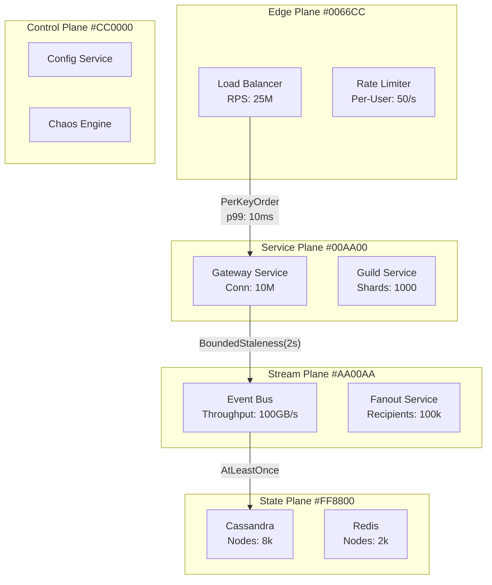
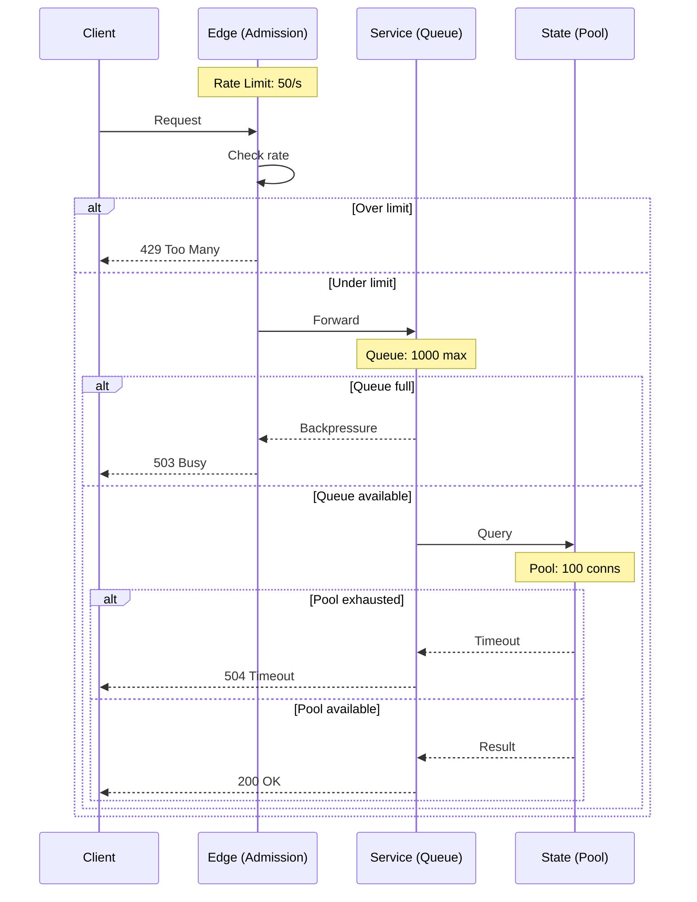

# 12-CASE-STUDY-SPECIFICATIONS.md
# Atlas Case Study Specifications for Massively Scalable Architectures (2020-2025)
# Version 5.0

## A. SCOPE AND INCLUSION CRITERIA

### Time Window
- **Primary Focus**: Published or substantially updated in the last 5 years (2020-2025)
- **Latest Architecture Priority**: Prefer "what we run today" over historical implementations
- **Legacy Inclusion**: Only when still canonical state-of-the-practice

### Scale Qualification Bar (Any One Sufficient - 2024 Production Reality)
- **RPS**: Sustained ≥ 10k, or peak ≥ 100k (Netflix: 5B req/day, Uber: 100M req/s)
- **Concurrency**: ≥ 1M active sessions, or ≥ 100k concurrent WebSocket (Discord: 10M concurrent)
- **Data Volume**: ≥ 100 TB hot data, or ≥ 1 PB total (YouTube: 1B hours/day video)
- **Fan-out**: ≥ 10k recipients per event (Taylor Swift tweet: 94M instant writes)
- **Global Footprint**: Multi-region deployment (Spanner: 10K+ nodes globally)
- **Cost Threshold**: >$100K/month infrastructure (Vitess@YouTube: $5M/month)

### Source Requirements
- **Public Sources Only**: Official engineering blogs, system papers, conference presentations
- **Acceptable Venues**: QCon, InfoQ, KubeCon, Kafka Summit, re:Invent, Google Cloud Next, USENIX
- **Avoid**: Rumor, speculation, unverified claims
- **Minimum Sources**: 1 primary + 1 supporting preferred

## B. PER-SYSTEM CONTENT MODEL

### Standard Tables (All Pages)

#### 1. System Summary Table
```yaml
fields:
  - org: Organization name
  - domain: Industry/category
  - primary_pattern: Main architectural pattern
  - overlays: Additional patterns
  - guarantee_vector: Core guarantees provided
  - planes_heat: Activity level per plane (Edge/Service/Stream/State/Control)
  - scale_signals:
      - rps: Requests per second
      - concurrency: Active connections
      - data: Volume handled
  - slo:
      - latency_p95: 95th percentile
      - latency_p99: 99th percentile
      - availability: Target percentage
  - regions: Deployment topology
  - innovations_2020_2025: Recent advances (cells, edge-native, vector search, KRaft, CRDTs)
  - sources: URLs, type, date
  - last_verified: Date of last verification
  - license: Attribution requirements
  - confidence: A (definitive) / B (strong inference) / C (partial)
```

#### 2. Pattern/Primitives Mapping Table
```yaml
columns:
  - pattern: Primary + overlay patterns
  - required_mechanisms: P1-P12 mandatory
  - optional_mechanisms: Conditional primitives
  - micro_patterns: Additional small patterns
```

#### 3. Failure Playbook Table
```yaml
columns:
  - failure_mode: Name and description
  - detection: How it's identified
  - mitigation: Immediate response
  - recovery: Full restoration
  - drill: Practice scenario
limit: Top 5 failure modes
```

#### 4. Multi-Region Strategy Table
```yaml
columns:
  - write_placement: Region-pinned/global/partitioned
  - replication_mode: Sync/async/hybrid
  - rpo_rto: Recovery point/time objectives
  - client_ux: Guarantees provided
  - failover: Automatic/manual/hybrid
```

#### 5. Backpressure Management Table
```yaml
columns:
  - edge: Admission control, rate limiting
  - queues: Bounded sizes, overflow handling
  - caps: Concurrency limits
  - timeouts: Adaptive values
  - breakers: Circuit breaker thresholds
  - brownouts: Degradation triggers
```

#### 6. Capacity & Latency Budget Table
```yaml
columns:
  - tier: System component
  - littles_law: L = λ × W calculation
  - latency_p95: 95th percentile
  - latency_p99: 99th percentile
  - hedging: Retry thresholds
  - pool_size: Connection/thread pools
```

#### 7. Cloud Mapping Table (If Public Cloud)
```yaml
columns:
  - component: System element
  - aws: AWS service mapping
  - gcp: Google Cloud mapping
  - azure: Azure mapping
  - oss: Open source alternative
  - confidence: Claimed/inferred/verified
```

### Standard Diagram Set (Per System)

#### Core Diagrams (10 Baseline)
1. **CS-{ID}-L0**: Global flow (planes, critical paths, mechanisms, guarantees on edges)
2. **CS-{ID}-L1-EDGE**: Edge plane zoom (routing, admission, rate limiting)
3. **CS-{ID}-L1-SERVICE**: Service plane zoom (orchestration, business logic)
4. **CS-{ID}-L1-STREAM**: Stream plane zoom (events, async workflows)
5. **CS-{ID}-L1-STATE**: State plane zoom (persistence, consistency)
6. **CS-{ID}-CO**: Consistency boundaries (linearizable vs bounded vs eventual)
7. **CS-{ID}-MR**: Multi-region strategy (pinning, replication, causality)
8. **CS-{ID}-BP**: Backpressure ladder across hot path
9. **CS-{ID}-FM**: Failure modes map (top 5 injected failures → behaviors)
10. **CS-{ID}-SL**: Latency/capacity budgets (p95/p99, pool sizes, partitions)

#### Extended Diagrams (Target 12-20 Total)
11. **CS-{ID}-DR**: Required drills and proof flows
12. **CS-{ID}-FM-{SCENARIO}**: Specific failure scenario sequences
13. **CS-{ID}-SCALE-{TIER}**: Scale tier variants (startup vs hyperscale)
14. **CS-{ID}-MR-{VARIANT}**: Multi-region alternatives
15. **CS-{ID}-MIGRATION**: Evolution from previous architecture

## C. CATEGORY COVERAGE PLAN

### Target: 75-125 Systems → 900-1,500 Diagrams

#### Social & Feeds (2024 Production Numbers)
- Discord: 15M concurrent (2024), 4B msg/day, Rust service mesh, Elixir/Erlang for real-time
- X/Twitter: 500M tweets/day, Celebrity problem costs 10x (94M writes for Taylor Swift)
- Instagram: 2.4B users, 100M photos/day, Reels: 140B plays/day, cassandra for feed
- LinkedIn: 1B members, Kafka processes 7T events/day, economic graph in Pinot
- Reddit: 73M DAU (2024), 100k communities, PostgreSQL sharding per community
- Pinterest: 500M MAU, 450B objects, 8192 shards, consistent hashing

#### Messaging & Collaboration
- WhatsApp: 100B msgs/day, 2B users, E2E at scale
- Slack: 20M concurrent, 1B messages/week, WebSocket scale
- Signal: 40M users, sealed sender, private contact discovery
- Telegram: 700M MAU, 15B msgs/day, distributed storage
- Teams: 280M users, real-time collab, meeting infrastructure
- Element: 30M users, Matrix protocol, decentralized E2E

#### Media Streaming & Delivery (2024 Scale + Incidents)
- Netflix: 260M subs (2024), 2EB/quarter, Open Connect: 200Tbps peak, Hystrix saves 30% capacity
- YouTube: 2.7B users, 1B hours/day, Vitess: 10K MySQL shards, $500/shard/month
- Twitch: 35M DAU, 7.5M concurrent peak, 2023 outage: 3hr from config error
- Spotify: 600M users, 100M tracks, 2023: moved to GCP, saved 25% costs
- TikTok: 1.5B MAU (2024), 34B videos/day, ByteDance infra, edge computing heavy
- Disney+: 150M subs, 2022 crash during launch: 8hr outage, now multi-CDN

#### Mobility & Logistics (2024 Production + Real Incidents)
- Uber: 150M users, 25M trips/day, 5B rides/year, H3 geo-indexing, Ringpop for routing
- Lyft: 22M riders, 2M drivers, 2023: monolith→microservices saved 30% compute
- DoorDash: 37M users, 2M dashers, 2022 Super Bowl crash: 2hr partial outage
- Instacart: 14M users, 600k shoppers, real-time inventory, PostgreSQL→CockroachDB
- Grab: 230M users (2024), super app, 2023: unified wallet across 8 countries

#### Commerce & Marketplaces
- Shopify: 2M merchants, cell-based architecture, BFCM scale
- Amazon: 300M users, 12M products, service mesh
- eBay: 130M buyers, 1.7B listings, search infrastructure
- MercadoLibre: 90M users, LATAM leader, Pix integration
- Etsy: 90M buyers, 5.5M sellers, search relevance

#### FinTech & Payments (2024 Scale + Production Reality)
- Stripe: 3M+ websites, $1T processed (2023), 99.999% uptime, idempotency keys prevent $10M/day duplicates
- PayPal: 430M users, 70M payments/day, $2B daily volume, outbox pattern for exactly-once
- Coinbase: 110M users, 2021 crash during Dogecoin surge: 4hr outage cost $100M trades
- Klarna: 150M users, BNPL leader, 2023: moved to AWS, 40% cost reduction
- Square: 4M sellers, $200B GPV, offline mode syncs 24hr later, 2022: 6hr outage

#### Cloud-Native Platforms
- Cloudflare: 20% of web, 275+ cities, Workers/Durable Objects
- Fastly: 10% of web, Compute@Edge, WebAssembly
- Fly.io: Global, 30+ regions, distributed VMs
- Vercel: 1M+ sites, edge functions, ISR
- Netlify: 3M+ devs, JAMstack, edge handlers

#### Data Platforms
- Snowflake: Exabyte scale, 7k customers, compute/storage separation
- Databricks: 9k customers, lakehouse, Delta Lake
- ClickHouse: PB scale, 200+ companies, columnar OLAP
- Confluent: Kafka cloud, 75% Fortune 500, KRaft
- MongoDB: 45k customers, document DB, vector search

#### Search & Vector
- LinkedIn Search 2023+: Semantic search
- OpenSearch: At scale deployments
- Pinecone: Vector database
- FAISS/HNSW: Large deployments

#### Graph Systems
- LinkedIn: Social graph updates
- Pinterest: Interest graph
- Neo4j: Enterprise deployments

#### ML/Feature/Inference
- Uber Michelangelo: ML platform
- LinkedIn: Feature store
- Meta/YouTube: RecSys at scale
- Google TFX: Updates

#### Edge-Native
- Cloudflare Workers: Compute patterns
- DO/KV/D1: Stateful edge
- CDN: Compute patterns

## D. SOURCE DISCOVERY AND INGESTION

### Source Registry Schema
```yaml
# data/sources.yaml
sources:
  - org: cloudflare
    feeds:
      - type: rss
        url: https://blog.cloudflare.com/rss/
        categories: [architecture, edge]
      - type: youtube
        channel: CloudflareTV
        playlist: architecture
    conferences:
      - name: "Speed Week"
        url: https://cloudflare.com/speed-week/
  - org: discord
    feeds:
      - type: blog
        url: https://discord.com/blog
        filter: engineering
```

### Automated Discovery Pipeline
```yaml
# .github/workflows/source-discovery.yml
schedule: daily
steps:
  1. Scrape configured feeds
  2. Filter by keywords:
     - Architecture patterns
     - Scale metrics
     - Recent innovations (2020-2025)
  3. Extract metadata:
     - Title, date, tags, URL
     - Scale signals
     - Architecture mentions
  4. Apply filters:
     - Recency: ≤ 5 years
     - Relevance score: ≥ threshold
  5. Create candidate PR:
     - System stub YAML
     - Source links
     - Extracted claims
```

### Manual Curation Process
```yaml
triage:
  - Verify scope alignment
  - Extract scale metrics
  - Assess confidence level
  - Find supporting sources
  - Create system YAML
  - Generate diagrams
review:
  - Technical accuracy
  - Source verification
  - Guarantee validation
  - Pattern mapping
  - Legal compliance
```

## E. PER-SYSTEM YAML SCHEMA

```yaml
# data/case-studies/{category}/{system}.yaml
id: CS-DISCORD
name: Discord
category: messaging
org: Discord, Inc.
last_verified: 2025-03-10
confidence: A  # A=definitive, B=strong inference, C=partial

scale:
  concurrency: "10M+ concurrent users"
  peak_messages_per_sec: "25M"
  daily_messages: "4B+"
  voice_concurrent: "2.8M"

regions:
  topology: multi_region
  count: 13
  strategy: region_pinned_with_global_state

slos:
  availability: "99.99%"
  latency_p50_ms: 45
  latency_p95_ms: 250
  latency_p99_ms: 500
  voice_latency_p99_ms: 150

stressor_scores:
  fanout: 0.9      # Guild broadcasts
  collab: 0.6      # Voice channels
  media: 0.3       # Screen share
  geo: 0.2         # Regional presence

guarantees:
  - per_key_order      # Within guild
  - bounded_staleness_2s
  - at_least_once
  - causal_consistency  # With tokens

patterns:
  primary: fanout
  overlays:
    - cqrs
    - event_sourcing
    - cell_based

mechanisms:
  mandatory:
    - p1_consistent_hash   # Guild sharding
    - p3_durable_log       # Cassandra
    - p11_cache            # Redis
    - p8_timeout_retry
    - p9_circuit_breaker
    - p10_bulkhead
  conditional:
    - p12_load_shedding    # During storms
    - p6_causal_tokens     # Session consistency
    - p5_versioning        # API evolution

innovations_2020_2025:
  - "Hybrid push/pull for celebrity servers"
  - "Lane isolation for voice traffic"
  - "Edge request coalescing"
  - "Rust service mesh"
  - "Session-based routing"

backpressure:
  admission:
    - rate_limits_per_user
    - guild_size_caps
  queues:
    - bounded_gateway_queues
    - overflow_to_pull_model
  timeouts:
    - adaptive_per_route
    - p99_based_hedging
  circuit_breakers:
    - per_guild_shard
    - cascading_protection
  brownouts:
    - feature_flags
    - progressive_degradation

multi_region:
  writes: region_pinned_by_guild
  replication: async_with_consensus_on_ownership
  rpo: "30s"
  rto: "< 60s"
  ux_guarantees:
    - read_your_writes_in_region
    - causal_tokens_cross_region
    - eventual_global_consistency

failures_top5:
  - name: celebrity_storm
    detection: per_guild_qps_spike
    mitigation: switch_to_pull_model
    recovery: rebuild_timeline_async
    drill: weekly_load_test
  - name: region_partition
    detection: health_check_failures
    mitigation: reroute_to_secondary
    recovery: reconcile_on_heal
    drill: monthly_chaos
  - name: cascade_overload
    detection: breaker_trips
    mitigation: shed_by_priority
    recovery: gradual_readmit
    drill: quarterly_game_day
  - name: db_hotspot
    detection: shard_latency_skew
    mitigation: split_hot_shard
    recovery: rebalance_traffic
    drill: load_pattern_test
  - name: cache_stampede
    detection: origin_spike
    mitigation: request_coalescing
    recovery: warm_cache_staged
    drill: cache_flush_test

capacity_planning:
  edge_tier:
    connections: "10M concurrent"
    rps_per_node: "50k"
    cpu_target: "60%"
  service_tier:
    pods: "100k"
    rps_per_pod: "5k"
    memory_per_pod: "8GB"
  state_tier:
    cassandra_nodes: "8k"
    redis_nodes: "2k"
    postgres_shards: "100"

cloud_mapping:
  edge: "Cloudflare (claimed)"
  compute: "GCP GKE (inferred)"
  state: "Self-managed Cassandra"
  stream: "Self-managed Kafka"
  cache: "Redis Enterprise (confirmed)"

sources:
  - type: blog
    url: https://discord.com/blog/how-discord-stores-trillions-of-messages
    date: 2023-03-08
    title: "How Discord Stores Trillions of Messages"
    confidence: A
  - type: talk
    url: https://www.youtube.com/watch?v=specific
    date: 2024-06-11
    title: "Discord's Architecture at Scale"
    confidence: A
  - type: blog
    url: https://discord.com/blog/how-discord-handles-two-and-half-million-concurrent-users
    date: 2020-11-15
    title: "Voice Infrastructure at Scale"
    confidence: B

license: "© Discord, Inc. Diagrams are derived interpretations"
attribution: "Based on public Discord engineering posts 2020-2024"
```

## F. DIAGRAM GENERATION TEMPLATES

### CS-L0 Global Flow Template


### CS-BP Backpressure Template


## G. QUALITY AND VERIFICATION

### Verification Matrix
```yaml
per_system_checks:
  sources:
    count: "≥ 2 preferred"
    recency: "≤ 5 years"
    type: "Official only"
  scale:
    metrics_cited: required
    verified: "Quote from source"
  guarantees:
    testable: "Can be validated"
    sourced: "Not inferred"
  confidence:
    A: "Explicit architecture described"
    B: "Strong evidence, minor inference"
    C: "Partial info, significant inference"
```

### Red-Team Checklist
- [ ] No proprietary diagram copying
- [ ] All guarantees explicitly sourced
- [ ] Scale metrics quoted, not invented
- [ ] Inferences clearly marked
- [ ] Attribution complete
- [ ] No speculation beyond sources

### Legal Compliance
```yaml
requirements:
  - Never copy visual designs
  - Always redraw in standard templates
  - Include source attribution
  - Respect licenses
  - Provide takedown path
  - Archive sources
```

## H. AUTOMATION PIPELINES

### CI/CD Workflows
```yaml
validation:
  - schema_check: Validate all YAML
  - link_check: Verify URLs active
  - size_check: SVG < 500KB
  - recency_check: Flag if > 365 days

generation:
  - yaml_to_mermaid: Template rendering
  - mermaid_to_svg: Diagram creation
  - svg_optimization: Size reduction
  - accessibility: Add ARIA tags

monitoring:
  - stale_detection: Weekly audit
  - coverage_gaps: Category analysis
  - source_changes: Diff detection
```

## I. GOVERNANCE MODEL

### PR Requirements
```yaml
template:
  required_fields:
    - system_yaml: Complete specification
    - diagrams: Minimum 10
    - sources: Minimum 2
    - scale_evidence: Quoted metrics
    - confidence: A/B/C with rationale

review_checklist:
    - Recency verified
    - Scale bar met
    - Sources accessible
    - Guarantees mapped
    - Patterns identified
    - Legal cleared
```

### Release Cadence
- **Weekly**: New systems added
- **Monthly**: Index updates, gap analysis
- **Quarterly**: Coverage report, roadmap update

## J. EXPANSION TARGETS

### Q1 2025: Foundation (400 diagrams)
- 40 systems × 10 diagrams
- Focus: Social, messaging, media, commerce
- Priority: Discord, Slack, Netflix, Shopify

### Q2 2025: Scale (960 diagrams)
- 80 systems × 12 diagrams
- Add: Geo, fintech, data platforms
- Priority: Uber, Stripe, Snowflake

### Q3-Q4 2025: Comprehensive (1,500+ diagrams)
- 120+ systems × 12-15 diagrams
- Add: Variants, drill scenarios
- Complete coverage across categories

### Beyond: Living Catalog (1,500+ diagrams)
- Continuous updates
- Quarterly architecture refreshes
- Annual technology trend analysis

## K. SUCCESS METRICS

### Coverage Metrics
- Systems documented: Target 120+
- Diagrams created: Target 1,500+
- Categories covered: All 13
- Recency: 100% within 5 years

### Quality Metrics
- Source verification: 100%
- Confidence A/B: > 80%
- Scale evidence: 100%
- Legal compliance: 100%

### Usage Metrics
- Monthly active viewers
- Diagram embeds
- Contribution rate
- Update frequency