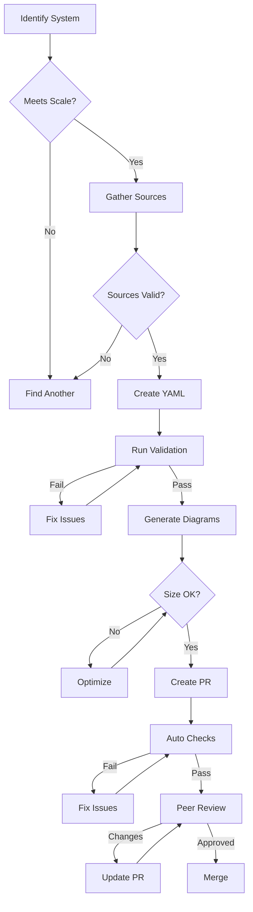

# 14-GOVERNANCE-CONTRIBUTION.md
# Atlas Governance and Contribution Model
# Version 5.0

## A. CONTRIBUTION PHILOSOPHY

### Core Principles
1. **Evidence-Based**: All claims must be sourced from public, verifiable materials
2. **Consistency First**: Follow established patterns and templates exactly
3. **Scale-Verified**: Meet minimum scale thresholds with documented metrics
4. **Recency-Required**: Sources must be from last 5 years (2020-2025)
5. **Community-Driven**: Open to contributions with rigorous review

### Contribution Types
- **New Case Studies**: Complete system documentation with 10+ diagrams
- **Updates**: Refresh existing case studies with new sources
- **Corrections**: Fix errors or outdated information
- **Enhancements**: Add optional diagrams or deeper analysis
- **Tooling**: Improve generation, validation, or automation

## B. PULL REQUEST TEMPLATES

### New Case Study PR Template
```markdown
# [Case Study] Add {System Name} Architecture

## System Overview
- **Organization**: {Company/Org Name}
- **Category**: {social|messaging|media|mobility|commerce|fintech|cloud|data|search|ml}
- **Primary Pattern**: {fanout|cqrs|event_sourcing|streaming|batch|hybrid}
- **Confidence Level**: {A|B|C}

## Scale Qualification ✓ (Check at least one)
- [ ] Sustained RPS ≥ 10k or Peak ≥ 100k
  - Evidence: {quote and source}
- [ ] Concurrency ≥ 1M sessions or ≥ 100k WebSocket connections
  - Evidence: {quote and source}
- [ ] Data Volume ≥ 100 TB hot or ≥ 1 PB total
  - Evidence: {quote and source}
- [ ] Fan-out ≥ 10k recipients per event
  - Evidence: {quote and source}
- [ ] Global multi-region deployment
  - Evidence: {quote and source}

## Sources (Minimum 2 Required)
### Primary Source
- **Type**: {blog|talk|paper|doc|video|book}
- **URL**: {full URL}
- **Date**: {YYYY-MM-DD}
- **Title**: {exact title}
- **Key Claims**:
  - Scale: {specific metrics quoted}
  - Architecture: {components mentioned}
  - Guarantees: {consistency/availability claims}

### Supporting Source(s)
- **Type**: {blog|talk|paper|doc|video|book}
- **URL**: {full URL}
- **Date**: {YYYY-MM-DD}
- **Title**: {exact title}
- **Corroborates**: {what it validates from primary}

## Architectural Highlights
### Innovations (2020-2025)
- [ ] {Innovation 1 with source reference}
- [ ] {Innovation 2 with source reference}
- [ ] {Innovation 3 with source reference}

### Guarantees Provided
- [ ] Consistency: {type and evidence}
- [ ] Availability: {SLA and evidence}
- [ ] Partition Tolerance: {approach and evidence}

### Failure Patterns
1. **{Failure Mode}**: {detection} → {mitigation} → {recovery}
2. **{Failure Mode}**: {detection} → {mitigation} → {recovery}
3. **{Failure Mode}**: {detection} → {mitigation} → {recovery}

## Deliverables Checklist
### Required Files
- [ ] `/data/case-studies/{category}/{system}.yaml` - Complete specification
- [ ] System passes schema validation
- [ ] All required fields populated with evidence

### Required Diagrams (10 Minimum)
- [ ] CS-{ID}-L0: Global architecture flow
- [ ] CS-{ID}-L1-EDGE: Edge plane detail
- [ ] CS-{ID}-L1-SERVICE: Service plane detail
- [ ] CS-{ID}-L1-STREAM: Stream plane detail
- [ ] CS-{ID}-L1-STATE: State plane detail
- [ ] CS-{ID}-CO: Consistency boundaries
- [ ] CS-{ID}-MR: Multi-region strategy
- [ ] CS-{ID}-BP: Backpressure ladder
- [ ] CS-{ID}-FM: Failure modes map
- [ ] CS-{ID}-SL: SLA/latency budgets

### Optional Diagrams
- [ ] CS-{ID}-DR: Drill sequences
- [ ] CS-{ID}-FM-{SCENARIO}: Specific failure scenarios
- [ ] CS-{ID}-SCALE-{TIER}: Scale tier variants
- [ ] CS-{ID}-MR-{VARIANT}: Multi-region alternatives
- [ ] CS-{ID}-MIG: Migration from previous architecture

## Validation Results
```bash
# Paste output of validation scripts
$ python scripts/validate_case_study.py data/case-studies/{category}/{system}.yaml
✓ Schema valid
✓ Scale thresholds met
✓ Sources accessible
✓ Diagrams generated
✓ Size limits ok
```

## Legal Compliance
- [ ] No proprietary diagrams copied
- [ ] All sources properly attributed
- [ ] Redrawn diagrams are interpretations
- [ ] License field includes proper attribution
- [ ] No confidential information included

## Review Request
- **Primary Reviewer**: @{github-username}
- **Domain Expert**: @{github-username} (if applicable)
- **Priority**: {High|Medium|Low}
- **Target Merge Date**: {YYYY-MM-DD}

---
### PR Checklist for Reviewers
- [ ] Scale criteria met with evidence
- [ ] Sources are recent (≤5 years) and accessible
- [ ] All 10 required diagrams present
- [ ] Diagrams follow color/labeling standards
- [ ] YAML validates against schema
- [ ] Confidence level justified
- [ ] No speculation beyond sources
- [ ] Legal compliance verified
```

### Update/Correction PR Template
```markdown
# [Update] Refresh {System Name} Case Study

## Update Type
- [ ] New architecture version
- [ ] Updated scale metrics
- [ ] Additional sources
- [ ] Error correction
- [ ] Diagram improvements

## What Changed
### Previous State
- **Metric/Claim**: {old value}
- **Source**: {old source}
- **Date**: {when it was valid}

### New State
- **Metric/Claim**: {new value}
- **Source**: {new source}
- **Date**: {current date}

## Evidence for Change
- **Source URL**: {link}
- **Quote**: "{exact quote supporting change}"
- **Confidence**: {A|B|C}

## Files Modified
- [ ] `{system}.yaml` - Updated {fields}
- [ ] Diagrams regenerated
- [ ] Version bumped appropriately

## Validation
```bash
$ python scripts/validate_case_study.py {file}
✓ All checks passed
```

## Backward Compatibility
- [ ] No breaking changes to IDs
- [ ] Diagrams maintain same structure
- [ ] Previous guarantees still valid OR migration path documented
```

## C. SIMPLIFIED REVIEW PROCESS

### GitHub PR Workflow

#### Automated Checks (Required)
```yaml
checks:
  - schema_validation: YAML validates against schema
  - scale_verification: Metrics meet minimum thresholds
  - source_accessibility: URLs return 200 status
  - diagram_generation: All 10 required diagrams created
  - size_limits: SVG files < 500KB
```

#### Human Review (Single Stage)
- **Technical Accuracy**: Architecture components correctly identified
- **Source Quality**: Claims directly supported by evidence
- **Production Focus**: Real-world scale and failure modes
- **Template Compliance**: Follows structure exactly

### Production-First Review Checklist

#### Must Have (Blocking)
- [ ] Scale metrics with evidence (not "millions of users")
- [ ] Failure modes documented with detection/mitigation
- [ ] Multi-region strategy clear
- [ ] Backpressure mechanisms identified
- [ ] Sources from last 5 years
- [ ] All 10 required diagrams present

#### Should Have (Reviewer discretion)
- [ ] Multiple sources corroborate
- [ ] Recent innovations identified
- [ ] SLO/latency budgets specified
- [ ] Technology stack clear

#### Legal Compliance
- [ ] No proprietary diagrams copied
- [ ] Sources properly attributed
- [ ] Confidence level justified

## D. REVIEWER GUIDELINES

### For New Contributors
```markdown
## First-Time Contributor Checklist
1. Read the Atlas Master Specification (00-MASTER-SPECIFICATION.md)
2. Study existing case studies in your category
3. Use provided templates exactly - no creativity in structure
4. Start with high-confidence (A-level) sources
5. Generate all 10 required diagrams before submitting
6. Run all validation scripts locally
7. Include evidence quotes for every claim
```

### Reviewer Guidelines

#### Fast Track Approval (24hr)
- A-confidence sources with explicit architecture details
- All scale metrics clearly stated
- Production failure scenarios included
- Recent (2023-2024) sources

#### Standard Review (48hr)
- B-confidence sources requiring minor inference
- Most scale metrics present
- Some failure modes documented

#### Requires Investigation (5 days)
- C-confidence sources needing research
- Limited public information
- Significant inference required

### Common Rejection Reasons
1. **No Production Evidence**: Marketing fluff without technical details
2. **Stale Information**: Primary source > 5 years old
3. **Scale Not Verified**: Vague claims without metrics
4. **Missing Core Diagrams**: < 10 required diagrams
5. **Speculation**: Claims not supported by sources

## E. CONTRIBUTION WORKFLOW

### Step-by-Step Process



### Local Development Setup
```bash
# Clone repository
git clone https://github.com/org/atlas-framework
cd atlas-framework

# Install dependencies
pip install -r requirements.txt
npm install

# Set up pre-commit hooks
pre-commit install

# Create feature branch
git checkout -b case-study/cs-{system}

# Validate locally
make validate-all

# Generate diagrams
make generate-diagrams

# Run full test suite
make test
```

## F. STREAMLINED QUALITY GATES

### Required Checks
```yaml
required:
  - schema_valid: YAML passes validation
  - scale_evidence: Metrics quoted from source
  - diagrams_complete: 10 required diagrams generated
  - sources_recent: Primary source ≤ 5 years
  - legal_clear: No proprietary content
```

### Production Validation
- **Real Scale**: Specific metrics, not marketing claims
- **Failure Reality**: How they actually break and recover
- **Current Architecture**: What they run today, not historical
- **Verifiable Claims**: Traceable to public sources

## G. SIMPLE ESCALATION

### Dispute Resolution
1. **Technical Disputes**: Discuss in PR comments with evidence
2. **Source Conflicts**: Maintainer decision based on source quality
3. **Legal Issues**: Immediate removal, discuss separately

### Appeal Process
- Provide additional evidence in PR
- One maintainer final decision
- Focus on production reality over perfect documentation

## H. CONTRIBUTOR RECOGNITION

### Simple Recognition
- **Contributors**: GitHub contributor list
- **Quality Focus**: Highlight high-confidence, well-sourced studies
- **Community**: Acknowledge helpful reviewers in release notes

### What Matters
- Production-ready case studies
- Clear, actionable architecture patterns
- Well-sourced, verifiable claims
- Helpful review feedback

## I. MAINTENANCE CALENDAR

### Regular Activities
```yaml
schedule:
  daily:
    - Source monitoring
    - PR triage
    - Validation runs

  weekly:
    - Stale PR review
    - Source verification
    - Metric updates

  monthly:
    - Coverage report
    - Contributor recognition
    - Precedent documentation

  quarterly:
    - Template updates
    - Schema evolution
    - Process improvements

  annually:
    - Full source revalidation
    - Architecture trend analysis
    - Roadmap planning
```

## J. COMMUNICATION CHANNELS

### Collaboration Channels
```yaml
channels:
  github:
    discussions: "Q&A, Ideas, Announcements"
    issues: "Bugs, Features, Improvements"
    prs: "Contributions, Reviews"

  slack:
    general: "Community discussion"
    case_studies: "Case study coordination"
    reviews: "Review requests"
    help: "Contributor support"

  email:
    announce: "Major updates"
    security: "Security issues"
```

### Realistic Response Times
- High-confidence PR: Review within 24 hours
- Standard PR: Review within 48 hours
- Research needed: Up to 5 days
- Questions: Best effort, 1-3 days

## K. SUCCESS METRICS

### Contribution Metrics
- PRs submitted per month
- Time to first review
- Time to merge
- Rejection rate and reasons
- Contributor retention

### Quality Metrics
- Schema validation pass rate
- Source verification success
- Diagram generation success
- Post-merge issue rate

### Coverage Metrics
- Systems documented per category
- Categories fully covered
- Geographic distribution
- Technology distribution

## L. MAINTAINER MODEL

### Simple Structure
- **Core Maintainers**: 2-3 people with merge permissions
- **Regular Contributors**: Active community members
- **Domain Reviewers**: Optional subject matter experts

### Maintainer Responsibilities
- Review PRs for accuracy and completeness
- Maintain quality standards
- Update templates and processes
- Resolve conflicts

### Decision Making
- Maintainer consensus for major changes
- Individual maintainer judgment for routine PRs
- Community input welcomed via issues/discussions

---

*Version: 1.0.0 | Document 14 of 16 | Last Updated: 2025-03-10*