# Enhanced Diagram Specifications
## Maximizing Insights Through Production Reality

### 🎯 The Fundamental Shift

**From**: Static architecture documentation
**To**: Dynamic insight generation revealing hidden production truths

---

## 📊 New Diagram Categories for Maximum Insight

### 1. Composition Cliff Diagrams (CC-*)

**Purpose**: Show exactly where and why systems break at scale transitions


**Required Elements**:
- Exact scale points where architecture breaks
- Specific metrics degradation
- Root cause of failure
- Cost explosion points
- Required architectural changes

### 2. Hidden Coupling Diagrams (HC-*)

**Purpose**: Reveal non-obvious dependencies that cause cascading failures


**Required Elements**:
- Explicit "obvious" dependencies (solid lines)
- Hidden dependencies (dotted lines) with explanation
- Failure propagation paths
- Actual incident examples

### 3. Latency Composition Diagrams (LC-*)

**Purpose**: Show how latency actually compounds in distributed systems


**Required Elements**:
- Cumulative time at each step
- Parallel vs serial processing
- Identify the critical path
- Show p50, p99, p99.9 variations

### 4. Phase Transition Diagrams (PT-*)

**Purpose**: Document architectural evolution points and why they happen


**Required Elements**:
- Clear phase boundaries with metrics
- Trigger points for transitions
- Architecture at each phase
- Cost implications
- Operational complexity growth

### 5. Failure Cascade Diagrams (FC-*)

**Purpose**: Show how failures propagate with timeline and blast radius


**Required Elements**:
- Precise timeline (seconds/minutes)
- Failure propagation sequence
- Specific metrics at each stage
- Business impact quantified
- Recovery sequence

### 6. Cost Composition Diagrams (CO-*)

**Purpose**: Show true infrastructure costs and where money is wasted

```mermaid
graph TB
    subgraph "CO-01: The True Cost of Microservices"
        subgraph "Visible Costs"
            EC2[EC2 Instances<br/>$50K/mo]
            RDS[RDS Databases<br/>$30K/mo]
            S3[S3 Storage<br/>$5K/mo]
        end

        subgraph "Hidden Costs"
            NET[Inter-service Network<br/>$15K/mo]
            LOG[Logging/Monitoring<br/>$25K/mo]
            RETRY[Retry Amplification<br/>$10K/mo waste]
            IDLE[Idle Capacity<br/>$40K/mo waste]
        end

        subgraph "Operational Costs"
            ONC[On-call Coverage<br/>$20K/mo]
            DEBUG[Debug Complexity<br/>$30K/mo productivity]
            COORD[Coordination Overhead<br/>$25K/mo meetings]
        end

        TOTAL[Total: $250K/mo<br/>Visible: $85K (34%)<br/>Hidden: $165K (66%)]
    end

    style IDLE fill:#ff0000
    style RETRY fill:#ff0000
    style TOTAL fill:#ff8800
```

### 7. Emergent Behavior Diagrams (EB-*)

**Purpose**: Document unexpected system behaviors that emerge at scale

```mermaid
graph TD
    subgraph "EB-01: The Retry Storm Emergence"
        INIT[Initial State<br/>Normal Load]

        INIT -->|"1 service slow<br/>+50ms latency"| SLOW[Timeouts Begin<br/>1% failure rate]

        SLOW -->|"Clients retry 3x"| RETRY[Load Triples<br/>3x normal]

        RETRY -->|"More timeouts"| CASCADE[Cascade Effect<br/>10% failure]

        CASCADE -->|"More retries"| STORM[Retry Storm<br/>10x load]

        STORM -->|"Total collapse"| DOWN[System Down<br/>100% failure]

        SLOW -.->|Emergence| PATTERN[Pattern:<br/>Linear slowdown →<br/>Exponential failure]
    end

    style STORM fill:#ff0000
    style DOWN fill:#cc0000
```



### 8. Guarantee Degradation Diagrams (GD-*)

**Purpose**: Show how guarantees actually degrade under stress


---

## 🎨 Enhanced Diagram Patterns

### Pattern 1: The Reality Sandwich

```yaml
Structure:
  Top Layer: What we promise (SLA, Architecture)
  Middle Layer: What actually happens (Metrics, Behavior)
  Bottom Layer: Why it breaks (Root causes, Limits)

Example:
  Promise: 99.99% uptime
  Reality: 99.9% achieved
  Why: Deployment failures, dependency cascades
```

### Pattern 2: The Scale Ladder

```yaml
Show architecture at each 10x scale point:
  1X: Simple, clean, works
  10X: Cracks showing, patches applied
  100X: Major refactor required
  1000X: Complete paradigm shift

Include:
  - Cost per scale point
  - Latency impact
  - Operational complexity
  - Team size required
```

### Pattern 3: The Time Bomb

```yaml
Show degradation over time:
  Day 1: Fresh deployment, all metrics green
  Day 30: Memory slowly growing
  Day 90: Garbage collection pauses increasing
  Day 180: System crash from memory leak

Include:
  - Metric trends
  - Warning signs missed
  - Point of no return
  - Recovery options
```

---

## 📐 New Diagram Requirements

### Every Diagram Must Answer:

1. **What breaks and when?**
   - Specific failure points
   - Exact scale thresholds
   - Time to failure

2. **How much does it really cost?**
   - Visible costs
   - Hidden costs
   - Waste identification

3. **What are we not seeing?**
   - Hidden couplings
   - Emergent behaviors
   - Cascade risks

4. **Where does theory meet reality?**
   - Theoretical guarantee
   - Actual achievement
   - Gap explanation

5. **What would save us at 3 AM?**
   - Clear debug path
   - Specific commands
   - Recovery sequence

---

## 🔍 Insight Maximization Techniques

### 1. Layer Reality Over Theory


### 2. Quantify Everything

Replace vague terms with specific numbers:
- ❌ "High availability"
- ✅ "99.9% uptime = 43 minutes downtime/month"

- ❌ "Scales horizontally"
- ✅ "Scales to 100 nodes max, then coordination breaks"

### 3. Show the Breaking Points

Every system has limits. Document them:
- Connection pool: 500 connections then exhaustion
- Cache: 10GB then eviction storms
- API: 10K RPS then CPU saturation

### 4. Include the Scars

Show actual incidents and their lessons:
- "This timeout was 30s until the 2019 Black Friday crash"
- "This cache was added after the 2020 database meltdown"
- "This circuit breaker saved us during AWS outage"

---

## 🎯 Priority Diagram Updates

### Must-Add Diagrams (Highest Insight Value)

1. **Scale Cliff Series** (CC-01 through CC-10)
   - Where each major system type breaks

2. **Hidden Coupling Maps** (HC-01 through HC-20)
   - Non-obvious dependencies in popular architectures

3. **Latency Reality Chains** (LC-01 through LC-15)
   - True latency composition in production

4. **The Cost Icebergs** (CO-01 through CO-10)
   - Hidden costs in different architectures

5. **Failure Cascade Library** (FC-01 through FC-30)
   - Actual cascade patterns from incidents

### Enhanced Existing Diagrams

All existing diagrams should add:
- **Red zones**: Where things break
- **Cost annotations**: $ per component
- **Latency budgets**: ms at each hop
- **Failure modes**: What happens when X dies
- **Scale limits**: Max supported load

---

## 🚀 Implementation Priority

### Phase 1: Critical Reality Diagrams
- 10 Scale Cliff diagrams
- 10 Hidden Coupling diagrams
- 10 Failure Cascade diagrams

### Phase 2: Cost and Performance Truth
- 10 Cost Iceberg diagrams
- 15 Latency Reality diagrams
- 10 Guarantee Degradation diagrams

### Phase 3: Emergent Behaviors
- 20 Emergent pattern diagrams
- 15 Phase transition diagrams
- 10 Time bomb diagrams

---

*"The best diagram is not the one that shows how it should work, but the one that shows why it didn't."*