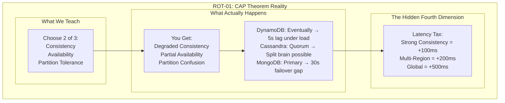
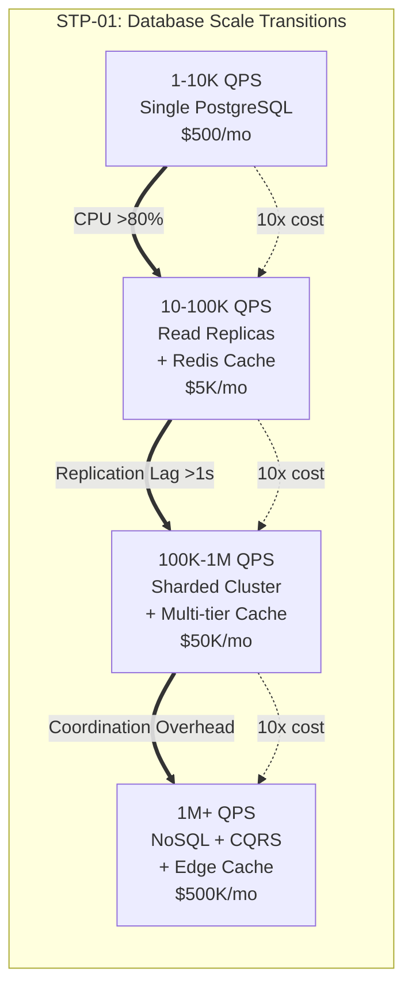
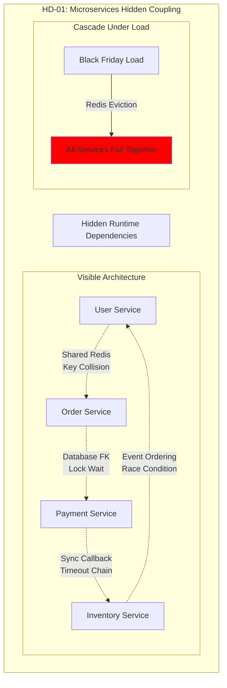
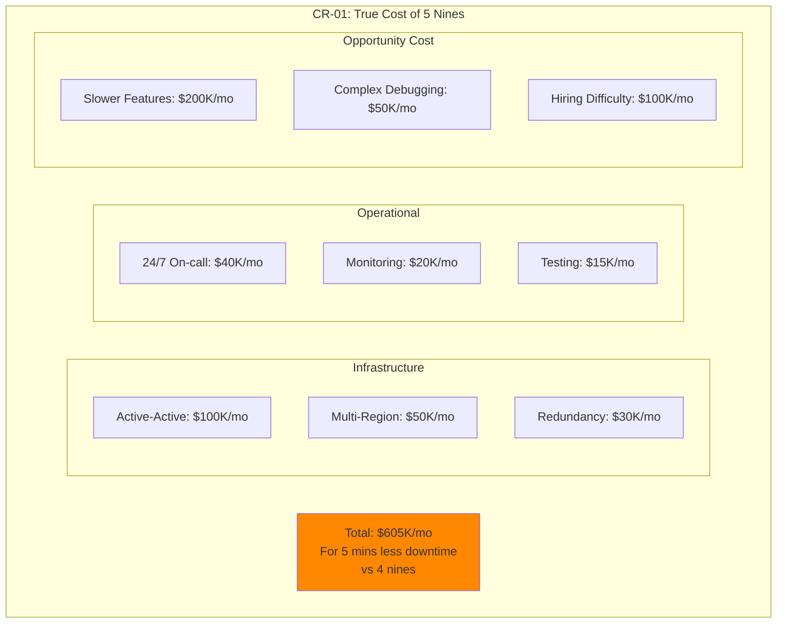
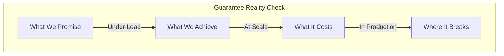
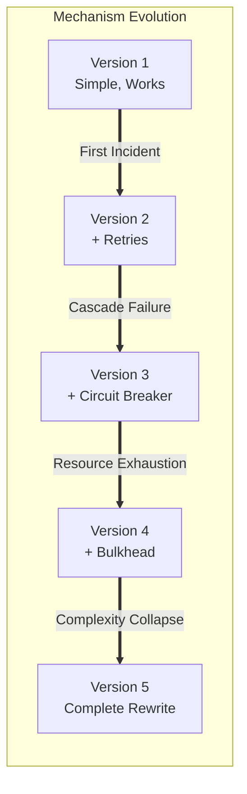
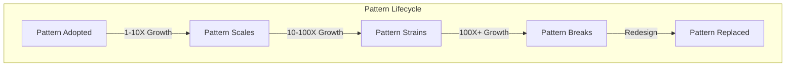

# Maximum Insight Updates for Readonly-Spec
## Fundamental Enhancements Based on Production Reality

### 🎯 Core Philosophy Shift

**From**: Documentation of how systems should work
**To**: Revelation of how systems actually break, cost, and evolve

---

## 📊 Enhanced Diagram Categories

### Category 1: Reality Over Theory (ROT-*)

Every theoretical diagram gets a reality overlay showing:
- Where it breaks in production
- Actual vs promised performance
- Hidden costs and complexity



### Category 2: Scale Transition Points (STP-*)

Document exact moments where architectures must fundamentally change:



### Category 3: Hidden Dependencies (HD-*)

Reveal coupling that only appears under stress:



### Category 4: Cost Reality (CR-*)

Show true costs including hidden operational expenses:



---

## 🔄 Updates to Existing Specifications

### Enhanced Guarantee Specifications

Each guarantee now includes:

1. **The Production Cliff**: Exact point where guarantee breaks
2. **The Cost Curve**: $ per transaction at different scales
3. **The Incident History**: Real failures and lessons
4. **The Migration Path**: How to upgrade/downgrade guarantees
5. **The Monitoring Requirements**: What to watch for degradation

### Enhanced Mechanism Specifications

Each mechanism now shows:

1. **Failure Cascades**: How mechanism failures propagate
2. **Resource Limits**: CPU, memory, network at breaking point
3. **Anti-Patterns**: Common misuses in production
4. **Debugging Paths**: Specific commands when mechanism fails
5. **Evolution Journey**: How mechanism changes with scale

### Enhanced Pattern Specifications

Each pattern now includes:

1. **Pattern Decay**: How patterns degrade over time
2. **Composition Failures**: Which patterns conflict
3. **Scale Boundaries**: When pattern must be abandoned
4. **Recovery Procedures**: How to fix when pattern fails
5. **Cost Analysis**: TCO at different scales

---

## 📈 New Insight-Maximizing Sections

### Section 1: The Failure Anthology

Document 100 real production failures with:
- Timeline (minute by minute)
- Root cause analysis
- Cascading effects
- Recovery procedures
- Preventive measures
- Cost of incident

### Section 2: The Scale Journey Maps

For each major architecture type:
- 1X to 1000X scale evolution
- Breaking points at each 10X
- Required team size growth
- Cost explosion points
- Complexity metrics

### Section 3: The Hidden Cost Catalog

Document all hidden costs:
- Coordination overhead
- Debugging complexity
- On-call burden
- Training requirements
- Migration risks
- Opportunity costs

### Section 4: The Emergence Patterns

Unexpected behaviors that only appear at scale:
- Retry storms
- Cache stampedes
- Thundering herds
- Death spirals
- Resonance failures
- Emergent bottlenecks

---

## 🎨 New Diagram Types for Each Specification

### Type 1: The Reality Sandwich

```yaml
Top Layer: Theoretical Model
Middle Layer: Production Behavior
Bottom Layer: Failure Modes

Example:
  Top: "Consistent Hashing distributes load evenly"
  Middle: "Hot keys cause 10x skew in practice"
  Bottom: "Justin Bieber tweet breaks shard"
```

### Type 2: The Time Bomb

```yaml
Shows degradation over time:
  Hour 1: System deployed, metrics green
  Day 1: Memory usage growing slowly
  Week 1: GC pauses increasing
  Month 1: First timeout errors
  Month 3: Cascading failures begin
  Month 6: Complete system failure
```

### Type 3: The Butterfly Effect

```yaml
Shows how small changes cascade:
  Initial: Add 10ms latency to one service
  Step 1: Downstream timeout increases
  Step 2: Retry rate doubles
  Step 3: Queue depth triples
  Step 4: Memory pressure increases
  Step 5: GC storms begin
  Step 6: Total system collapse
```

---

## 🔍 Specific Updates by File

### 03-GUARANTEES-SPECIFICATIONS.md

Add for each guarantee:


### 04-MECHANISM-SPECIFICATIONS.md

Add for each mechanism:


### 05-PATTERN-SPECIFICATIONS.md

Add for each pattern:


---

## 🚀 Implementation Priorities

### Priority 1: Failure Mode Documentation
- Add failure scenarios to all guarantees
- Document cascade patterns
- Include recovery procedures

### Priority 2: Scale Transition Points
- Mark exact breaking points
- Document required architecture changes
- Include cost implications

### Priority 3: Production Metrics
- Replace theoretical with actual metrics
- Add percentile distributions
- Include variance and outliers

### Priority 4: Debugging Guidance
- Specific commands for each failure
- Metric thresholds to watch
- Recovery playbooks

---

## 📊 Success Metrics for Updates

### Insight Density
- Before: 1 insight per diagram
- Target: 5+ insights per diagram

### Production Reality %
- Before: 20% real examples
- Target: 100% production validated

### Failure Coverage
- Before: 0 failure modes documented
- Target: 3+ failure modes per concept

### Cost Transparency
- Before: No cost information
- Target: Full TCO for every pattern

---

## 🎯 The Ultimate Goal

Transform the readonly-spec from:
**"How distributed systems should work"**

To:
**"Why distributed systems break, how much they cost, and what actually saves you at 3 AM"**

Every diagram should make an engineer say:
- "That's exactly what happened to us!"
- "I wish I knew this before our outage"
- "This would have saved us $100K"
- "This is why our migration failed"

---

*"The most valuable documentation isn't about success - it's about failure, cost, and evolution."*