# New Diagram Implementation Plan
## Maximizing Insights Across All 900 Diagrams

### 🎯 Strategic Overview

**Objective**: Transform every diagram from passive documentation to active insight generation

**Key Principle**: Every diagram must reveal something hidden about production systems

---

## 📊 Diagram Enhancement Framework

### Layer 1: Base Reality (All Diagrams)

Every existing diagram gets these overlays:


### Layer 2: Insight Annotations

Add to every diagram:

```yaml
Insight Annotations:
  🔴 Breaking Points: Where and why it fails
  💰 Hidden Costs: Unexpected expenses
  ⚡ Performance Cliffs: Sudden degradation points
  🔗 Hidden Dependencies: Non-obvious couplings
  📈 Scale Transitions: Architecture change points
  ⏰ Time Bombs: Gradual degradation patterns
  🌊 Cascade Risks: Failure propagation paths
```

---

## 🔄 Diagram Type Transformations

### Transform Type 1: Guarantees (108 diagrams)

**Before**: Static definition of guarantee
**After**: Dynamic reality of guarantee degradation

```mermaid
graph LR
    subgraph "Enhanced Guarantee Diagram"
        subgraph "Load Spectrum"
            LOW[Low Load<br/>✅ Guarantee Met<br/>$0.01/op]
            MED[Medium Load<br/>⚠️ Degrading<br/>$0.10/op]
            HIGH[High Load<br/>💥 Violated<br/>$1.00/op]
        end

        subgraph "Real Examples"
            EX1[Amazon: Relaxed consistency<br/>during Prime Day]
            EX2[Netflix: Disabled features<br/>during outage]
            EX3[GitHub: Read-only mode<br/>during incident]
        end

        LOW -->|10x load| MED
        MED -->|10x load| HIGH
        HIGH --> EX1
        HIGH --> EX2
        HIGH --> EX3
    end
```



### Transform Type 2: Mechanisms (120 diagrams)

**Before**: How mechanism works
**After**: How mechanism fails and recovers


### Transform Type 3: Patterns (105 diagrams)

**Before**: Pattern structure
**After**: Pattern evolution through scale


### Transform Type 4: Case Studies (240 diagrams)

**Before**: Current architecture
**After**: Architecture journey with scars


---

## 📈 New Diagram Categories to Add

### Category A: Incident Anatomies (100 diagrams)

Structure for each incident:


### Category B: Cost Waterfalls (60 diagrams)

Show where money really goes:


### Category C: Performance Cliffs (80 diagrams)

Document sudden performance degradations:

```mermaid
graph LR
    subgraph "Performance Cliff Diagram"
        subgraph "The Cliff"
            SMOOTH[0-1000 QPS<br/>p99: 10ms<br/>✅ Linear]

            DEGRADED[1000-1100 QPS<br/>p99: 100ms<br/>⚠️ 10x jump]

            FAILED[1100+ QPS<br/>p99: timeout<br/>💥 System down]
        end

        SMOOTH ==>|"Connection Pool Full"| DEGRADED
        DEGRADED ==>|"Thread Exhaustion"| FAILED

        SMOOTH -.->|Why| REASON1[Connection pool: 1000 max]
        DEGRADED -.->|Why| REASON2[Threads blocking on pool]
        FAILED -.->|Why| REASON3[Cascading timeouts]
    end

    style FAILED fill:#ff0000
```



### Category D: Migration Journeys (60 diagrams)

Real migration stories with timelines:


---

## 🎯 Implementation Strategy

### Phase 1: Enhance Existing (Weeks 1-4)
- Add reality overlays to all 19 existing diagrams
- Include production metrics and incidents
- Document breaking points

### Phase 2: Critical New Diagrams (Weeks 5-8)
- 30 Incident Anatomies (highest value)
- 20 Performance Cliffs
- 20 Cost Waterfalls

### Phase 3: Pattern Evolution (Weeks 9-12)
- Update all pattern diagrams with scale evolution
- Add migration journeys
- Document pattern decay

### Phase 4: Case Study Reality (Weeks 13-16)
- Transform case studies to journey format
- Include incidents and lessons
- Add team/cost growth metrics

---

## 📊 Insight Metrics Per Diagram

### Target Insights per Diagram Type

| Diagram Type | Current Insights | Target Insights | Key Additions |
|--------------|-----------------|-----------------|---------------|
| Guarantees | 1-2 | 8-10 | Breaking points, costs, incidents |
| Mechanisms | 1-2 | 6-8 | Failure modes, limits, anti-patterns |
| Patterns | 2-3 | 7-9 | Evolution, decay, replacements |
| Case Studies | 3-4 | 10-12 | Journey, incidents, lessons |
| Incidents | 0 | 15-20 | Timeline, impact, prevention |

### Insight Categories to Cover

1. **Performance Reality**: Actual latencies, not theoretical
2. **Cost Truth**: Hidden expenses, waste identification
3. **Scale Limits**: Exact breaking points
4. **Failure Modes**: How it actually breaks
5. **Recovery Paths**: What actually fixes it
6. **Evolution Story**: How it changes over time
7. **Team Impact**: People required at each scale
8. **Operational Burden**: On-call reality
9. **Migration Difficulty**: Actual effort and risks
10. **Business Impact**: Revenue and user effects

---

## 🚀 Success Criteria

### Quantitative Metrics
- 100% of diagrams show failure modes
- 100% include real production metrics
- 80% document actual incidents
- 100% show scale transition points
- 100% include cost implications

### Qualitative Metrics
- Engineers say "This explains our outage"
- Architects use for decision making
- On-call engineers reference during incidents
- Management understands true costs
- Teams avoid documented pitfalls

---

## 💡 The Transformation

### Before (Current State)
- Academic understanding
- Theoretical patterns
- Clean architectures
- Perfect scenarios

### After (Target State)
- Battle-tested knowledge
- Production patterns
- Scarred architectures
- Failure scenarios

**Every diagram tells a story of production reality, not theoretical possibility.**

---

*"The best architecture diagram is covered in scars from production battles."*