# Diagram Depth Maximization Strategy
## Maximizing Insight, Correctness, and Value in Every Static Diagram

### 🎯 Core Philosophy: Dense Truth Over Dynamic Visualization

**Principle**: Each diagram should be a complete, self-contained lesson that reveals deep truths about distributed systems.

---

## 📊 Depth Maximization Framework

### 1. The Complete Story Principle

Every diagram tells the COMPLETE story, not just the happy path:

```mermaid
graph TB
    subgraph "Complete Consensus Story"
        %% The Theory
        THEORY[Consensus: Agreement Among Nodes]

        %% The Implementation Reality
        IMPL[Raft/Paxos: 2-Phase Protocol<br/>Leader Election + Log Replication]

        %% The Production Constraints
        CONSTRAINTS[etcd: 10K writes/sec max<br/>5 nodes optimal (not 3, not 7)<br/>10GB practical limit]

        %% The Failure Modes
        FAILURES[Split Brain: Network partition<br/>Livelock: Leader flapping<br/>Data Loss: Minority writes]

        %% The Actual Incidents
        INCIDENTS[Cloudflare 2020: etcd CPU exhaustion<br/>GitHub 2018: MySQL split-brain<br/>Google 2017: Spanner clock skew]

        %% The Costs
        COSTS[3-node: $3K/month<br/>5-node: $8K/month<br/>Global: $50K+/month]

        %% The Trade-offs
        TRADEOFFS[Consistency vs Availability<br/>Latency vs Correctness<br/>Cost vs Reliability]

        THEORY --> IMPL
        IMPL --> CONSTRAINTS
        CONSTRAINTS --> FAILURES
        FAILURES --> INCIDENTS
        INCIDENTS --> COSTS
        COSTS --> TRADEOFFS
    end
```

### 2. The Holistic Context Principle

Show WHERE this fits in the larger system:


### 3. The Numbers Matter Principle

Replace ALL vague terms with specific production numbers:


### 4. The Scarred Wisdom Principle

Show the scars - what went wrong and why:


---

## 🔍 Correctness Through Layered Truth

### Layer 1: Theoretical Foundation
- Mathematical properties
- Formal guarantees
- Academic definitions

### Layer 2: Implementation Reality
- Actual algorithms used
- Real system constraints
- Production limitations

### Layer 3: Operational Truth
- What breaks in production
- Actual incident data
- Recovery procedures

### Layer 4: Economic Reality
- True costs (including hidden)
- Team requirements
- Opportunity costs

Example applying all layers:


---

## 📈 Value Maximization Strategies

### Strategy 1: Decision Support Diagrams

Each diagram helps make actual decisions:


### Strategy 2: Anti-Pattern Documentation

Show what NOT to do and why:

```mermaid
graph TD
    subgraph "Anti-Patterns That Kill Systems"
        AP1[Distributed Monolith<br/>Services share database<br/>❌ Kills independence]

        AP2[Sync Service Chains<br/>A→B→C→D→E<br/>❌ Cascading failures]

        AP3[Retry Without Backoff<br/>Immediate retry × 3<br/>❌ Amplifies load 3x]

        AP4[Unbounded Queues<br/>No size limits<br/>❌ Memory exhaustion]

        AP5[Global Locks<br/>Cross-service locking<br/>❌ Deadlocks at scale]

        AP1 -.->|Fix| F1[Database per service]
        AP2 -.->|Fix| F2[Async + events]
        AP3 -.->|Fix| F3[Exponential backoff + jitter]
        AP4 -.->|Fix| F4[Bounded queues + backpressure]
        AP5 -.->|Fix| F5[Optimistic locking]
    end
```



### Strategy 3: Evolution Documentation

Show how systems actually evolve:


---

## 🎨 Depth Patterns for Each Diagram Type

### For Guarantees: Show Degradation Reality


### For Mechanisms: Show Complete Implementation


### For Patterns: Show Complete Lifecycle


---

## 🎯 Quality Criteria for Maximum Depth

### Every Diagram Must:

1. **Tell the Complete Story**
   - Theory + Implementation + Operations + Economics
   - Success paths + Failure modes
   - Current state + Evolution path

2. **Use Specific Numbers**
   - No vague terms (high, low, scalable)
   - Real production metrics
   - Actual costs and limits

3. **Include Production Scars**
   - Real incidents and their impact
   - Lessons learned
   - What actually failed and why

4. **Support Decisions**
   - When to use vs when not to use
   - Trade-off analysis with numbers
   - Migration paths and costs

5. **Show Context**
   - Where it fits in the system
   - Dependencies and impacts
   - Team and skill requirements

---

## 📊 Measuring Diagram Value

### Insight Density Score

```yaml
Score = Theory(1-3) + Implementation(1-3) + Operations(1-3) +
        Economics(1-3) + Failures(1-3) + Decisions(1-3)

Maximum: 18 points
Target: 15+ points per diagram
Current Average: 5-6 points
```

### Correctness Validation

```yaml
Correctness Checklist:
✓ Numbers verified from production sources
✓ Incidents referenced with dates
✓ Costs validated with actual bills
✓ Limits tested in production
✓ Trade-offs quantified
✓ Evolution paths proven
```

---

*"A diagram's value isn't in its beauty, but in the hard-won truths it reveals about production reality."*