# Holistic Value Framework for Diagrams
## Ensuring Every Diagram Delivers Complete, Correct, and Actionable Knowledge

### 🎯 The Holistic Value Equation

```
Diagram Value = Completeness × Correctness × Actionability × Context
```

---

## 📐 The Four Dimensions of Value

### Dimension 1: Completeness (What + Why + How + When)

```mermaid
graph TB
    subgraph "Complete Replication Story"
        WHAT[What: Data Copies<br/>Master-Slave, Multi-Master<br/>Sync, Async, Semi-Sync]

        WHY[Why: Availability + Performance<br/>Read scaling: 10-100x<br/>Fault tolerance: N-1 failures<br/>Geographic distribution]

        HOW[How: Implementation<br/>Binary log streaming<br/>Logical replication<br/>Trigger-based]

        WHEN[When to Use<br/>Reads >> Writes (10:1)<br/>Geographic distribution needed<br/>HA required (>99.9%)]

        WHEN_NOT[When NOT to Use<br/>Strong consistency critical<br/>Write-heavy workloads<br/>Complex transactions]

        LIMITS[Production Limits<br/>MySQL: 100 replicas max<br/>PostgreSQL: Practical 10-20<br/>MongoDB: 50 secondaries<br/>Lag: 0.1s - 10s typical]

        COSTS[Real Costs<br/>2x infrastructure minimum<br/>Network: $1K/TB transferred<br/>Operational: +50% complexity<br/>Incidents: 2x debugging time]

        WHAT --> WHY
        WHY --> HOW
        HOW --> WHEN
        WHEN --> WHEN_NOT
        WHEN_NOT --> LIMITS
        LIMITS --> COSTS
    end
```

### Dimension 2: Correctness (Verified Production Data)

```mermaid
graph LR
    subgraph "Verified Load Balancing Algorithms"
        subgraph "Round Robin"
            RR_THEORY[Theory: Equal distribution]
            RR_REALITY[Reality: 30% skew common<br/>Source: AWS ELB metrics 2024]
        end

        subgraph "Least Connections"
            LC_THEORY[Theory: Optimal balance]
            LC_REALITY[Reality: Long connections dominate<br/>Source: Netflix 2023 report]
        end

        subgraph "Consistent Hash"
            CH_THEORY[Theory: Minimal reshuffling]
            CH_REALITY[Reality: Hot keys 10x load<br/>Source: Discord incident 2022]
        end

        subgraph "Weighted"
            W_THEORY[Theory: Capacity-aware]
            W_REALITY[Reality: Requires constant tuning<br/>Source: Uber engineering 2023]
        end

        RR_THEORY -.->|Verification| RR_REALITY
        LC_THEORY -.->|Verification| LC_REALITY
        CH_THEORY -.->|Verification| CH_REALITY
        W_THEORY -.->|Verification| W_REALITY
    end
```



### Dimension 3: Actionability (Decisions + Operations)

```mermaid
graph TD
    subgraph "Actionable Circuit Breaker Guide"
        subgraph "Configuration Decisions"
            THRESHOLD[Failure Threshold<br/>Netflix: 50% in 10 seconds<br/>Uber: 20% in 20 seconds<br/>Stripe: 10% in 30 seconds]

            TIMEOUT[Timeout Settings<br/>p50 latency × 3<br/>Never > 10 seconds<br/>Mobile: 3 seconds max]

            HALF_OPEN[Half-Open Testing<br/>1 request every 30s<br/>5 successes to close<br/>1 failure to re-open]
        end

        subgraph "Operational Actions"
            MONITOR[What to Monitor<br/>❗ Error rate > threshold<br/>❗ Response time > p99<br/>❗ State transitions/minute]

            ALERT[When to Alert<br/>🔴 Circuit opens > 5 min<br/>🔴 Flapping (>10 transitions/hr)<br/>🔴 All circuits open]

            DEBUG[How to Debug<br/>1. Check downstream health<br/>2. Verify timeout settings<br/>3. Review recent deploys<br/>4. Check resource limits]
        end

        subgraph "Recovery Procedures"
            RECOVER[Recovery Steps<br/>1. Identify root cause<br/>2. Fix downstream issue<br/>3. Manually reset circuit<br/>4. Gradual traffic ramp<br/>5. Monitor for 1 hour]
        end

        THRESHOLD --> MONITOR
        TIMEOUT --> MONITOR
        HALF_OPEN --> MONITOR
        MONITOR --> ALERT
        ALERT --> DEBUG
        DEBUG --> RECOVER
    end
```

### Dimension 4: Context (System + Scale + Team)

```mermaid
graph TB
    subgraph "Kafka in Complete Context"
        subgraph "System Context"
            ROLE[Role in Architecture<br/>Central nervous system<br/>Decoupling layer<br/>Event backbone]

            UPSTREAM[Upstream: 100+ producers<br/>APIs, DBs, IoT devices<br/>10M events/second]

            DOWNSTREAM[Downstream: 500+ consumers<br/>Analytics, ML, Storage<br/>5x consumption rate]
        end

        subgraph "Scale Context"
            SMALL[Small: <1K msg/s<br/>3 brokers, 1 ZK<br/>Cost: $1K/mo<br/>Team: 1 engineer]

            MEDIUM[Medium: 1K-100K msg/s<br/>10 brokers, 3 ZK<br/>Cost: $20K/mo<br/>Team: 2-3 engineers]

            LARGE[Large: 100K-10M msg/s<br/>100+ brokers, 5 ZK<br/>Cost: $200K+/mo<br/>Team: 5-10 engineers]

            LINKEDIN[LinkedIn Scale: 7T msg/day<br/>4000+ brokers<br/>Cost: $5M+/mo<br/>Team: 30+ engineers]
        end

        subgraph "Team Context"
            SKILLS[Required Skills<br/>JVM tuning<br/>Linux internals<br/>Network protocols<br/>Distributed systems]

            ROLES[Team Roles<br/>Platform engineer<br/>SRE for operations<br/>Data engineer for pipelines]

            TRAINING[Learning Curve<br/>Basic: 1 month<br/>Proficient: 6 months<br/>Expert: 2+ years]
        end

        ROLE --> UPSTREAM
        UPSTREAM --> DOWNSTREAM
        DOWNSTREAM --> SMALL
        SMALL --> MEDIUM
        MEDIUM --> LARGE
        LARGE --> LINKEDIN
        LINKEDIN --> SKILLS
        SKILLS --> ROLES
        ROLES --> TRAINING
    end
```



---

## 🎨 Holistic Patterns by System Component

### Pattern 1: The Maturity Journey

Show how understanding and implementation evolves:

```mermaid
graph LR
    subgraph "Caching Maturity Journey"
        L0[Level 0: No Cache<br/>Every request hits DB<br/>Simple but slow]

        L1[Level 1: Basic Cache<br/>Simple key-value<br/>TTL-based expiry<br/>Cache stampedes common]

        L2[Level 2: Smart Cache<br/>Probabilistic expiry<br/>Request coalescing<br/>Warm-up procedures]

        L3[Level 3: Distributed Cache<br/>Consistent hashing<br/>Multi-tier (L1/L2/L3)<br/>Read-through/Write-through]

        L4[Level 4: Intelligent Cache<br/>ML-based prefetch<br/>Adaptive TTLs<br/>Cost-aware eviction]

        L0 ==>|"Load increases"| L1
        L1 ==>|"Stampedes hurt"| L2
        L2 ==>|"Scale needs"| L3
        L3 ==>|"Optimization"| L4

        L1 -.->|Incident| I1[First stampede<br/>Site down 30min]
        L2 -.->|Learning| I2[Jitter prevents<br/>thundering herd]
        L3 -.->|Cost| I3[Cache more expensive<br/>than database]
        L4 -.->|Reality| I4[Most stop at L3<br/>L4 rarely worth it]
    end
```

### Pattern 2: The Decision Matrix

Help choose between alternatives:

```mermaid
graph TD
    subgraph "SQL vs NoSQL Decision Matrix"
        START[Data Structure?]

        START -->|Relational| REL[Relationships Critical?]
        START -->|Document| DOC[Schema Flexibility?]
        START -->|Key-Value| KV[Simple Lookups?]
        START -->|Graph| GRAPH[Complex Relationships?]

        REL -->|Yes + ACID| RDBMS[PostgreSQL/MySQL<br/>Pros: ACID, SQL, Mature<br/>Cons: Scale limits<br/>Cost: $500-50K/mo]
        REL -->|Yes + Scale| NEWSQL[CockroachDB/Spanner<br/>Pros: Global scale<br/>Cons: Expensive<br/>Cost: $50K+/mo]
        REL -->|No| NOSQL1[Consider NoSQL]

        DOC -->|Yes| MONGO[MongoDB/DynamoDB<br/>Pros: Flexible, Fast dev<br/>Cons: Consistency<br/>Cost: $1K-100K/mo]

        KV -->|Yes| REDIS[Redis/Memcached<br/>Pros: Fast (sub-ms)<br/>Cons: Memory cost<br/>Cost: $10K+/mo]

        GRAPH -->|Yes| NEO4J[Neo4j/Neptune<br/>Pros: Graph queries<br/>Cons: Specialized<br/>Cost: $5K+/mo]

        RDBMS -.->|Scale Limit| LIMIT1[~100TB practical]
        MONGO -.->|Hidden Cost| LIMIT2[Index memory 2x data]
        REDIS -.->|Memory| LIMIT3[$100/GB/month]
    end
```

### Pattern 3: The Production Checklist

What must be in place for production:

```mermaid
graph TB
    subgraph "Production Readiness: Microservices"
        subgraph "Must Have"
            M1[Health checks: /health endpoint]
            M2[Metrics: Prometheus/DataDog]
            M3[Logging: Structured, correlation IDs]
            M4[Tracing: Distributed traces]
            M5[Circuit breakers: All external calls]
            M6[Rate limiting: Prevent abuse]
            M7[Graceful shutdown: Drain connections]
        end

        subgraph "Should Have"
            S1[Feature flags: Gradual rollout]
            S2[Canary deployment: Test with 1%]
            S3[Load testing: Prove scale]
            S4[Chaos testing: Prove resilience]
            S5[SLO/SLA defined: Clear targets]
        end

        subgraph "Often Forgotten"
            F1[Connection pool tuning]
            F2[Timeout configuration]
            F3[Retry strategy]
            F4[Backpressure handling]
            F5[Memory limits]
            F6[CPU throttling]
            F7[Disk space monitoring]
        end

        M1 --> M2 --> M3 --> M4 --> M5 --> M6 --> M7
        M7 --> S1 --> S2 --> S3 --> S4 --> S5
        S5 --> F1 --> F2 --> F3 --> F4 --> F5 --> F6 --> F7

        F7 -.->|Common Failures| FAIL[50% of incidents from<br/>forgotten items]
    end
```



---

## 📊 Value Measurement Framework

### Completeness Score (0-5 points)
```yaml
1 point: Basic what
2 points: + Why
3 points: + How
4 points: + When/When not
5 points: + Limits, costs, alternatives
```

### Correctness Score (0-5 points)
```yaml
1 point: Theoretical accuracy
2 points: + Implementation verified
3 points: + Production metrics
4 points: + Incident data
5 points: + Cost validated
```

### Actionability Score (0-5 points)
```yaml
1 point: Informational
2 points: + Decision support
3 points: + Operational guidance
4 points: + Debug procedures
5 points: + Recovery runbooks
```

### Context Score (0-5 points)
```yaml
1 point: Standalone component
2 points: + System position
3 points: + Scale considerations
4 points: + Team requirements
5 points: + Evolution path
```

### Target: 18+ out of 20 points per diagram

---

## 🎯 Implementation Priorities

### Priority 1: Core Mechanisms (Highest Impact)
Update all 22 mechanism diagrams with:
- Complete lifecycle (design → implementation → operation → evolution)
- Production limits and breaking points
- Real incident examples
- Decision matrices

### Priority 2: Guarantees (Foundation)
Enhance all 18 guarantee diagrams with:
- Degradation under load
- Cost at different consistency levels
- Production trade-offs
- Migration paths between guarantees

### Priority 3: Patterns (Architecture)
Improve all 27 pattern diagrams with:
- Maturity journey
- Anti-patterns and pitfalls
- Scale transitions
- Team and cost implications

### Priority 4: Case Studies (Validation)
Transform 30 case studies to show:
- Complete evolution story
- Incidents and recoveries
- Lessons learned
- Alternative paths not taken

---

## 💡 The Holistic Difference

### Before (Shallow)
- Shows: How replication works
- Focus: Mechanism
- Value: Educational

### After (Holistic)
- Shows: Complete replication story from theory to production reality
- Includes: When it breaks, what it costs, how to fix it, when to avoid it
- Value: Immediately actionable for architecture decisions and operations

**Every diagram becomes a complete knowledge artifact that serves both learning and production needs.**

---

*"The best diagram doesn't just explain a concept - it provides everything needed to implement, operate, and evolve it in production."*