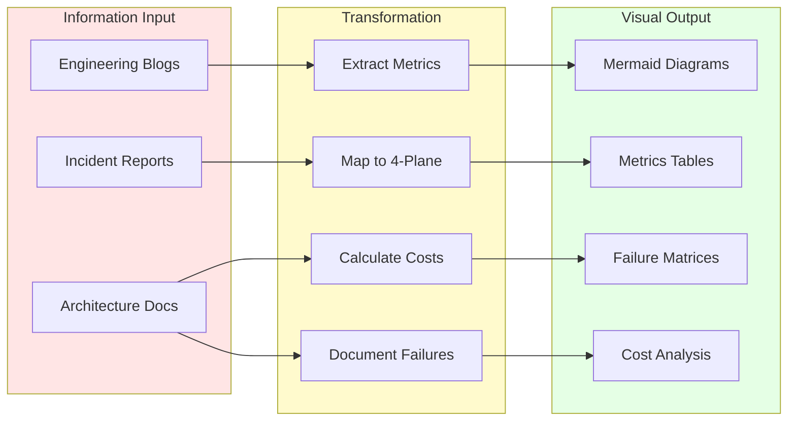
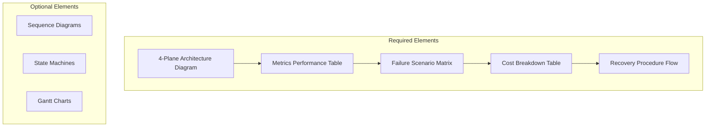
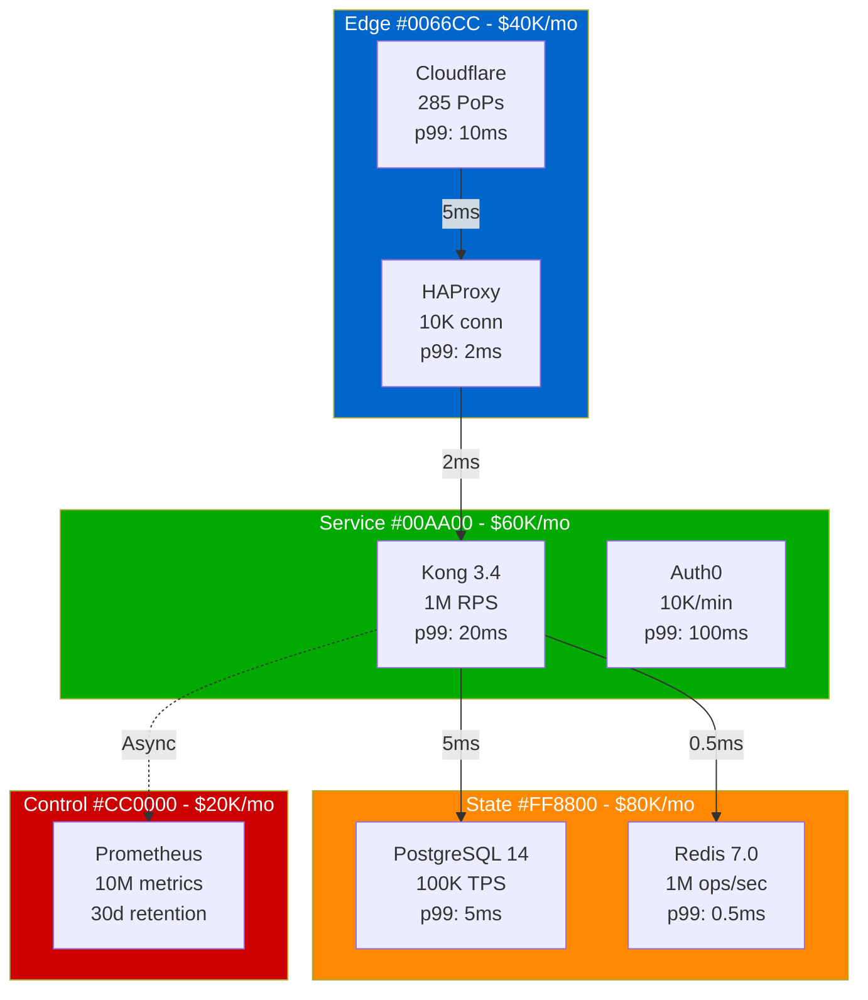
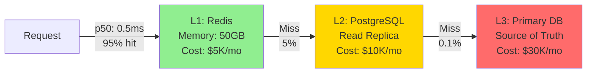
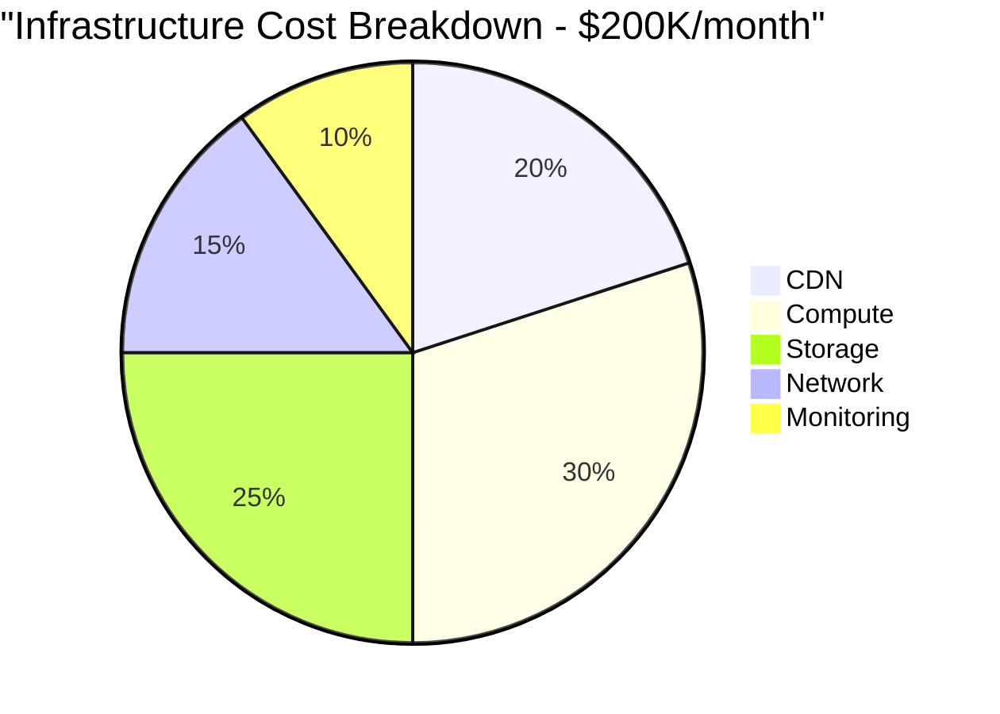
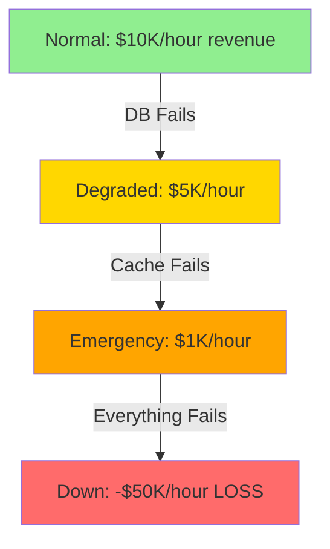
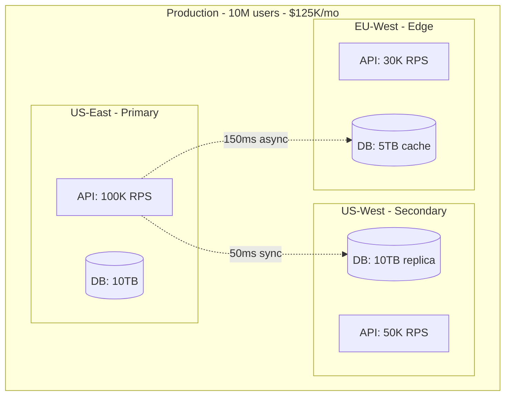

# Visual-First Specification v2.0: The Atlas Evolution

## Executive Mandate: Diagrams Over Text

## The New Specification Rules

### Rule 1: Maximum Text Limits

| Content Type | Old Limit | New Limit | Example |
|--------------|-----------|-----------|---------|
| **Section Intro** | No limit | 2 sentences | "Netflix serves 260M users. Here's how." |
| **Diagram Caption** | Paragraph | 1 sentence | "Request flow with latency budgets." |
| **Table Header** | Multiple lines | 5 words max | "Failure Recovery Matrix" |
| **Bullet Points** | Unlimited | 5 items max | Only critical points |

### Rule 2: Mandatory Visual Elements

Every topic MUST include:

### Rule 3: The 4-Plane Color Mandate

| Plane | Color Code | RGB | Components | Metrics Required |
|-------|------------|-----|------------|------------------|
| **Edge** | #0066CC | (0,102,204) | CDN, LB, WAF | Latency, Bandwidth |
| **Service** | #00AA00 | (0,170,0) | API, Logic | RPS, Error Rate |
| **State** | #FF8800 | (255,136,0) | DB, Cache | IOPS, Storage |
| **Control** | #CC0000 | (204,0,0) | Monitor, Config | Metrics/sec |

### Rule 4: Metrics Are Mandatory

| Metric Type | Required Format | Example | Banned Words |
|-------------|----------------|---------|--------------|
| **Latency** | p50/p99/p999 | p99: 10ms | "Fast", "Quick" |
| **Throughput** | Exact number + unit | 100K RPS | "High", "Scalable" |
| **Availability** | Percentage + downtime | 99.95% (26 min/year) | "Reliable", "Stable" |
| **Cost** | $/unit + total | $0.001/req ($100K/mo) | "Cheap", "Expensive" |
| **Scale** | Exact numbers | 10M users, 1B requests | "Large", "Massive" |

## Content Transformation Templates

### Template 1: System Architecture (Visual Only)

### Template 2: Incident Timeline (No Text Needed)

| T+ | Phase | System State | Metric | Action | Cost |
|----|-------|--------------|--------|--------|------|
| 0 | Normal | ✅ All Green | 0.01% errors | - | $0 |
| 30s | Detection | 🟡 Alerts firing | 5% errors | Page on-call | $1K/min |
| 2m | Diagnosis | 🔴 DB CPU 100% | 50% errors | Check queries | $5K/min |
| 5m | Mitigation | 🟡 Failover started | 10% errors | Route to replica | $2K/min |
| 10m | Recovery | 🟢 Service restored | 0.1% errors | Monitor stability | $0 |
| 30m | Resolution | ✅ Root cause fixed | 0.01% errors | Deploy fix | -$50K credit |

### Template 3: Capacity Model (Pure Numbers)

| Resource | Now | +3mo | +6mo | +1yr | Break Point | Action |
|----------|-----|------|------|------|-------------|--------|
| **RPS** | 50K | 75K | 110K | 200K | 150K | Scale @ 100K |
| **DB Size** | 5TB | 7TB | 10TB | 18TB | 20TB | Shard @ 15TB |
| **Cost** | $100K | $130K | $180K | $320K | $400K | Optimize @ $250K |
| **Latency p99** | 10ms | 12ms | 15ms | 25ms | 50ms | Cache @ 20ms |

## Examples: Before vs After

### ❌ OLD: Text-Heavy Explanation

"Our system uses a sophisticated caching strategy that significantly improves performance. We implement a multi-tier cache architecture with Redis as the primary cache layer, which helps reduce database load. The cache uses an LRU eviction policy and maintains high hit rates through intelligent prefetching algorithms..."

### ✅ NEW: Visual + Metrics

| Cache Layer | Hit Rate | Latency | Cost/Month | Failure Mode |
|-------------|----------|---------|------------|--------------|
| L1: Redis 7.0 | 95% | p99: 0.5ms | $5K | Fallback to L2 |
| L2: Read Replica | 4.9% | p99: 5ms | $10K | Fallback to L3 |
| L3: Primary DB | 0.1% | p99: 10ms | $30K | Service degraded |

## The 5 Commandments of Visual Documentation

### 1. Show the Money

### 2. Show the Failures

### 3. Show the Scale

| Company | Scale Metric | Infrastructure | Cost/User | Incident Cost |
|---------|--------------|----------------|-----------|---------------|
| Netflix | 260M users | 100K servers | $0.48/mo | $2.6M/hour down |
| Uber | 25M trips/day | 4K services | $0.30/trip | $1M/hour down |
| Stripe | 1M+ businesses | 99.999% uptime | $0.0001/txn | $10M/hour down |

### 4. Show the Timeline

```mermaid
gantt
    title Incident Response Timeline
    dateFormat HH:mm
    axisFormat %H:%M

    section Detection
    Alert Fires           :done, 00:00, 1m
    Page On-Call         :done, 00:01, 1m

    section Diagnosis
    Check Metrics        :active, 00:02, 3m
    Find Root Cause      :active, 00:05, 5m

    section Mitigation
    Execute Failover     :crit, 00:10, 5m
    Verify Recovery      :crit, 00:15, 5m

    section Resolution
    Deploy Fix          :00:20, 10m
    Monitor Stability   :00:30, 30m
```

### 5. Show the Architecture

Never describe architecture in words. Always show it with metrics:

## Validation Checklist

Every document MUST pass:

- [ ] **Text Limit**: <10% of content is text
- [ ] **Diagram First**: Mermaid diagram in first 100 lines
- [ ] **Metrics Table**: Real numbers, no adjectives
- [ ] **4-Plane Colors**: Exact hex codes used
- [ ] **Failure Documented**: What breaks and recovery
- [ ] **Cost Included**: $ amounts for everything
- [ ] **Company Example**: Real incident or architecture
- [ ] **3AM Test**: Usable during incident
- [ ] **No Code Blocks**: Tables only
- [ ] **No Generic Terms**: Specific versions always

## Enforcement Rules

1. **Reject PRs** that don't meet visual-first criteria
2. **Automated validation** for diagram:text ratio
3. **Metrics required** - no vague descriptions
4. **Real examples only** - no hypotheticals
5. **Cost analysis mandatory** - show the money

---

*"A diagram is worth a thousand words. A metric is worth a thousand guesses. A real incident is worth a thousand theories."*

**Visual-First Specification v2.0 - Effective Immediately**