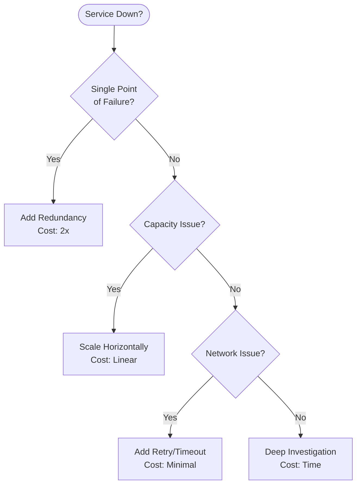

# Incident Response Quick Reference

## 🚨 Emergency Navigation - Find Your Fix in <3 Minutes

### By Symptom

| Symptom | Likely Cause | Immediate Action | Reference |
|---------|-------------|------------------|-----------|
| **High Latency (p99 >100ms)** | Cache miss, DB slow query | Check cache hit rate, slow query log | [Debugging Guide](#latency) |
| **503 Errors** | Circuit breaker open | Check error rate, dependency health | [Circuit Breaker](#circuit-breaker) |
| **OOM Kills** | Memory leak, traffic spike | Scale horizontally, restart with heap dump | [Memory Issues](#memory) |
| **Connection Refused** | Pool exhausted, service down | Increase pool size, check service health | [Connection Pool](#connections) |
| **Split Brain** | Network partition | Check quorum, force leader election | [Consensus Issues](#consensus) |
| **Data Inconsistency** | Replication lag | Check lag metrics, pause writes | [Replication](#replication) |
| **Cascading Failure** | No bulkheads | Enable circuit breakers, add timeouts | [Resilience](#resilience) |

### By Service Type

| Service | Common Issues | Quick Fixes | Monitoring |
|---------|--------------|-------------|------------|
| **Kafka** | Broker down, partition skew | Rebalance, increase replicas | JMX metrics, consumer lag |
| **PostgreSQL** | Lock contention, vacuum | Kill long queries, manual vacuum | pg_stat_activity |
| **Redis** | Memory full, slow commands | Eviction policy, SLOWLOG | INFO memory, MONITOR |
| **Kubernetes** | Pod crashes, node pressure | Scale replicas, cordon node | kubectl top, events |
| **Elasticsearch** | Shard failure, heap pressure | Reallocate shards, increase heap | _cluster/health, _nodes/stats |

### Critical Commands

| Situation | Command | Purpose |
|-----------|---------|---------|
| **Database locked** | `SELECT pg_cancel_backend(pid)` | Kill blocking query |
| **Kafka lag** | `kafka-consumer-groups --describe` | Check consumer lag |
| **Redis memory** | `redis-cli --bigkeys` | Find memory hogs |
| **K8s issues** | `kubectl get events --sort-by='.lastTimestamp'` | Recent failures |
| **Network partition** | `iptables -L -n -v` | Check firewall rules |

### Recovery Procedures

| Failure Type | Detection (<1min) | Mitigation (1-5min) | Resolution (5-30min) |
|--------------|------------------|---------------------|----------------------|
| **Leader Lost** | Heartbeat timeout | Force new election | Investigate old leader |
| **Disk Full** | Monitoring alert | Delete logs/temp | Add storage/compress |
| **DDoS Attack** | Rate limit alerts | Enable WAF rules | Scale edge capacity |
| **Data Corruption** | Checksum failures | Failover to replica | Restore from backup |
| **Deployment Failed** | Health checks fail | Rollback deployment | Fix and redeploy |

## Production Limits - Know Your Breaking Points

| Component | Limit | Symptoms at Limit | Mitigation |
|-----------|-------|-------------------|------------|
| **MySQL** | 20K writes/sec/shard | Lock timeouts | Shard further |
| **etcd** | 10K nodes max | Leader election fails | Use hierarchical |
| **Kafka** | 4K partitions/cluster | Rebalance storms | More clusters |
| **PostgreSQL** | 100 connections | Connection refused | Use pgBouncer |
| **Redis** | 10K ops/sec/core | CPU 100% | Cluster mode |
| **Consul** | 5K services | Gossip floods | Federation |

## Real Incident Patterns

### Pattern 1: The Thundering Herd
**Trigger**: Cache expires simultaneously
**Impact**: Database overload
**Fix**: Jittered TTL, cache warming
**Example**: Facebook 2019 - Memcached expiry caused DB meltdown

### Pattern 2: The Retry Storm
**Trigger**: Service returns errors
**Impact**: Exponential load increase
**Fix**: Exponential backoff, circuit breaker
**Example**: AWS 2017 - S3 retry storm

### Pattern 3: The Cascading Timeout
**Trigger**: One slow service
**Impact**: All services slow
**Fix**: Aggressive timeouts, bulkheads
**Example**: Netflix 2016 - One service caused platform outage

### Pattern 4: The Split Brain
**Trigger**: Network partition
**Impact**: Data inconsistency
**Fix**: Proper quorum, fencing
**Example**: GitHub 2018 - MySQL split-brain

## Cost of Downtime Reference

| Service Level | Downtime/Year | Cost/Hour | Example Impact |
|---------------|---------------|-----------|----------------|
| 99.9% (3 nines) | 8.76 hours | $10K | Small business |
| 99.95% | 4.38 hours | $50K | Mid-size SaaS |
| 99.99% (4 nines) | 52.6 minutes | $100K | E-commerce |
| 99.999% (5 nines) | 5.26 minutes | $1M | Financial services |

## Quick Architecture Decisions

## Emergency Contacts

| Escalation Level | Team | Response Time | Use When |
|------------------|------|---------------|----------|
| L1 | On-call Engineer | <5 min | First response |
| L2 | Senior SRE | <15 min | Complex issues |
| L3 | Architect | <30 min | Design problems |
| L4 | Vendor Support | <1 hour | Third-party issues |

---

**Remember**: During an incident, focus on mitigation first, root cause second. This index is designed to get you to mitigation in <3 minutes.