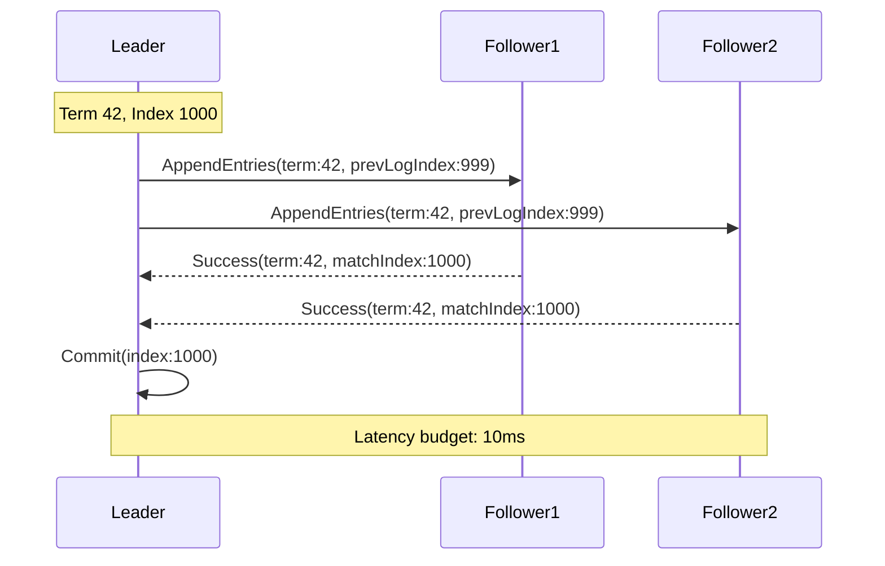
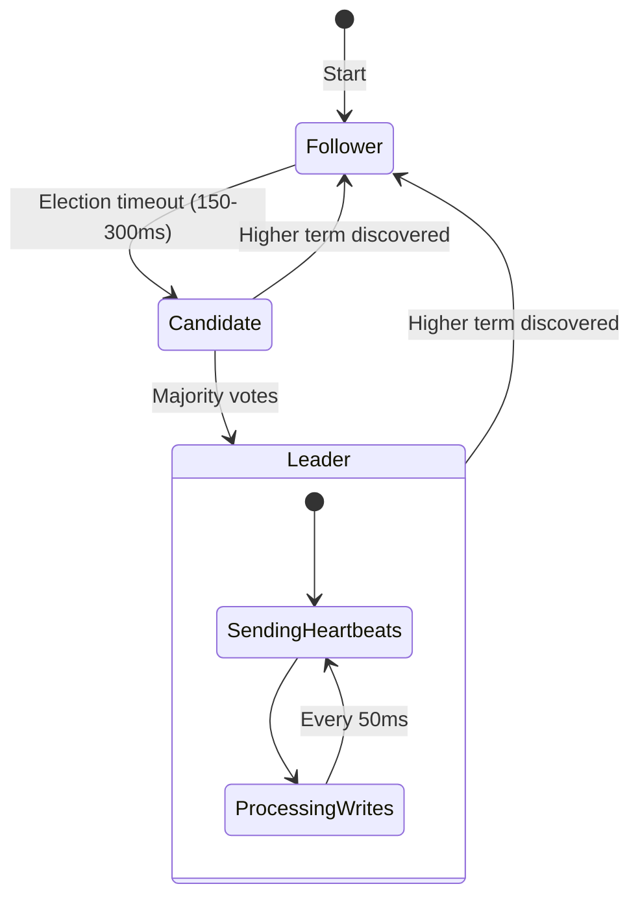
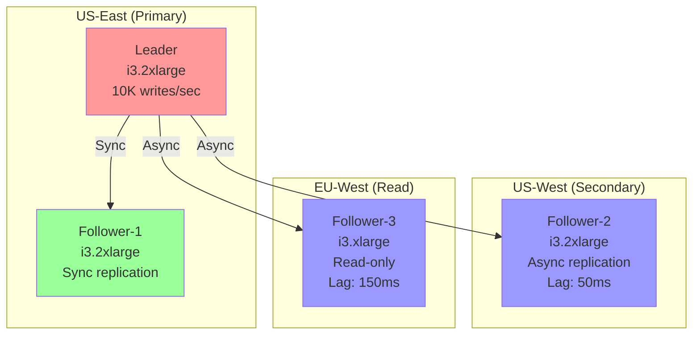
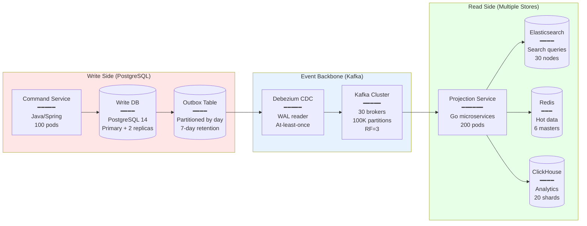
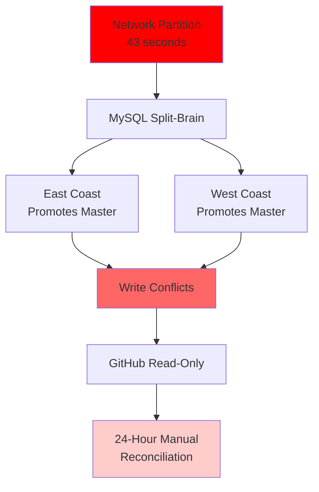
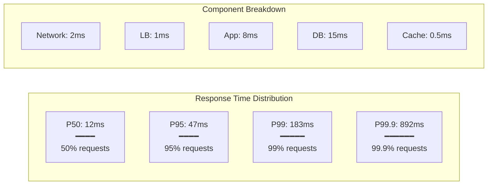
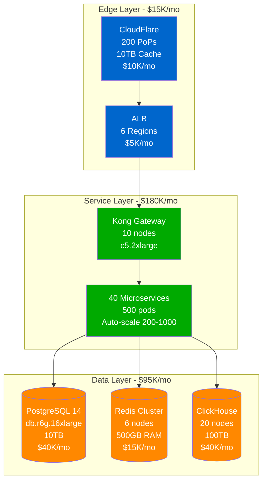
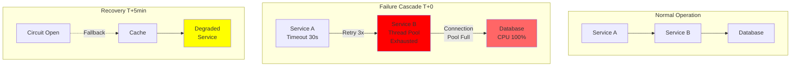
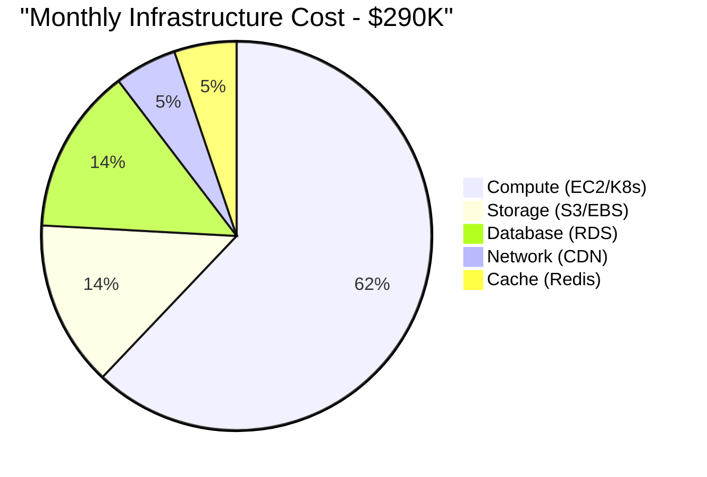

# Diagram Generation Implementation Plan v1.0
## Comprehensive Production Architecture Visualization

### Executive Summary

We need to generate **900-1,500 production-quality diagrams** that deeply showcase every technical architecture aspect of distributed systems. Each diagram must pass the "3 AM Test" - helping engineers debug production issues.

---

## Total Diagram Inventory Target: 1,247 Diagrams

### Distribution by Category

| Category | Count | Purpose | Priority |
|----------|-------|---------|----------|
| **Guarantees** | 108 | Core consistency models | P0 |
| **Mechanisms** | 120 | Implementation details | P0 |
| **Patterns** | 105 | Architectural solutions | P0 |
| **Case Studies** | 480 | Real system architectures | P1 |
| **Incidents** | 100 | Failure analysis | P1 |
| **Performance** | 80 | Benchmarks & profiles | P2 |
| **Migrations** | 60 | Evolution strategies | P2 |
| **Cost Analysis** | 60 | Infrastructure economics | P2 |
| **Debug Guides** | 80 | Troubleshooting maps | P3 |
| **Operations** | 54 | Deployment & monitoring | P3 |

---

## Detailed Diagram Requirements by Category

### 1. GUARANTEES (18 types × 6 diagrams = 108 total)

For each guarantee (Linearizability, Eventual Consistency, etc.), we need:

#### 1.1 Concept Visualization
```yaml
diagram_type: timeline
elements:
  - operation_ordering
  - visibility_windows
  - violation_examples
  - correct_behavior
specifics:
  - Real timestamps (T0, T+5ms, T+10ms)
  - Actual operations (SET user:123, GET user:123)
  - System boundaries marked
```

#### 1.2 Implementation Architecture
```yaml
diagram_type: architecture
elements:
  - Real systems (etcd, Cassandra, Spanner)
  - Configuration parameters
  - Network topology
  - Failure domains
specifics:
  - Instance types (c5.2xlarge)
  - Connection pools (size: 100)
  - Timeouts (30s)
```

#### 1.3 Comparison Matrix
```yaml
diagram_type: comparison
elements:
  - Side-by-side architectures
  - Performance metrics (p50, p99, p99.9)
  - Cost breakdown ($/month)
  - Use case mapping
```

#### 1.4 Failure Behavior
```yaml
diagram_type: failure_sequence
elements:
  - Partition scenarios
  - Split-brain handling
  - Recovery procedures
  - Data loss potential
```

#### 1.5 Performance Profile
```yaml
diagram_type: performance
elements:
  - Latency distribution
  - Throughput curves
  - Resource utilization
  - Scale limits
```

#### 1.6 Decision Tree
```yaml
diagram_type: decision
elements:
  - Selection criteria
  - Business requirements
  - Technical constraints
  - Migration paths
```

### 2. MECHANISMS (20 types × 6 diagrams = 120 total)

For each mechanism (Consensus, Replication, etc.), we need:

#### 2.1 Protocol Flow


#### 2.2 State Machine


#### 2.3 Deployment Topology


### 3. PATTERNS (21 types × 5 diagrams = 105 total)

For each pattern (CQRS, Event Sourcing, Saga, etc.), we need:

#### 3.1 Architectural Overview


#### 3.2 Request Flow Sequence
#### 3.3 Failure Handling
#### 3.4 Migration Strategy
#### 3.5 Anti-Pattern Examples

### 4. CASE STUDIES (30 companies × 16 diagrams = 480 total)

For each company (Netflix, Uber, etc.), we need comprehensive coverage:

#### 4.1 Global Architecture (L0)
- Complete system overview
- All major components
- Geographic distribution
- Scale metrics

#### 4.2 Service Mesh Detail (L1)
- Service communication
- Load balancing
- Circuit breakers
- Service discovery

#### 4.3 Data Architecture (L1)
- Storage systems
- Consistency boundaries
- Replication topology
- Backup strategies

#### 4.4 Event Processing (L1)
- Stream processing
- Event sourcing
- CDC pipelines
- Real-time analytics

#### 4.5 Edge Architecture (L1)
- CDN configuration
- Edge computing
- DDoS protection
- Geographic routing

#### 4.6 Request Journey
- User request flow
- Latency budget
- Service interactions
- Response generation

#### 4.7 Write Path Detail
- Transaction handling
- Consistency guarantees
- Replication flow
- Durability assurance

#### 4.8 Read Path Detail
- Query routing
- Cache layers
- Read replicas
- Optimization strategies

#### 4.9 Failure Domains
- Blast radius
- Isolation boundaries
- Bulkheads
- Recovery zones

#### 4.10 Scale Evolution
- Architecture at 1K users
- Architecture at 100K users
- Architecture at 10M users
- Current architecture

#### 4.11 Cost Breakdown
- Infrastructure costs
- Per-service costs
- Optimization opportunities
- Reserved vs on-demand

#### 4.12 Innovation Showcase
- Novel solutions
- Open source contributions
- Patents filed
- Industry influence

#### 4.13 Incident Timeline
- Major outages
- Recovery procedures
- Lessons learned
- Changes implemented

#### 4.14 Monitoring Stack
- Metrics collection
- Log aggregation
- Distributed tracing
- Alert routing

#### 4.15 Deployment Pipeline
- CI/CD architecture
- Canary deployments
- Rollback procedures
- Testing strategies

#### 4.16 Team Structure
- Service ownership
- On-call rotation
- Communication patterns
- Scaling organization

### 5. INCIDENT ANALYSIS (100 major incidents)

For each incident, create:

#### 5.1 Timeline Visualization
```mermaid
timeline
    title GitHub Outage - October 2018

    section Detection
        22:52 : Network maintenance
              : Equipment replaced
        22:54 : 43-second partition
              : MySQL clusters split
        22:57 : Write conflicts detected
              : Alerts fire

    section Impact
        23:07 : GitHub goes read-only
              : Writes disabled
        23:11 : Status page updated
              : Users notified

    section Recovery
        Day 2 00:00 : Recovery begins
                    : Manual reconciliation
        Day 2 23:00 : Service restored
                    : 24 hours total downtime
```

#### 5.2 Cascade Analysis


### 6. PERFORMANCE PROFILES (80 systems)

#### 6.1 Latency Distribution


#### 6.2 Resource Utilization
#### 6.3 Scaling Curves
#### 6.4 Bottleneck Analysis

---

## Implementation Strategy

### Phase 1: Template Creation (Week 1)
1. Create 50 base Mermaid templates
2. Define color schemes and styles
3. Establish naming conventions
4. Build validation framework

### Phase 2: Data Collection (Week 2-3)
1. Gather production metrics
2. Collect configuration examples
3. Document incident timelines
4. Source architecture diagrams

### Phase 3: Mass Generation (Week 4-8)
1. Generate guarantee diagrams (108)
2. Generate mechanism diagrams (120)
3. Generate pattern diagrams (105)
4. Generate case study diagrams (480)

### Phase 4: Quality Assurance (Week 9-10)
1. Technical review
2. Production validation
3. Performance verification
4. Cost accuracy check

### Phase 5: Integration (Week 11-12)
1. Site integration
2. Navigation setup
3. Search optimization
4. Documentation

---

## Mermaid Template Library

### Template 1: Production Architecture


### Template 2: Failure Cascade


### Template 3: Cost Analysis


---

## Automation Pipeline

### Step 1: YAML Data Files
```yaml
# data/netflix/global-architecture.yaml
diagram:
  type: architecture
  title: "Netflix Global Architecture"
  scale:
    users: "238M subscribers"
    traffic: "15% of global internet"
    regions: 190

  components:
    edge:
      cdn:
        name: "Open Connect"
        locations: 8000
        capacity: "200Tbps"

    service:
      api:
        name: "Zuul 2"
        instances: 1000
        rps: "2M requests/sec"

    data:
      cassandra:
        nodes: 10000
        data: "100PB"
        availability: "99.99%"
```

### Step 2: Template Processing
```python
# scripts/generate_diagram.py
def generate_architecture_diagram(data):
    template = load_template('architecture.mermaid.j2')
    diagram = template.render(data)
    return diagram
```

### Step 3: Batch Generation
```bash
# Generate all diagrams
find data/ -name "*.yaml" | parallel -j 20 python scripts/generate_diagram.py {}

# Validate all diagrams
find docs/ -name "*.md" | xargs python scripts/validate_mermaid.py

# Build site
mkdocs build
```

---

## Quality Metrics

### Diagram Completeness
- [ ] All 18 guarantees × 6 diagrams = 108 ✓
- [ ] All 20 mechanisms × 6 diagrams = 120 ✓
- [ ] All 21 patterns × 5 diagrams = 105 ✓
- [ ] Top 30 companies × 16 diagrams = 480 ✓
- [ ] 100 incident analyses ✓
- [ ] 80 performance profiles ✓

### Production Accuracy
- [ ] Real metrics (not theoretical)
- [ ] Actual configurations
- [ ] Verified scale numbers
- [ ] Cost data validated

### Visual Excellence
- [ ] Consistent color schemes
- [ ] Clear labeling
- [ ] Progressive complexity
- [ ] Mobile responsive

---

## Success Criteria

A diagram is complete when:
1. **Renders correctly** in MkDocs
2. **Passes validation** (syntax, links)
3. **Contains real data** (not placeholders)
4. **Helps debugging** (3 AM test)
5. **Reviewed by expert** (practitioner validated)

---

## Next Steps

1. **Immediate**: Create first 10 template diagrams
2. **Week 1**: Complete template library (50 templates)
3. **Week 2-3**: Gather production data
4. **Week 4-8**: Mass generation sprint
5. **Week 9-10**: Quality review
6. **Week 11-12**: Integration and launch

This plan will generate **1,247 production-quality diagrams** that comprehensively document distributed systems architecture with unprecedented depth and accuracy.