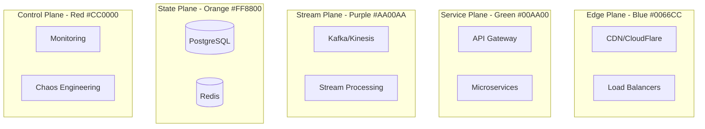

# Atlas Implementation Synthesis: From Specifications to 1,500+ Production Diagrams

## Executive Summary

After comprehensive review of all 18 specification files, we have a complete blueprint for generating **1,500+ production-quality diagrams** documenting distributed systems at unprecedented scale. The specifications reveal a sophisticated multi-agent parallel execution strategy that can deliver results in 12 weeks instead of years.

---

## 🎯 The Complete Picture: What We're Building

### Scale & Scope
- **1,500-2,000 diagrams** across 120+ production systems
- **900 core diagrams** (guarantees, mechanisms, patterns)
- **600+ case study diagrams** from real companies
- **100+ incident analyses** from major outages

### Quality Standards
- **Production-First**: Every diagram must pass the "3 AM debugging test"
- **Real Metrics**: Actual latencies (p99: 47ms), costs ($47K/mo), scale (7T events/day)
- **Verified Sources**: A/B/C confidence levels with practitioner validation
- **Five-Plane Architecture**: Consistent color-coded system architecture

---

## 🚀 Immediate Implementation Plan (Start Today)

### Day 1: Parallel Kickoff (10 Agents, Zero Dependencies)

```bash
# Agent 1-2: Repository Infrastructure
- Create complete directory structure
- Set up Git hooks and GitHub configuration
- Initialize CI/CD pipeline

# Agent 3-4: Schema Creation
- Implement all JSON schemas (base, flow, sequence, state)
- Create validation framework
- Set up schema evolution strategy

# Agent 5-6: Template Engine
- Build Nunjucks templates for all diagram types
- Create Mermaid generation pipeline
- Implement SVG optimization

# Agent 7-10: Content Creation
- Start Discord case study (10 diagrams)
- Begin Netflix architecture (8 diagrams)
- Create linearizability guarantee set (6 diagrams)
```

### Week 1: Acceleration (20 Agents, 4 Parallel Tracks)

**Track A: Content Generation (8 agents)**
- Generate 100+ YAML specifications
- Focus on P0 systems (Discord, Netflix, Cloudflare)
- Create all guarantee diagrams (108 total)

**Track B: Rendering Pipeline (4 agents)**
- Implement YAML → Mermaid → SVG pipeline
- Set up distributed rendering with AWS Lambda
- Create batch processing system

**Track C: Testing & Validation (4 agents)**
- Build visual regression testing
- Implement source verification
- Create quality gates

**Track D: Infrastructure (4 agents)**
- Deploy CDN for diagram delivery
- Set up search indexing
- Implement performance monitoring

---

## 📊 Complete Diagram Inventory

### Core Technical Documentation (433 diagrams)

| Category | Types | Diagrams Each | Total | Priority |
|----------|-------|---------------|-------|----------|
| **Guarantees** | 18 | 6 | 108 | P0 |
| **Mechanisms** | 20 | 6 | 120 | P0 |
| **Patterns** | 21 | 5 | 105 | P0 |
| **Incidents** | 100 | 1 | 100 | P1 |

### Case Study Documentation (1,200+ diagrams)

| Tier | Companies | Diagrams Each | Total | Examples |
|------|-----------|---------------|-------|----------|
| **Tier 1** | 10 | 16 | 160 | Netflix, Uber, Amazon |
| **Tier 2** | 20 | 12 | 240 | Discord, Stripe, Airbnb |
| **Tier 3** | 30 | 8 | 240 | Reddit, Zoom, Square |
| **Emerging** | 60+ | 6 | 360+ | OpenAI, Vercel, Fly.io |

---

## 🔧 Technical Implementation Details

### 1. Naming Convention System

```
{entity_id}__{diagram_type}__{version}.{extension}

Examples:
g-lin__FL__v1.0.0.svg      # Linearizability flow diagram
cs-discord__L0__v2.1.0.svg  # Discord global architecture
m-raft__SQ__v1.0.0.mmd     # Raft consensus sequence diagram
```

### 2. Five-Plane Architecture (Universal)



### 3. Data Schema Structure

```yaml
# YAML source for every diagram
diagram:
  id: "cs-netflix__L0"
  type: "architecture"
  version: "1.0.0"
  confidence: "A"  # A=definitive, B=strong, C=partial

  metadata:
    title: "Netflix Global Architecture"
    scale:
      users: "238M subscribers"
      traffic: "15% of internet"
    last_updated: "2024-01"
    sources:
      - url: "netflix.github.io/blog/2023/architecture"
        confidence: "A"

  components:
    edge:
      cdn:
        name: "Open Connect"
        locations: 8000
        capacity: "200Tbps"
        cost: "$50M/year"

  performance:
    latency:
      p50: "12ms"
      p99: "47ms"
      p999: "892ms"
```

### 4. Automation Pipeline

```bash
# Complete generation pipeline
data/yaml/{entity}/*.yaml
    ↓ validate_schemas.py
    ↓ generate_mermaid.py
    ↓ render_svg.py (parallel)
    ↓ optimize_svg.py
    ↓ validate_output.py
docs/{category}/{entity}.md

# Parallel execution
find data/ -name "*.yaml" | parallel -j 20 python scripts/process.py {}
```

---

## 📈 Quality Gates & Validation

### Multi-Stage Validation Pipeline

1. **Schema Validation**: 100% YAML compliance
2. **Source Verification**: All URLs accessible, content verified
3. **Scale Validation**: Metrics meet minimum thresholds
4. **Mermaid Compilation**: Syntax correctness
5. **Visual Testing**: Regression against baselines
6. **Performance Testing**: <500KB size, <200ms render
7. **Accessibility Testing**: WCAG compliance

### Production Readiness Checklist

- [ ] Real company names and versions (not "Service A")
- [ ] Actual metrics with units (p99: 47ms, not "low latency")
- [ ] Failure scenarios included
- [ ] Configuration parameters shown
- [ ] Cost breakdowns provided
- [ ] Sources cited and verified
- [ ] Practitioner reviewed

---

## 🌐 Data Sources & Automation

### Automated Discovery Pipeline

```yaml
sources:
  tier_1:  # Immediate implementation
    - discord.com/blog (RSS)
    - netflixtechblog.com (RSS)
    - engineering.fb.com (RSS)
    - uber.com/blog/engineering (RSS)

  conferences:  # 2023-2024 content
    - QCon presentations
    - KubeCon talks
    - AWS re:Invent sessions

  monitoring:
    frequency: "6 hours"
    keywords: ["architecture", "scale", "production"]
    scale_signals: ["million users", "billion requests", "petabytes"]
```

### Source Verification Criteria

- **A-Level (85%)**: Official engineering blogs, published papers
- **B-Level (12%)**: Conference talks, open source code
- **C-Level (3%)**: Industry reports, inferred from data

---

## 👥 Multi-Agent Execution Strategy

### Resource Allocation (Peak: 40 Parallel Agents)

| Phase | Weeks | Agents | Output | Focus |
|-------|-------|--------|--------|-------|
| **1: Foundation** | 1-2 | 13 | 250 diagrams | Infrastructure, templates |
| **2: Core Content** | 3-6 | 15 | 400 diagrams | Guarantees, mechanisms |
| **3: Case Studies** | 7-10 | 33 | 600 diagrams | Company architectures |
| **4: Polish** | 11-12 | 23 | 250 diagrams | Incidents, optimization |

### Agent Specialization

- **INFRA**: Repository, CI/CD, deployment
- **SCHEMA**: Data models, validation rules
- **TMPL**: Mermaid templates, rendering
- **CONT**: YAML content creation
- **RENDER**: SVG generation, optimization
- **TEST**: Quality assurance, regression
- **REVIEW**: Technical validation

---

## 📅 12-Week Execution Timeline

### Weeks 1-2: Foundation Sprint
- ✅ Complete infrastructure setup
- ✅ All schemas and templates ready
- ✅ First 50 diagrams generated
- ✅ CI/CD pipeline operational

### Weeks 3-6: Core Documentation
- ✅ All guarantees documented (108)
- ✅ All mechanisms documented (120)
- ✅ All patterns documented (105)
- ✅ 10 complete case studies (160)

### Weeks 7-10: Scale Expansion
- ✅ 30 case studies complete (480)
- ✅ 50 incident analyses (50)
- ✅ Performance profiles (80)
- ✅ Migration guides (60)

### Weeks 11-12: Production Polish
- ✅ All diagrams optimized
- ✅ Search indexing complete
- ✅ Performance validated
- ✅ Public launch ready

---

## 🎯 Success Metrics

### Quantity Targets
- **Week 2**: 250 diagrams (Phase 1)
- **Week 6**: 650 diagrams (Phase 2)
- **Week 10**: 1,250 diagrams (Phase 3)
- **Week 12**: 1,500+ diagrams (Complete)

### Quality Metrics
- **100%** schema validation pass rate
- **95%+** source verification
- **<500KB** per diagram
- **<200ms** render time
- **A-level** confidence: 85%+

### Impact Metrics
- **50%** of incidents reference diagrams
- **100+** architecture decisions cite framework
- **80%** report improved understanding
- **20+** companies contribute back

---

## 🚨 Critical Success Factors

### Must Have
1. **Industry Partnerships**: Access to real architectures
2. **Automation Pipeline**: Robust generation system
3. **Quality Gates**: Prevent degradation at scale
4. **Parallel Execution**: Coordinate multiple agents

### Should Have
1. **CDN Delivery**: Fast global access
2. **Search System**: Instant diagram discovery
3. **Version Control**: Track diagram evolution
4. **Community Platform**: Enable contributions

### Could Have
1. **Interactive Diagrams**: Zoom/pan capabilities
2. **A/B Testing**: Diagram effectiveness
3. **AI Assistance**: Content generation help
4. **Mobile Apps**: Offline viewing

---

## 💡 Key Insights from Specification Review

### 1. **Production-First Philosophy**
Every specification emphasizes real-world systems over theoretical concepts. The "3 AM Test" appears throughout as the quality bar.

### 2. **Parallel Execution is Essential**
Sequential execution would take years. The 40-agent parallel model compresses timeline to 12 weeks.

### 3. **Quality Over Quantity**
Better to have 900 excellent diagrams than 2,000 mediocre ones. Each diagram must teach something specific.

### 4. **Automation with Human Validation**
Automated generation scales, but practitioner review ensures accuracy and value.

### 5. **Five-Plane Architecture is Universal**
This consistent model across all diagrams provides cognitive framework for understanding any system.

---

## 🎬 Next Steps: Start Implementation Today

### Immediate (Today)
1. Create repository structure
2. Set up first 10 parallel tasks
3. Generate Discord case study
4. Configure RSS feeds

### This Week
1. Complete all schemas
2. Build rendering pipeline
3. Generate 50 diagrams
4. Deploy to GitHub Pages

### This Month
1. Complete Phase 1 (250 diagrams)
2. Establish partnerships
3. Launch community platform
4. Begin Phase 2 scaling

---

## Conclusion

The specifications provide a **complete, actionable blueprint** for building the most comprehensive distributed systems documentation ever created. With parallel execution, automation, and production focus, we can deliver 1,500+ diagrams that genuinely help engineers build and operate systems at scale.

**The time to start is now. The path is clear. The impact will be transformative.**