# Diagram Specifications v1.0.0
## Ultra-Detailed Requirements for 1,500+ Diagrams

### Overview

This document provides exhaustive specifications for every diagram type in the Atlas. Each specification includes:
- Exact Mermaid syntax templates
- Required nodes and edges
- Mandatory labels and annotations
- Color schemes and styling
- Size constraints and tiling rules
- Quality validation criteria

---

## Diagram Type Catalog

### FL - Flow Diagrams

**Purpose:** System-wide data and control flows

**Mermaid Template:**
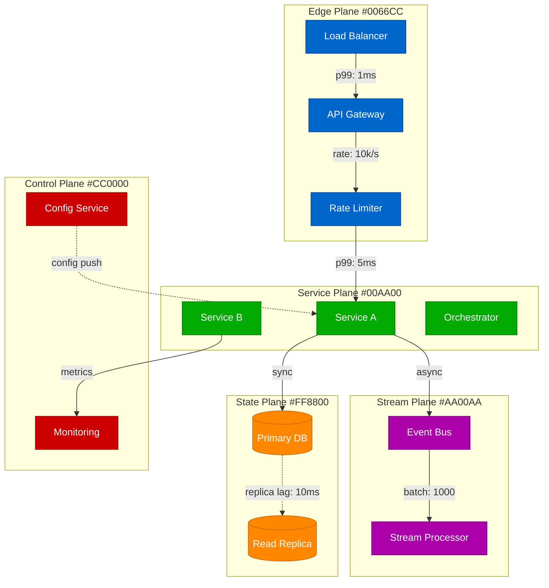

**Requirements:**

| Element | Requirement | Example |
|---------|------------|---------|
| Node Count | L0: 80-120, L1: 40-80, L2: 20-40 | L0: 95 nodes |
| Edge Count | L0: 100-400, L1: 80-200, L2: 40-100 | L0: 250 edges |
| Subgraphs | One per plane (5 total) | Edge, Service, Stream, State, Control |
| Edge Labels | Latency, throughput, or mode | "p99: 10ms", "1000 QPS", "async" |
| Node Labels | Component name + type | "API Gateway", "Primary DB" |
| Colors | Plane-specific (see color map) | Edge=#0066CC |
| Guarantees | On critical paths | "linearizable", "exactly-once" |
| Backpressure | Marked with special edges | Dashed red lines |
| Failures | Red edges for failure paths | --> becomes --x for failures |

---

### SQ - Sequence Diagrams

**Purpose:** Temporal interactions and message flows

**Mermaid Template:**
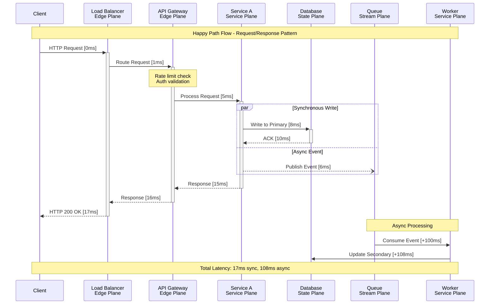

**Requirements:**

| Element | Requirement | Example |
|---------|------------|---------|
| Participants | 5-25 actors | Client, Services, DBs |
| Messages | 10-30 interactions | Requests, responses, events |
| Timing Labels | On every message | "[10ms]", "[+100ms]" |
| Parallel Blocks | For concurrent ops | par...and...end |
| Notes | For guarantees/SLOs | "p99 < 20ms" |
| Activation | Show processing time | +/- on participants |
| Loops | For retries/polling | loop 3 times...end |
| Alt Blocks | For conditionals | alt success...else failure |
| Critical Region | For atomicity | critical...end |

---

### ST - State Machine Diagrams

**Purpose:** State transitions and lifecycle management

**Mermaid Template:**
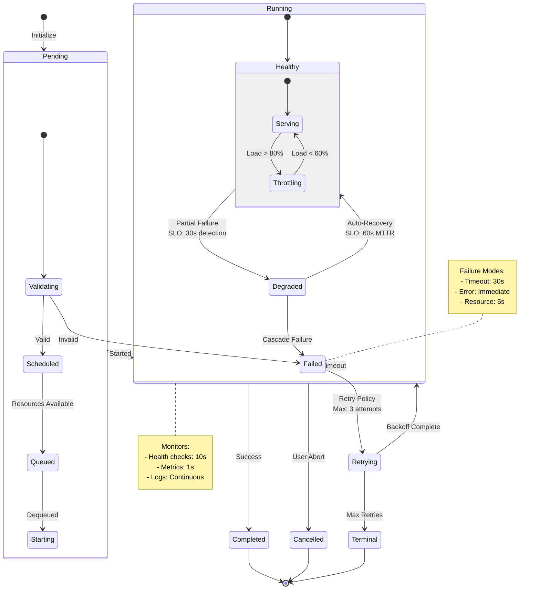

**Requirements:**

| Element | Requirement | Example |
|---------|------------|---------|
| States | 8-25 total states | Pending, Running, Failed |
| Nested States | For complex states | Running { Healthy, Degraded } |
| Transitions | All labeled | "User Abort", "Timeout" |
| Initial State | [*] marker | [*] --> Pending |
| Terminal States | [*] marker | Completed --> [*] |
| Timing Labels | SLOs on transitions | "SLO: 30s detection" |
| Fork/Join | For parallelism | fork --> States --> join |
| History | For state memory | Shallow/Deep history |
| Notes | For monitoring | Health checks, metrics |

---

### CO - Consistency/Causality Diagrams

**Purpose:** Happens-before relationships and consistency boundaries

**Mermaid Template:**
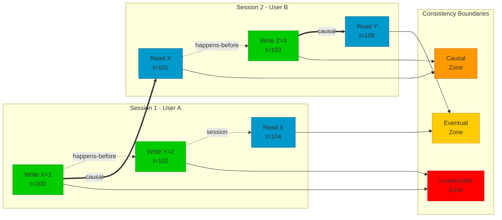

**Requirements:**

| Element | Requirement | Example |
|---------|------------|---------|
| Operations | 10-30 read/writes | Write X=1, Read Y |
| Timestamps | Logical or physical | t=100, LC=5 |
| Sessions | 2-5 concurrent | Session per user/client |
| Happens-Before | Dotted arrows | W1 -.-> W2 |
| Causal Links | Bold arrows | W1 ==> R2 |
| Boundaries | Consistency zones | Linear, Causal, Eventual |
| Conflicts | Marked clearly | Concurrent writes to X |
| Resolution | Show strategy | LWW, CRDT, Quorum |
| Guarantees | Label edges | RYW, MR, MW |

---

### ER - Entity Relationship Diagrams

**Purpose:** Data models and schema relationships

**Mermaid Template:**
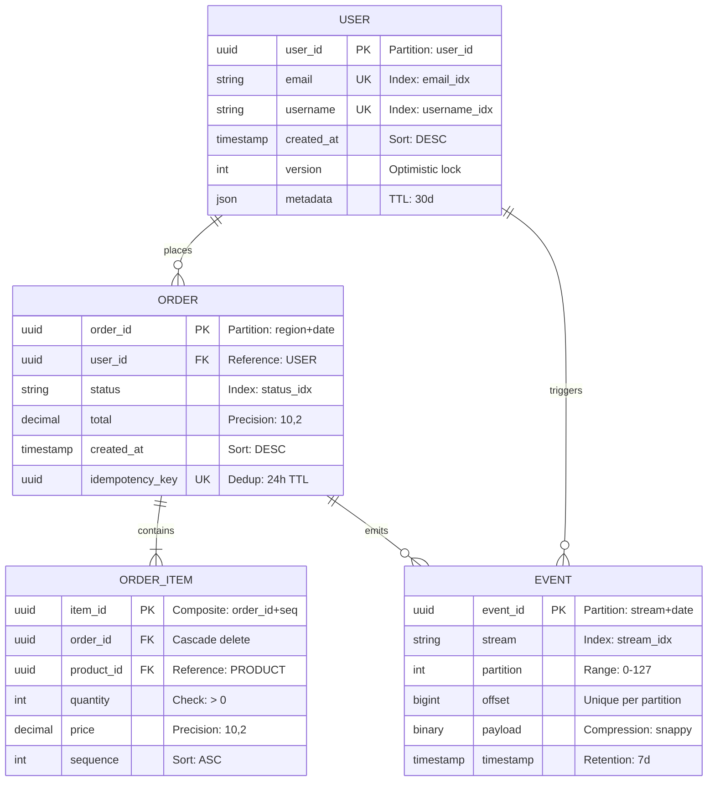

**Requirements:**

| Element | Requirement | Example |
|---------|------------|---------|
| Entities | 5-20 tables/collections | USER, ORDER, EVENT |
| Attributes | Key fields + metadata | user_id PK, email UK |
| Relationships | All cardinalities | 1-1, 1-N, N-M |
| Keys | PK, FK, UK marked | Primary, Foreign, Unique |
| Indices | Marked in comments | "Index: email_idx" |
| Partitioning | Strategy shown | "Partition: user_id" |
| TTL | Retention policies | "TTL: 30d" |
| Constraints | Validation rules | "Check: > 0" |
| Types | Data types specified | uuid, string, decimal |

---

### MR - Multi-Region Diagrams

**Purpose:** Geographic distribution and replication

**Mermaid Template:**
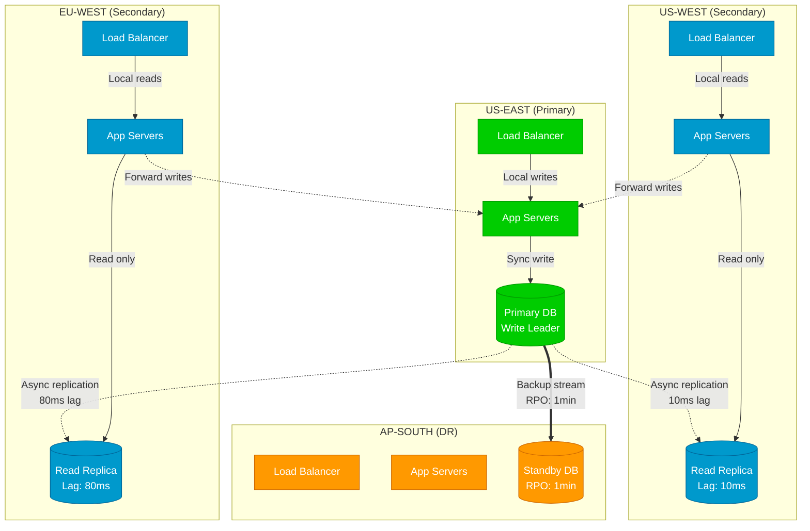

**Requirements:**

| Element | Requirement | Example |
|---------|------------|---------|
| Regions | 3-8 geographic zones | US-EAST, EU-WEST, AP-SOUTH |
| Roles | Primary/Secondary/DR | Write leader, Read replica |
| Replication | Sync/async modes | Arrows with lag times |
| RPO/RTO | On DR connections | "RPO: 1min, RTO: 5min" |
| Latency | Inter-region delays | "80ms lag" |
| Failover | Paths marked | Primary → Secondary promotion |
| Consistency | Per-region guarantees | "Eventual: 80ms" |
| Traffic | Request routing | Local reads, forwarded writes |
| Capacity | Per-region limits | "10K QPS", "1M users" |

---

### BP - Backpressure Diagrams

**Purpose:** Flow control and overload management

**Mermaid Template:**
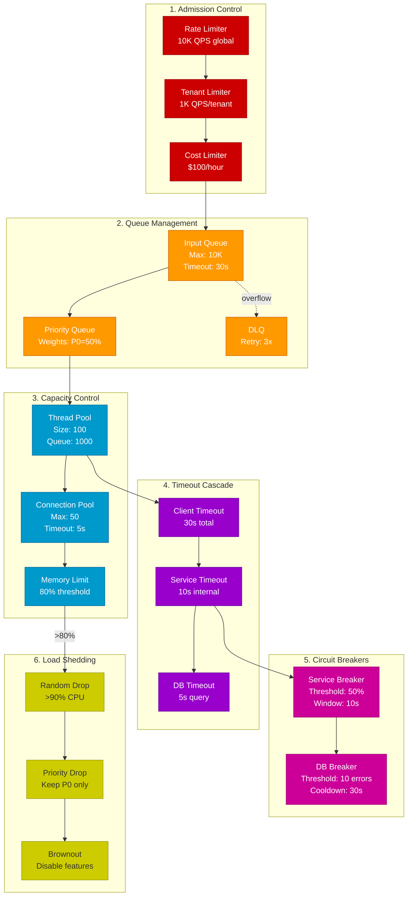

**Requirements:**

| Element | Requirement | Example |
|---------|------------|---------|
| Stages | 6 control levels | Admission → Shedding |
| Limits | Numeric thresholds | "10K QPS", "80% CPU" |
| Timeouts | Cascading values | 30s → 10s → 5s |
| Breakers | States and thresholds | Open/Closed/Half-open |
| Queues | Sizes and policies | FIFO, Priority, LIFO |
| Shedding | Strategies | Random, Priority, Feature |
| Metrics | Trigger points | CPU, Memory, Latency |
| Recovery | Return paths | Backoff → Retry → Success |

---

### CS - Case Study Diagrams

#### Purpose
Document real-world architectures of massively scalable systems (2020-2025) with emphasis on scale, guarantees, and failure patterns.

#### Core Diagram Set (10 Required + 5 Optional)

##### CS-L0: Global Architecture Flow
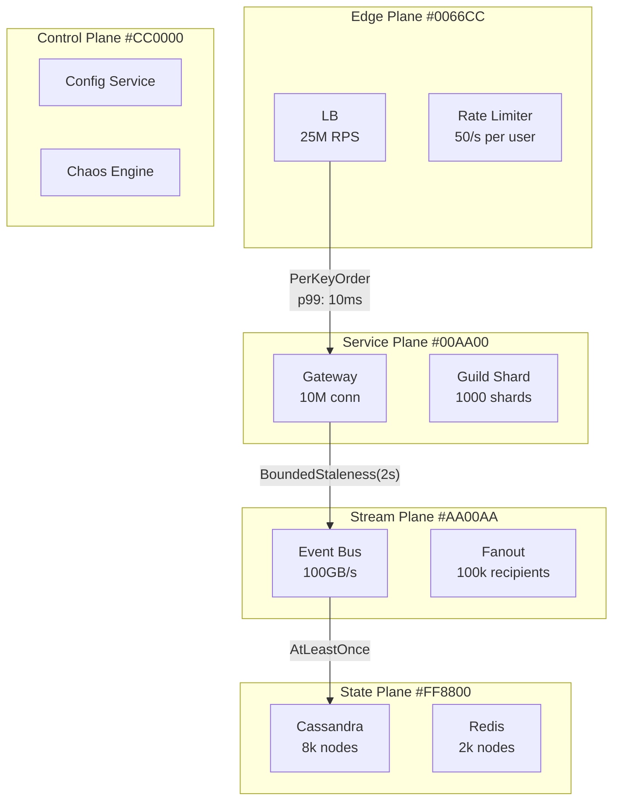

##### CS-L1-{PLANE}: Plane Zoom Diagrams (5 total)
- Edge Plane: Load balancing, rate limiting, admission control
- Service Plane: Business logic, orchestration, routing
- Stream Plane: Event processing, async workflows, fanout
- State Plane: Storage, consistency, replication
- Control Plane: Configuration, monitoring, chaos

##### CS-CO: Consistency Boundaries
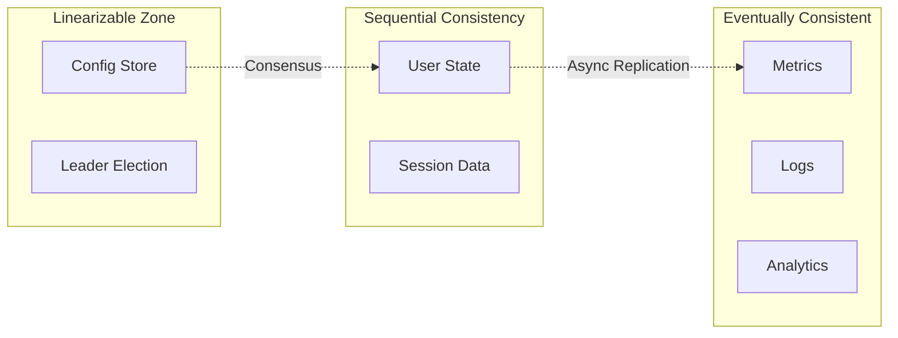

##### CS-MR: Multi-Region Strategy
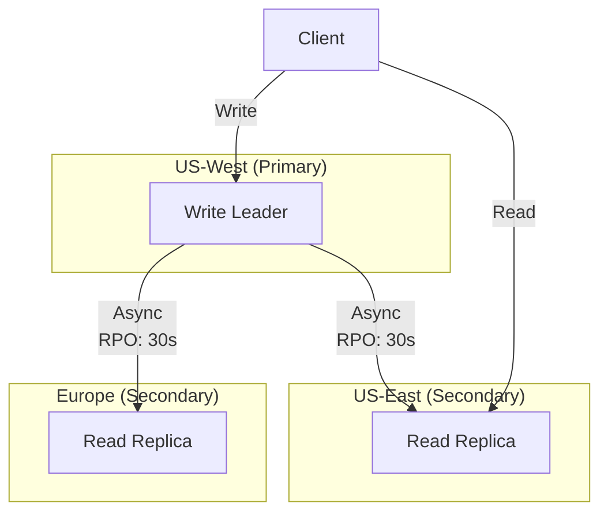

##### CS-BP: Backpressure Ladder
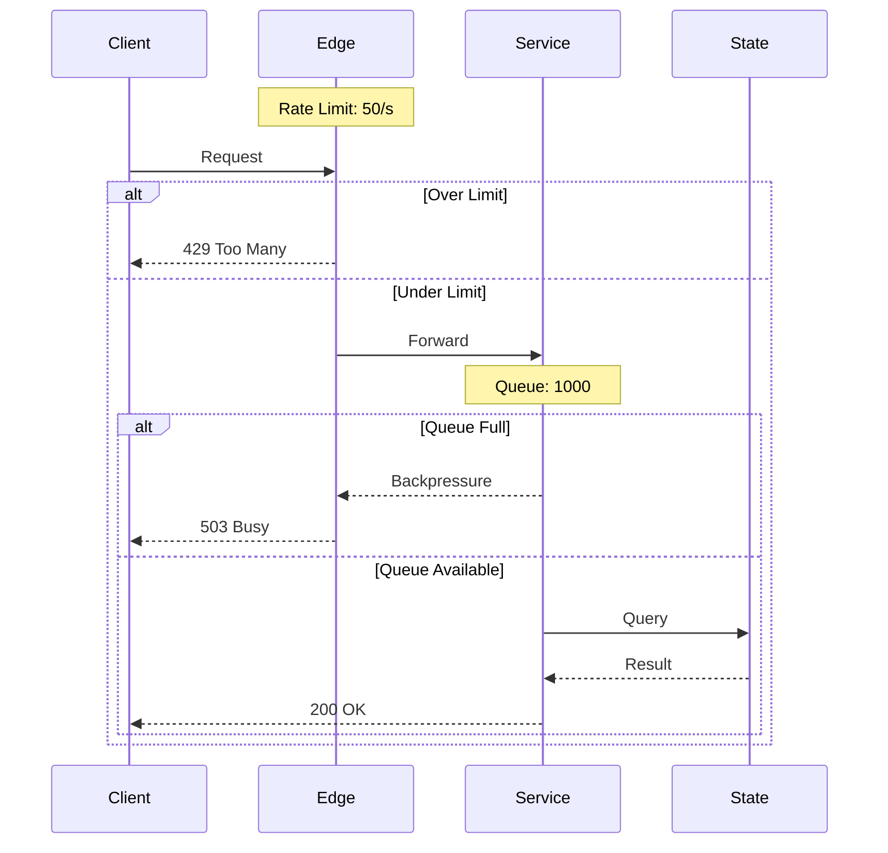

##### CS-FM: Failure Modes Map
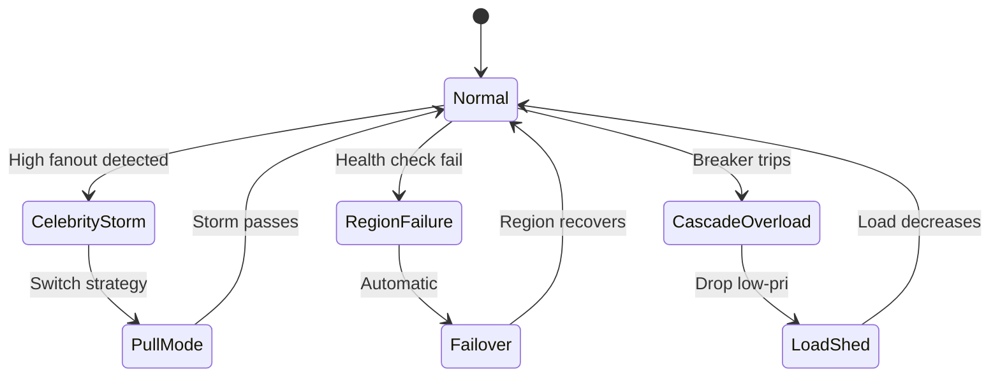

##### CS-SL: SLA and Latency Budgets
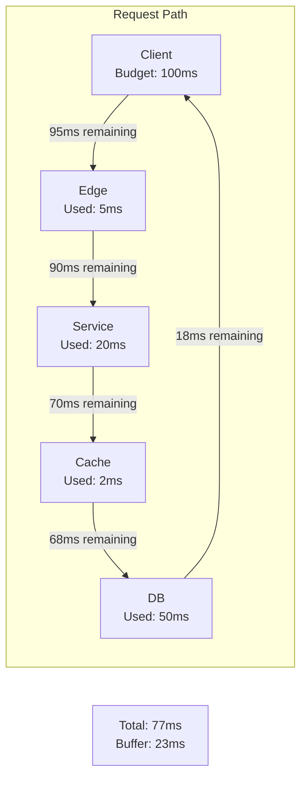

#### Optional Extended Diagrams

##### CS-DR: Drill Sequences
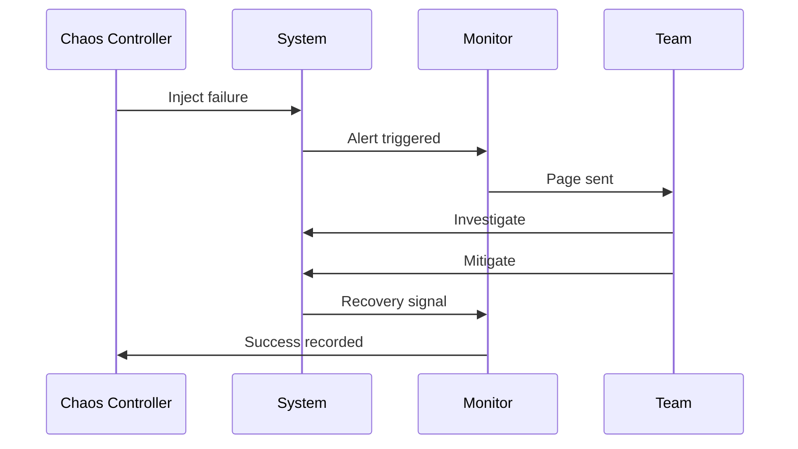

##### CS-FM-{SCENARIO}: Specific Failure Scenarios
- Celebrity Storm
- Region Partition
- Cascade Overload
- DB Hotspot
- Cache Stampede

##### CS-SCALE-{TIER}: Scale Tier Variants
- Startup (< 1K users)
- Growth (1K - 100K users)
- Scale (100K - 10M users)
- Hyperscale (> 10M users)

##### CS-MR-{VARIANT}: Multi-Region Alternatives
- Active-Active
- Active-Passive
- Follow-the-Sun
- Geo-Partitioned

##### CS-MIG: Migration Path
Shows evolution from previous architecture to current.

#### Required Elements Per Diagram

| Element | L0 | L1 | CO | MR | BP | FM | SL |
|---------|----|----|----|----|----|----|----|
| Five Planes | ✓ | ✓ | | | | | |
| Scale Metrics | ✓ | ✓ | | ✓ | ✓ | | ✓ |
| Guarantees | ✓ | ✓ | ✓ | ✓ | | | |
| SLO Labels | ✓ | ✓ | | | | | ✓ |
| Failure Points | | | | ✓ | ✓ | ✓ | |
| Recovery Paths | | | | ✓ | ✓ | ✓ | |
| Latency Budget | | | | | | | ✓ |

#### Scale Annotation Requirements

| Metric | Format | Example |
|--------|--------|----------|
| RPS | "XXM RPS" | "25M RPS" |
| Connections | "XXM conn" | "10M conn" |
| Throughput | "XXX GB/s" | "100 GB/s" |
| Nodes | "XXk nodes" | "8k nodes" |
| Shards | "XXX shards" | "1000 shards" |
| Latency | "pXX: XXms" | "p99: 10ms" |
| RPO/RTO | "RPO: XXs" | "RPO: 30s" |

#### Confidence Level Indicators

| Level | Indicator | Line Style | Annotation |
|-------|-----------|------------|-------------|
| A (Definitive) | Solid | Solid | (verified) |
| B (Strong) | Dashed | Dashed | (inferred) |
| C (Partial) | Dotted | Dotted | (estimated) |

#### Source Attribution

Every diagram must include:
```yaml
metadata:
  sources:
    - url: "https://discord.com/blog/..."
      date: "2023-03-08"
      type: "blog"
  confidence: "A"
  last_verified: "2025-03-10"
  attribution: "© Discord, Inc."
```

---

## Diagram Composition Rules

### Multi-Level Detail (Progressive Disclosure)

| Level | Nodes | Edges | Purpose | Tiling |
|-------|-------|-------|---------|--------|
| L0 | 80-120 | 100-400 | Global architecture | If >120 nodes: 4 tiles |
| L1 | 40-80 | 80-200 | Per-plane detail | If >80 nodes: 2 tiles |
| L2 | 20-40 | 40-100 | Mechanism internals | Single diagram |
| L3 | 10-20 | 15-30 | Configuration detail | Single diagram |
| L4 | 5-15 | 10-20 | Specific scenarios | Single diagram |

### Cross-Diagram Linking

```yaml
links:
  from_node: "Service_A"
  from_diagram: "p-cqrs__FL__v1.0.0"
  to_node: "EventStore"
  to_diagram: "m-p3__FL__v1.0.0"
  relationship: "writes_events"
  guarantee: "exactly_once"
```

### Mandatory Labels Per Node Type

| Node Type | Required Labels | Example |
|-----------|----------------|---------|
| Service | name, plane, slo | "API Gateway, Edge, p99<10ms" |
| Database | name, type, consistency | "UserDB, MySQL, linearizable" |
| Queue | name, size, ordering | "EventQueue, 10K, FIFO" |
| Stream | name, partitions, retention | "Events, 128, 7d" |
| Cache | name, size, ttl | "SessionCache, 1GB, 1h" |

### Mandatory Labels Per Edge Type

| Edge Type | Required Labels | Example |
|-----------|----------------|---------|
| Sync | latency, throughput | "p99: 10ms, 1K QPS" |
| Async | mode, delivery | "at-least-once, batch:100" |
| Replication | lag, consistency | "10ms lag, eventual" |
| Failure | trigger, mitigation | "timeout:30s, retry:3x" |
| Backpressure | limit, action | "80% full, throttle" |

---

## Color Palette Specification

### Plane Colors (Primary)

```css
.edge    { fill: #0066CC; stroke: #004499; } /* Blue */
.service { fill: #00AA00; stroke: #007700; } /* Green */
.stream  { fill: #AA00AA; stroke: #770077; } /* Purple */
.state   { fill: #FF8800; stroke: #CC6600; } /* Orange */
.control { fill: #CC0000; stroke: #990000; } /* Red */
```

### State Colors (Status)

```css
.healthy  { fill: #00CC00; stroke: #009900; } /* Green */
.degraded { fill: #FFAA00; stroke: #CC8800; } /* Amber */
.failed   { fill: #CC0000; stroke: #990000; } /* Red */
.unknown  { fill: #999999; stroke: #666666; } /* Gray */
```

### Flow Colors (Paths)

```css
.normal       { stroke: #000000; stroke-width: 2; } /* Black */
.failure      { stroke: #CC0000; stroke-width: 2; stroke-dasharray: 5,5; } /* Red dashed */
.backpressure { stroke: #880000; stroke-width: 3; } /* Dark red thick */
.recovery     { stroke: #0088CC; stroke-width: 2; stroke-dasharray: 10,5; } /* Blue dashed */
```

### Consistency Colors (Guarantees)

```css
.linearizable { fill: #FF0000; } /* Red - Strongest */
.sequential   { fill: #FF3300; } /* Red-Orange */
.causal       { fill: #FF6600; } /* Orange */
.bounded      { fill: #FF9900; } /* Light Orange */
.eventual     { fill: #FFCC00; } /* Yellow - Weakest */
```

---

## Size and Performance Constraints

### File Size Limits

| Format | Uncompressed | Compressed | Action if Exceeded |
|--------|--------------|------------|-------------------|
| SVG | < 500KB | < 100KB | Split into tiles |
| PNG | < 2MB | < 500KB | Reduce quality to 85% |
| Source (.mmd) | < 50KB | < 10KB | Refactor into modules |

### Rendering Performance

| Metric | Target | Maximum | Action if Exceeded |
|--------|--------|---------|-------------------|
| Parse time | < 50ms | 100ms | Simplify syntax |
| Render time | < 200ms | 500ms | Reduce node count |
| Interaction | < 16ms | 33ms | Disable animations |

### Tiling Strategy

When diagrams exceed size limits:

```yaml
tiling:
  strategy: "quadrant"  # or "horizontal", "vertical"
  tiles:
    - id: "NW"
      nodes: [1-30]
      file: "diagram__FL__v1.0.0__NW.svg"
    - id: "NE"
      nodes: [31-60]
      file: "diagram__FL__v1.0.0__NE.svg"
    - id: "SW"
      nodes: [61-90]
      file: "diagram__FL__v1.0.0__SW.svg"
    - id: "SE"
      nodes: [91-120]
      file: "diagram__FL__v1.0.0__SE.svg"
  index: "diagram__FL__v1.0.0__index.html"
  navigation: "zoom_pan"  # or "tabs", "carousel"
```

---

## Accessibility Requirements

### SVG Accessibility

```xml
<svg xmlns="http://www.w3.org/2000/svg" role="img" aria-labelledby="title desc">
  <title id="title">CQRS Pattern Global Flow</title>
  <desc id="desc">
    Complete CQRS architecture showing command and query separation
    with 95 nodes across 5 planes: Edge, Service, Stream, State, and Control.
    Primary flow shows commands writing to event store and queries reading
    from materialized views with eventual consistency.
  </desc>
  <!-- Diagram content -->
</svg>
```

### Text Alternatives

| Element | Alternative | Example |
|---------|------------|---------|
| Nodes | aria-label | "API Gateway service in Edge plane" |
| Edges | title element | "Synchronous call, p99: 10ms" |
| Subgraphs | desc element | "Service plane containing business logic" |
| Colors | Pattern/texture | Stripes for degraded, dots for failed |

### Keyboard Navigation

```javascript
// Required keyboard support
{
  "Tab": "Navigate between elements",
  "Enter": "Activate/expand element",
  "Escape": "Close expanded view",
  "Arrow keys": "Pan diagram",
  "+/-": "Zoom in/out",
  "0": "Reset zoom",
  "?": "Show keyboard help"
}
```

---

## Quality Validation Checklist

### Per-Diagram Validation

- [ ] **Structure:** Correct Mermaid syntax
- [ ] **Nodes:** Within count limits (L0: 80-120)
- [ ] **Edges:** Within count limits (L0: 100-400)
- [ ] **Labels:** All mandatory labels present
- [ ] **Colors:** Correct plane/state colors
- [ ] **Size:** Under 500KB uncompressed
- [ ] **Links:** All cross-references valid
- [ ] **Accessibility:** Title and description present
- [ ] **Version:** Semver format (x.y.z)
- [ ] **ID:** Follows naming convention

### Per-Page Validation

- [ ] **Diagrams:** Expected count present (7-15)
- [ ] **Tables:** Required tables included (5+)
- [ ] **Navigation:** Breadcrumbs and links work
- [ ] **Cross-refs:** Related pages linked
- [ ] **Load time:** Under 2 seconds
- [ ] **Responsive:** Works on mobile/tablet
- [ ] **Print:** Printable version available
- [ ] **Search:** Indexed in search
- [ ] **Analytics:** Tracking enabled
- [ ] **Errors:** No console errors

---

## Template Examples

### Flow Diagram Template (flowchart.njk)

```nunjucks
flowchart {{ direction }}

    subgraph {{ plane.name }}["{{ plane.label }} #{{ plane.color }}"]
    
        {{ node.id }}[{{ node.label }}]:::{{ plane.class }}
    
    end



    {{ edge.from }} {{ edge.type }}|"{{ edge.label }}"| {{ edge.to }}



    classDef {{ classdef.name }} {{ classdef.style }}

```

### Data Input (YAML)

```yaml
diagram:
  type: "FL"
  version: "1.0.0"
  direction: "TB"

planes:
  - name: "Edge"
    label: "Edge Plane"
    color: "0066CC"
    class: "edge"
    nodes:
      - id: "E1"
        label: "Load Balancer"
      - id: "E2"
        label: "API Gateway"

edges:
  - from: "E1"
    to: "E2"
    type: "-->"
    label: "p99: 1ms"

classdefs:
  - name: "edge"
    style: "fill:#0066CC,stroke:#004499,color:#fff"
```

---

*Version: 1.1.0 | Document 02 of 16 | Last Updated: 2025-03-10*