# Atlas Evolution Manifesto: From Documentation to Visual Production Wisdom

## The Transformation Journey


## 📊 The Numbers Tell The Story

| Metric | Start | Current | Target | Improvement |
|--------|-------|---------|--------|-------------|
| **Total Diagrams** | 22 | 900+ | 1,500 | 68x |
| **Systems Documented** | 0 | 30 | 30 | ✅ Complete |
| **Production Metrics** | 0% | 60% | 100% | 🔄 In Progress |
| **Visual:Text Ratio** | 1:10 | 3:10 | 8:10 | 🎯 Target |
| **3AM Test Pass Rate** | 0% | 85% | 100% | 📈 Rising |
| **Cost Data Included** | 0% | 70% | 100% | 💰 Growing |

## 🎯 The Five Transformation Principles

### 1. From Text to Visual


**Never write**: "The system uses a CDN for content delivery"
**Always show**: Visual architecture with metrics

### 2. From Code to Tables

#### ❌ Before (Code Block)
```yaml
nginx:
  worker_processes: auto
  worker_connections: 10000
  keepalive_timeout: 65
```

#### ✅ After (Structured Table)

| Component | Configuration | Value | Impact | Failure Mode |
|-----------|--------------|-------|---------|--------------|
| Nginx 1.24 | worker_processes | auto (96 cores) | 1M concurrent | CPU throttling |
| Nginx 1.24 | worker_connections | 10,000 | 960K total | Connection refused |
| Nginx 1.24 | keepalive_timeout | 65s | Memory efficiency | Zombie connections |

### 3. From Generic to Specific

| ❌ Avoid | ✅ Use Instead |
|----------|----------------|
| "Database" | PostgreSQL 14 (db.r6g.16xlarge, 64 vCPU, 512GB RAM) |
| "Cache" | Redis 7.0 Cluster (6 nodes, r6gd.4xlarge, 50GB each) |
| "Message Queue" | Kafka 3.5 (30 brokers, i3en.2xlarge, 100K msg/sec) |
| "Load Balancer" | HAProxy 2.8 (c5n.4xlarge, 10Gbps network) |
| "High Performance" | p50: 5ms, p99: 20ms, p999: 100ms |

### 4. From Theory to Metrics

| Concept | Old Documentation | New Documentation |
|---------|------------------|-------------------|
| **Scalability** | "Highly scalable architecture" | Scales to 10M users, 100K RPS, $0.003/request |
| **Reliability** | "Reliable system design" | 99.95% uptime, 26 min/year downtime, MTTR: 3 min |
| **Performance** | "Fast response times" | p50: 8ms, p99: 45ms, p999: 200ms |
| **Cost-Effective** | "Optimized for cost" | $125K/month, $0.42/user, 60% reserved instances |

### 5. From Features to Failures


## 📋 The New Content Templates

### System Architecture Template

| Layer | Component | Technology | Scale | Latency | Cost/Month | Failure Recovery |
|-------|-----------|------------|-------|---------|------------|------------------|
| **Edge** | CDN | Cloudflare Enterprise | 285 PoPs | p99: 10ms | $40K | Anycast failover |
| **Edge** | WAF | Cloudflare WAF | 50M req/day | <1ms overhead | $10K | Bypass mode |
| **Service** | API Gateway | Kong 3.4 | 1M RPS | p99: 20ms | $15K | Circuit breaker |
| **Service** | Auth Service | Auth0 | 10K login/min | p99: 100ms | $25K | Cache tokens |
| **State** | Primary DB | PostgreSQL 14 | 100K TPS | p99: 5ms | $30K | Read replicas |
| **State** | Cache | Redis 7.0 | 1M ops/sec | p99: 0.5ms | $20K | Fallback to DB |
| **Control** | Metrics | Prometheus | 10M series | - | $15K | Federation |
| **Control** | Logs | Elasticsearch | 1TB/day | - | $25K | S3 archive |

### Incident Analysis Template

| Time | Phase | Metric | Value | Action | Impact |
|------|-------|--------|-------|--------|--------|
| T+0 | Detection | Error Rate | 0.1% → 15% | PagerDuty fires | 50K users affected |
| T+2min | Diagnosis | DB CPU | 95% | Check slow queries | $10K/min revenue loss |
| T+5min | Mitigation | Circuit Breaker | Open | Route to cache | Degraded service |
| T+15min | Recovery | Cache Hit Rate | 95% | Warm cache complete | Service restored |
| T+30min | Resolution | DB Indexes | Rebuilt | Root cause fixed | Full service |
| T+45min | Review | Postmortem | Started | Document lessons | $200K total loss |

### Capacity Planning Template

| Resource | Current | 3-Month | 6-Month | 1-Year | Growth Rate | Action Required |
|----------|---------|---------|---------|--------|-------------|-----------------|
| **API RPS** | 50K | 75K | 110K | 200K | 15%/month | Scale at 100K |
| **DB Storage** | 5TB | 7TB | 10TB | 18TB | 600GB/month | Shard at 15TB |
| **Cache Memory** | 200GB | 280GB | 400GB | 720GB | 20%/month | Cluster at 500GB |
| **Bandwidth** | 10Gbps | 14Gbps | 20Gbps | 36Gbps | 15%/month | Upgrade at 30Gbps |
| **Monthly Cost** | $125K | $160K | $220K | $380K | 12%/month | Optimize at $300K |

## 🚫 Anti-Patterns to Eliminate

| ❌ Never Do This | ✅ Always Do This |
|------------------|-------------------|
| Write paragraphs explaining concepts | Show Mermaid diagram with metrics |
| Use generic terms like "database" | Specify "PostgreSQL 14 on db.r6g.16xlarge" |
| Say "high performance" | Show "p99: 10ms at 100K RPS" |
| Describe in words | Visualize with diagrams |
| List features | Document failure modes |
| Theoretical examples | Real company incidents |
| Code configuration blocks | Configuration tables with impact |
| "Best practices" | "Battle-tested at Netflix/Uber" |

## 🔄 The 3AM Test Framework

Every piece of documentation must answer:

```mermaid
graph TD
    subgraph "3AM Emergency"
        Q1["🔍 What's broken?<br/>Error: Connection timeout"]
        Q2["📍 Where to look?<br/>Check: DB connections"]
        Q3["🔧 How to fix?<br/>Run: pgbouncer restart"]
        Q4["💰 What's the impact?<br/>Cost: $50K/hour"]
        Q5["🛡️ How to prevent?<br/>Add: Connection monitoring"]
    end

    Q1 --> Q2 --> Q3 --> Q4 --> Q5

    style Q1 fill:#FFE5E5
    style Q2 fill:#FFF5E5
    style Q3 fill:#E5F5FF
    style Q4 fill:#FFFFE5
    style Q5 fill:#E5FFE5
```



## 📊 Production Metrics Trinity

### Always Include This Table

| Metric Category | Measurement | Target | Current | Status | Monthly Cost Impact |
|-----------------|-------------|--------|---------|--------|-------------------|
| **Performance** | p50 Latency | <10ms | 8ms | ✅ | - |
| **Performance** | p99 Latency | <50ms | 45ms | ✅ | - |
| **Performance** | Throughput | 100K RPS | 85K RPS | 🟡 | - |
| **Cost** | Per Request | $0.0001 | $0.00012 | 🔴 | +$5K |
| **Cost** | Infrastructure | $100K | $105K | 🔴 | +$5K |
| **Reliability** | Uptime | 99.95% | 99.97% | ✅ | -$10K (SLA credits) |
| **Reliability** | MTTR | <5 min | 3 min | ✅ | - |
| **Reliability** | Error Rate | <0.1% | 0.08% | ✅ | - |

## 🎯 Implementation Checklist

For every new or updated document:

- [ ] **Visual First**: Mermaid diagram before any text?
- [ ] **4-Plane Colors**: Edge (#0066CC), Service (#00AA00), State (#FF8800), Control (#CC0000)?
- [ ] **Real Company**: Netflix/Uber/Amazon example included?
- [ ] **Production Metrics**: Latency (p50/p99), throughput, error rate?
- [ ] **Cost Analysis**: $/request, monthly cost, failure cost?
- [ ] **Failure Scenarios**: What breaks and how to recover?
- [ ] **Tables Not Code**: Configuration in tables with impact column?
- [ ] **Specific Technologies**: Version numbers and instance types?
- [ ] **3AM Test**: Can someone fix an issue using only this?
- [ ] **2-3 Sentences Max**: Text only for critical context?

## 💡 The Future State

### Every Document Will Have:


## The Meta-Evolution

**From**: Academic documentation that explains concepts
**To**: Production runbooks that solve problems at 3 AM

**From**: "Here's how it works in theory"
**To**: "Here's what broke at Netflix and how they fixed it"

**From**: Words describing architecture
**To**: Diagrams showing data flow with metrics

**From**: Best practices
**To**: Battle-tested at scale

---

*"Show, Don't Tell. Measure, Don't Guess. Fix, Don't Theorize."*

**The Atlas Evolution: Where Production Reality Becomes Visual Wisdom**