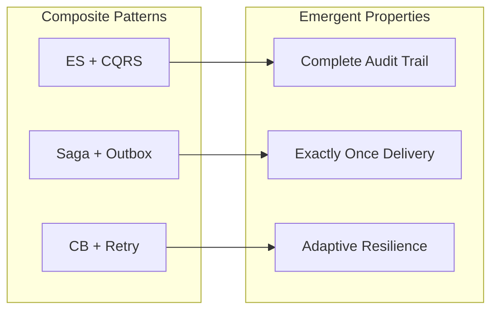
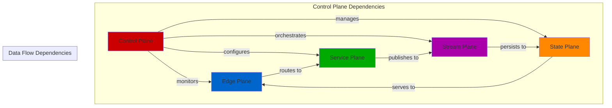
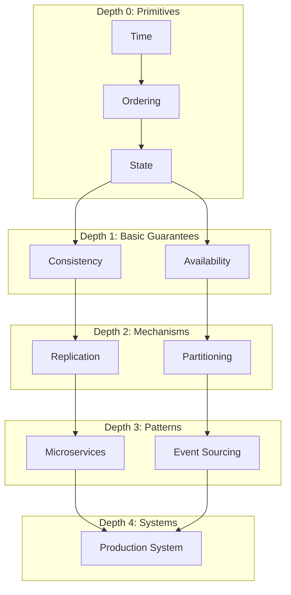

```mermaid
graph TB
    subgraph "Universal Laws & Theorems"
        CAP[CAP Theorem]
        LITTLE[Little's Law]
        AMDAHL[Amdahl's Law]
        UNIVERSAL[Universal Scalability Law]
    end

    subgraph "Fundamental Guarantees Layer"
        subgraph "Consistency Guarantees"
            LIN[G-LIN: Linearizable]
            SEQ[G-SEQ: Sequential]
            CAU[G-CAU: Causal]
            EVE[G-EVE: Eventual]
        end

        subgraph "Availability Guarantees"
            HA[G-HA: High Availability]
            FT[G-FT: Fault Tolerance]
            DR[G-DR: Disaster Recovery]
        end

        subgraph "Performance Guarantees"
            LAT[G-LAT: Latency Bounds]
            THR[G-THR: Throughput]
            SCALE[G-SCALE: Scalability]
        end
    end

    subgraph "Core Mechanisms Layer"
        subgraph "State Management"
            REP[M-P1: Replication]
            PART[M-P2: Partitioning]
            SNAP[M-P8: Snapshot]
        end

        subgraph "Coordination"
            LOCK[M-P4: Locking]
            CONS[M-P5: Consensus]
            LEAD[M-P9: Leader Election]
        end

        subgraph "Communication"
            MSG[M-P3: Messaging]
            RPC[M-P10: RPC]
            STREAM[M-P11: Streaming]
        end

        subgraph "Optimization"
            CACHE[M-P6: Caching]
            BATCH[M-P7: Batching]
            COMP[M-P12: Compression]
        end
    end

    subgraph "Architectural Patterns Layer"
        subgraph "Data Patterns"
            CQRS[P-CQRS: Command Query Separation]
            ES[P-ES: Event Sourcing]
            CDC[P-CDC: Change Data Capture]
        end

        subgraph "Integration Patterns"
            SAGA[P-SAGA: Distributed Transactions]
            OUT[P-OUT: Outbox]
            ORCH[P-ORCH: Orchestration]
        end

        subgraph "Resilience Patterns"
            CB[P-CB: Circuit Breaker]
            RETRY[P-RETRY: Retry Logic]
            BULK[P-BULK: Bulkhead]
        end
    end

    subgraph "Production Systems Layer"
        subgraph "Tier 1 Giants"
            NFLX[Netflix: 260M users]
            UBER[Uber: 131M users]
            META[Meta: 3B users]
        end

        subgraph "Specialized Systems"
            STRIPE[Stripe: 99.999%]
            DISCORD[Discord: 19M concurrent]
            KAFKA[Kafka: 7T msg/day]
        end
    end

    %% Universal Laws to Guarantees
    CAP --> LIN
    CAP --> EVE
    CAP --> HA
    LITTLE --> THR
    LITTLE --> LAT
    AMDAHL --> SCALE
    UNIVERSAL --> SCALE

    %% Guarantees to Mechanisms
    LIN --> CONS
    LIN --> LOCK
    SEQ --> REP
    CAU --> MSG
    EVE --> CACHE
    HA --> REP
    FT --> SNAP
    LAT --> CACHE
    THR --> BATCH
    SCALE --> PART

    %% Mechanisms to Patterns
    REP --> CQRS
    CONS --> SAGA
    MSG --> ES
    MSG --> OUT
    CACHE --> CB
    LOCK --> ORCH
    STREAM --> CDC
    BATCH --> BULK

    %% Patterns to Systems
    CQRS --> NFLX
    ES --> STRIPE
    SAGA --> UBER
    CB --> NFLX
    CDC --> META
    BULK --> DISCORD

    %% Cross-cutting dependencies
    CONS -.-> LEAD
    REP -.-> SNAP
    CACHE -.-> COMP
    MSG -.-> RPC

    style CAP fill:#ffcccc
    style LIN fill:#0066CC
    style REP fill:#FF8800
    style CQRS fill:#AA00AA
    style NFLX fill:#00AA00
```

# Compositional Dependency Graph
## Deep Structure of Distributed Systems Knowledge

### 🌐 The Complete Dependency Network



---

## 🔄 Compositional Algebra

### 1. **Mechanism Composition Rules**

```yaml
Associative Compositions:
  (Partition ∘ Replicate) ∘ Cache = Partition ∘ (Replicate ∘ Cache)
  Example: Cassandra with row cache

Commutative Compositions:
  Cache ∘ Compress = Compress ∘ Cache
  Example: Redis with LZ4 compression

Non-Commutative:
  Encrypt ∘ Compress ≠ Compress ∘ Encrypt
  Rule: Always compress before encrypting

Identity Element:
  PassThrough ∘ Mechanism = Mechanism
  Example: Direct database access (no cache)

Zero Element:
  Drop ∘ Mechanism = Drop
  Example: Circuit breaker open state
```

### 2. **Pattern Algebra**



### 3. **Guarantee Compositions**

```yaml
Strong + Strong = Strong:
  Linearizable + Linearizable = Linearizable
  Example: Consensus-based replication

Strong + Weak = Weak:
  Linearizable + Eventually Consistent = Eventually Consistent
  Example: Write-through cache with async replication

Weak + Weak = Weaker:
  Eventually Consistent + Best Effort = Best Effort
  Example: Multi-region async replication
```

---

## 🎨 Five-Plane Compositional Matrix

### Cross-Plane Dependencies



### Plane-Specific Mechanism Affinity

| Plane | Primary Mechanisms | Secondary Mechanisms | Anti-Patterns |
|-------|-------------------|---------------------|---------------|
| **Edge** | Caching, Rate Limiting, Load Balancing | Compression, CDN | Consensus, Heavy State |
| **Service** | RPC, Orchestration, API Gateway | Circuit Breaker, Retry | Global Locks |
| **Stream** | Messaging, Event Log, Pub-Sub | Batching, Windowing | Synchronous RPC |
| **State** | Replication, Partitioning, Consensus | Snapshot, Backup | Unbounded Growth |
| **Control** | Health Check, Config, Monitoring | Chaos, Feature Flags | Business Logic |

---

## 🔗 Dependency Strength Analysis

### Critical Path Dependencies

```yaml
Strongest Dependencies (Cannot Function Without):
  1. Consensus → Linearizability (100% dependency)
  2. Event Sourcing → Event Log (100% dependency)
  3. CQRS → Eventual Consistency (95% dependency)
  4. Saga → Compensating Transactions (100% dependency)
  5. Circuit Breaker → State Machine (100% dependency)

Beneficial Dependencies (Enhances But Not Required):
  1. Caching → Compression (30% benefit)
  2. Replication → Snapshot (40% benefit)
  3. Partitioning → Consistent Hashing (50% benefit)
  4. Rate Limiting → Token Bucket (60% benefit)
  5. Load Balancing → Health Checks (70% benefit)

Conflicting Dependencies (Mutual Exclusion):
  1. Strong Consistency ⊗ High Availability (CAP)
  2. Synchronous ⊗ Event-Driven
  3. Global Lock ⊗ Partition Independence
  4. Stateful ⊗ Horizontal Scaling
  5. Low Latency ⊗ Global Consistency
```

### Dependency Depth



---

## 📊 Production Composition Examples

### Netflix Architecture Decomposition

```yaml
Netflix System Composition:
  Edge Plane:
    - Zuul (API Gateway)
    - EVCache (Distributed Cache)
    Mechanisms: [M-P6: Caching, M-P10: Rate Limiting]

  Service Plane:
    - Microservices (>700)
    - Hystrix (Circuit Breaker)
    Mechanisms: [M-P5: Service Mesh, M-P11: Circuit Breaking]

  Stream Plane:
    - Kafka (Event Streaming)
    - Flink (Stream Processing)
    Mechanisms: [M-P3: Event Log, M-P7: Windowing]

  State Plane:
    - Cassandra (Wide Column)
    - S3 (Object Storage)
    Mechanisms: [M-P1: Replication, M-P2: Partitioning]

  Control Plane:
    - Spinnaker (Deployment)
    - Atlas (Monitoring)
    - Chaos Monkey (Testing)
    Mechanisms: [M-P12: Chaos Engineering]

Compositional Formula:
  Netflix = (Edge ∘ Cache) ⊕ (Services ∘ CircuitBreaker) ⊕
            (Streaming ∘ EventLog) ⊕ (Storage ∘ Replication) ⊕
            (Control ∘ Chaos)
```

### Uber's Compositional Evolution

```yaml
Scale Point Compositions:

Phase 1 (Monolith - 1K rides/day):
  Composition: Monolith + PostgreSQL
  Mechanisms: [Simple, Direct DB]

Phase 2 (SOA - 100K rides/day):
  Composition: Services + MySQL Sharding
  Added: [M-P2: Partitioning]

Phase 3 (Microservices - 10M rides/day):
  Composition: Microservices + Cassandra + Kafka
  Added: [M-P3: Event Streaming, M-P1: Multi-DC Replication]

Phase 4 (Global - 20M rides/day):
  Composition: Mesh + Multi-Region + Edge Computing
  Added: [M-P9: Geo-Distribution, M-P6: Edge Caching]

Evolution Formula:
  Growth = Previous_Architecture ∘ New_Mechanisms ∘ Scale_Factor
```

---

## 🧩 Compositional Patterns in Production

### 1. **The Resilience Stack**
```yaml
Layer Composition:
  User Request
    ↓ [Circuit Breaker]      # Fail fast
    ↓ [Retry + Backoff]      # Transient failure handling
    ↓ [Bulkhead]             # Isolation
    ↓ [Timeout]              # Bounded wait
    ↓ [Fallback]             # Degraded service
    ↓ Service

Production Example: Netflix API
  - 50ms timeout
  - 3 retries with exponential backoff
  - 10 concurrent request bulkhead
  - Cached response fallback
```

### 2. **The Consistency Ladder**
```yaml
Consistency Levels (Weakest to Strongest):
  1. Best Effort
     ↓ [Add Acknowledgment]
  2. At Least Once
     ↓ [Add Idempotency]
  3. Exactly Once
     ↓ [Add Ordering]
  4. Sequential Consistency
     ↓ [Add Linearization Points]
  5. Linearizability
     ↓ [Add Global Clock]
  6. Strict Serializability

Production Mapping:
  - S3: Read-after-write consistency
  - DynamoDB: Eventual → Strong (configurable)
  - Spanner: External consistency (TrueTime)
```

### 3. **The Scale Pyramid**
```yaml
Scaling Composition:
         /\           Global (Billions)
        /  \          Multi-Region + Edge
       /    \         Regional (Millions)
      /      \        Replicated + Partitioned
     /        \       City (Hundreds of Thousands)
    /          \      Sharded + Cached
   /            \     Single DC (Tens of Thousands)
  /              \    Vertical + Horizontal
 /________________\   Single Server (Thousands)
                      Optimized Monolith

Each Level Adds:
  - Single → DC: +Replication +LoadBalancing
  - DC → City: +Partitioning +Caching
  - City → Regional: +Multi-Master +CDN
  - Regional → Global: +Edge Computing +Geo-Distribution
```

---

## 🔮 Emergent Properties from Composition

### Positive Emergence
```yaml
Caching + Replication → Read Scalability:
  Property: Superlinear scaling for reads
  Example: Reddit (90% cache hit rate)

Event Sourcing + CQRS → Time Travel:
  Property: Complete audit and replay capability
  Example: Git version control

Consensus + Replication → Fault Tolerance:
  Property: Survive (n-1)/2 failures
  Example: etcd with 5 nodes survives 2 failures
```

### Negative Emergence
```yaml
Microservices + Synchronous Calls → Death Spiral:
  Problem: Cascading latency amplification
  Fix: Async + Circuit Breakers

Caching + Eventual Consistency → Cache Stampede:
  Problem: Thundering herd on cache miss
  Fix: Probabilistic early expiration

Retry + Retry → Retry Storm:
  Problem: Exponential load increase
  Fix: Circuit breaker + backoff + jitter
```

---

## 🎯 Key Compositional Insights

### 1. **Composition is Not Commutative**
Order matters: `Compress → Encrypt` ≠ `Encrypt → Compress`

### 2. **Weakest Link Principle**
System guarantees = MIN(component guarantees)

### 3. **Emergent Complexity**
Simple mechanisms → Complex behaviors

### 4. **Scale Changes Everything**
Compositions that work at 1K break at 1M

### 5. **Production Validates Theory**
All compositions must be tested under real load

---

*"In distributed systems, the whole is not just greater than the sum of its parts - it's fundamentally different."*