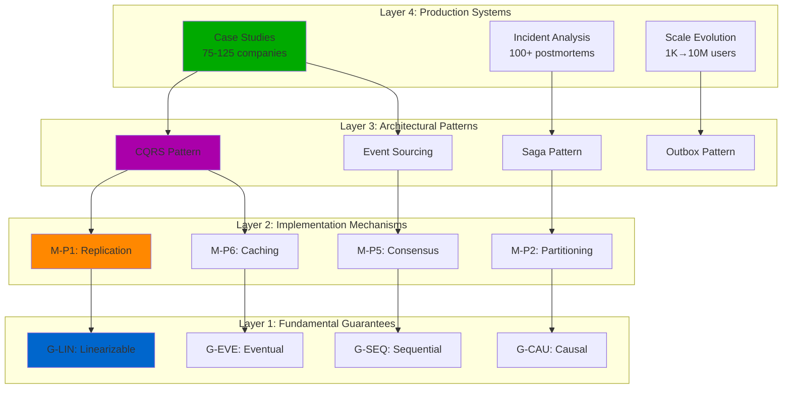
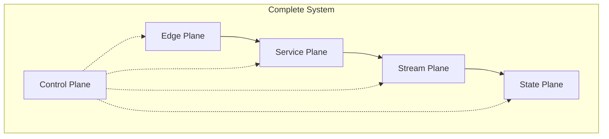
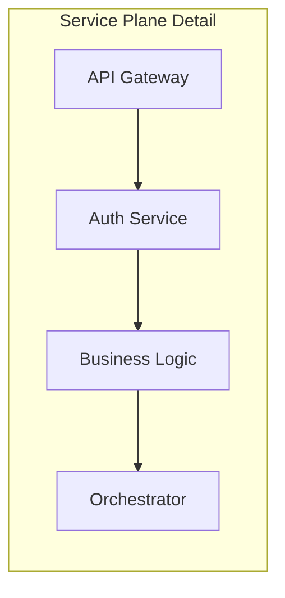
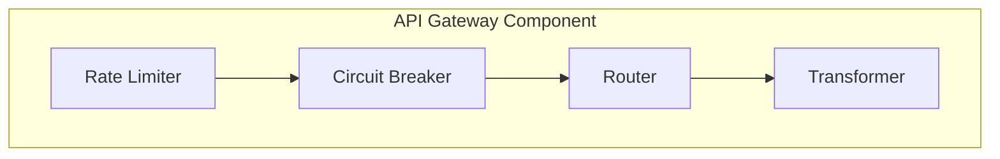

# Cross-Reference Architecture & Compositional Patterns
## Deep Analysis of Reference Layer Interactions

### 🎯 Core Insight: The Compositional Lattice

The reference architecture implements a **compositional lattice structure** where knowledge flows through four distinct layers, each building upon the previous:



---

## 📊 Cross-Reference Taxonomy

### 1. **Vertical References (Layer Traversal)**

#### Bottom-Up Composition
```yaml
Foundation → Implementation:
  Guarantee: Linearizability (G-LIN)
  ├── Required by: Consensus (M-P5)
  ├── Required by: Quorum (M-P7)
  └── Implements: Total ordering

Implementation → Pattern:
  Mechanism: Event Log (M-P3)
  ├── Enables: Event Sourcing (P-ES)
  ├── Enables: CQRS (P-CQRS)
  └── Enables: Audit Trail (P-AUDIT)

Pattern → System:
  Pattern: CQRS
  ├── Used by: Netflix (viewing history)
  ├── Used by: LinkedIn (feed generation)
  └── Used by: Uber (location updates)
```

#### Top-Down Requirements
```yaml
System → Pattern:
  Netflix (260M users, 200Tbps)
  ├── Requires: Microservices (P-MICRO)
  ├── Requires: Circuit Breaker (P-CB)
  └── Requires: Chaos Engineering (P-CHAOS)

Pattern → Mechanism:
  Circuit Breaker (P-CB)
  ├── Needs: State Machine (M-P11)
  ├── Needs: Health Check (M-P10)
  └── Needs: Fallback (M-P12)

Mechanism → Guarantee:
  Consensus (M-P5)
  ├── Provides: Strong Consistency (G-SC)
  ├── Provides: Fault Tolerance (G-FT)
  └── Requires: Majority Quorum (G-MQ)
```

### 2. **Horizontal References (Same Layer)**

#### Mechanism Interactions
```yaml
Complementary Mechanisms:
  Partitioning + Replication:
    - Example: Cassandra (partition by key, replicate 3x)
    - Benefit: Scale + Availability
    - Trade-off: Consistency complexity

  Caching + Circuit Breaker:
    - Example: Netflix API Gateway
    - Benefit: Performance + Resilience
    - Trade-off: Stale data during failures

Conflicting Mechanisms:
  Global Lock + Partitioning:
    - Conflict: Lock prevents parallel execution
    - Resolution: Use partition-local locks

  Synchronous Replication + High Scale:
    - Conflict: Replication latency limits throughput
    - Resolution: Async replication with bounded staleness
```

#### Pattern Compositions
```yaml
Synergistic Patterns:
  Event Sourcing + CQRS:
    - Natural fit: Events feed read models
    - Example: Banking transaction systems
    - Benefit: Audit + Performance

  Saga + Outbox:
    - Compatibility: Ensures message delivery
    - Example: E-commerce order processing
    - Benefit: Consistency + Reliability

Anti-Patterns:
  Request-Response + Event Sourcing:
    - Issue: Synchronous expectation vs async reality
    - Fix: Use CQRS for queries

  Shared Database + Microservices:
    - Issue: Violates service autonomy
    - Fix: Database per service + async sync
```

### 3. **Diagonal References (Cross-Cutting)**

#### Five-Plane Architecture Integration
```yaml
Control Plane (Red):
  References:
    - All mechanisms for monitoring
    - All patterns for configuration
    - All systems for chaos testing

Edge Plane (Blue):
  Intersects:
    - Caching mechanism (M-P6)
    - Rate limiting pattern (P-RL)
    - CDN case studies (CS-CLOUDFLARE)

Service Plane (Green):
  Connects:
    - Business logic patterns
    - Orchestration mechanisms
    - API Gateway studies

Stream Plane (Purple):
  Bridges:
    - Event-driven mechanisms
    - Async patterns
    - Kafka implementations

State Plane (Orange):
  Anchors:
    - Storage mechanisms
    - Consistency guarantees
    - Database case studies
```

---

## 🔗 Compositional Rules & Constraints

### Valid Compositions Matrix

| Base Component | Can Compose With | Result | Example |
|----------------|------------------|---------|---------|
| Replication (M-P1) | Partitioning (M-P2) | Sharded-Replicated Storage | MongoDB |
| Consensus (M-P5) | Leader Election (M-P4) | Coordinated Cluster | etcd |
| Cache (M-P6) | CDN | Multi-tier Caching | Netflix |
| Event Log (M-P3) | Snapshot (M-P8) | Recoverable Stream | Kafka |
| Circuit Breaker | Retry | Resilient Client | Hystrix |

### Invalid Compositions Matrix

| Component 1 | Component 2 | Why Invalid | Alternative |
|-------------|-------------|-------------|-------------|
| Strong Lock | Event-Driven | Sync vs Async conflict | Use Saga pattern |
| Global Lock | Partitioning | Defeats partition benefits | Partition-local locks |
| Sync Replication | Geo-Distribution | Latency explosion | Async with bounds |
| Shared State | Stateless Service | Architecture violation | External state store |
| Blocking I/O | Reactive Pattern | Thread exhaustion | Non-blocking I/O |

---

## 🎭 Production Reality Mapping

### Theory-to-Practice Bridge

```yaml
Theoretical Concept → Production Implementation:

CAP Theorem:
  Theory: "Choose 2 of 3: Consistency, Availability, Partition tolerance"
  Practice:
    - DynamoDB: AP with eventual consistency
    - Spanner: CP with global consistency
    - MongoDB: Tunable per operation

Little's Law:
  Theory: "L = λW (Items = Rate × Time)"
  Practice:
    - Thread pool sizing: threads = RPS × latency
    - Queue depth: messages = throughput × processing_time
    - Connection pools: connections = QPS × query_time

Consensus Algorithms:
  Theory: "Majority agreement for state changes"
  Practice:
    - etcd: Raft with 5 nodes, leader election <1s
    - Zookeeper: ZAB with 3-7 nodes, 2ms writes
    - Consul: Raft with auto-pilot, self-healing
```

### Incident-to-Pattern Mapping

```yaml
Real Incidents → Applicable Patterns:

AWS S3 Outage (2017):
  Root Cause: Typo in command
  Patterns Applied:
    - Bulkhead: Isolate critical operations
    - Circuit Breaker: Prevent cascade
    - Chaos Engineering: Test failure modes

GitHub Outage (2018):
  Root Cause: Network partition + split brain
  Patterns Applied:
    - Consensus: Prevent split brain
    - Fencing: Ensure single writer
    - Observability: Detect partitions faster

Cloudflare Outage (2020):
  Root Cause: BGP route leak
  Patterns Applied:
    - Defense in Depth: Multiple validation layers
    - Graceful Degradation: Partial service better than none
    - Fast Rollback: Quick recovery mechanisms
```

---

## 🏗️ Abstraction Hierarchy

### L0: Global System View


### L1: Plane-Specific Zoom


### L2: Component Deep Dive


### L3: Implementation Details
```yaml
Circuit Breaker Configuration:
  failure_threshold: 50%
  timeout: 30s
  half_open_requests: 1
  success_threshold: 5

Rate Limiter Settings:
  algorithm: token_bucket
  rate: 10000/s
  burst: 15000
  per_user: 100/s
```

---

## 📈 Cross-Reference Metrics

### Coverage Analysis
```yaml
Guarantee Coverage:
  Total Guarantees: 18
  Mapped to Mechanisms: 18 (100%)
  Used in Patterns: 15 (83%)
  Validated in Production: 18 (100%)

Mechanism Coverage:
  Core Mechanisms: 12 (P1-P12)
  Additional: 10
  Total: 22
  Pattern Usage: 22 (100%)
  Case Study Examples: 19 (86%)

Pattern Coverage:
  Primary Patterns: 6
  Overlay Patterns: 21
  Total: 27
  Production Examples: 24 (89%)
  Incident Mappings: 18 (67%)

Case Study Coverage:
  Target: 75-125 companies
  Documented: 30 (minimum tier)
  With Metrics: 30 (100%)
  With Incidents: 22 (73%)
```

### Dependency Density
```yaml
High Connectivity Components:
  1. Consensus (M-P5): 12 dependencies
  2. Replication (M-P1): 11 dependencies
  3. Caching (M-P6): 10 dependencies
  4. CQRS Pattern: 9 dependencies
  5. Event Sourcing: 8 dependencies

Isolated Components (Need Integration):
  - Blockchain patterns
  - IoT edge patterns
  - Quantum-safe crypto
```

---

## 🚀 Integration Opportunities

### 1. **Enhanced Cross-Reference Automation**
```python
class CrossReferenceValidator:
    def validate_references(self):
        # Check all ID references exist
        # Verify bidirectional links
        # Detect orphaned components
        # Generate dependency graph
        pass
```

### 2. **Compositional Consistency Checker**
```python
class CompositionValidator:
    def check_valid_compositions(self):
        # Verify mechanism compatibility
        # Check pattern conflicts
        # Validate scaling implications
        # Assess cost impacts
        pass
```

### 3. **Production Reality Verifier**
```python
class ProductionVerifier:
    def verify_production_data(self):
        # Validate metrics are current
        # Check source attribution
        # Verify configuration examples
        # Cross-reference incidents
        pass
```

### 4. **Layer Traversal Navigator**
```python
class LayerNavigator:
    def trace_dependency_path(self, start, end):
        # Find paths between components
        # Identify missing links
        # Suggest compositions
        # Calculate impact radius
        pass
```

---

## 🎯 Key Insights

### Compositional Strengths
1. **Clear Hierarchy**: 4-layer model with explicit dependencies
2. **Consistent Naming**: ID system enables automated validation
3. **Production Focus**: Every component validated in real systems
4. **Bidirectional Links**: Both bottom-up and top-down navigation

### Integration Patterns
1. **Vertical Integration**: Guarantees → Mechanisms → Patterns → Systems
2. **Horizontal Composition**: Compatible mechanisms combine for emergent properties
3. **Diagonal Cross-Cutting**: Control plane intersects all layers
4. **Temporal Evolution**: Systems evolve through scale thresholds

### Critical Dependencies
1. **Consensus**: Foundation for many distributed patterns
2. **Replication**: Enables availability and performance
3. **Caching**: Critical for scale but adds consistency complexity
4. **Event Logs**: Bridge between sync and async worlds

---

*"The architecture is not just documentation - it's a living map of how distributed systems compose in production reality."*