# EXECUTION_MASTER.md
## Production-First Atlas: 900 Battle-Tested Distributed Systems Diagrams

### 🎯 The Prime Directive
**Every diagram must help someone fix a production issue at 3 AM.**

If it doesn't help during an incident, during debugging, during capacity planning, or during architecture decisions - it doesn't belong here.

---

## 📊 Production Reality: The Numbers

> **📈 Live Metrics**: See `/site/data/CENTRAL_METRICS.json` for current status
>
> All project metrics are centrally tracked and updated via scripts.
> Run `python scripts/unified_status_tracker.py --dashboard` for latest numbers.

### Streamlined Approach
- **Parallel Agents**: 5+ agents working simultaneously
- **Velocity**: 350+ diagrams/session (proven)
- **Quality**: Relational thinking, visual-first
- **Focus**: Real incidents, actual metrics, production configs

### Key Changes from Streamlining
- ✅ Deleted 7 redundant specification files
- ✅ Merged overlapping content (40% reduction)
- ✅ Created INCIDENT_RESPONSE_INDEX.md for emergencies
- ✅ Converted verbose text to visual tables
- ✅ Applied relational composition framework

---

## 🔄 Review & Update Workflow (NEW)

### The Challenge
With 887 diagrams already created and significant changes made to readonly-spec, we need a systematic approach to review and update existing content while continuing new creation.

### Dual-Track Execution
1. **Track 1: Review & Update** (40% effort)
   - Review existing diagrams against new specs
   - Update outdated content
   - Ensure consistency with visual-first approach

2. **Track 2: New Creation** (60% effort)
   - Continue creating missing diagrams
   - Focus on gaps (incidents, debugging guides)
   - Maintain momentum toward 900 target

### Review Priority Matrix
| Priority | Category | Reason | Action |
|----------|----------|--------|--------|
| **🔴 HIGH** | Pre-visual diagrams | Created before visual-first spec | Complete redesign |
| **🟡 MEDIUM** | Stream Plane refs | Obsolete 5-plane architecture | Update to 4-plane |
| **🟢 LOW** | Working diagrams | Already production-quality | Minor adjustments |

### Unified Tracking Workflow
```bash
# Monday: Unified Status Check (2 hours)
python scripts/unified_status_tracker.py --scan  # Update all statuses
python scripts/unified_status_tracker.py --dashboard  # View comprehensive status
python scripts/batch_diagram_reviewer.py --report  # Detailed compliance report

# Tuesday-Thursday: Dual-Track Execution
# Track 1: Review & Update Existing
python scripts/batch_diagram_reviewer.py --category systems  # Review by category
python scripts/unified_status_tracker.py --mark-reviewed <file>  # Mark completed

# Track 2: Create New Diagrams
# Continue with missing diagrams per unified dashboard

# Friday: Progress & Planning
python scripts/unified_status_tracker.py --dashboard  # Final weekly status
python scripts/unified_status_tracker.py --export weekly_report  # Export for records
```

---

## 🏗️ Content Distribution (v5.0 Navigation)

| Category | Count | Purpose | Nav Location | Timeline |
|----------|-------|---------|--------------|----------|
| **Systems Architecture** | 240 | 30 systems × 8 diagrams | Systems | Weeks 3-6 |
| **Incident Anatomies** | 100 | Learn from real failures | Incidents | Weeks 9-10 |
| **Debugging Guides** | 100 | Troubleshooting maps | Debugging | Weeks 9-10 |
| **Performance Profiles** | 80 | Real bottlenecks & metrics | Performance | Weeks 5-6 |
| **Scale Journeys** | 80 | Evolution with growth | Scaling | Weeks 7-8 |
| **Pattern Implementations** | 80 | Patterns in production | Home > Patterns | Weeks 1-2 |
| **Capacity Models** | 60 | Planning for scale | Capacity | Weeks 11-12 |
| **Migration Playbooks** | 60 | Transformation strategies | Migrations | Weeks 7-8 |
| **Cost Breakdowns** | 60 | Infrastructure economics | Costs | Weeks 5-6 |
| **Technology Comparisons** | 40 | Real trade-offs | Comparisons | Weeks 11-12 |
| **Production Practices** | 20 | Best practices & reality | Production | Weeks 1-2 |

---

## 🎨 The 4-Plane Architecture (MANDATORY with Interactive Features)

Every diagram MUST use these exact colors and interactive features:

```css
Edge Plane:    #3B82F6 (Blue-500)    - CDN, WAF, Load Balancers
Service Plane: #10B981 (Emerald-500) - API Gateway, Business Logic
State Plane:   #F59E0B (Amber-500)   - Databases, Caches, Storage
Control Plane: #8B5CF6 (Violet-500)  - Monitoring, Config, Automation
```

**Why These Colors?**
- Battle-tested in production across 467+ diagrams
- Clear visual distinction between planes
- Consistent with existing codebase (3,101 occurrences)
- Red for control plane indicates critical monitoring/alerting
- Professional and recognizable color scheme

**Note**: The "Stream Plane" has been removed from specifications.

### Interactive Features (Automatically Applied)
- **Zoom**: Ctrl/Cmd + Scroll (50% to 400% range)
- **Pan**: Click and drag to navigate large diagrams
- **Fullscreen**: Press 'F' for presentation mode
- **Clickable Nodes**: Add links to documentation
- **Dark Mode**: Automatic theme switching
- **Mobile**: Pinch-to-zoom support

### Visual Enhancements (Required)
- **Emojis**: Use for visual clarity
  - 🌐 Network/Edge components
  - ⚙️ Service/Processing
  - 💾 Storage/Database
  - 🎛️ Control/Monitoring
  - 📊 Metrics/Analytics
  - ⚡ Performance indicators
  - 💰 Cost information
- **Minimum Height**: 400px for zoom/pan functionality
- **Rounded Corners**: rx:8 for modern appearance

---

## 🏢 The 30 Must-Document Systems

### Tier 1: The Giants (8 diagrams each)
1. **Netflix** - Microservices, Chaos Engineering
2. **Uber** - Real-time matching, Geo-distributed
3. **Amazon** - Everything (DynamoDB, S3, Lambda)
4. **Google** - Spanner, BigTable, Borg
5. **Meta/Facebook** - TAO, Social Graph
6. **Microsoft** - Azure, Cosmos DB, Teams
7. **LinkedIn** - Kafka creators, Professional network
8. **Twitter/X** - Timeline generation, Real-time
9. **Stripe** - Payment processing, Financial consistency
10. **Spotify** - Music streaming, Discovery algorithms

### Tier 2: The Innovators (8 diagrams each)
11. **Airbnb** - Search, Pricing, Booking systems
12. **Discord** - Real-time chat/voice at scale
13. **Cloudflare** - Edge computing, DDoS protection
14. **GitHub** - Git at scale, Actions CI/CD
15. **Shopify** - E-commerce platform, Black Friday
16. **DoorDash** - Logistics, Real-time tracking
17. **Slack** - Enterprise messaging, Search
18. **Pinterest** - Visual discovery, Image serving
19. **Twitch** - Live streaming, Chat scale
20. **Coinbase** - Crypto exchange, Matching engine

### Tier 3: The Specialists (8 diagrams each)
21. **Reddit** - Comment trees, Voting system
22. **Datadog** - Metrics ingestion, Time series
23. **Robinhood** - Stock trading, Market data
24. **Zoom** - Video conferencing, WebRTC
25. **TikTok** - Recommendation algorithm, CDN
26. **Square** - Payment processing, Hardware
27. **Snap** - Ephemeral messaging, Stories
28. **Dropbox** - File sync, Storage optimization
29. **Instacart** - Grocery logistics, Inventory
30. **OpenAI** - LLM serving, ChatGPT scale

**Total Architecture Deep-Dives: 240 diagrams**

---

## 📋 The Mandatory 8 Diagrams Per System

For each of the 30 systems, these 8 diagrams are REQUIRED:

### 1. Complete Architecture - "The Money Shot"
- Every component with AWS/GCP instance types
- Real production numbers (not estimates)
- Connection timeouts and retry configs
- Actual costs per component

### 2. Request Flow - "The Golden Path"
- User request traversal through system
- Latency budget at each hop
- Fallback paths for failures
- SLO/SLA annotations (p50, p99, p999)

### 3. Storage Architecture - "The Data Journey"
- Every database with size and type
- Consistency boundaries clearly marked
- Replication lag measurements
- Backup and recovery strategy

### 4. Failure Domains - "The Incident Map"
- Blast radius of each component failure
- Cascading failure paths
- Circuit breakers and bulkheads
- Actual incidents that occurred

### 5. Scale Evolution - "The Growth Story"
- Architecture at 1K, 10K, 100K, 1M, 10M users
- What broke at each level
- How they fixed it
- Cost at each scale point

### 6. Cost Breakdown - "The Money Graph"
- Infrastructure spend by component
- Cost per transaction/request
- Optimization opportunities
- Reserved vs on-demand split

### 7. Novel Solutions - "The Innovation"
- Problems unique to their scale
- Solutions they invented
- Open source contributions
- Patents filed

### 8. Production Operations - "The Ops View"
- Deployment pipeline
- Monitoring and alerting setup
- On-call procedures
- Chaos engineering practices

---

## 📅 Realistic Implementation Timeline (9-12 Months)

### Phase 1: Emergency Response Foundation (Months 1-2)
**Target**: 150 diagrams focusing on immediate production value
- **Incident Response Diagrams**: 50 (Week 1-4)
  - Service down debugging paths
  - Database performance issues
  - Latency spike investigation
  - Cascade failure patterns
  - Memory leak detection

- **Debugging Guides**: 50 (Week 5-8)
  - Distributed tracing analysis
  - Log aggregation patterns
  - Metric correlation guides
  - Error propagation maps

- **Common Failure Modes**: 50 (Week 5-8)
  - Circuit breaker states
  - Timeout configurations
  - Retry storm patterns
  - Resource exhaustion

**Team Effort**: 60-80 hours/week combined (3-4 engineers)
**Output**: ~19 diagrams/week

### Phase 2: Core Concepts (Months 3-4)
**Target**: 200 diagrams establishing theoretical foundation
- **Guarantees** (108 diagrams):
  - Consistency models (18 variations)
  - Availability patterns (18 variations)
  - Partition tolerance (18 variations)
  - Durability mechanisms (18 variations)
  - Ordering guarantees (18 variations)
  - Isolation levels (18 variations)

- **Critical Mechanisms** (92 diagrams):
  - Consensus algorithms (Raft, Paxos variations)
  - Replication strategies
  - Partitioning schemes
  - Caching layers
  - Load balancing algorithms

**Team Effort**: 60-80 hours/week combined
**Output**: ~25 diagrams/week

### Phase 3: Pattern Library (Months 5-6)
**Target**: 150 diagrams of architectural patterns
- **Pattern Implementations** (105 diagrams):
  - CQRS at scale (Uber, Netflix, etc.)
  - Event Sourcing (banking, e-commerce)
  - Saga patterns (distributed transactions)
  - Outbox pattern variations
  - API Gateway patterns

- **Pattern Variations** (45 diagrams):
  - Environment-specific adaptations
  - Scale-specific modifications
  - Technology-specific implementations

**Team Effort**: 60-80 hours/week combined
**Output**: ~19 diagrams/week

### Phase 4: Case Studies - The Giants (Months 7-9)
**Target**: 240 diagrams (30 companies × 8 diagrams each)
- **Tier 1 Systems** (80 diagrams):
  Netflix, Uber, Amazon, Google, Meta, Microsoft, LinkedIn, Twitter, Stripe, Spotify

- **Tier 2 Innovators** (80 diagrams):
  Airbnb, Discord, Cloudflare, GitHub, Shopify, DoorDash, Slack, Pinterest, Twitch, Coinbase

- **Tier 3 Specialists** (80 diagrams):
  Reddit, Datadog, Robinhood, Zoom, TikTok, Square, Snap, Dropbox, Instacart, OpenAI

**Each system includes**:
1. Complete architecture with real metrics
2. Request flow with latencies
3. Storage architecture
4. Failure domains
5. Scale evolution
6. Cost breakdown
7. Novel solutions
8. Production operations

**Team Effort**: 80-100 hours/week combined
**Output**: ~20 diagrams/week

### Phase 5: Polish & Completeness (Months 10-12)
**Target**: 160 diagrams filling gaps
- **Performance Comparisons** (40 diagrams)
- **Migration Guides** (40 diagrams)
- **Cost Analyses** (40 diagrams)
- **Capacity Models** (40 diagrams)

**Team Effort**: 40-60 hours/week combined
**Output**: ~13 diagrams/week

---

## 🛠️ Available Scripts & Tools

### Existing Scripts (site/scripts/)
```bash
# Weekly source discovery and prioritization
python scripts/manual_source_discovery.py

# Progress tracking and dashboard generation
python scripts/progress_tracker.py

# Validate mermaid syntax and rendering
python scripts/validate_mermaid.py

# Check for broken links in documentation
python scripts/check_links.py
```

### MkDocs Operations
```bash
# Serve documentation locally (with interactive diagrams)
cd site
mkdocs serve  # View at http://127.0.0.1:8000

# Test interactive features
# Navigate to http://127.0.0.1:8000/mermaid-style-guide
# Try: Ctrl+scroll to zoom, drag to pan, F for fullscreen

# Build static site
mkdocs build  # Output to site/site/

# Verify interactive JS/CSS loaded
ls -la site/site/javascripts/mermaid-interactive.js
ls -la site/site/stylesheets/mermaid-beautiful.css
```

---

## 📁 File Organization (v5.0 Navigation Structure)

```
site/
├── EXECUTION_MASTER.md           # THIS FILE
├── docs/                         # All diagrams go here
│   ├── foundation/              # Fundamental concepts (Home)
│   ├── getting-started/         # Quick start guides (Home)
│   ├── guarantees/              # System guarantees (Home)
│   │   ├── linearizability/    # Linearizability concepts
│   │   ├── eventual-consistency/# Eventual consistency patterns
│   │   └── exactly-once/        # Exactly-once delivery
│   ├── mechanisms/              # Implementation mechanisms (Home)
│   │   ├── replication/        # Replication strategies
│   │   ├── load-balancing/     # Load balancing algorithms
│   │   ├── partitioning/       # Data partitioning
│   │   ├── consensus/          # Consensus protocols
│   │   └── caching/            # Caching patterns
│   ├── patterns/                # Architecture patterns (Home)
│   ├── examples/                # Implementation examples (Home)
│   ├── reference/               # API and glossary (Home)
│   ├── systems/                 # Architecture Deep-Dives (30 companies)
│   │   ├── netflix/             # 8 Netflix diagrams
│   │   ├── uber/                # 8 Uber diagrams
│   │   └── [28 more companies]  # 8 diagrams each
│   ├── incidents/               # Incident Anatomies (100)
│   │   ├── high-profile/       # Major outages
│   │   ├── cloud-providers/    # AWS, Azure, GCP incidents
│   │   ├── financial-services/  # Banking and payment failures
│   │   ├── communication/      # Messaging platform outages
│   │   └── response-patterns/  # Common response strategies
│   ├── debugging/               # Debugging Guides (100) - Standalone
│   │   ├── performance-issues/  # CPU, memory, latency
│   │   ├── data-issues/        # Consistency, replication
│   │   ├── infrastructure/     # Container, k8s, cloud
│   │   ├── application-issues/ # API, Lambda, services
│   │   ├── messaging-queuing/  # Kafka, Redis, queues
│   │   ├── distributed-systems/# Tracing, dependencies
│   │   ├── monitoring/         # Metrics and observability
│   │   ├── capacity-scale/    # Capacity and scaling
│   │   └── security/          # Security incidents
│   ├── performance/            # Performance Profiles (80)
│   ├── scaling/               # Scale Journeys (80)
│   ├── capacity/              # Capacity Models (60)
│   ├── migrations/            # Migration Playbooks (60)
│   ├── costs/                 # Cost Breakdowns (60)
│   ├── comparisons/           # Technology Comparisons (40)
│   ├── case-studies/          # In-depth analyses
│   └── production/            # Best practices (20)
├── scripts/                   # Automation tools
├── data/                      # Progress tracking (v5.0)
├── execution/                 # Daily workflow guides
└── .github/workflows/         # CI/CD automation
```

---

## ✅ Quality Gates

### The 3 AM Test
- [ ] Shows exact error messages to look for
- [ ] Indicates which logs to check
- [ ] Specifies metrics that indicate the issue
- [ ] Includes runbook link or inline instructions
- [ ] Shows recovery procedures

### The New Hire Test
- [ ] No unexplained acronyms
- [ ] Technologies are versioned
- [ ] Data flow is directional
- [ ] Dependencies are explicit
- [ ] Scale metrics are included

### The CFO Test
- [ ] Infrastructure costs are shown
- [ ] ROI of optimizations calculated
- [ ] Cost per user/transaction included
- [ ] Reserved vs on-demand indicated
- [ ] Growth projections costed

### The Incident Test
- [ ] Failure modes documented
- [ ] Blast radius indicated
- [ ] Recovery time specified
- [ ] Data loss potential marked
- [ ] Rollback procedure shown

---

## 📈 Weekly Team Workflow (60-80 hours/week combined)

### Monday - Planning & Research (8-10 hours team total)
**Morning (4 hours)**
1. Team sync and weekly planning (1 hour all-hands)
2. Review previous week's diagrams (1 hour)
3. Assign ownership for this week's targets (1 hour)
4. Run `python scripts/manual_source_discovery.py`

**Afternoon (4-6 hours)**
1. Research incident reports and postmortems
2. Interview on-call engineers
3. Collect production metrics from engineering blogs
4. Verify data sources and cross-reference

### Tuesday-Thursday - Creation Sprint (36-48 hours team total)
**Per Engineer Daily (12-16 hours/day team combined)**
1. **Morning (2 hours/engineer)**:
   - Research and data collection for assigned diagrams
   - Verify production metrics and sources
   - Draft initial diagram structures

2. **Afternoon (2-3 hours/engineer)**:
   - Create 1-2 complete diagrams with all annotations
   - Follow 4-plane architecture standards
   - Include real production metrics with sources
   - Add failure scenarios and recovery procedures

**Daily Output**: 3-6 complete diagrams (team total)

### Friday - Validation & Publishing (16-20 hours team total)
**Morning (8-10 hours team combined)**
1. Quality gate reviews for all week's diagrams:
   - Technical validation (Mermaid syntax)
   - Production data verification (sources, dates)
   - "3 AM Test" validation (operational value)
   - Architecture consistency check

2. Revisions based on review feedback
3. Run `python scripts/validate_mermaid.py`

**Afternoon (8-10 hours team combined)**
1. Final reviews and approvals
2. Commit to repository with proper documentation
3. Update tracking with `python scripts/progress_tracker.py`
4. Test rendering with `mkdocs serve`
5. Team retrospective and next week planning

---

## 🚨 Critical Requirements

### Every Diagram Must Include:
- **Real company/system names** (not "Service A")
- **Actual metrics** (not "high performance")
- **Specific technologies** with versions
- **Failure scenarios** and recovery procedures
- **Cost information** where applicable
- **4-plane color scheme** (no exceptions)

### Example: GOOD vs BAD

❌ **BAD - Academic Theory**
```
Client → API Gateway → Microservice → Database
```

✅ **GOOD - Production Reality with Interactive Features**

```mermaid
graph LR
    subgraph EdgePlane["🌐 Edge"]
        APP["iPhone App<br/>📱 2M DAU"]
    end

    subgraph ServicePlane["⚙️ Service"]
        GW["Kong Gateway<br/>⚡ p99: 10ms"]
        SVC["Order Service<br/>Java 17<br/>200 threads"]
    end

    subgraph StatePlane["💾 State"]
        DB[("PostgreSQL 14<br/>db.r6g.2xlarge<br/>1000 connections")]
    end

    APP --> GW
    GW --> SVC
    SVC --> DB

    classDef edgeStyle fill:#3B82F6,stroke:#2563EB,color:#fff
    classDef serviceStyle fill:#10B981,stroke:#059669,color:#fff
    classDef stateStyle fill:#F59E0B,stroke:#D97706,color:#fff

    class APP edgeStyle
    class GW,SVC serviceStyle
    class DB stateStyle

    click DB "https://docs.aws.amazon.com/AmazonRDS/latest/UserGuide/CHAP_PostgreSQL.html" "PostgreSQL on AWS"
```


---

## 🎯 Success Metrics

### Realistic Velocity Targets (Team Combined)
- **Month 1-2**: 19 diagrams/week (Emergency response focus)
- **Month 3-4**: 25 diagrams/week (Core concepts)
- **Month 5-6**: 19 diagrams/week (Pattern library)
- **Month 7-9**: 20 diagrams/week (Case studies)
- **Month 10-12**: 13 diagrams/week (Polish and gaps)
- **Overall Average**: 19-20 diagrams/week

### Effort Breakdown Per Diagram
- **Research & Data Collection**: 1-1.5 hours
- **Diagram Creation**: 1-1.5 hours
- **Validation & Review**: 0.5-1 hour
- **Revisions & Publishing**: 0.5 hour
- **Total per Diagram**: 3-4 hours average

### Quality Metrics
- **100%** follow 4-plane architecture
- **100%** include real production metrics with sources
- **100%** show failure scenarios and recovery
- **100%** pass all 4 quality gates
- **100%** validated by automated tools
- **0** placeholder or example data

### Team Performance Indicators
- **Weekly Diagram Output**: 15-25 (depending on complexity)
- **Review Pass Rate**: >80% first time
- **Data Verification**: 100% sourced and dated
- **3 AM Test Pass**: >90% operational value
- **Technical Debt**: <5% rework needed

---

## 📋 Review Tracking & Version Control

### Diagram Versioning System
Every diagram now has:
- **Version Number**: Major.Minor (e.g., 1.0, 1.1, 2.0)
- **Review Status**: up_to_date | needs_review | outdated | missing_version
- **Last Review Date**: ISO timestamp
- **Content Hash**: MD5 hash for change detection

### Unified Status Commands
```bash
# Primary Status Commands (Use These Daily)
# Comprehensive dashboard showing creation AND review status
python scripts/unified_status_tracker.py --dashboard

# Scan all diagrams and update unified tracking
python scripts/unified_status_tracker.py --scan

# Mark diagram as reviewed/updated
python scripts/unified_status_tracker.py --mark-reviewed docs/systems/netflix/architecture.md

# Update specific diagram status
python scripts/unified_status_tracker.py --update-status docs/patterns/cqrs.md --status needs_update

# Batch Review Commands
# Review all diagrams in a category for compliance
python scripts/batch_diagram_reviewer.py --category systems --report

# Generate fix suggestions for non-compliant diagrams
python scripts/batch_diagram_reviewer.py --fix-suggestions

# Export unified status report
python scripts/unified_status_tracker.py --export status_report
```

### Review Priorities
1. **🔴 HIGH Priority**: Diagrams with Stream Plane references (obsolete)
2. **🟡 MEDIUM Priority**: Content changed or review > 30 days old
3. **🟢 LOW Priority**: Working diagrams needing minor updates

### Spec Change Impact Analysis
When readonly-spec files change, affected diagrams are automatically identified:
- `02-DIAGRAM-SPECIFICATIONS-V3.md` → All diagrams
- `03-GUARANTEES-SPECIFICATIONS.md` → Guarantees category
- `04-MECHANISM-SPECIFICATIONS.md` → Mechanisms category
- `05-PATTERN-SPECIFICATIONS.md` → Patterns category
- `02-DIAGRAM-SPECIFICATIONS-V3.md` → All diagrams (includes visual specs)

## 🎉 Completion Criteria

### At 900 Diagrams, We Will Have:
1. **Complete coverage** of all 30 major systems (240 diagrams)
2. **Full pattern library** with production implementations (80 diagrams)
3. **Comprehensive incident analysis** from real outages (100 diagrams)
4. **Complete debugging toolkit** for distributed systems (100 diagrams)
5. **Production-tested scaling strategies** (80 diagrams)
6. **Battle-tested migration playbooks** (60 diagrams)
7. **Real cost optimization guides** (60 diagrams)
8. **Performance benchmarking data** (80 diagrams)
9. **Capacity planning models** (60 diagrams)
10. **Technology comparison matrices** (40 diagrams)

---

## 💡 Final Reminder

**This is not documentation. This is collective production wisdom.**

Every diagram represents:
- Hours of debugging at 3 AM
- Millions in infrastructure spend
- Hard-won lessons from operating at scale
- Real incidents and their solutions

We're building an atlas of **battle-tested production architectures** that actually work, actually scale, and actually help engineers build better systems.

---

## 💰 Resource Requirements & Budget

### Team Composition
- **Lead Engineer**: 1 senior engineer (50% allocation)
- **Core Team**: 2-3 engineers (50% allocation)
- **Domain Experts**: 5-10 engineers (5% for reviews)
- **Total FTEs**: 2-2.5 full-time equivalent

### Budget Estimation
- **Engineering Time**: $500K-750K (2,400-3,600 hours at $200/hour)
- **Tooling & Infrastructure**: $10K (monitoring, validation tools)
- **Review & Validation**: $50K (expert reviews)
- **Total Investment**: $560K-810K

### Risk Mitigation

#### Risk: Data Becomes Stale
- **Mitigation**: Quarterly review cycles
- **Automation**: Staleness detection in tracking
- **Process**: Update triggers from production incidents

#### Risk: Team Burnout
- **Mitigation**: Realistic 9-12 month timeline
- **Rotation**: Switch focus areas monthly
- **Recognition**: Credit and visibility for contributions

#### Risk: Quality Degradation
- **Mitigation**: Strict 4-gate quality process
- **Review**: Multi-stage validation
- **Feedback**: Production engineer input

## 🚀 Ready to Start?

### Week 1 Priorities
1. **Form Team**: Identify 3-4 dedicated engineers
2. **Set Up Tooling**: Install validation scripts
3. **Test Interactive Features**:
   - Navigate to `/mermaid-style-guide` to see examples
   - Verify zoom/pan works on existing diagrams
   - Test dark mode switching
4. **Create First 5 Diagrams**: Focus on incident response with interactive features
   - Use 4-plane color scheme
   - Add clickable nodes for documentation
   - Include emojis for visual clarity
5. **Establish Review Process**: Define quality gates including interactive features
6. **Begin Data Collection**: Start production metrics database

### Month 1 Goals
- 50 incident response diagrams completed
- Quality gates fully operational
- Team rhythm established (60-80 hours/week combined)
- Production data sources verified
- First feedback from on-call engineers

**Let's build something that actually helps engineers at 3 AM!**

---

*"In production, there are no theoretical problems - only real incidents at 3 AM."*

**The Atlas v4.0 - Where Production Reality Lives**