# Production Composition Reality
## What Actually Happens When Patterns Compose at Scale

### 🚨 The Composition Cliff

**Critical Insight**: Compositions that work perfectly at 10K RPS can catastrophically fail at 100K RPS.

```mermaid
graph LR
    subgraph "The Composition Cliff"
        A[10K RPS<br/>✅ Working] -->|10x Scale| B[100K RPS<br/>💥 Failure]
        B -->|Root Cause| C[Hidden Coupling]
        C --> D[Cascading Delays]
        D --> E[Resource Exhaustion]
        E --> F[System Collapse]
    end

    style B fill:#ff0000
    style F fill:#cc0000
```



---

## 📊 Real Production Composition Failures

### Case 1: The Netflix Microservices Cascade (2016)

```yaml
Composition:
  Pattern: Microservices + Synchronous REST
  Scale: 700+ services, 5B+ requests/day

What Happened:
  1. Single service added 100ms latency
  2. Dependent services started timing out
  3. Retries amplified load 3x
  4. Circuit breakers opened in cascade
  5. 45-minute partial outage

Root Cause:
  - Synchronous dependency chains
  - No backpressure mechanism
  - Retry storms

Fix Applied:
  Before: A → B → C → D (synchronous chain)
  After: A → [Queue] → B
         A → [Cache] → Fallback

Composition Change:
  From: Sync_REST ∘ Retry ∘ Timeout
  To: Async_Queue ∘ Circuit_Breaker ∘ Cache_Fallback
```

### Case 2: The Uber Geospatial Index Meltdown (2017)

```yaml
Composition:
  Pattern: Sharding + Geo-Index + Real-time Updates
  Scale: 15M trips/day, 100K drivers online

What Happened:
  1. Hot shard in Manhattan during rush hour
  2. Geo-index updates backed up
  3. Location updates delayed by minutes
  4. Drivers appeared in wrong locations
  5. Matching algorithm failed

Root Cause:
  - Uneven geographic distribution
  - Synchronous index updates
  - No hot shard splitting

Fix Applied:
  Before: Fixed_Sharding ∘ Sync_Index_Update
  After: Dynamic_Sharding ∘ Async_Index ∘ Hot_Shard_Split

New Composition:
  H3_Hexagons ∘ Write_Ahead_Log ∘ Eventual_Consistency
```

### Case 3: Discord Voice Server Storm (2020)

```yaml
Composition:
  Pattern: WebRTC + Stateful Servers + Auto-scaling
  Scale: 19M concurrent voice users

What Happened:
  1. Popular streamer joined voice channel
  2. 50K users joined simultaneously
  3. Auto-scaling triggered
  4. New servers started cold
  5. State synchronization overwhelmed cluster

Root Cause:
  - Cold start problem
  - State transfer bottleneck
  - Thundering herd

Fix Applied:
  Before: Stateful_Server ∘ Full_State_Transfer
  After: Stateless_Edge ∘ State_in_Redis ∘ Incremental_Sync

Composition Evolution:
  Stateful_Monolith → Stateless_Services ∘ External_State
```

---

## 🔄 Composition Phase Transitions

### The Three Phases of Scale


### Phase Transition Symptoms

```yaml
Phase 1 → 2 Transition Symptoms:
  - Database becomes bottleneck
  - Single point of failure emerges
  - Vertical scaling hits limits
  Signal: CPU > 70%, Memory > 80%

Phase 2 → 3 Transition Symptoms:
  - Coordination overhead dominates
  - Network becomes bottleneck
  - Complexity becomes unmanageable
  Signal: Cross-service calls > 50% of latency

Required Composition Changes:
  Phase 1→2:
    Add: [Caching, Sharding, Read Replicas]
    Pattern: Monolith → Services

  Phase 2→3:
    Add: [Async, Event-Driven, Edge]
    Pattern: Services → Mesh
```

---

## ⚡ Latency Composition Mathematics

### The Hidden Latency Tax

```yaml
Synchronous Service Chain:
  Services: A → B → C → D
  Individual p99: 10ms each

  Naive Calculation: 4 × 10ms = 40ms ❌

  Reality (probability):
    P(all succeed in p99) = 0.99^4 = 0.96
    Real p99: ~65ms
    Real p99.9: ~120ms

With Retries:
  Base latency: 10ms
  Retry count: 3
  Backoff: exponential (1s, 2s, 4s)

  Worst case: 10ms + 1s + 2s + 4s = 7.01s 😱
```

### Latency Composition Patterns


---

## 💥 Failure Mode Compositions

### How Failures Compose

```yaml
Single Failure Modes:
  1. Service Down: 0.1% of requests fail
  2. Network Flaky: 0.5% packet loss
  3. Database Slow: p99 = 100ms

Combined Failure (Multiplicative):
  Service Down + Retries:
    - 3 retries = 0.1% × 3 = 0.3% load increase

  Network Flaky + Timeout:
    - TCP retransmission + app timeout = cascading delays

  Database Slow + Connection Pool:
    - Threads blocked → pool exhausted → total failure

Failure Composition Formula:
  System_Reliability = ∏(Component_Reliability)
  System_Latency = Σ(Component_Latency) + Coordination_Overhead
```

### Defensive Composition Patterns


---

## 🎭 The Reality of Event-Driven Composition

### Promise vs Reality

```yaml
The Promise:
  - Complete decoupling
  - Infinite scalability
  - Perfect resilience

The Reality:
  Hidden Couplings:
    - Schema evolution breaks consumers
    - Event ordering requirements
    - Replay complexity

  Scalability Limits:
    - Kafka partition limits (4000/cluster)
    - Consumer group rebalancing storms
    - State store growth

  Failure Modes:
    - Poison messages
    - Infinite retry loops
    - Event storm amplification
```

### Event Composition Anti-Patterns


---

## 🔧 Production-Tested Compositions

### Battle-Tested Combinations

```yaml
1. Cache + Circuit Breaker + Fallback:
   Used By: Netflix, Twitter
   Pattern: Cache{Hit:90%} → CB{Open?} → Fallback{Stale:OK}
   Benefit: 10x latency reduction, 100% availability

2. Sharding + Replication + Consistent Hashing:
   Used By: Discord, Cassandra
   Pattern: Hash(Key) → Shard → Replicas{N=3}
   Benefit: Linear scaling, fault tolerance

3. Event Log + Snapshot + Replay:
   Used By: Kafka, Event Store
   Pattern: Log{Append} → Snapshot{Periodic} → Replay{From:Snapshot}
   Benefit: Durability, time travel, fast recovery

4. Rate Limit + Queue + Backpressure:
   Used By: Stripe, Square
   Pattern: RateLimit{1000/s} → Queue{MaxSize} → Backpressure{Reject}
   Benefit: Predictable performance, protection

5. Async + Idempotency + At-Least-Once:
   Used By: Amazon, Uber
   Pattern: Async{Queue} → Process{Idempotent} → Ack{After:Success}
   Benefit: Reliability without coordination
```

### Compositions to Avoid

```yaml
Never Combine:
  1. Global Lock + Microservices
     Why: Defeats service independence

  2. Synchronous + Cross-Region
     Why: Latency explosion (100ms+ per call)

  3. Strong Consistency + Auto-Scaling
     Why: Consensus doesn't scale horizontally

  4. Shared Database + Service Ownership
     Why: Creates hidden coupling

  5. Stateful + Serverless
     Why: Cold starts lose state
```

---

## 📈 Composition Performance Formulas

### Throughput Composition

```python
# Serial Composition
throughput_serial = min(T1, T2, T3, ..., Tn)

# Parallel Composition
throughput_parallel = sum(T1, T2, T3, ..., Tn)

# Pipeline Composition
throughput_pipeline = min(T_stage_i for i in stages)

# Example: Netflix Edge
edge_throughput = min(
    cdn_capacity,      # 200 Gbps
    gateway_rps,       # 1M requests/sec
    backend_capacity   # 500K requests/sec
) = 500K requests/sec  # Backend is bottleneck
```

### Availability Composition

```python
# Serial Dependency (AND)
availability_serial = A1 × A2 × A3 × ... × An

# Parallel Redundancy (OR)
availability_parallel = 1 - ((1-A1) × (1-A2) × ... × (1-An))

# Example: Multi-Region
region_availability = 0.999
multi_region = 1 - (0.001)^3 = 0.999999  # Six nines

# With Shared Dependencies
shared_db = 0.999
service = 0.9999
total = min(shared_db, service) = 0.999  # Three nines
```

---

## 🎯 The 10 Commandments of Production Composition

1. **Measure Before Composing**: Profile individual components first
2. **Test at 10x Scale**: Compositions break at scale transitions
3. **Async by Default**: Synchronous chains are fragile
4. **Cache Aggressively**: But handle invalidation properly
5. **Bulkhead Everything**: Isolate failure domains
6. **Plan for Partial Failure**: Perfect availability is a myth
7. **Version Your Events**: Schema evolution will happen
8. **Monitor Compositions**: Not just individual services
9. **Practice Chaos**: Compositions fail in unexpected ways
10. **Document Dependencies**: Hidden coupling kills systems

---

## 🚀 Composition Maturity Model

### Level 1: Naive Composition
- Direct service calls
- No failure handling
- Synchronous everything

### Level 2: Defensive Composition
- Timeouts and retries
- Basic circuit breakers
- Some caching

### Level 3: Resilient Composition
- Async messaging
- Bulkheads and isolation
- Fallback strategies

### Level 4: Adaptive Composition
- Dynamic configuration
- Auto-scaling and healing
- Chaos engineering

### Level 5: Emergent Composition
- Self-organizing systems
- ML-driven optimization
- Predictive scaling

---

*"In production, composition is multiplication - both for success and failure."*