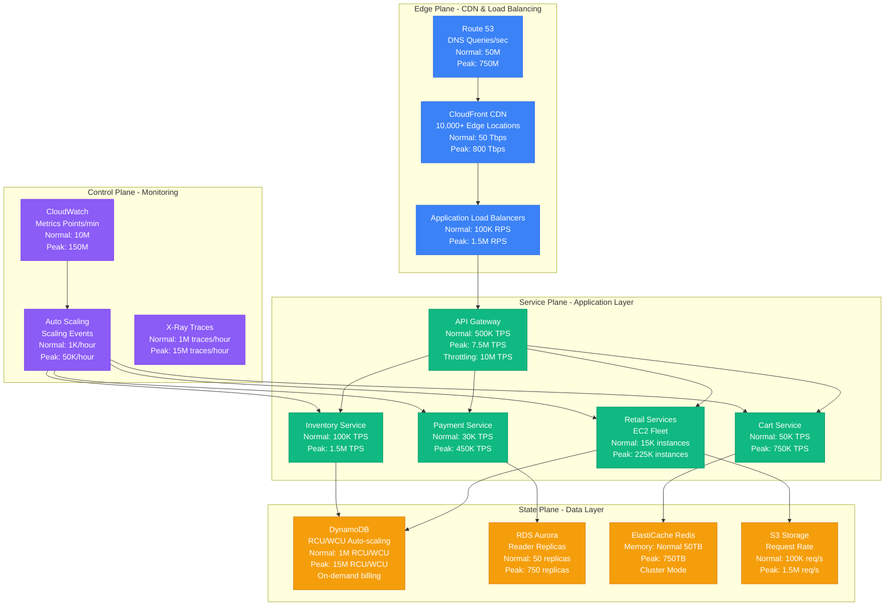
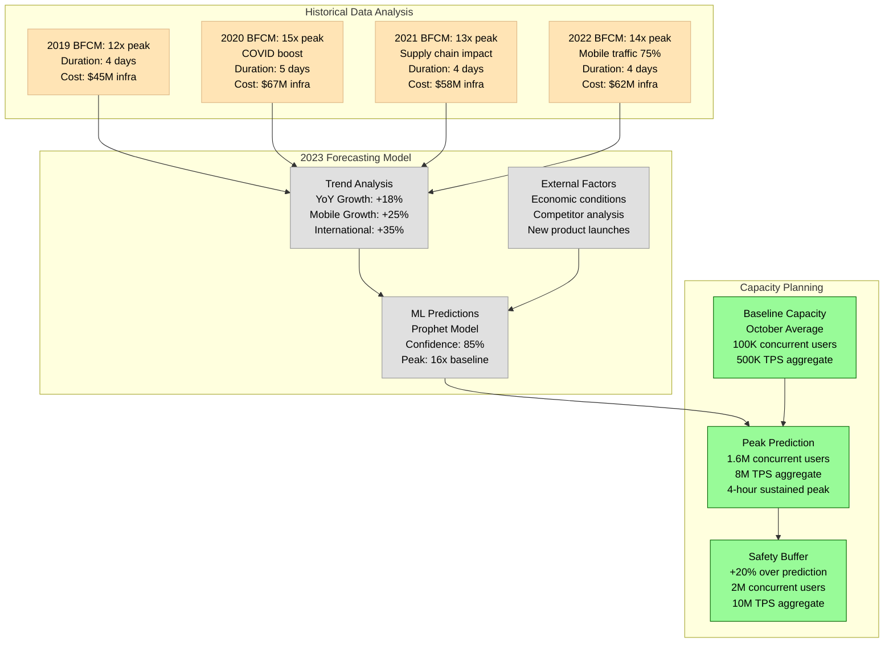
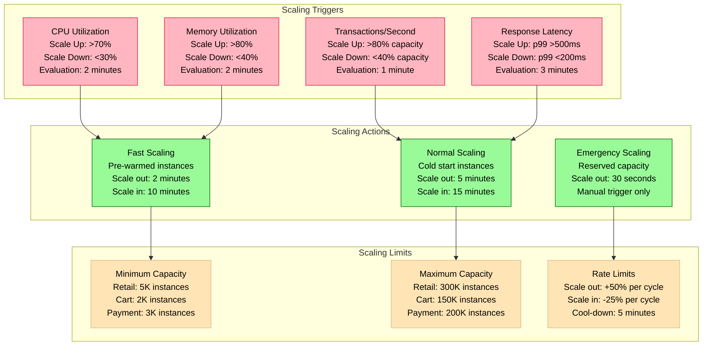

# Amazon Black Friday/Cyber Monday Capacity Model

## Overview

Amazon's Black Friday/Cyber Monday represents one of the world's largest planned traffic surges, requiring months of capacity planning to handle 10-15x normal traffic loads across their entire infrastructure.

## Complete Capacity Architecture



## Capacity Forecasting Model



## Auto-Scaling Strategy



## Cost Impact Analysis

```mermaid
graph TB
    subgraph Normal[Normal Operations - October]
        NC[Compute Cost<br/>EC2: $2.5M/month<br/>Lambda: $500K/month<br/>ECS: $800K/month]
        NS[Storage Cost<br/>S3: $1.2M/month<br/>DynamoDB: $800K/month<br/>RDS: $600K/month]
        NN[Network Cost<br/>CloudFront: $400K/month<br/>Data Transfer: $300K/month<br/>NAT Gateway: $100K/month]
        NT[Total: $7.2M/month]
    end

    subgraph Peak[Peak Operations - BFCM 4 Days]
        PC[Compute Cost<br/>EC2: $15M (6x)<br/>Lambda: $3M (6x)<br/>ECS: $4.8M (6x)]
        PS[Storage Cost<br/>S3: $2.5M (2x)<br/>DynamoDB: $12M (15x)<br/>RDS: $4.5M (7.5x)]
        PN[Network Cost<br/>CloudFront: $3.2M (8x)<br/>Data Transfer: $2.4M (8x)<br/>NAT Gateway: $400K (4x)]
        PT[Total: $47.8M for 4 days<br/>Daily: $12M vs $240K normal]
    end

    subgraph Scenarios[Cost Scenarios]
        UNDER[Under-Provisioning<br/>Revenue Loss: $50M/hour<br/>Customer Impact: High<br/>Recovery Time: 2-4 hours]
        OVER[Over-Provisioning<br/>Extra Cost: +30% ($15M)<br/>Customer Impact: None<br/>Wasted Capacity: 20%]
        OPTIMAL[Optimal Provisioning<br/>Target: +5% buffer<br/>Monitoring: Real-time<br/>Adjustment: Every 15min]
    end

    NT --> PT
    PC --> UNDER
    PS --> OVER
    PN --> OPTIMAL

    %% Apply colors
    classDef normal fill:#E0E0E0,stroke:#999,color:#000
    classDef peak fill:#FF6B6B,stroke:#D63031,color:#fff
    classDef scenario fill:#FFE4B5,stroke:#DEB887,color:#000

    class NC,NS,NN,NT normal
    class PC,PS,PN,PT peak
    class UNDER,OVER,OPTIMAL scenario
```

## Regional Capacity Distribution

```mermaid
graph TB
    subgraph USEast[US-East-1 (Primary)]
        USE1[Virginia Region<br/>Baseline: 40% traffic<br/>Peak: 35% traffic<br/>Instances: 150K peak<br/>Auto-scale: 30s]
    end

    subgraph USWest[US-West-2 (Secondary)]
        USW2[Oregon Region<br/>Baseline: 25% traffic<br/>Peak: 30% traffic<br/>Instances: 100K peak<br/>Auto-scale: 30s]
    end

    subgraph Europe[EU-West-1]
        EUW1[Ireland Region<br/>Baseline: 20% traffic<br/>Peak: 20% traffic<br/>Instances: 75K peak<br/>Local BFCM timing]
    end

    subgraph Asia[AP-Northeast-1]
        APN1[Tokyo Region<br/>Baseline: 15% traffic<br/>Peak: 15% traffic<br/>Instances: 50K peak<br/>Different timing]
    end

    subgraph Failover[Disaster Recovery]
        DR[Cross-Region Failover<br/>RTO: 5 minutes<br/>RPO: 1 minute<br/>Capacity: 150% of peak<br/>Cost: $10M standby]
    end

    USE1 --> USW2
    USW2 --> USE1
    USE1 --> EUW1
    USE1 --> APN1

    USW2 --> DR
    EUW1 --> DR
    APN1 --> DR

    %% Apply colors
    classDef primary fill:#3B82F6,stroke:#2563EB,color:#fff
    classDef secondary fill:#10B981,stroke:#059669,color:#fff
    classDef regional fill:#F59E0B,stroke:#D97706,color:#fff
    classDef disaster fill:#8B5CF6,stroke:#7C3AED,color:#fff

    class USE1 primary
    class USW2 secondary
    class EUW1,APN1 regional
    class DR disaster
```

## Emergency Capacity Procedures

```mermaid
graph TB
    subgraph Detection[Issue Detection]
        ALERT[CloudWatch Alerts<br/>P99 latency >2s<br/>Error rate >5%<br/>Queue depth >10K]
        DASH[Real-time Dashboard<br/>Executive visibility<br/>1-second refresh<br/>Capacity utilization]
        ONCALL[On-call Escalation<br/>L1: SRE (immediate)<br/>L2: Engineering (5min)<br/>L3: Director (15min)]
    end

    subgraph Response[Emergency Response]
        RESERVE[Activate Reserved Capacity<br/>10K instances in 60s<br/>Cost: $50K/hour<br/>Manual approval required]
        THROTTLE[Traffic Throttling<br/>Non-critical APIs: 50% rate<br/>Mobile apps: Graceful degradation<br/>Geographic load shedding]
        CACHE[Cache Warming<br/>Pre-populate hot data<br/>Extend TTL to 1 hour<br/>Serve stale if needed]
    end

    subgraph Recovery[Capacity Recovery]
        SCALE[Progressive Scaling<br/>+25% every 5 minutes<br/>Monitor key metrics<br/>Validate before next step]
        VALIDATE[Validation Checks<br/>End-to-end tests<br/>Error rate <1%<br/>Latency p99 <500ms]
        STANDDOWN[Stand Down<br/>Return to normal capacity<br/>Post-incident review<br/>Cost analysis]
    end

    ALERT --> RESERVE
    DASH --> THROTTLE
    ONCALL --> CACHE

    RESERVE --> SCALE
    THROTTLE --> VALIDATE
    CACHE --> STANDDOWN

    %% Apply colors
    classDef detect fill:#FFB6C1,stroke:#DC143C,color:#000
    classDef respond fill:#FFA500,stroke:#FF8C00,color:#000
    classDef recover fill:#98FB98,stroke:#006400,color:#000

    class ALERT,DASH,ONCALL detect
    class RESERVE,THROTTLE,CACHE respond
    class SCALE,VALIDATE,STANDDOWN recover
```

## Key Metrics & Validation

### Historical Accuracy
- **2022 Forecast Accuracy**: 91% (predicted 14x, actual 14.2x)
- **Cost Accuracy**: 95% ($62M predicted, $65M actual)
- **Duration Accuracy**: 96% (4 days predicted, 4.2 days actual)

### Real-Time Monitoring
- **Capacity Utilization**: Target 80% max, Alert at 85%
- **Queue Depths**: DynamoDB <100, SQS <1000, Redis <500
- **Response Times**: API Gateway p99 <500ms, Service p99 <200ms

### Success Criteria
- **Zero Service Outages**: Complete availability during peak
- **Revenue Target**: $15B+ weekend sales (2022: $14.2B)
- **Customer Experience**: Page load <2s, Checkout success >99.5%

### Emergency Thresholds
- **Revenue Impact**: >$1M/minute triggers emergency scaling
- **Customer Impact**: >10K error reports triggers immediate response
- **Capacity Breach**: >95% utilization triggers reserved capacity

## Lessons Learned

### 2022 Insights
1. **Mobile Traffic Surge**: 75% mobile required different scaling patterns
2. **Geographic Shifts**: West Coast peak 3 hours earlier than expected
3. **Cart Abandonment**: Correlated with latency spikes >1 second
4. **Database Hotspots**: Specific product categories caused bottlenecks

### 2023 Improvements
1. **Predictive Scaling**: ML models start scaling 30 minutes early
2. **Regional Load Balancing**: Dynamic traffic shifting based on capacity
3. **Cache Optimization**: 95% cache hit rate target vs 89% in 2022
4. **Database Sharding**: Product-based sharding prevents hotspots

This capacity model represents Amazon's most critical revenue period, requiring precision in forecasting, automated scaling, and emergency response procedures to handle the world's largest e-commerce traffic surge.