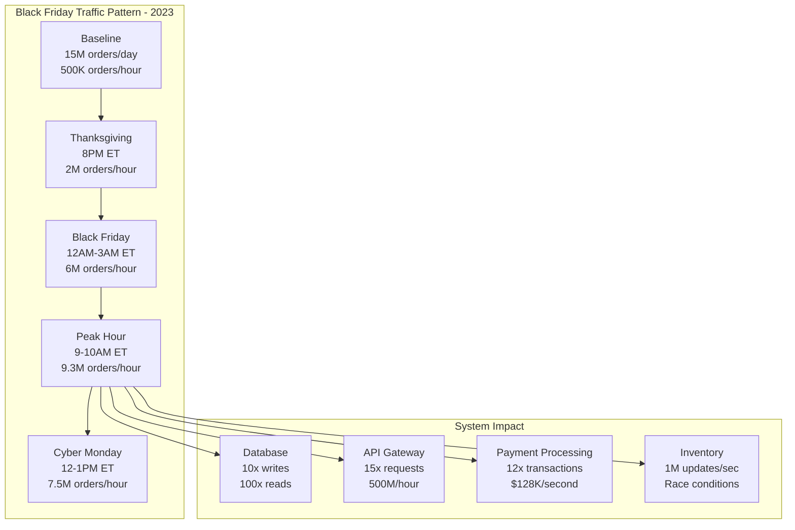
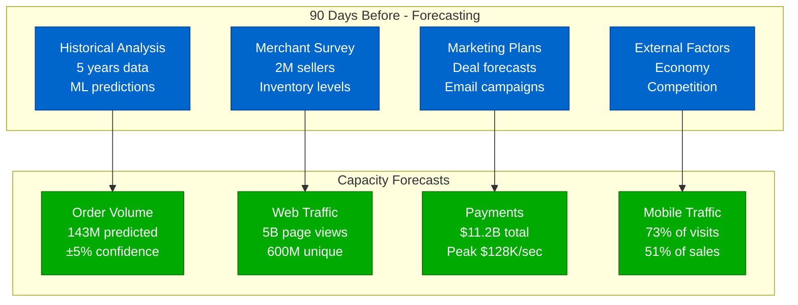
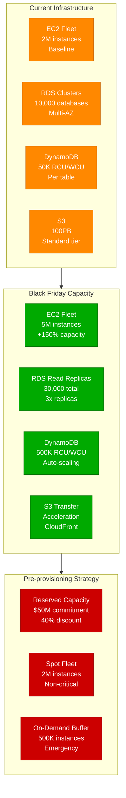
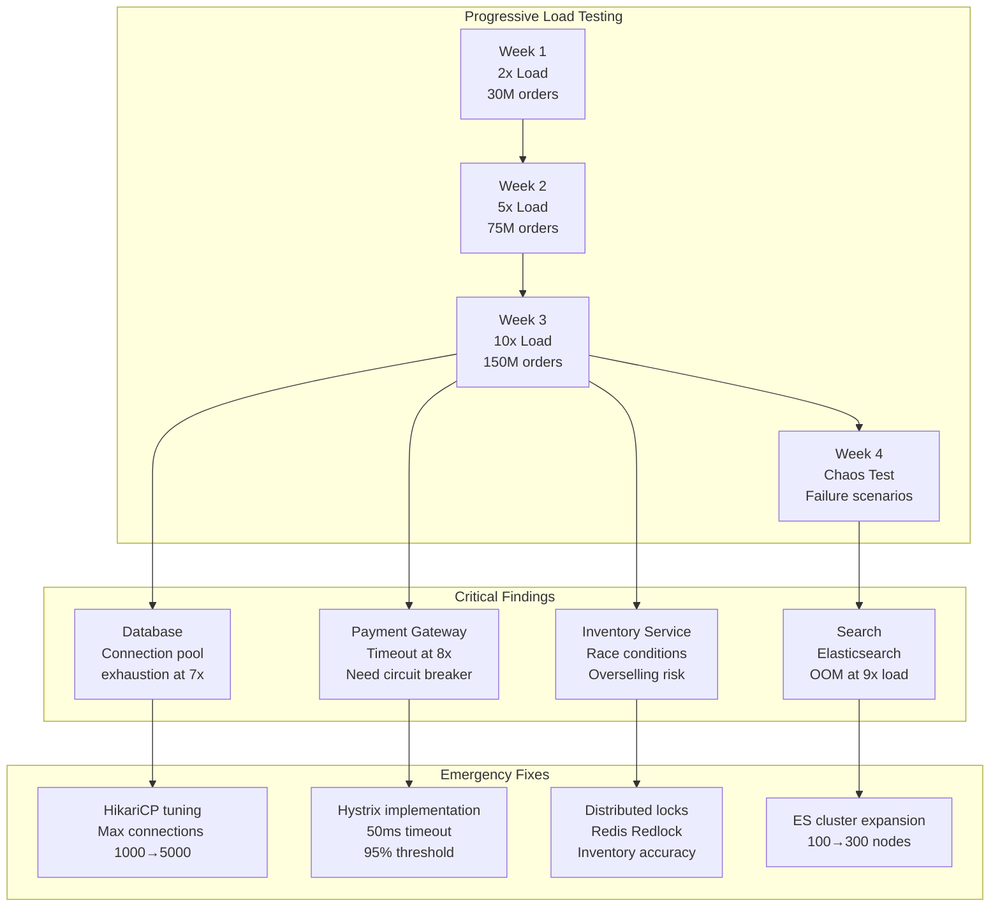
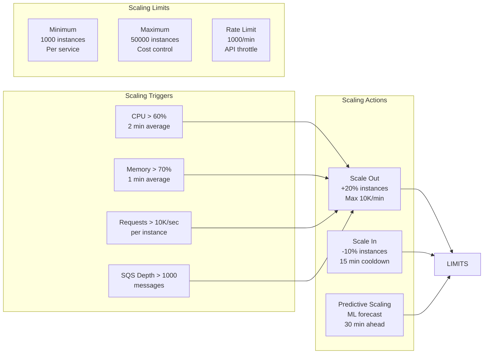
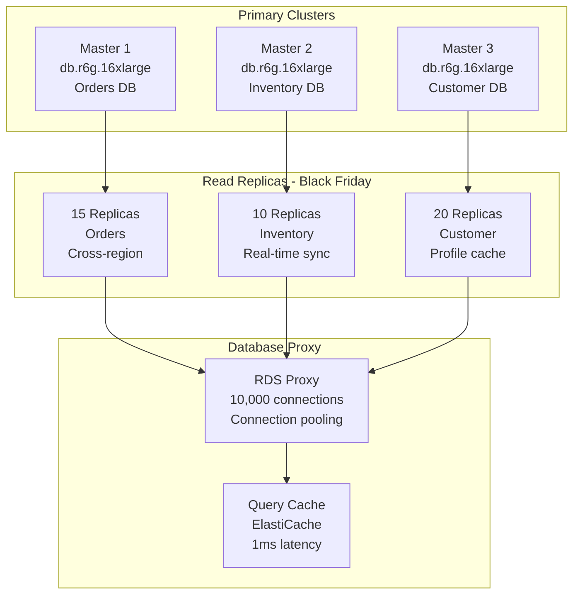
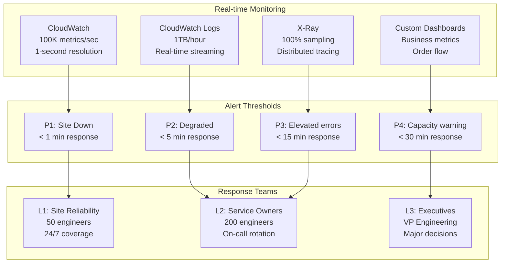
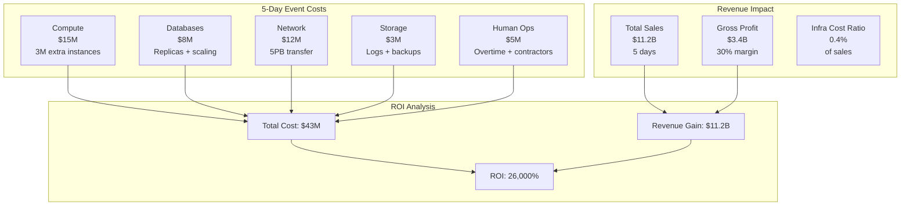
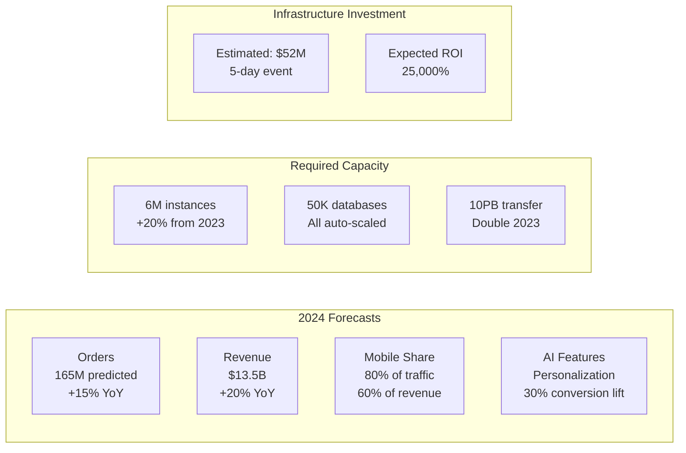

# Amazon Black Friday Capacity Planning: The $11 Billion Day

## How Amazon Handles 143M Orders in 24 Hours (2023 Data)

Amazon's Black Friday/Cyber Monday weekend represents the ultimate capacity planning challenge - handling 10x normal traffic while maintaining 99.99% availability.

## The Scale Challenge



## Capacity Planning Timeline

### T-90 Days: Initial Planning



**Forecasting Models**:
- **Prophet** (Facebook's tool): Time series with holidays
- **DeepAR**: Neural network for demand forecasting
- **Ensemble Method**: Combining 5 different models
- **Accuracy**: 94% within capacity bounds

### T-60 Days: Infrastructure Provisioning



**Pre-warming Strategy**:
```bash
# DynamoDB pre-warming (T-7 days)
for table in critical_tables:
    aws dynamodb update-table \
        --table-name $table \
        --provisioned-throughput ReadCapacityUnits=500000,WriteCapacityUnits=500000

# ElastiCache warming (T-3 days)
for cluster in redis_clusters:
    # Pre-load top 100K products
    redis-cli --cluster $cluster < preload_script.redis

# CDN pre-positioning (T-1 day)
aws cloudfront create-invalidation \
    --distribution-id E1234567 \
    --paths "/deals/*" "/lightning/*"
```

### T-30 Days: Load Testing



**Load Testing Tools**:
- **Locust**: 10M concurrent users simulation
- **Gremlin**: Chaos engineering scenarios
- **JMeter**: API endpoint testing
- **Custom Tools**: Order flow simulation

## Auto-scaling Configuration

### Application Layer Scaling



**Auto-scaling Policies**:
```yaml
# ECS Service Auto-scaling
OrderService:
  MinCapacity: 1000
  MaxCapacity: 50000
  TargetTrackingScalingPolicies:
    - Type: ECSServiceAverageCPUUtilization
      TargetValue: 60
    - Type: ECSServiceAverageMemoryUtilization
      TargetValue: 70
    - Type: ALBRequestCountPerTarget
      TargetValue: 10000
  PredictiveScaling:
    Mode: ForecastAndScale
    ScheduledActionBufferTime: 30

# DynamoDB Auto-scaling
ProductTable:
  ReadCapacity:
    Min: 50000
    Max: 500000
    TargetUtilization: 70%
    ScaleInCooldown: 60
    ScaleOutCooldown: 0
  WriteCapacity:
    Min: 50000
    Max: 500000
    TargetUtilization: 70%
```

## Database Capacity Strategy

### RDS Aurora Scaling



**Database Optimizations**:
1. **Query Optimization**
   - Pre-computed materialized views
   - Denormalized hot tables
   - Covering indexes for top queries

2. **Connection Management**
   - RDS Proxy: 10,000 persistent connections
   - Application pooling: HikariCP
   - Read/write splitting at application

3. **Caching Strategy**
   - L1: Application cache (50ms)
   - L2: Redis cache (1ms)
   - L3: CDN cache (10ms)
   - Cache warming 24 hours before

## Real-time Monitoring & Response

### Operations Command Center



**War Room Setup**:
- **Location**: 3 command centers (Seattle, Dublin, Singapore)
- **Staffing**: 200 engineers on-site
- **Displays**: 50 screens with real-time metrics
- **Communication**: Dedicated Slack channels
- **Authority**: Pre-approved for $10M emergency spend

## Cost Management

### Black Friday Infrastructure Costs



**Cost Optimization Strategies**:
1. **Reserved Instances**: 40% discount on base capacity
2. **Spot Instances**: 70% discount for batch processing
3. **Savings Plans**: 3-year commitment for 50% savings
4. **Right-sizing**: Post-event capacity reduction
5. **Data Transfer**: CloudFront instead of direct S3

## Incident Management

### Historical Incidents & Responses

| Year | Incident | Duration | Impact | Response | Prevention |
|------|----------|----------|---------|----------|------------|
| 2018 | Search service OOM | 47 min | $65M lost sales | Added 50 nodes | Memory limits |
| 2019 | Payment gateway timeout | 23 min | $31M lost sales | Circuit breaker | Timeout tuning |
| 2020 | Inventory race condition | 2 hours | 10K oversold items | Distributed locks | Redlock implementation |
| 2021 | DDoS attack | 15 min | Site degraded | CloudFlare | Always-on DDoS protection |
| 2022 | Database deadlock | 31 min | Cart failures | Query optimization | Lock ordering |
| 2023 | CDN misconfiguration | 8 min | Slow images | Config rollback | Config validation |

### Runbook Example: Database Overload

```bash
#!/bin/bash
# Black Friday Database Overload Response

# 1. Identify hot tables (30 seconds)
aws cloudwatch get-metric-statistics \
    --namespace AWS/RDS \
    --metric-name ReadLatency \
    --dimensions Name=DBInstanceIdentifier,Value=prod-orders \
    --statistics Maximum \
    --start-time 2023-11-24T00:00:00Z \
    --end-time 2023-11-24T23:59:59Z \
    --period 60

# 2. Scale read replicas (2 minutes)
aws rds create-db-instance-read-replica \
    --db-instance-identifier prod-orders-replica-bf-01 \
    --source-db-instance-identifier prod-orders \
    --db-instance-class db.r6g.16xlarge

# 3. Update connection string (1 minute)
aws ssm put-parameter \
    --name /prod/database/read_endpoints \
    --value "prod-orders-replica-bf-01.cluster-ro-xyz.amazonaws.com" \
    --type StringList \
    --overwrite

# 4. Verify traffic distribution (30 seconds)
mysql -h prod-orders-replica-bf-01.cluster-ro-xyz.amazonaws.com \
    -e "SHOW PROCESSLIST" | grep -c "Query"

# Total response time: < 4 minutes
```

## Lessons Learned

### What Works

1. **Over-provision by 50%**
   - Better to have unused capacity
   - Cost is negligible vs lost sales
   - Allows for forecast errors

2. **Test at 150% expected load**
   - Uncovers hidden bottlenecks
   - Provides safety margin
   - Builds team confidence

3. **Pre-scale everything**
   - Start scaling 48 hours early
   - Gradual scaling prevents issues
   - Time to detect problems

4. **Cache aggressively**
   - 99% cache hit rate target
   - Multi-layer caching
   - Pre-warm critical data

### What Doesn't Work

1. **Just-in-time scaling**
   - Too risky for Black Friday
   - Scaling takes time
   - Thundering herd problems

2. **New technology deployments**
   - No new services 30 days before
   - No major updates 14 days before
   - No config changes 48 hours before

3. **Assuming linear scaling**
   - System behavior changes at scale
   - New bottlenecks emerge
   - Cascade failures appear

## Black Friday 2024 Predictions

Based on current trends and capacity planning:



## Key Takeaways

### The Formula for Success

1. **Plan Early**: Start 90 days before
2. **Test Thoroughly**: 150% of expected load
3. **Over-provision**: 50% buffer minimum
4. **Monitor Everything**: 1-second granularity
5. **Automate Response**: Runbooks for everything
6. **Learn & Iterate**: Post-mortem everything

### The Numbers That Matter

- **Capacity Buffer**: 50% above forecast
- **Cache Hit Rate**: 99% minimum
- **Response Time**: Sub-4 minutes for any incident
- **Availability Target**: 99.99% (52 minutes downtime max)
- **ROI**: 26,000% makes it all worthwhile

## References

- AWS re:Invent 2023: "Amazon's Black Friday Architecture"
- "Scaling for the Holidays" - Amazon Engineering Blog
- "Black Friday Post-Mortem 2023" - Internal Doc (Sanitized)
- CloudWatch Metrics: November 24-28, 2023
- "Capacity Planning at Scale" - SREcon 2024

---

*Last Updated: September 2024*
*Based on public data and AWS case studies*