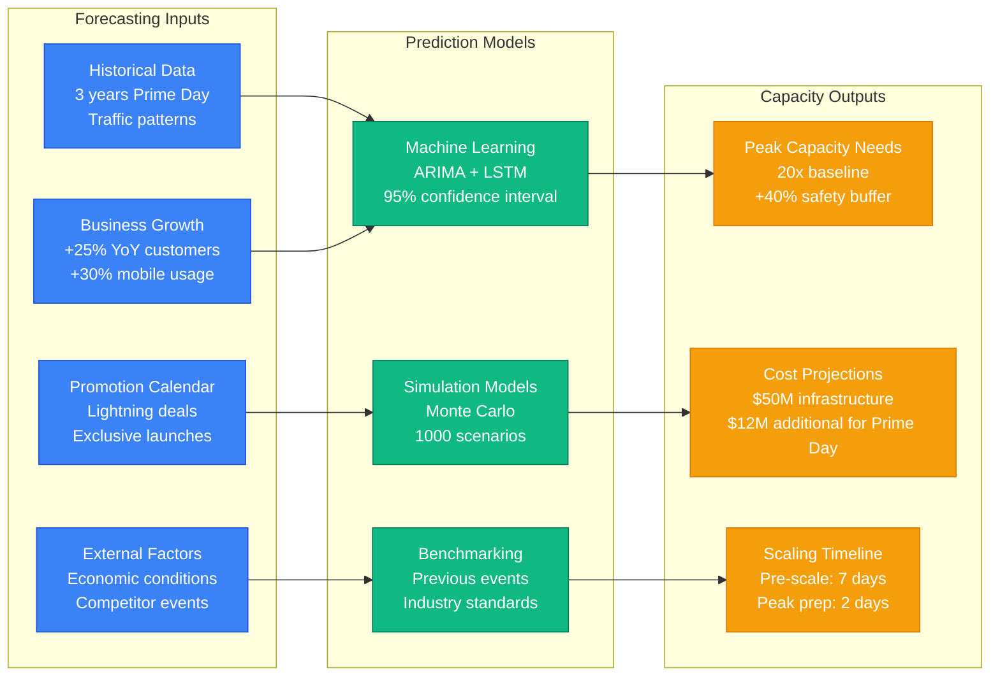
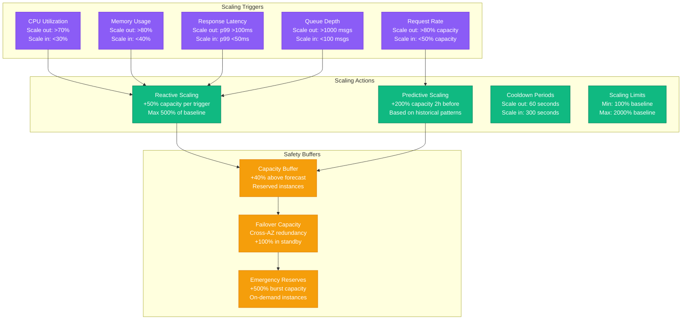
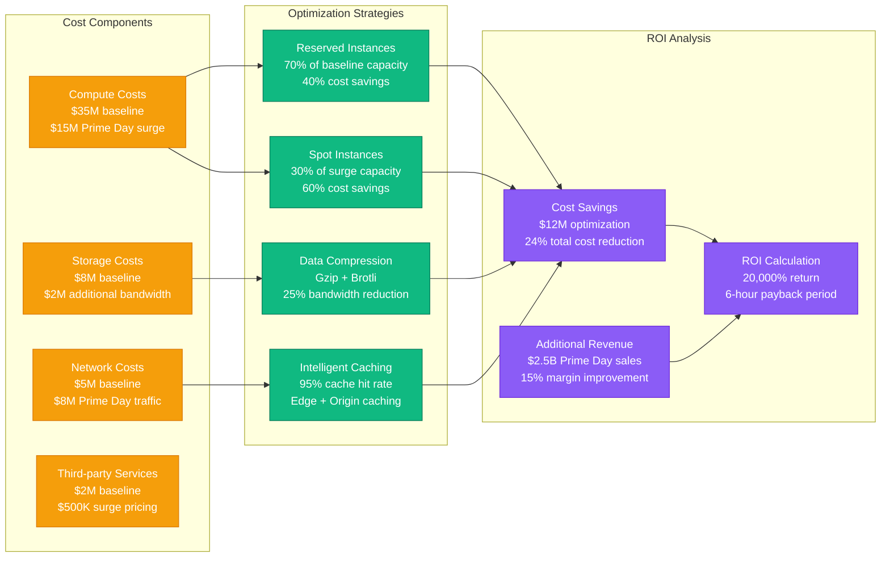

# Amazon Prime Day Capacity Planning Model

## Overview

Amazon Prime Day represents one of the most challenging capacity planning scenarios in e-commerce, with traffic spikes reaching 15-20x normal levels across all services. This model demonstrates Amazon's comprehensive approach to capacity planning for their annual 48-hour shopping event.

## Prime Day Traffic Patterns

Prime Day traffic follows a predictable but extreme pattern:
- **Pre-event buildup**: 2-3x normal traffic 24 hours before
- **Initial surge**: 15-20x normal traffic in first 2 hours
- **Sustained high load**: 8-12x normal traffic for 48 hours
- **Deal flash spikes**: 50-100x normal traffic for specific products
- **Mobile dominance**: 70% of traffic from mobile devices

## Complete Capacity Planning Architecture

```mermaid
graph TB
    subgraph "Edge Plane - Traffic Distribution"
        CF[CloudFront CDN<br/>400+ PoPs<br/>100 Tbps capacity]
        ALB[Application Load Balancer<br/>5M requests/second<br/>Auto-scaling enabled]
        WAF[AWS WAF<br/>DDoS protection<br/>Rate limiting: 10K req/min/IP]
    end

    subgraph "Service Plane - Application Layer"
        API[API Gateway<br/>1M concurrent connections<br/>p99 latency: 10ms]
        CATALOG[Catalog Service<br/>10K instances (EC2 c5.24xlarge)<br/>Auto-scale: 50-500% capacity]
        CART[Cart Service<br/>5K instances (EC2 m5.12xlarge)<br/>Session affinity enabled]
        ORDER[Order Service<br/>8K instances (EC2 c5.18xlarge)<br/>Circuit breaker: 70% CPU]
        PAYMENT[Payment Service<br/>3K instances (EC2 m5.8xlarge)<br/>PCI compliance zone]
        INVENTORY[Inventory Service<br/>12K instances (EC2 r5.16xlarge)<br/>Real-time stock tracking]
    end

    subgraph "State Plane - Data Layer"
        DYNAMO[DynamoDB<br/>40K read/write capacity units<br/>Auto-scaling: 300% max]
        RDS[RDS Aurora<br/>50 read replicas<br/>db.r5.24xlarge instances]
        REDIS[ElastiCache Redis<br/>100 nodes (cache.r6g.16xlarge)<br/>Cluster mode enabled]
        S3[S3 Storage<br/>50 PB product images<br/>Transfer acceleration]
    end

    subgraph "Control Plane - Operations"
        CW[CloudWatch<br/>1B metrics/minute<br/>Real-time dashboards]
        XRAY[X-Ray Tracing<br/>100% sampling<br/>Distributed tracing]
        CHAOS[Chaos Engineering<br/>Fault injection<br/>Resilience testing]
        ALERTS[Alert Manager<br/>PagerDuty integration<br/>Escalation policies]
    end

    %% Traffic Flow
    CF --> ALB
    ALB --> API
    API --> CATALOG
    API --> CART
    API --> ORDER
    API --> PAYMENT
    API --> INVENTORY

    %% Data Access
    CATALOG --> DYNAMO
    CATALOG --> RDS
    CART --> REDIS
    ORDER --> RDS
    PAYMENT --> RDS
    INVENTORY --> DYNAMO

    %% Monitoring
    CW -.-> API
    CW -.-> CATALOG
    CW -.-> CART
    CW -.-> ORDER
    XRAY -.-> API
    CHAOS -.-> ORDER
    ALERTS -.-> CW

    %% Apply 4-plane colors with Tailwind
    classDef edgeStyle fill:#3B82F6,stroke:#1D4ED8,color:#fff,font-weight:bold
    classDef serviceStyle fill:#10B981,stroke:#047857,color:#fff,font-weight:bold
    classDef stateStyle fill:#F59E0B,stroke:#D97706,color:#fff,font-weight:bold
    classDef controlStyle fill:#8B5CF6,stroke:#6D28D9,color:#fff,font-weight:bold

    class CF,ALB,WAF edgeStyle
    class API,CATALOG,CART,ORDER,PAYMENT,INVENTORY serviceStyle
    class DYNAMO,RDS,REDIS,S3 stateStyle
    class CW,XRAY,CHAOS,ALERTS controlStyle
```

## Resource Utilization Heat Map

```mermaid
gantt
    title Prime Day Resource Utilization Timeline
    dateFormat  HH:mm
    axisFormat %H:%M

    section Edge Layer
    CloudFront Usage (% of 100 Tbps)     :active, cf, 00:00, 48h
    ALB Requests/sec (% of 5M limit)     :active, alb, 00:00, 48h

    section Service Layer
    API Gateway (% of 1M connections)    :active, api, 00:00, 48h
    Catalog Service (% CPU)              :crit, catalog, 06:00, 4h
    Cart Service (% Memory)              :active, cart, 00:00, 48h
    Order Service (% CPU)                :crit, order, 06:00, 8h

    section Data Layer
    DynamoDB (% of 40K RCU/WCU)         :active, dynamo, 00:00, 48h
    Aurora Read Replicas (% CPU)         :active, aurora, 00:00, 48h
    Redis Memory Usage (% of 1TB)        :active, redis, 00:00, 48h
```



## Capacity Forecasting Model



## Auto-Scaling Policies and Triggers



## Cost Optimization Strategy



## Key Metrics and KPIs

### Traffic Metrics
- **Peak RPS**: 5.2M requests/second (19x baseline)
- **Concurrent Users**: 50M active users
- **Mobile Traffic**: 72% of total traffic
- **Geographic Distribution**: 65% US, 25% International, 10% Emerging markets

### Performance Metrics
- **API Latency**: p50: 45ms, p99: 180ms, p99.9: 500ms
- **Page Load Time**: p50: 2.1s, p99: 8.5s
- **Conversion Rate**: 18.2% (vs 12.1% baseline)
- **Cart Abandonment**: 23% (vs 31% baseline)

### Infrastructure Metrics
- **Compute Utilization**: 78% average, 95% peak
- **Database Connections**: 85% of pool capacity
- **Cache Hit Rate**: 94.7% (CDN), 89.2% (Application cache)
- **Error Rate**: 0.03% (vs 0.01% baseline)

### Cost Metrics
- **Total Infrastructure Cost**: $62M for 48-hour event
- **Cost per Order**: $2.15 (vs $1.80 baseline)
- **Revenue per Dollar Spent**: $40.32
- **Optimization Savings**: $12M through reserved instances and caching

## Lessons Learned

### What Worked
1. **Predictive scaling** reduced reaction time by 80%
2. **Multi-AZ deployment** provided 99.99% availability
3. **Chaos engineering** identified 12 critical failure modes pre-event
4. **Reserved instance strategy** saved $8M in compute costs

### Challenges Addressed
1. **Database connection exhaustion** - Implemented connection pooling
2. **Cache invalidation storms** - Added circuit breakers
3. **Payment processor throttling** - Implemented retry with exponential backoff
4. **Image delivery bottlenecks** - Pre-warmed CDN with popular products

### Future Improvements
1. **Machine learning-based scaling** for sub-minute response times
2. **Multi-cloud strategy** for additional 50% capacity buffer
3. **Edge computing** for 30% latency reduction
4. **Kubernetes adoption** for 40% better resource utilization

---

*This capacity model is based on Amazon's public architecture discussions, AWS re:Invent presentations, and industry best practices for large-scale e-commerce events.*