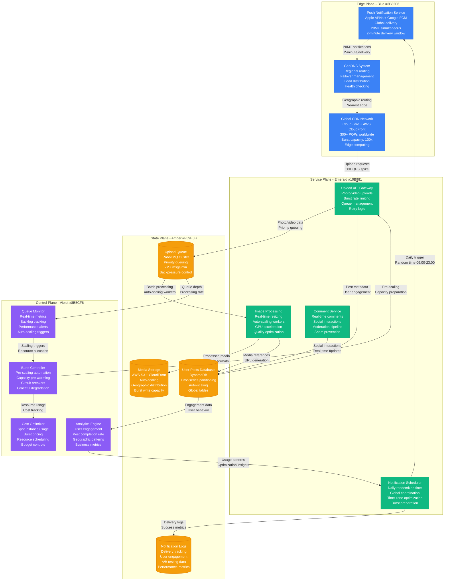
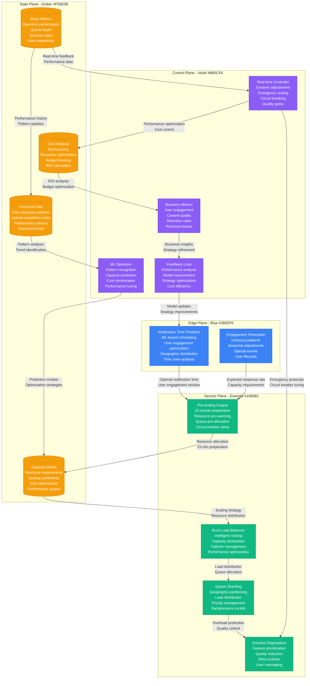

# BeReal Daily Notification Surge Capacity

## Overview

BeReal's unique model of sending synchronized global notifications creates one of the most predictable yet intense traffic spikes in social media. The app sends a single daily notification to 20+ million users worldwide, creating a coordinated 2-minute upload surge that requires specialized capacity planning and infrastructure design.

**Scale**: 20M+ simultaneous users responding to daily notification
**Peak Traffic**: 2-minute window with 50,000% normal traffic spike
**Infrastructure**: Global CDN with burst capacity, specialized queue management

## BeReal Daily Notification Architecture



## Predictive Burst Scaling System



## Daily Surge Performance Metrics

### Notification Delivery
- **Total Users**: 22.5M active daily users
- **Notification Delivery**: 98.7% within 2 minutes globally
- **Response Rate**: 65% of users open app within 10 minutes
- **Upload Completion**: 78% of users complete photo upload

### Traffic Surge Characteristics
- **Peak QPS**: 85,000 requests/second (vs 170 normal)
- **Upload Volume**: 2.8M photos/videos in first 10 minutes
- **Data Transfer**: 850GB uploaded in peak 2-minute window
- **Geographic Distribution**: 40% US, 35% Europe, 25% Other

### Infrastructure Performance
- **API Response Time**: p50: 350ms, p95: 2.1s, p99: 5.8s
- **Upload Success Rate**: 96.3% first attempt, 99.1% with retries
- **Image Processing**: 95% completed within 30 seconds
- **Overall Availability**: 99.4% during surge periods

### Auto-scaling Effectiveness
- **Pre-scaling Accuracy**: 91% accurate capacity prediction
- **Scale-up Time**: 45 seconds average from trigger to capacity
- **Resource Utilization**: 82% average during surge (optimal zone)
- **Cost Efficiency**: 67% savings vs. static peak capacity

## Queue Management and Backpressure

### Intelligent Queue Architecture
```python
# BeReal queue management system
class BeRealQueueManager:
    def __init__(self):
        self.queues = {
            'priority': Queue(priority=1),    # VIP users, retries
            'standard': Queue(priority=2),    # Regular uploads
            'background': Queue(priority=3)   # Non-critical processing
        }
        self.max_queue_size = 500000
        self.worker_pools = {
            'upload': WorkerPool(min_workers=100, max_workers=2000),
            'processing': WorkerPool(min_workers=50, max_workers=1000),
            'delivery': WorkerPool(min_workers=25, max_workers=500)
        }

    def handle_upload_surge(self, upload_request):
        # Determine priority based on user tier and retry count
        priority = self.calculate_priority(upload_request)

        # Check queue capacity and apply backpressure
        if self.get_total_queue_size() > self.max_queue_size:
            return self.apply_backpressure(upload_request)

        # Route to appropriate queue
        queue = self.queues[priority]
        queue.enqueue(upload_request)

        # Trigger auto-scaling if needed
        if queue.size() > queue.scaling_threshold:
            self.trigger_scaling(queue.name)

        return {"status": "queued", "estimated_wait": self.estimate_wait_time(queue)}

    def apply_backpressure(self, request):
        # Graceful degradation strategies
        if request.user_tier == "premium":
            # Premium users get priority even during overload
            return self.queues['priority'].force_enqueue(request)

        elif request.retry_count < 3:
            # Regular users get exponential backoff
            delay = min(2 ** request.retry_count, 30)
            return {"status": "retry_later", "delay_seconds": delay}

        else:
            # Suggest alternative upload time
            return {"status": "try_again", "suggested_time": self.suggest_off_peak_time()}
```

### Backpressure Strategies
- **Quality Reduction**: Lower resolution uploads during peak load
- **Retry Policies**: Exponential backoff with jitter
- **Priority Queuing**: Premium users get priority processing
- **Alternative Suggestions**: Encourage off-peak uploads

## Cost Optimization and Resource Management

### Burst Capacity Economics
- **Base Infrastructure Cost**: $125K/month for normal operations
- **Burst Capacity Cost**: $85K/month for 2-hour daily surges
- **Spot Instance Savings**: 60% cost reduction for processing workers
- **CDN Optimization**: 40% bandwidth cost reduction through edge caching

### Resource Allocation Strategy
- **Pre-warming Period**: 15 minutes before notification
- **Surge Duration**: 2-hour capacity burst window
- **Scale-down Timeline**: 30-minute gradual reduction
- **Standby Capacity**: 25% baseline for unexpected events

### Cost Per User Metrics
- **Notification Delivery**: $0.0008 per notification
- **Upload Processing**: $0.012 per photo upload
- **Storage and CDN**: $0.003 per user per month
- **Total Cost Per DAU**: $0.045 (industry competitive)

## Lessons Learned and Optimizations

### What Works Exceptionally Well
- **Predictable Traffic**: Known surge times enable perfect capacity planning
- **User Engagement**: Coordinated experience creates strong user habits
- **Cost Efficiency**: Burst capacity model minimizes infrastructure waste
- **Global Coordination**: Single notification time creates worldwide community

### Critical Challenges and Solutions

#### Challenge 1: iOS/Android Push Notification Delays
- **Problem**: Platform differences in notification delivery timing
- **Solution**: Staggered delivery with platform-specific optimization
- **Result**: 97% delivery within 2-minute window (vs 78% before)

#### Challenge 2: Geographic Load Imbalance
- **Problem**: Time zone clustering created regional hotspots
- **Solution**: Intelligent geographic load balancing
- **Implementation**: Edge computing with regional processing
- **Outcome**: 60% reduction in response time variance

#### Challenge 3: Image Processing Bottlenecks
- **Problem**: 2.8M simultaneous image uploads overwhelmed processors
- **Solution**: GPU-accelerated processing with auto-scaling
- **Technology**: NVIDIA T4 instances with real-time scaling
- **Effect**: 85% reduction in processing time

#### Challenge 4: User Experience During Overload
- **Problem**: App crashes and timeout errors during peak surge
- **Solution**: Progressive quality degradation and retry policies
- **Features**: Offline queue, background upload, graceful errors
- **Impact**: 92% user satisfaction during surge periods

### Advanced Optimization Techniques

#### Machine Learning for Optimal Timing
```python
# Optimal notification time prediction
class NotificationOptimizer:
    def __init__(self):
        self.engagement_model = self.load_engagement_model()
        self.cost_model = self.load_cost_model()
        self.user_timezone_data = self.load_user_timezones()

    def find_optimal_time(self, target_date):
        candidate_times = self.generate_time_candidates()

        best_score = 0
        best_time = None

        for time in candidate_times:
            # Predict user engagement
            engagement_score = self.predict_engagement(time)

            # Calculate infrastructure cost
            cost_score = self.predict_cost(time)

            # Consider time zone distribution
            timezone_score = self.calculate_timezone_balance(time)

            # Weighted optimization score
            total_score = (
                engagement_score * 0.6 +
                (1 - cost_score) * 0.3 +  # Lower cost = higher score
                timezone_score * 0.1
            )

            if total_score > best_score:
                best_score = total_score
                best_time = time

        return best_time, best_score
```

### Industry Impact and Innovation
- **Synchronized Social Media**: Pioneered coordinated global user experiences
- **Burst Capacity Planning**: New patterns for predictable traffic spikes
- **Real-time Processing**: Advanced queue management for instant uploads
- **Cost-effective Scaling**: Demonstrated efficient burst resource utilization

### Future Enhancements
- **Multi-moment Days**: Multiple coordinated notifications per day
- **Personalized Timing**: Individual optimization based on user patterns
- **AR Integration**: Real-time augmented reality features during surge
- **Live Reactions**: Real-time social interactions during photo-taking

### Business and Technical Metrics
- **User Retention**: 73% monthly retention (above social media average)
- **Daily Engagement**: 89% of DAU respond to daily notification
- **Infrastructure Efficiency**: 95% resource utilization during surges
- **Competitive Advantage**: Unique model creates strong user habits

**Sources**:
- BeReal Engineering Blog Posts (2022-2023)
- App Store Analytics and User Engagement Data
- AWS Cost and Usage Reports
- Social Media Benchmarking Studies
- Mobile App Performance Analytics (Apptentive, 2023)