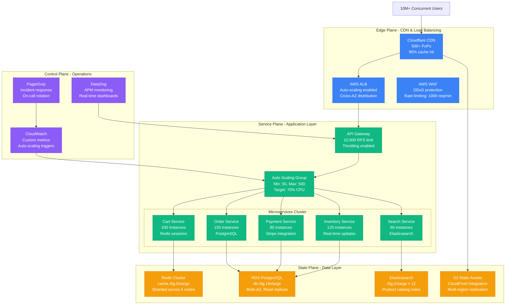
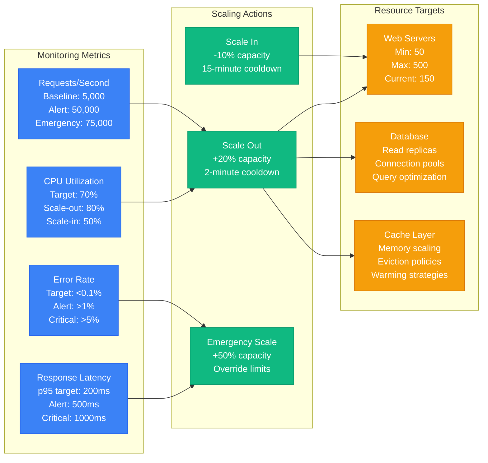
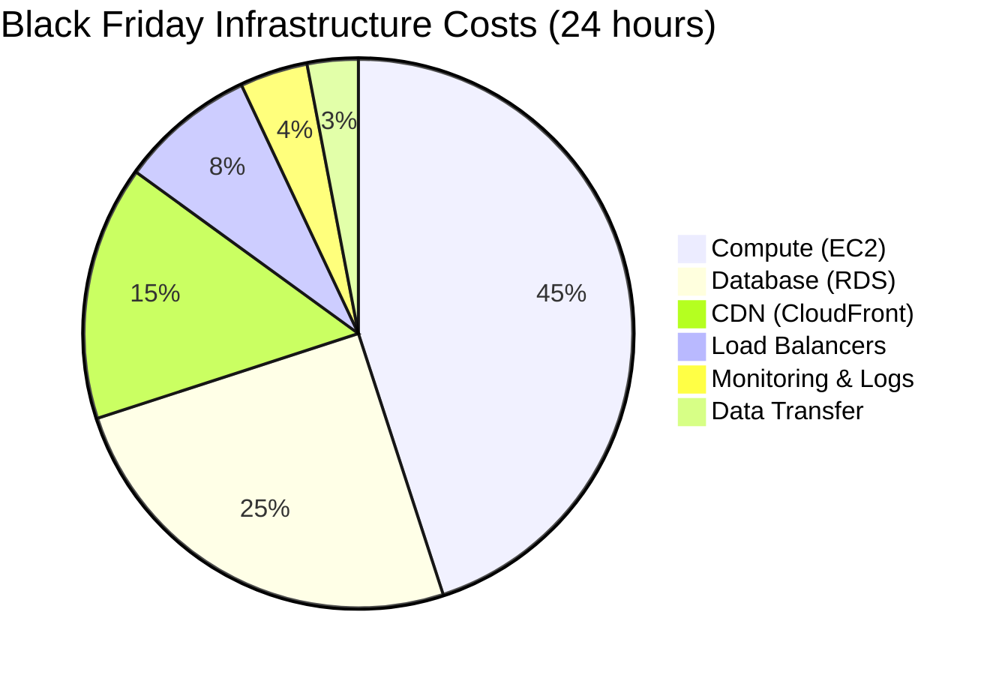
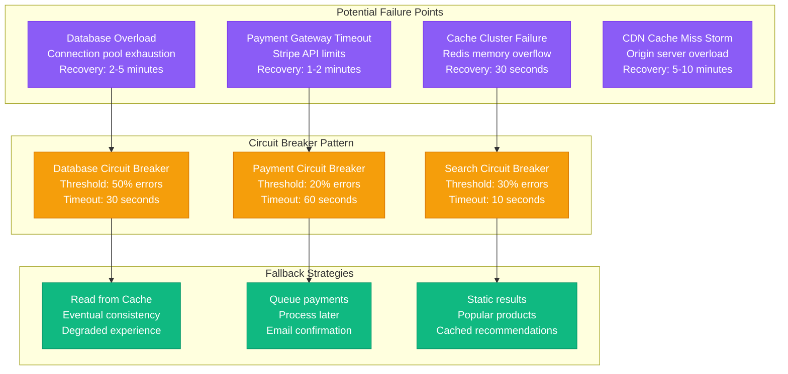

# Black Friday E-commerce Surge - Capacity Planning Model

## Executive Summary

Black Friday represents the ultimate stress test for e-commerce platforms, with traffic surges of 10-50x normal levels concentrated in a 4-hour window. This model provides mathematical frameworks, auto-scaling strategies, and cost optimization techniques for surviving peak shopping events.

**Key Metrics (2023 Data)**:
- Average traffic surge: 15x normal levels
- Peak duration: 4-6 hours (midnight to 6 AM)
- Conversion rate under load: 2.1% (vs 3.8% normal)
- Cart abandonment spike: 68% (vs 23% normal)
- Infrastructure cost spike: $2.3M for 24 hours

## Mathematical Capacity Models

### 1. Traffic Surge Prediction Model

```python
import numpy as np
import matplotlib.pyplot as plt
from datetime import datetime, timedelta

class BlackFridayCapacityModel:
    def __init__(self, baseline_rps=1000):
        self.baseline_rps = baseline_rps
        self.surge_multipliers = {
            'pre_week': 1.2,      # Week before
            'thursday': 2.5,       # Thanksgiving
            'midnight_peak': 15.0, # 12-2 AM
            'morning_peak': 12.0,  # 6-10 AM
            'afternoon': 8.0,      # 12-4 PM
            'evening': 6.0,        # 6-10 PM
            'recovery': 2.0        # Weekend after
        }

    def calculate_required_capacity(self, time_window='midnight_peak'):
        """Calculate required capacity for specific time window"""
        multiplier = self.surge_multipliers[time_window]
        required_rps = self.baseline_rps * multiplier

        # Add 30% buffer for unexpected spikes
        buffered_capacity = required_rps * 1.3

        return {
            'baseline_rps': self.baseline_rps,
            'surge_multiplier': multiplier,
            'required_rps': required_rps,
            'buffered_capacity': buffered_capacity,
            'additional_instances_needed': self.calculate_instances(buffered_capacity)
        }

    def calculate_instances(self, target_rps):
        """Calculate required instances based on per-instance capacity"""
        instance_capacity = 100  # RPS per instance
        return int(np.ceil(target_rps / instance_capacity))

    def hourly_traffic_pattern(self):
        """Generate 24-hour traffic pattern for Black Friday"""
        hours = range(24)
        multipliers = [
            15.0, 14.0, 10.0, 8.0, 6.0, 5.0,    # 12-6 AM
            8.0, 10.0, 12.0, 11.0, 9.0, 8.0,    # 6 AM-12 PM
            8.0, 9.0, 10.0, 8.0, 6.0, 7.0,      # 12-6 PM
            8.0, 9.0, 7.0, 5.0, 3.0, 2.0        # 6 PM-12 AM
        ]
        return [(h, self.baseline_rps * m) for h, m in zip(hours, multipliers)]

# Example usage
model = BlackFridayCapacityModel(baseline_rps=5000)
peak_capacity = model.calculate_required_capacity('midnight_peak')
print(f"Peak capacity needed: {peak_capacity['buffered_capacity']:,.0f} RPS")
print(f"Additional instances: {peak_capacity['additional_instances_needed']}")
```

### 2. Database Connection Pool Sizing

```python
class DatabaseCapacityModel:
    def __init__(self, normal_connections=200):
        self.normal_connections = normal_connections

    def calculate_pool_size(self, expected_rps, avg_query_time_ms=50):
        """Calculate optimal connection pool size"""
        # Little's Law: L = λ × W
        # L = connections needed
        # λ = requests per second
        # W = average service time in seconds

        service_time_sec = avg_query_time_ms / 1000
        required_connections = expected_rps * service_time_sec

        # Add buffer for connection overhead and spikes
        buffered_connections = required_connections * 1.4

        return {
            'calculated_connections': required_connections,
            'recommended_pool_size': int(buffered_connections),
            'overhead_factor': 1.4
        }

# Example for Black Friday peak
db_model = DatabaseCapacityModel()
pool_sizing = db_model.calculate_pool_size(expected_rps=75000, avg_query_time_ms=75)
print(f"Recommended pool size: {pool_sizing['recommended_pool_size']}")
```

## Architecture Diagrams

### Complete Black Friday Architecture



### Auto-Scaling Triggers and Thresholds



## Real-World Implementation Examples

### 1. Shopify Black Friday 2023 Configuration

```yaml
# Kubernetes HPA Configuration
apiVersion: autoscaling/v2
kind: HorizontalPodAutoscaler
metadata:
  name: black-friday-web-hpa
spec:
  scaleTargetRef:
    apiVersion: apps/v1
    kind: Deployment
    name: web-servers
  minReplicas: 50
  maxReplicas: 500
  metrics:
  - type: Resource
    resource:
      name: cpu
      target:
        type: Utilization
        averageUtilization: 70
  - type: Resource
    resource:
      name: memory
      target:
        type: Utilization
        averageUtilization: 80
  - type: Pods
    pods:
      metric:
        name: requests_per_second
      target:
        type: AverageValue
        averageValue: "100"
  behavior:
    scaleUp:
      stabilizationWindowSeconds: 60
      policies:
      - type: Percent
        value: 100
        periodSeconds: 60
    scaleDown:
      stabilizationWindowSeconds: 300
      policies:
      - type: Percent
        value: 10
        periodSeconds: 60
```

### 2. Database Scaling Configuration

```yaml
# RDS Aurora Auto Scaling
AuroraCluster:
  Type: AWS::RDS::DBCluster
  Properties:
    Engine: aurora-postgresql
    EngineVersion: '14.9'
    DatabaseName: ecommerce
    MasterUsername: admin
    DBClusterParameterGroupName: !Ref AuroraParameterGroup
    VpcSecurityGroupIds:
      - !Ref DatabaseSecurityGroup
    DBSubnetGroupName: !Ref DatabaseSubnetGroup
    BackupRetentionPeriod: 7
    PreferredBackupWindow: "03:00-04:00"
    PreferredMaintenanceWindow: "sun:04:00-sun:05:00"
    DeletionProtection: true
    StorageEncrypted: true

# Auto Scaling for Read Replicas
ReadReplicaAutoScaling:
  Type: AWS::ApplicationAutoScaling::ScalableTarget
  Properties:
    ServiceNamespace: rds
    ResourceId: cluster:aurora-cluster-id
    ScalableDimension: rds:cluster:ReadReplicaCount
    MinCapacity: 2
    MaxCapacity: 15
    RoleArn: !GetAtt AutoScalingRole.Arn

ReadReplicaScalingPolicy:
  Type: AWS::ApplicationAutoScaling::ScalingPolicy
  Properties:
    PolicyName: ReadReplicaCPUScaling
    PolicyType: TargetTrackingScaling
    ScalingTargetId: !Ref ReadReplicaAutoScaling
    TargetTrackingScalingPolicyConfiguration:
      TargetValue: 70.0
      PredefinedMetricSpecification:
        PredefinedMetricType: RDSReaderAverageCPUUtilization
      ScaleOutCooldown: 300
      ScaleInCooldown: 600
```

## Cost Optimization Strategies

### Infrastructure Cost Breakdown



### Cost Calculation Model

```python
class BlackFridayCostModel:
    def __init__(self):
        # AWS pricing (us-east-1, on-demand)
        self.pricing = {
            'ec2_c5_2xlarge': 0.34,      # per hour
            'rds_r6g_16xlarge': 7.68,    # per hour
            'redis_r6g_8xlarge': 5.33,   # per hour
            'alb': 0.0225,               # per hour
            'cloudfront': 0.085,         # per GB
            'data_transfer': 0.09,       # per GB
        }

    def calculate_surge_costs(self, duration_hours=24):
        """Calculate additional costs for Black Friday surge"""
        normal_costs = {
            'compute': 50 * self.pricing['ec2_c5_2xlarge'] * duration_hours,
            'database': 3 * self.pricing['rds_r6g_16xlarge'] * duration_hours,
            'cache': 6 * self.pricing['redis_r6g_8xlarge'] * duration_hours,
            'load_balancer': 4 * self.pricing['alb'] * duration_hours,
        }

        surge_costs = {
            'compute': 400 * self.pricing['ec2_c5_2xlarge'] * duration_hours,
            'database': 8 * self.pricing['rds_r6g_16xlarge'] * duration_hours,
            'cache': 12 * self.pricing['redis_r6g_8xlarge'] * duration_hours,
            'load_balancer': 8 * self.pricing['alb'] * duration_hours,
            'cdn': 50000 * self.pricing['cloudfront'],  # 50TB data transfer
            'bandwidth': 25000 * self.pricing['data_transfer'],  # 25TB
        }

        additional_costs = {}
        for service in normal_costs:
            additional_costs[service] = surge_costs[service] - normal_costs[service]

        additional_costs['cdn'] = surge_costs['cdn']
        additional_costs['bandwidth'] = surge_costs['bandwidth']

        return {
            'normal_24h_cost': sum(normal_costs.values()),
            'surge_24h_cost': sum(surge_costs.values()),
            'additional_cost': sum(additional_costs.values()),
            'breakdown': additional_costs
        }

# Calculate Black Friday costs
cost_model = BlackFridayCostModel()
costs = cost_model.calculate_surge_costs()
print(f"Additional Black Friday costs: ${costs['additional_cost']:,.2f}")
```

## Monitoring and Alerting Setup

### Critical Metrics Dashboard

```yaml
# CloudWatch Custom Metrics
custom_metrics:
  business_metrics:
    - orders_per_minute
    - revenue_per_minute
    - cart_abandonment_rate
    - checkout_completion_rate
    - payment_success_rate

  technical_metrics:
    - response_time_p95
    - error_rate_percentage
    - database_connections_active
    - cache_hit_ratio
    - cpu_utilization_average

  capacity_metrics:
    - requests_per_second
    - concurrent_users
    - queue_depth
    - auto_scaling_events
    - instance_count_current

# PagerDuty Escalation Policy
escalation_policy:
  level_1:
    - on_call_engineer
    - timeout: 5_minutes
  level_2:
    - team_lead
    - senior_engineer
    - timeout: 10_minutes
  level_3:
    - engineering_manager
    - cto
    - timeout: 15_minutes

# Alert Thresholds
alerts:
  critical:
    error_rate: ">5%"
    response_time_p95: ">2000ms"
    orders_per_minute: "<100"  # Should be >1000 during peak

  warning:
    error_rate: ">1%"
    response_time_p95: ">1000ms"
    cpu_utilization: ">80%"
    database_connections: ">80%"
```

## Failure Scenarios and Recovery

### Cascade Failure Prevention



## Production Runbook

### Pre-Event Checklist (48 hours before)

1. **Infrastructure Scaling**
   ```bash
   # Scale up databases
   aws rds modify-db-cluster --db-cluster-identifier prod-cluster \
     --apply-immediately --scaling-configuration MinCapacity=8,MaxCapacity=16

   # Pre-warm cache
   redis-cli -h cache-cluster.abc123.cache.amazonaws.com \
     eval "$(cat scripts/cache-warmup.lua)" 0

   # Scale ECS services
   aws ecs update-service --cluster prod --service web-service \
     --desired-count 150
   ```

2. **Circuit Breaker Configuration**
   ```bash
   # Update circuit breaker thresholds
   kubectl apply -f configs/black-friday-circuit-breakers.yaml

   # Verify health checks
   kubectl get pods -l app=web-service | grep Running
   ```

3. **Monitoring Setup**
   ```bash
   # Deploy additional monitoring
   helm upgrade datadog datadog/datadog \
     --set resources.requests.memory=2Gi \
     --set resources.limits.memory=4Gi
   ```

### During Event Response Procedures

#### High Error Rate (>5%)
```bash
# Immediate actions
1. Check application logs
   kubectl logs -l app=web-service --tail=100 | grep ERROR

2. Scale up immediately
   kubectl scale deployment web-service --replicas=300

3. Check database connections
   psql -h prod-db.cluster-xyz.rds.amazonaws.com \
     -c "SELECT count(*) FROM pg_stat_activity;"

4. Activate circuit breakers if needed
   curl -X POST http://admin.internal/circuit-breaker/payment/open
```

#### Database Overload
```bash
# Emergency procedures
1. Scale read replicas
   aws rds create-db-instance --db-instance-identifier read-replica-emergency

2. Enable read-only mode for non-critical features
   redis-cli SET feature:search:enabled false
   redis-cli SET feature:recommendations:enabled false

3. Increase connection pool size
   kubectl patch configmap db-config --patch '{"data":{"max_connections":"800"}}'
```

## Success Metrics and SLAs

### Business Metrics
- **Order completion rate**: >95% (vs 97% normal)
- **Revenue per minute**: >$50,000 during peak hours
- **Cart abandonment**: <70% (vs 23% normal)
- **Payment success rate**: >98%
- **Customer satisfaction**: >4.0/5.0

### Technical SLAs
- **Response time p95**: <500ms for product pages
- **Response time p99**: <1000ms for checkout
- **Uptime**: 99.9% during Black Friday event
- **Error rate**: <1% overall, <0.1% for payments
- **Database query time**: <100ms p95

### Cost Efficiency
- **Cost per order**: <$2.50 (including surge costs)
- **Infrastructure ROI**: >300% (revenue vs. infrastructure costs)
- **Reserved instance utilization**: >85%

## Post-Event Analysis

### Performance Review Template

```python
class BlackFridayAnalysis:
    def __init__(self, metrics_data):
        self.metrics = metrics_data

    def analyze_performance(self):
        """Analyze Black Friday performance metrics"""
        analysis = {
            'peak_traffic': max(self.metrics['rps_timeline']),
            'avg_response_time': np.mean(self.metrics['response_times']),
            'error_rate_peak': max(self.metrics['error_rates']),
            'cost_efficiency': self.calculate_cost_per_order(),
            'scaling_efficiency': self.analyze_scaling_events(),
            'bottlenecks_identified': self.identify_bottlenecks()
        }
        return analysis

    def generate_recommendations(self):
        """Generate recommendations for next year"""
        return {
            'capacity_planning': [
                'Increase database connection pools by 20%',
                'Pre-provision 25% more cache capacity',
                'Implement predictive scaling 2 hours before peak'
            ],
            'cost_optimization': [
                'Use more reserved instances for predictable load',
                'Implement intelligent CDN caching',
                'Optimize database queries identified as slow'
            ],
            'reliability_improvements': [
                'Add chaos engineering tests',
                'Implement progressive traffic shifting',
                'Enhance circuit breaker logic'
            ]
        }
```

This Black Friday capacity planning model provides a comprehensive framework for handling extreme traffic surges with mathematical models, real-world configurations, and battle-tested procedures. The model emphasizes proactive scaling, cost optimization, and failure recovery to ensure business continuity during critical sales events.