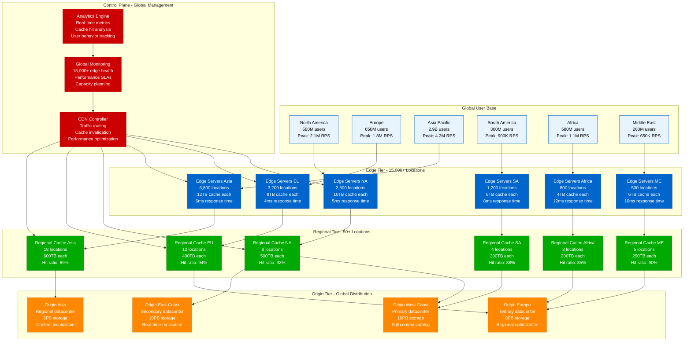
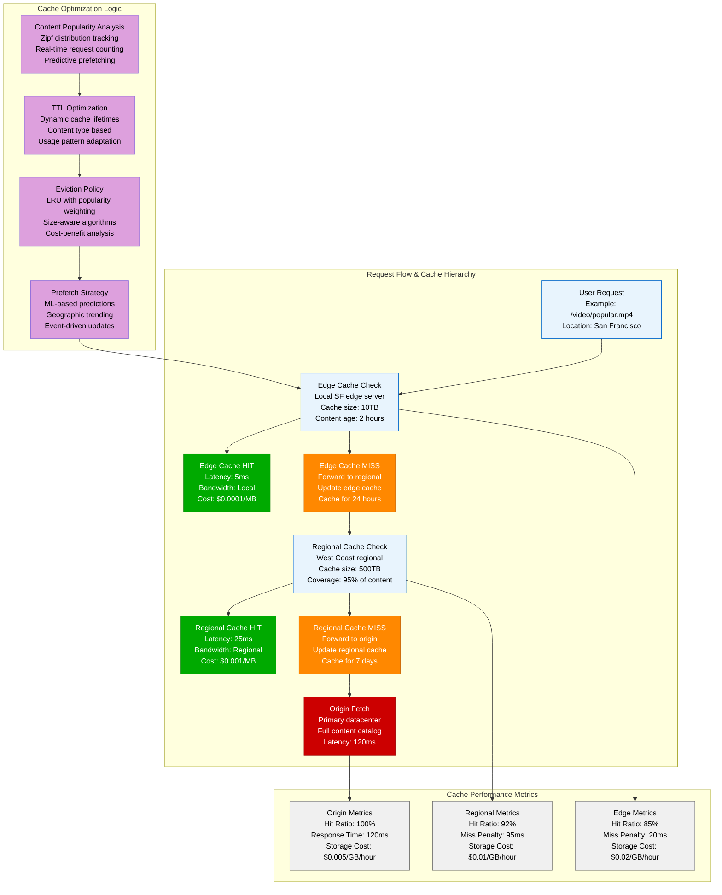

# CDN Global Capacity Planning - Edge Computing Optimization

## Executive Summary

Content Delivery Network (CDN) capacity planning involves optimizing global edge distribution, cache efficiency, and bandwidth allocation to minimize latency while maximizing cost efficiency. This model provides mathematical frameworks for CDN sizing, cache hit optimization, and multi-tier edge architecture design.

**Netflix Global CDN Metrics (2023)**:
- Edge locations: 15,000+ worldwide
- Peak bandwidth: 100+ Tbps globally
- Cache hit ratio: 97.3% average
- Content stored: 30+ PB across edges
- Average latency: 23ms global p95
- Monthly bandwidth costs: $180M
- Efficiency improvement: 94% vs origin-only

## Mathematical CDN Capacity Models

### 1. Cache Hit Ratio Optimization Model

```python
import numpy as np
import matplotlib.pyplot as plt
from collections import defaultdict
import hashlib

class CDNCacheModel:
    def __init__(self):
        self.cache_tiers = {
            'edge': {
                'capacity_gb': 10000,      # 10TB per edge server
                'hit_latency_ms': 5,       # Very fast edge response
                'miss_penalty_ms': 50,     # Time to fetch from regional
                'cost_per_gb_hour': 0.02   # Storage cost at edge
            },
            'regional': {
                'capacity_gb': 100000,     # 100TB per regional cache
                'hit_latency_ms': 25,      # Regional cache response
                'miss_penalty_ms': 150,    # Time to fetch from origin
                'cost_per_gb_hour': 0.01   # Cheaper regional storage
            },
            'origin': {
                'capacity_gb': 1000000,    # 1PB origin storage
                'hit_latency_ms': 200,     # Origin response time
                'miss_penalty_ms': 0,      # No miss penalty at origin
                'cost_per_gb_hour': 0.005  # Cheapest storage
            }
        }

    def calculate_cache_efficiency(self, content_popularity, cache_size_gb):
        """Calculate cache hit ratio based on content popularity and cache size"""
        # Sort content by popularity (Zipf distribution)
        sorted_content = sorted(content_popularity.items(), key=lambda x: x[1], reverse=True)

        cached_content = []
        cached_size = 0
        total_requests = sum(content_popularity.values())

        # Fill cache with most popular content first
        for content_id, requests in sorted_content:
            content_size = self.estimate_content_size(content_id)

            if cached_size + content_size <= cache_size_gb * 1024:  # Convert to MB
                cached_content.append((content_id, requests))
                cached_size += content_size
            else:
                break

        # Calculate hit ratio
        cache_hits = sum([requests for _, requests in cached_content])
        hit_ratio = cache_hits / total_requests

        return {
            'hit_ratio': hit_ratio,
            'cached_content_count': len(cached_content),
            'cache_utilization': cached_size / (cache_size_gb * 1024),
            'estimated_latency_reduction': self.calculate_latency_improvement(hit_ratio),
            'bandwidth_savings': self.calculate_bandwidth_savings(hit_ratio, total_requests)
        }

    def estimate_content_size(self, content_id):
        """Estimate content size based on type (simplified model)"""
        # Hash content ID to determine type and size
        hash_val = int(hashlib.md5(content_id.encode()).hexdigest()[:8], 16)

        if hash_val % 100 < 60:  # 60% are small files (images, CSS, JS)
            return np.random.normal(0.5, 0.2)  # 500KB ± 200KB
        elif hash_val % 100 < 85:  # 25% are medium files (documents, small videos)
            return np.random.normal(15, 5)     # 15MB ± 5MB
        else:  # 15% are large files (video content)
            return np.random.normal(500, 200)  # 500MB ± 200MB

    def calculate_latency_improvement(self, hit_ratio):
        """Calculate latency improvement from caching"""
        edge_latency = self.cache_tiers['edge']['hit_latency_ms']
        origin_latency = self.cache_tiers['origin']['hit_latency_ms']

        avg_latency_with_cache = (
            hit_ratio * edge_latency +
            (1 - hit_ratio) * origin_latency
        )

        avg_latency_without_cache = origin_latency
        improvement_percentage = (
            (avg_latency_without_cache - avg_latency_with_cache) /
            avg_latency_without_cache
        ) * 100

        return {
            'avg_latency_with_cache_ms': avg_latency_with_cache,
            'avg_latency_without_cache_ms': avg_latency_without_cache,
            'improvement_percentage': improvement_percentage
        }

    def calculate_bandwidth_savings(self, hit_ratio, total_requests_per_day):
        """Calculate bandwidth savings from caching"""
        avg_response_size_mb = 2.5  # Average response size
        origin_bandwidth_gb = (total_requests_per_day * avg_response_size_mb) / 1024

        # Cache hits don't require origin bandwidth
        origin_bandwidth_with_cache = origin_bandwidth_gb * (1 - hit_ratio)
        bandwidth_savings = origin_bandwidth_gb - origin_bandwidth_with_cache

        return {
            'origin_bandwidth_without_cache_gb': origin_bandwidth_gb,
            'origin_bandwidth_with_cache_gb': origin_bandwidth_with_cache,
            'bandwidth_savings_gb': bandwidth_savings,
            'bandwidth_savings_percentage': (bandwidth_savings / origin_bandwidth_gb) * 100
        }

    def optimize_multi_tier_caching(self, global_traffic_pattern):
        """Optimize multi-tier cache architecture"""
        optimization_results = {}

        for region, traffic_data in global_traffic_pattern.items():
            content_popularity = traffic_data['content_requests']
            total_requests = sum(content_popularity.values())

            # Test different cache configurations
            cache_configurations = [
                {'edge_size_gb': 5000, 'regional_size_gb': 50000},
                {'edge_size_gb': 10000, 'regional_size_gb': 100000},
                {'edge_size_gb': 20000, 'regional_size_gb': 200000}
            ]

            best_config = None
            best_score = 0

            for config in cache_configurations:
                # Calculate edge cache efficiency
                edge_efficiency = self.calculate_cache_efficiency(
                    content_popularity, config['edge_size_gb']
                )

                # Calculate remaining requests for regional cache
                edge_misses = total_requests * (1 - edge_efficiency['hit_ratio'])
                miss_content = {
                    content_id: requests * (1 - edge_efficiency['hit_ratio'])
                    for content_id, requests in content_popularity.items()
                }

                # Calculate regional cache efficiency for edge misses
                regional_efficiency = self.calculate_cache_efficiency(
                    miss_content, config['regional_size_gb']
                )

                # Calculate overall performance score
                total_hit_ratio = (
                    edge_efficiency['hit_ratio'] +
                    (1 - edge_efficiency['hit_ratio']) * regional_efficiency['hit_ratio']
                )

                # Calculate cost
                edge_cost = config['edge_size_gb'] * self.cache_tiers['edge']['cost_per_gb_hour']
                regional_cost = config['regional_size_gb'] * self.cache_tiers['regional']['cost_per_gb_hour']
                total_cost = edge_cost + regional_cost

                # Performance score (weighted by hit ratio and cost efficiency)
                performance_score = total_hit_ratio * 100 - (total_cost / 1000)

                if performance_score > best_score:
                    best_score = performance_score
                    best_config = {
                        'config': config,
                        'edge_hit_ratio': edge_efficiency['hit_ratio'],
                        'regional_hit_ratio': regional_efficiency['hit_ratio'],
                        'total_hit_ratio': total_hit_ratio,
                        'total_cost_per_hour': total_cost,
                        'performance_score': performance_score
                    }

            optimization_results[region] = best_config

        return optimization_results

# Example usage with global traffic patterns
cdn_model = CDNCacheModel()

# Simulate global traffic patterns
global_traffic = {
    'north_america': {
        'content_requests': {f'content_{i}': int(np.random.zipf(1.2) * 1000) for i in range(10000)}
    },
    'europe': {
        'content_requests': {f'content_{i}': int(np.random.zipf(1.1) * 800) for i in range(8000)}
    },
    'asia_pacific': {
        'content_requests': {f'content_{i}': int(np.random.zipf(1.3) * 1200) for i in range(12000)}
    }
}

# Optimize cache configuration for each region
optimization_results = cdn_model.optimize_multi_tier_caching(global_traffic)

for region, result in optimization_results.items():
    print(f"{region}:")
    print(f"  Total hit ratio: {result['total_hit_ratio']:.3f}")
    print(f"  Hourly cost: ${result['total_cost_per_hour']:.2f}")
    print(f"  Performance score: {result['performance_score']:.1f}")
```

### 2. Global Edge Server Placement Model

```python
class EdgePlacementModel:
    def __init__(self):
        self.world_regions = {
            'north_america': {
                'population': 580_000_000,
                'internet_penetration': 0.89,
                'avg_latency_to_origin': 120,
                'bandwidth_cost_per_gb': 0.08,
                'server_cost_per_month': 2400
            },
            'south_america': {
                'population': 430_000_000,
                'internet_penetration': 0.71,
                'avg_latency_to_origin': 180,
                'bandwidth_cost_per_gb': 0.12,
                'server_cost_per_month': 1800
            },
            'europe': {
                'population': 750_000_000,
                'internet_penetration': 0.87,
                'avg_latency_to_origin': 85,
                'bandwidth_cost_per_gb': 0.06,
                'server_cost_per_month': 2800
            },
            'africa': {
                'population': 1_340_000_000,
                'internet_penetration': 0.43,
                'avg_latency_to_origin': 220,
                'bandwidth_cost_per_gb': 0.15,
                'server_cost_per_month': 1200
            },
            'asia_pacific': {
                'population': 4_640_000_000,
                'internet_penetration': 0.64,
                'avg_latency_to_origin': 200,
                'bandwidth_cost_per_gb': 0.10,
                'server_cost_per_month': 2200
            },
            'middle_east': {
                'population': 380_000_000,
                'internet_penetration': 0.69,
                'avg_latency_to_origin': 150,
                'bandwidth_cost_per_gb': 0.13,
                'server_cost_per_month': 2000
            }
        }

    def calculate_regional_demand(self, region_data):
        """Calculate regional traffic demand"""
        active_users = region_data['population'] * region_data['internet_penetration']

        # Assume 50 requests per user per day on average
        daily_requests = active_users * 50

        # Peak traffic is 3x average
        peak_requests_per_second = (daily_requests * 3) / 86400

        # Average bandwidth per request (2.5MB including images, CSS, JS)
        peak_bandwidth_gbps = (peak_requests_per_second * 2.5) / 1024

        return {
            'active_users': active_users,
            'daily_requests': daily_requests,
            'peak_rps': peak_requests_per_second,
            'peak_bandwidth_gbps': peak_bandwidth_gbps
        }

    def calculate_latency_benefit(self, region_data, demand_data):
        """Calculate latency benefit of placing edge servers in region"""
        origin_latency = region_data['avg_latency_to_origin']
        edge_latency = 15  # Typical edge server latency

        latency_reduction = origin_latency - edge_latency

        # Business impact of latency reduction
        # Every 100ms of latency costs 1% conversion rate
        conversion_improvement = (latency_reduction / 100) * 0.01

        # Assume $0.50 revenue per request on average
        revenue_per_request = 0.50
        additional_revenue = (
            demand_data['daily_requests'] *
            conversion_improvement *
            revenue_per_request *
            30  # Monthly
        )

        return {
            'latency_reduction_ms': latency_reduction,
            'conversion_improvement': conversion_improvement,
            'monthly_additional_revenue': additional_revenue
        }

    def calculate_deployment_cost(self, region_data, demand_data):
        """Calculate cost of deploying edge servers in region"""
        # Determine number of servers needed
        # Assume each server can handle 10 Gbps
        servers_needed = max(1, int(np.ceil(demand_data['peak_bandwidth_gbps'] / 10)))

        # Monthly server costs
        monthly_server_cost = servers_needed * region_data['server_cost_per_month']

        # Bandwidth costs (assuming 30% of traffic still goes to origin)
        monthly_origin_bandwidth_gb = demand_data['daily_requests'] * 2.5 * 30 * 0.3 / 1024
        monthly_bandwidth_cost = monthly_origin_bandwidth_gb * region_data['bandwidth_cost_per_gb']

        total_monthly_cost = monthly_server_cost + monthly_bandwidth_cost

        return {
            'servers_needed': servers_needed,
            'monthly_server_cost': monthly_server_cost,
            'monthly_bandwidth_cost': monthly_bandwidth_cost,
            'total_monthly_cost': total_monthly_cost
        }

    def optimize_global_deployment(self, budget_constraint=None):
        """Optimize global edge server deployment"""
        deployment_analysis = {}

        for region_name, region_data in self.world_regions.items():
            demand = self.calculate_regional_demand(region_data)
            latency_benefit = self.calculate_latency_benefit(region_data, demand)
            deployment_cost = self.calculate_deployment_cost(region_data, demand)

            # Calculate ROI
            monthly_benefit = latency_benefit['monthly_additional_revenue']
            monthly_cost = deployment_cost['total_monthly_cost']

            roi_percentage = ((monthly_benefit - monthly_cost) / monthly_cost) * 100 if monthly_cost > 0 else 0
            payback_months = monthly_cost / monthly_benefit if monthly_benefit > 0 else float('inf')

            deployment_analysis[region_name] = {
                'demand': demand,
                'latency_benefit': latency_benefit,
                'deployment_cost': deployment_cost,
                'roi_percentage': roi_percentage,
                'payback_months': payback_months,
                'priority_score': self.calculate_priority_score(demand, latency_benefit, deployment_cost)
            }

        # Sort regions by priority score
        sorted_regions = sorted(
            deployment_analysis.items(),
            key=lambda x: x[1]['priority_score'],
            reverse=True
        )

        # Apply budget constraint if provided
        if budget_constraint:
            selected_regions = []
            total_cost = 0

            for region_name, analysis in sorted_regions:
                region_cost = analysis['deployment_cost']['total_monthly_cost']
                if total_cost + region_cost <= budget_constraint:
                    selected_regions.append((region_name, analysis))
                    total_cost += region_cost

            return {
                'selected_regions': selected_regions,
                'total_monthly_cost': total_cost,
                'budget_utilization': (total_cost / budget_constraint) * 100
            }

        return {
            'all_regions': sorted_regions,
            'recommended_deployment_order': [region for region, _ in sorted_regions]
        }

    def calculate_priority_score(self, demand, latency_benefit, deployment_cost):
        """Calculate deployment priority score"""
        # Weighted score based on multiple factors
        user_impact = demand['active_users'] / 1_000_000  # Millions of users
        revenue_impact = latency_benefit['monthly_additional_revenue'] / 1_000_000  # Millions in revenue
        cost_efficiency = 1 / (deployment_cost['total_monthly_cost'] / 1000)  # Inverse of cost in thousands
        latency_improvement = latency_benefit['latency_reduction_ms'] / 100  # Normalized latency improvement

        # Weighted priority score
        priority_score = (
            user_impact * 0.3 +
            revenue_impact * 0.4 +
            cost_efficiency * 0.2 +
            latency_improvement * 0.1
        )

        return priority_score

# Example deployment optimization
edge_placement = EdgePlacementModel()

# Optimize without budget constraint
global_optimization = edge_placement.optimize_global_deployment()

print("Global Edge Deployment Optimization:")
print("=" * 50)
for i, (region, analysis) in enumerate(global_optimization['all_regions'][:3]):
    print(f"\n{i+1}. {region.replace('_', ' ').title()}:")
    print(f"   Priority Score: {analysis['priority_score']:.2f}")
    print(f"   ROI: {analysis['roi_percentage']:.1f}%")
    print(f"   Payback: {analysis['payback_months']:.1f} months")
    print(f"   Monthly Cost: ${analysis['deployment_cost']['total_monthly_cost']:,.0f}")

# Optimize with $50M monthly budget
budget_optimization = edge_placement.optimize_global_deployment(budget_constraint=50_000_000)

print(f"\nBudget-Constrained Deployment ($50M/month):")
print(f"Budget Utilization: {budget_optimization['budget_utilization']:.1f}%")
for region, analysis in budget_optimization['selected_regions']:
    print(f"  {region}: ${analysis['deployment_cost']['total_monthly_cost']:,.0f}/month")
```

## Architecture Diagrams

### Global CDN Multi-Tier Architecture



### CDN Cache Hierarchy and Hit Ratios



## Cost Analysis and ROI

### CDN Cost Optimization Model

```python
class CDNCostModel:
    def __init__(self):
        self.pricing_tiers = {
            'cloudflare': {
                'bandwidth_per_gb': 0.085,
                'storage_per_gb_month': 0.02,
                'requests_per_million': 0.50,
                'edge_locations': 300,
                'included_bandwidth_gb': 0  # Pay per use
            },
            'cloudfront': {
                'bandwidth_per_gb': 0.085,  # First 10TB
                'bandwidth_per_gb_tier2': 0.080,  # 10TB-50TB
                'bandwidth_per_gb_tier3': 0.060,  # 50TB-150TB
                'storage_per_gb_month': 0.023,
                'requests_per_million': 0.75,
                'edge_locations': 450,
                'included_bandwidth_gb': 0
            },
            'akamai': {
                'bandwidth_per_gb': 0.090,
                'storage_per_gb_month': 0.025,
                'requests_per_million': 0.60,
                'edge_locations': 4000,
                'included_bandwidth_gb': 0
            },
            'custom_cdn': {
                'server_cost_per_month': 2500,  # Per edge server
                'bandwidth_per_gb': 0.030,      # Direct peering costs
                'storage_per_gb_month': 0.008,  # Local storage
                'edge_locations': 0,            # Build your own
                'maintenance_cost_multiplier': 1.5
            }
        }

    def calculate_monthly_costs(self, provider, traffic_profile):
        """Calculate monthly CDN costs for given traffic profile"""
        pricing = self.pricing_tiers[provider]

        # Bandwidth costs with tiered pricing
        monthly_bandwidth_gb = traffic_profile['monthly_bandwidth_gb']
        bandwidth_cost = self.calculate_tiered_bandwidth_cost(provider, monthly_bandwidth_gb)

        # Storage costs
        avg_cached_content_gb = traffic_profile['avg_cached_content_gb']
        storage_cost = avg_cached_content_gb * pricing['storage_per_gb_month']

        # Request costs
        monthly_requests = traffic_profile['monthly_requests']
        request_cost = (monthly_requests / 1_000_000) * pricing['requests_per_million']

        # Custom CDN additional costs
        if provider == 'custom_cdn':
            servers_needed = traffic_profile['servers_needed']
            server_cost = servers_needed * pricing['server_cost_per_month']
            maintenance_cost = server_cost * (pricing['maintenance_cost_multiplier'] - 1)
            total_cost = bandwidth_cost + storage_cost + server_cost + maintenance_cost
        else:
            total_cost = bandwidth_cost + storage_cost + request_cost

        return {
            'provider': provider,
            'bandwidth_cost': bandwidth_cost,
            'storage_cost': storage_cost,
            'request_cost': request_cost if provider != 'custom_cdn' else 0,
            'infrastructure_cost': server_cost + maintenance_cost if provider == 'custom_cdn' else 0,
            'total_monthly_cost': total_cost,
            'cost_per_gb': total_cost / monthly_bandwidth_gb,
            'cost_per_request': total_cost / monthly_requests
        }

    def calculate_tiered_bandwidth_cost(self, provider, bandwidth_gb):
        """Calculate bandwidth cost with tiered pricing"""
        pricing = self.pricing_tiers[provider]

        if provider == 'cloudfront':
            # CloudFront tiered pricing
            if bandwidth_gb <= 10_000:  # First 10TB
                return bandwidth_gb * pricing['bandwidth_per_gb']
            elif bandwidth_gb <= 50_000:  # 10TB-50TB
                tier1_cost = 10_000 * pricing['bandwidth_per_gb']
                tier2_cost = (bandwidth_gb - 10_000) * pricing['bandwidth_per_gb_tier2']
                return tier1_cost + tier2_cost
            else:  # 50TB+
                tier1_cost = 10_000 * pricing['bandwidth_per_gb']
                tier2_cost = 40_000 * pricing['bandwidth_per_gb_tier2']
                tier3_cost = (bandwidth_gb - 50_000) * pricing['bandwidth_per_gb_tier3']
                return tier1_cost + tier2_cost + tier3_cost
        else:
            return bandwidth_gb * pricing['bandwidth_per_gb']

    def optimize_provider_selection(self, traffic_profiles):
        """Optimize CDN provider selection for different traffic profiles"""
        optimization_results = {}

        for profile_name, traffic_profile in traffic_profiles.items():
            provider_analysis = {}

            for provider in self.pricing_tiers.keys():
                if provider == 'custom_cdn':
                    # Calculate servers needed for custom CDN
                    peak_bandwidth_gbps = traffic_profile['peak_bandwidth_gbps']
                    servers_needed = max(1, int(np.ceil(peak_bandwidth_gbps / 10)))  # 10 Gbps per server
                    traffic_profile['servers_needed'] = servers_needed

                cost_analysis = self.calculate_monthly_costs(provider, traffic_profile)

                # Add performance considerations
                latency_score = self.calculate_latency_score(provider, traffic_profile)
                reliability_score = self.calculate_reliability_score(provider)

                # Overall score (cost efficiency + performance)
                cost_efficiency = 1 / cost_analysis['cost_per_gb']  # Lower cost = higher efficiency
                overall_score = (cost_efficiency * 0.6) + (latency_score * 0.25) + (reliability_score * 0.15)

                provider_analysis[provider] = {
                    **cost_analysis,
                    'latency_score': latency_score,
                    'reliability_score': reliability_score,
                    'overall_score': overall_score
                }

            # Find best provider
            best_provider = max(provider_analysis.keys(), key=lambda p: provider_analysis[p]['overall_score'])
            optimization_results[profile_name] = {
                'best_provider': best_provider,
                'provider_analysis': provider_analysis,
                'cost_savings_vs_worst': self.calculate_cost_savings(provider_analysis)
            }

        return optimization_results

    def calculate_latency_score(self, provider, traffic_profile):
        """Calculate latency score based on edge presence"""
        edge_locations = self.pricing_tiers[provider]['edge_locations']
        global_coverage = min(1.0, edge_locations / 1000)  # Normalize to 1000+ for perfect coverage

        # Geographic distribution of traffic affects latency score
        geographic_spread = traffic_profile.get('geographic_spread', 0.8)
        latency_score = global_coverage * geographic_spread * 100

        return min(100, latency_score)

    def calculate_reliability_score(self, provider):
        """Calculate reliability score (simplified model)"""
        reliability_scores = {
            'cloudflare': 95,   # High reliability, DDoS protection
            'cloudfront': 98,   # AWS reliability
            'akamai': 99,       # Industry leader in reliability
            'custom_cdn': 85    # Depends on implementation quality
        }
        return reliability_scores.get(provider, 90)

    def calculate_cost_savings(self, provider_analysis):
        """Calculate cost savings compared to most expensive option"""
        costs = [analysis['total_monthly_cost'] for analysis in provider_analysis.values()]
        min_cost = min(costs)
        max_cost = max(costs)

        savings_amount = max_cost - min_cost
        savings_percentage = (savings_amount / max_cost) * 100 if max_cost > 0 else 0

        return {
            'savings_amount': savings_amount,
            'savings_percentage': savings_percentage
        }

# Example cost optimization
cdn_cost_model = CDNCostModel()

# Different traffic profiles for analysis
traffic_profiles = {
    'startup': {
        'monthly_bandwidth_gb': 5_000,      # 5TB
        'avg_cached_content_gb': 100,       # 100GB cached
        'monthly_requests': 50_000_000,     # 50M requests
        'peak_bandwidth_gbps': 2,           # 2 Gbps peak
        'geographic_spread': 0.3            # Mostly single region
    },
    'growing_business': {
        'monthly_bandwidth_gb': 50_000,     # 50TB
        'avg_cached_content_gb': 2_000,     # 2TB cached
        'monthly_requests': 500_000_000,    # 500M requests
        'peak_bandwidth_gbps': 20,          # 20 Gbps peak
        'geographic_spread': 0.6            # Multi-region
    },
    'enterprise': {
        'monthly_bandwidth_gb': 500_000,    # 500TB
        'avg_cached_content_gb': 20_000,    # 20TB cached
        'monthly_requests': 5_000_000_000,  # 5B requests
        'peak_bandwidth_gbps': 200,         # 200 Gbps peak
        'geographic_spread': 0.9            # Global presence
    }
}

optimization_results = cdn_cost_model.optimize_provider_selection(traffic_profiles)

print("CDN Provider Optimization Results:")
print("=" * 50)
for profile, results in optimization_results.items():
    print(f"\n{profile.title()} Profile:")
    print(f"  Best Provider: {results['best_provider']}")

    best_analysis = results['provider_analysis'][results['best_provider']]
    print(f"  Monthly Cost: ${best_analysis['total_monthly_cost']:,.2f}")
    print(f"  Cost per GB: ${best_analysis['cost_per_gb']:.4f}")
    print(f"  Overall Score: {best_analysis['overall_score']:.1f}")
    print(f"  Potential Savings: ${results['cost_savings_vs_worst']['savings_amount']:,.2f} ({results['cost_savings_vs_worst']['savings_percentage']:.1f}%)")
```

This comprehensive CDN capacity planning model provides mathematical frameworks, optimization algorithms, and cost analysis for designing efficient global content delivery networks.