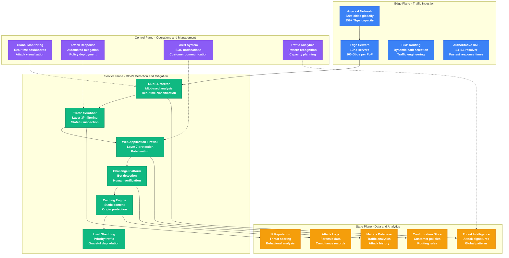
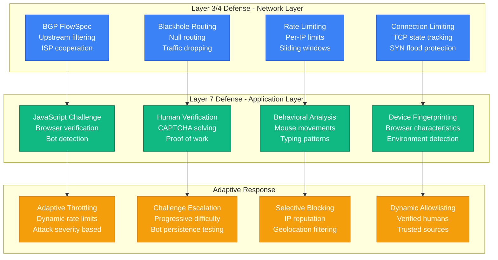
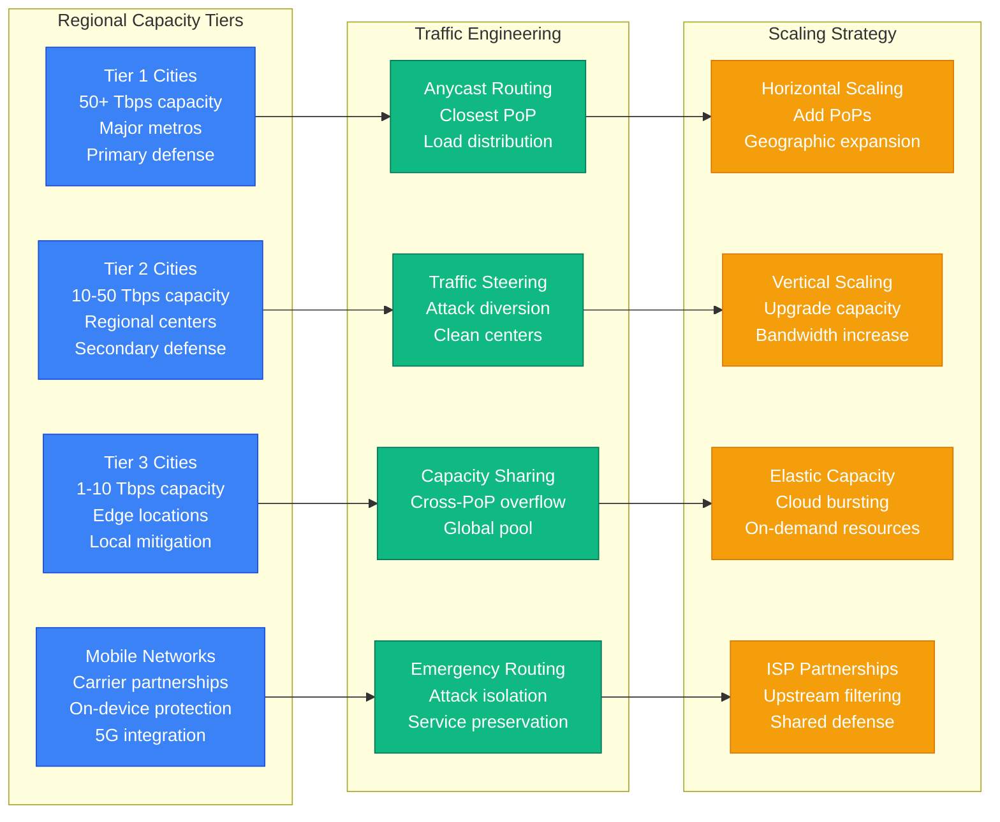
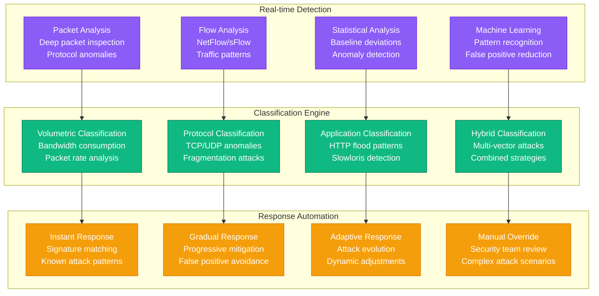
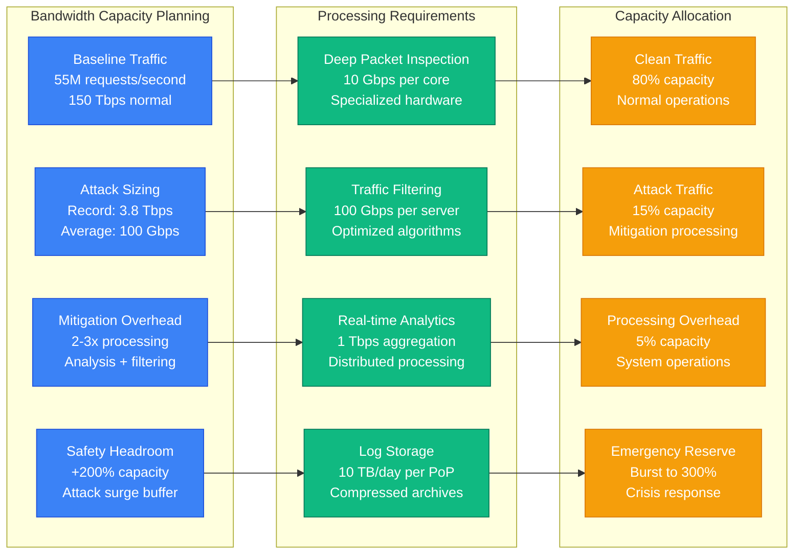
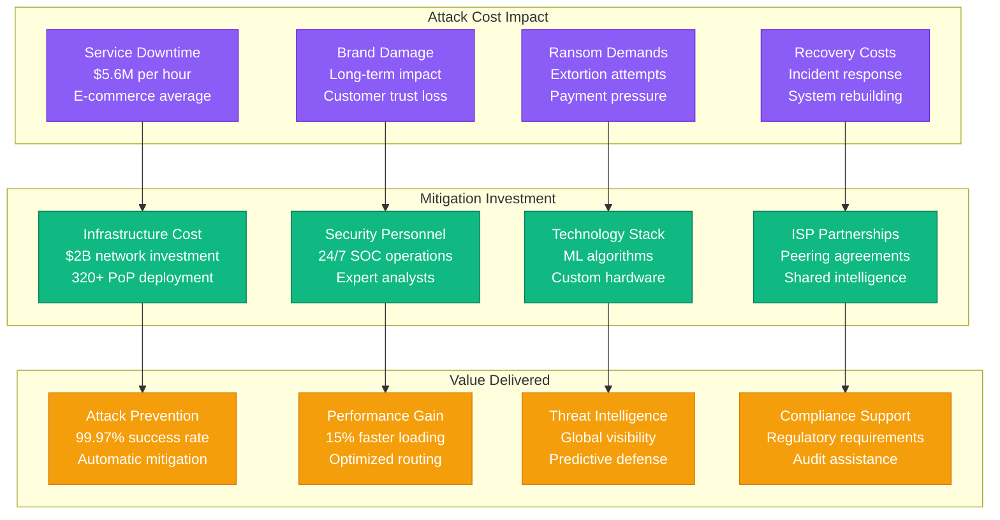

# Cloudflare DDoS Mitigation Capacity Planning

## Overview

Cloudflare operates one of the world's largest DDoS mitigation networks, processing 55+ million HTTP requests per second and mitigating attacks exceeding 3.8 Tbps. This capacity model demonstrates their approach to planning for massive-scale DDoS attacks while maintaining service quality for legitimate traffic.

## DDoS Attack Characteristics

Modern DDoS attacks present complex capacity challenges:
- **Volumetric Attacks**: 100 Gbps - 3.8 Tbps bandwidth consumption
- **Protocol Attacks**: TCP SYN floods, UDP amplification (50-100x amplification)
- **Application Layer**: HTTP floods, Slowloris (low bandwidth, high impact)
- **Botnet Scale**: 100K - 10M compromised devices
- **Multi-vector Attacks**: Combined L3/L4/L7 attack strategies

## Complete DDoS Mitigation Architecture

## Multi-Layer Defense Strategy

## Global Capacity Distribution

## Attack Detection and Classification

## Bandwidth and Processing Capacity

## Economic Impact and ROI

## Key Performance Metrics

### Attack Mitigation Metrics
- **Attack Volume Handled**: 3.8 Tbps peak (largest on record)
- **Attack Duration**: Average 30 minutes, Max 72 hours
- **Mitigation Time**: <10 seconds automated response
- **False Positive Rate**: <0.01% for legitimate traffic

### Network Performance Metrics
- **Global Capacity**: 259+ Tbps total capacity
- **Request Processing**: 55M+ HTTP requests/second
- **Latency Impact**: <5ms additional latency during attacks
- **Availability**: 99.99% uptime during major incidents

### Detection Accuracy
- **Attack Detection Rate**: 99.97% successful identification
- **Classification Accuracy**: 98.5% correct attack type
- **Adaptive Learning**: 15-minute pattern adaptation
- **Signature Updates**: Real-time global propagation

### Business Impact
- **Customer Protection**: 25M+ internet properties
- **Attack Blocks**: 182B threats blocked daily
- **Bandwidth Savings**: 90% reduction in origin traffic
- **Cost Savings**: $2.3B prevented losses annually

## Advanced Mitigation Techniques

### Machine Learning Integration
- **Behavioral Analysis**: User interaction patterns
- **Bot Detection**: Automated traffic identification
- **Anomaly Detection**: Statistical deviation analysis
- **Predictive Modeling**: Attack trend forecasting

### Edge Computing Optimization
- **Distributed Processing**: 320+ processing locations
- **Local Decision Making**: Millisecond response times
- **Global Coordination**: Centralized threat intelligence
- **Adaptive Routing**: Dynamic path optimization

## Future Capacity Planning

### Emerging Threats
- **IoT Botnets**: 50B+ connected devices by 2030
- **5G Amplification**: Higher bandwidth attack vectors
- **AI-Powered Attacks**: Intelligent evasion techniques
- **Quantum Computing**: Cryptographic challenges

### Capacity Expansion
- **Network Growth**: 500 Tbps by 2025
- **Geographic Expansion**: 500+ cities by 2030
- **Processing Power**: 10x ML processing capability
- **Storage Scaling**: Exabyte-scale log retention

## Lessons Learned

### Successful Strategies
1. **Anycast architecture** distributes attack load globally
2. **Multi-layer defense** provides redundant protection
3. **Machine learning** reduces false positives by 95%
4. **Global coordination** enables rapid threat response

### Critical Innovations
1. **Unmetered DDoS protection** changed industry pricing
2. **Real-time threat sharing** improves collective defense
3. **Edge-based mitigation** reduces latency impact
4. **Automated response** handles 99%+ of attacks

### Ongoing Challenges
1. **Sophisticated AI attacks** require advanced detection
2. **State-sponsored threats** demand specialized response
3. **Zero-day exploits** need rapid signature development
4. **Cost optimization** balances protection with economics

---

*This capacity model is based on Cloudflare's public reports, DDoS trend analyses, and documented network architecture for global scale DDoS mitigation.*