# Discord Game Launch Surge Capacity Planning

## Overview

Discord experiences massive traffic surges during AAA game launches, with concurrent users spiking from 150M baseline to 400M+ within hours. Major releases like Elden Ring, Call of Duty, or new World of Warcraft expansions create 3-4x normal load with voice channel usage increasing 8x.

**Key Challenge**: Scale voice infrastructure, real-time messaging, and screen sharing for 50M+ gamers simultaneously joining servers while maintaining <150ms voice latency globally.

**Historical Context**: During Elden Ring's launch in February 2022, Discord handled 387M concurrent users with 12.3M active voice connections and 99.7% uptime despite 4.2x normal traffic.

## Game Launch Surge Architecture

```mermaid
graph TB
    subgraph EdgePlane[Edge Plane - Global Gaming Traffic]
        direction TB

        subgraph GameCDN[Gaming-Optimized CDN]
            CLOUDFLARE_GAMING[CloudFlare Gaming<br/>300+ edge locations<br/>Gaming packet optimization<br/>UDP prioritization<br/>p50: 15ms globally]

            VOICE_EDGE[Voice Edge Servers<br/>Dedicated voice PoPs<br/>150+ voice regions<br/>Opus codec optimization<br/>Jitter buffer: 40ms]
        end

        subgraph TrafficIngress[Traffic Ingress Management]
            GAME_GATEWAY[Game Gateway<br/>Gaming traffic detection<br/>DDoS protection<br/>Traffic shaping<br/>Connection pooling]

            WEBSOCKET_LB[WebSocket Load Balancer<br/>Sticky sessions<br/>Connection migration<br/>Auto-failover<br/>50M+ connections]
        end
    end

    subgraph ServicePlane[Service Plane - Real-time Gaming Communication]
        direction TB

        subgraph VoiceInfrastructure[Voice Infrastructure]
            VOICE_API[Voice API Gateway<br/>WebRTC signaling<br/>Connection management<br/>Codec negotiation<br/>p99: 100ms]

            VOICE_SERVERS[Voice Servers<br/>C++ voice engines<br/>5,000+ instances<br/>Auto-scale: connection count<br/>50 users per server]

            VOICE_ROUTING[Voice Routing<br/>Optimal path selection<br/>Latency-based routing<br/>Quality monitoring<br/>Automatic failover]
        end

        subgraph MessageInfrastructure[Message Infrastructure]
            GATEWAY_SERVICE[Gateway Service<br/>WebSocket management<br/>Real-time events<br/>Connection state<br/>Message ordering]

            MESSAGE_API[Message API<br/>REST + WebSocket<br/>Rate limiting<br/>Spam detection<br/>p99: 50ms]

            NOTIFICATION_HUB[Notification Hub<br/>Push notifications<br/>Mobile delivery<br/>Presence updates<br/>Event broadcasting]
        end

        subgraph GameFeatures[Game-Specific Features]
            SCREEN_SHARE[Screen Share Service<br/>Video streaming<br/>WebRTC optimization<br/>Bandwidth adaptation<br/>Quality scaling]

            ACTIVITY_TRACKER[Rich Presence<br/>Game activity tracking<br/>Status updates<br/>Playing with friends<br/>Real-time sync]

            OVERLAY_SERVICE[Game Overlay<br/>In-game interface<br/>Voice controls<br/>Chat integration<br/>Performance optimized]
        end
    end

    subgraph StatePlane[State Plane - Gaming Data Management]
        direction TB

        subgraph MessageStorage[Message & Voice Storage]
            MESSAGE_DB[Message Database<br/>Cassandra clusters<br/>Time-series storage<br/>Billions of messages<br/>p99 read: 3ms]

            VOICE_LOGS[Voice Session Logs<br/>Session metadata<br/>Quality metrics<br/>Connection logs<br/>Analytics data]
        end

        subgraph UserGamingData[User & Server Data]
            USER_SERVICE[User Service<br/>MongoDB clusters<br/>Gamer profiles<br/>Friend networks<br/>400M+ users]

            SERVER_DB[Server Database<br/>PostgreSQL<br/>Guild management<br/>Channel configuration<br/>Permission systems]
        end

        subgraph GameIntegration[Game Integration Data]
            GAME_DB[Game Database<br/>Game metadata<br/>Integration status<br/>Rich presence data<br/>Achievement tracking]

            MEDIA_STORAGE[Media Storage<br/>AWS S3 + CDN<br/>Avatar images<br/>Custom emojis<br/>Shared screenshots]
        end

        subgraph CachingLayers[Multi-Tier Caching]
            REDIS_VOICE[Redis Voice Cache<br/>Active connections<br/>Voice server state<br/>User presence<br/>Real-time data]

            REDIS_MESSAGES[Redis Message Cache<br/>Recent messages<br/>Typing indicators<br/>User status<br/>Hot channel data]
        end
    end

    subgraph ControlPlane[Control Plane - Gaming Operations]
        direction TB

        subgraph GameMonitoring[Gaming-Specific Monitoring]
            VOICE_MONITORING[Voice Quality Monitor<br/>Latency tracking<br/>Packet loss detection<br/>Codec performance<br/>Regional quality]

            GAME_ANALYTICS[Game Analytics<br/>Launch day metrics<br/>Concurrent players<br/>Server performance<br/>User engagement]
        end

        subgraph SurgeManagement[Launch Surge Management]
            LAUNCH_PREDICTOR[Launch Predictor<br/>Game release calendar<br/>Hype metrics<br/>Pre-order data<br/>Community growth]

            CAPACITY_SCALER[Capacity Scaler<br/>Auto-scaling policies<br/>Voice server scaling<br/>Database scaling<br/>CDN capacity]
        end

        subgraph GameSupport[Gaming Support Operations]
            GAME_SUPPORT[Gaming Support<br/>24/7 launch support<br/>Voice quality issues<br/>Connection problems<br/>Game integration help]

            INCIDENT_WAR_ROOM[Launch War Room<br/>Real-time coordination<br/>Cross-team communication<br/>Escalation procedures<br/>Community updates]
        end
    end

    %% Traffic flow with gaming-specific metrics
    CLOUDFLARE_GAMING -->|"Gaming traffic<br/>UDP optimization"| GAME_GATEWAY
    VOICE_EDGE -->|"Voice connections<br/>50M+ concurrent"| WEBSOCKET_LB

    GAME_GATEWAY -->|"Game detection<br/>Traffic classification"| VOICE_API
    WEBSOCKET_LB -->|"WebSocket upgrade<br/>Connection routing"| GATEWAY_SERVICE

    VOICE_API -->|"Voice connections<br/>12M+ active"| VOICE_SERVERS
    VOICE_SERVERS -->|"Voice routing<br/>Optimal paths"| VOICE_ROUTING
    GATEWAY_SERVICE -->|"Real-time messages<br/>Event streaming"| MESSAGE_API

    MESSAGE_API -->|"Message delivery<br/>Real-time updates"| NOTIFICATION_HUB
    VOICE_ROUTING -->|"Video streams<br/>Screen sharing"| SCREEN_SHARE
    NOTIFICATION_HUB -->|"Game presence<br/>Activity updates"| ACTIVITY_TRACKER

    SCREEN_SHARE -->|"Rich presence<br/>Game integration"| OVERLAY_SERVICE
    ACTIVITY_TRACKER -->|"Overlay features<br/>In-game UI"| OVERLAY_SERVICE

    %% Data layer connections
    MESSAGE_API -->|"Message storage<br/>Chat history"| MESSAGE_DB
    VOICE_SERVERS -->|"Session logs<br/>Quality metrics"| VOICE_LOGS
    GATEWAY_SERVICE -->|"User data<br/>Profile updates"| USER_SERVICE

    ACTIVITY_TRACKER -->|"Server metadata<br/>Guild management"| SERVER_DB
    OVERLAY_SERVICE -->|"Game integration<br/>Rich presence"| GAME_DB
    SCREEN_SHARE -->|"Media uploads<br/>Shared content"| MEDIA_STORAGE

    %% Caching connections
    VOICE_SERVERS -->|"Voice state<br/>Connection data"| REDIS_VOICE
    MESSAGE_API -->|"Message cache<br/>Channel state"| REDIS_MESSAGES
    USER_SERVICE -->|"Profile cache<br/>Friend data"| REDIS_VOICE

    MESSAGE_DB -->|"Hot data<br/>Recent messages"| REDIS_MESSAGES
    SERVER_DB -->|"Channel cache<br/>Permission data"| REDIS_MESSAGES

    %% Monitoring and control
    VOICE_MONITORING -.->|"Quality metrics"| VOICE_SERVERS
    VOICE_MONITORING -.->|"Latency tracking"| VOICE_ROUTING
    GAME_ANALYTICS -.->|"Launch metrics"| ACTIVITY_TRACKER

    LAUNCH_PREDICTOR -.->|"Scaling triggers"| CAPACITY_SCALER
    CAPACITY_SCALER -.->|"Resource scaling"| VOICE_SERVERS
    CAPACITY_SCALER -.->|"Database scaling"| MESSAGE_DB

    GAME_SUPPORT -.->|"Support metrics"| INCIDENT_WAR_ROOM
    INCIDENT_WAR_ROOM -.->|"Coordination"| VOICE_MONITORING

    %% Styling with 4-plane colors
    classDef edgeStyle fill:#3B82F6,stroke:#1E40AF,color:#fff,stroke-width:2px
    classDef serviceStyle fill:#10B981,stroke:#047857,color:#fff,stroke-width:2px
    classDef stateStyle fill:#F59E0B,stroke:#D97706,color:#fff,stroke-width:2px
    classDef controlStyle fill:#8B5CF6,stroke:#6D28D9,color:#fff,stroke-width:2px

    class CLOUDFLARE_GAMING,VOICE_EDGE,GAME_GATEWAY,WEBSOCKET_LB edgeStyle
    class VOICE_API,VOICE_SERVERS,VOICE_ROUTING,GATEWAY_SERVICE,MESSAGE_API,NOTIFICATION_HUB,SCREEN_SHARE,ACTIVITY_TRACKER,OVERLAY_SERVICE serviceStyle
    class MESSAGE_DB,VOICE_LOGS,USER_SERVICE,SERVER_DB,GAME_DB,MEDIA_STORAGE,REDIS_VOICE,REDIS_MESSAGES stateStyle
    class VOICE_MONITORING,GAME_ANALYTICS,LAUNCH_PREDICTOR,CAPACITY_SCALER,GAME_SUPPORT,INCIDENT_WAR_ROOM controlStyle
```



## Game Launch Timeline & Scaling

```mermaid
graph TB
    subgraph LaunchTimeline[AAA Game Launch Timeline & Capacity Response]
        direction TB

        subgraph PreLaunch[Pre-Launch Phase - T-7 to T-0 days]
            HYPE_TRACKING[Hype Tracking<br/>Pre-order numbers<br/>Social media buzz<br/>Influencer coverage<br/>Community growth rate]

            CAPACITY_PREP[Capacity Preparation<br/>+200% voice servers<br/>Database scaling<br/>CDN pre-warming<br/>Support team scaling]

            INTEGRATION_TEST[Integration Testing<br/>Game SDK testing<br/>Rich presence validation<br/>Overlay compatibility<br/>Performance benchmarks]
        end

        subgraph LaunchDay[Launch Day - T+0 to T+24 hours]
            TRAFFIC_SURGE[Traffic Surge<br/>4x concurrent users<br/>8x voice connections<br/>15x server joins<br/>25x friend requests]

            REAL_TIME_SCALING[Real-time Scaling<br/>Auto-scale voice servers<br/>Database read replicas<br/>CDN capacity boost<br/>Support team activation]

            PERFORMANCE_MONITOR[Performance Monitoring<br/>Voice quality tracking<br/>Message latency monitoring<br/>Connection success rate<br/>Error rate analysis]
        end

        subgraph PostLaunch[Post-Launch - T+1 to T+30 days]
            PATTERN_ANALYSIS[Usage Pattern Analysis<br/>Peak hour identification<br/>Regional usage patterns<br/>Feature adoption rates<br/>Community behavior]

            OPTIMIZATION[Infrastructure Optimization<br/>Resource right-sizing<br/>Cost optimization<br/>Performance tuning<br/>Capacity planning]

            COMMUNITY_GROWTH[Community Growth<br/>Server proliferation<br/>User engagement metrics<br/>Retention analysis<br/>Feature requests]
        end
    end

    subgraph GameCategories[Game Category Scaling Profiles]
        direction TB

        subgraph MMORPGs[MMORPGs - Sustained High Load]
            WOW_EXPANSION[WoW Expansion Launch<br/>Peak: 15M concurrent<br/>Duration: 48-72 hours<br/>Voice usage: 6x normal<br/>Server load: persistent]

            FFXIV_EXPANSION[FFXIV Expansion<br/>Peak: 8M concurrent<br/>Queue systems: critical<br/>Voice parties: 4x normal<br/>Community coordination]
        end

        subgraph CompetitiveShooters[Competitive Shooters - Spike + Sustain]
            COD_LAUNCH[Call of Duty Launch<br/>Peak: 25M concurrent<br/>Duration: 7 days high<br/>Voice usage: 10x normal<br/>Tournament coordination]

            VALORANT_ACT[Valorant New Act<br/>Peak: 12M concurrent<br/>Ranked climb coordination<br/>Stream integration<br/>Competitive voice]
        end

        subgraph IndieViralGames[Indie Viral Games - Unpredictable]
            AMONG_US[Among Us Viral Moment<br/>Peak: 35M concurrent<br/>Unpredictable timing<br/>Voice critical for gameplay<br/>Influencer driven]

            FALL_GUYS[Fall Guys Launch<br/>Peak: 18M concurrent<br/>Party voice essential<br/>Stream integration<br/>Meme culture spread]
        end
    end

    subgraph TechnicalChallenges[Game Launch Technical Challenges]
        direction TB

        subgraph VoiceChallenges[Voice Infrastructure Challenges]
            VOICE_SCALING[Voice Server Scaling<br/>50 users per server<br/>Geographic distribution<br/>Quality maintenance<br/>Auto-scaling policies]

            LATENCY_OPTIMIZATION[Latency Optimization<br/>Edge server placement<br/>Routing optimization<br/>Codec efficiency<br/>Jitter management]

            QUALITY_MAINTENANCE[Quality Maintenance<br/>Packet loss handling<br/>Bandwidth adaptation<br/>Echo cancellation<br/>Noise suppression]
        end

        subgraph MessageChallenges[Messaging Infrastructure]
            MESSAGE_SCALING[Message Scaling<br/>Real-time delivery<br/>Message ordering<br/>Rate limiting<br/>Spam detection]

            PRESENCE_SYNC[Presence Synchronization<br/>User status updates<br/>Playing status<br/>Voice state sync<br/>Friend notifications]

            NOTIFICATION_FLOOD[Notification Management<br/>Push notification scaling<br/>Mobile battery optimization<br/>Priority queuing<br/>Rate limiting]
        end
    end

    %% Timeline flow
    HYPE_TRACKING --> TRAFFIC_SURGE
    CAPACITY_PREP --> REAL_TIME_SCALING
    INTEGRATION_TEST --> PERFORMANCE_MONITOR

    TRAFFIC_SURGE --> PATTERN_ANALYSIS
    REAL_TIME_SCALING --> OPTIMIZATION
    PERFORMANCE_MONITOR --> COMMUNITY_GROWTH

    %% Game category connections
    WOW_EXPANSION --> VOICE_SCALING
    FFXIV_EXPANSION --> LATENCY_OPTIMIZATION
    COD_LAUNCH --> QUALITY_MAINTENANCE

    VALORANT_ACT --> MESSAGE_SCALING
    AMONG_US --> PRESENCE_SYNC
    FALL_GUYS --> NOTIFICATION_FLOOD

    %% Cross-connections
    TRAFFIC_SURGE --> WOW_EXPANSION
    REAL_TIME_SCALING --> COD_LAUNCH
    PATTERN_ANALYSIS --> VOICE_SCALING

    %% Styling
    classDef preStyle fill:#8B5CF6,stroke:#6D28D9,color:#fff,stroke-width:2px
    classDef launchStyle fill:#EF4444,stroke:#DC2626,color:#fff,stroke-width:2px
    classDef postStyle fill:#10B981,stroke:#047857,color:#fff,stroke-width:2px
    classDef mmoStyle fill:#3B82F6,stroke:#1E40AF,color:#fff,stroke-width:2px
    classDef shooterStyle fill:#F59E0B,stroke:#D97706,color:#fff,stroke-width:2px
    classDef indieStyle fill:#EC4899,stroke:#DB2777,color:#fff,stroke-width:2px
    classDef techStyle fill:#6B7280,stroke:#4B5563,color:#fff,stroke-width:2px

    class HYPE_TRACKING,CAPACITY_PREP,INTEGRATION_TEST preStyle
    class TRAFFIC_SURGE,REAL_TIME_SCALING,PERFORMANCE_MONITOR launchStyle
    class PATTERN_ANALYSIS,OPTIMIZATION,COMMUNITY_GROWTH postStyle
    class WOW_EXPANSION,FFXIV_EXPANSION mmoStyle
    class COD_LAUNCH,VALORANT_ACT shooterStyle
    class AMONG_US,FALL_GUYS indieStyle
    class VOICE_SCALING,LATENCY_OPTIMIZATION,QUALITY_MAINTENANCE,MESSAGE_SCALING,PRESENCE_SYNC,NOTIFICATION_FLOOD techStyle
```



## Capacity Scaling Scenarios

### Scenario 1: Elden Ring Launch (February 2022)
- **Pre-launch hype**: 2.8M Discord server joins in 48 hours
- **Peak concurrent**: 387M users, 12.3M in voice channels
- **Voice infrastructure**: 8x normal capacity, 150ms global latency
- **Community impact**: 500K new gaming servers created
- **Performance**: 99.7% uptime, 4.2x normal traffic handled successfully

### Scenario 2: Call of Duty: Modern Warfare II Launch
- **Launch coordination**: 72-hour sustained high load
- **Peak voice usage**: 15.2M concurrent voice connections
- **Competitive features**: Tournament mode usage +2400%
- **Screen sharing**: +1800% for strategy coordination
- **Infrastructure response**: Auto-scaled to 12x voice server capacity

### Scenario 3: World of Warcraft: Dragonflight Expansion
- **Guild coordination**: Mass guild migrations to Discord
- **Raid planning**: Voice channel usage +600% for 2 weeks
- **International coordination**: 24/7 sustained load across regions
- **Community features**: Custom emoji usage +400%
- **Long-term impact**: 35% permanent user growth in gaming communities

## Real-time Launch Metrics

### Game Launch Dashboard
```yaml
live_launch_metrics:
  user_metrics:
    concurrent_users: 387000000
    voice_connections: 12300000
    active_servers: 2400000
    messages_per_second: 185000

  voice_performance:
    average_latency: 145ms
    packet_loss_rate: 0.08%
    connection_success_rate: 99.87%
    voice_quality_score: 4.2/5

  infrastructure_status:
    voice_server_utilization: 78%
    database_connection_pool: 65%
    cdn_cache_hit_rate: 94.5%
    api_response_time_p99: 125ms

  game_integration:
    rich_presence_active: 89%
    overlay_usage: 67%
    screen_share_sessions: 2400000
    game_detection_accuracy: 97.8%
```

### Auto-scaling Configuration
```yaml
gaming_autoscale:
  voice_servers:
    baseline_capacity: 50000_servers
    scale_metric: concurrent_connections
    users_per_server: 50
    scale_out_threshold: 80%_utilization
    max_servers: 200000

  message_infrastructure:
    baseline_instances: 5000
    scale_metric: messages_per_second
    threshold: 100000_mps
    scale_factor: 1.5x
    max_instances: 25000

  database_scaling:
    read_replicas: auto_scale
    connection_pools: dynamic
    query_cache: expand
    partition_management: automatic
```

## Gaming Community Impact Analysis

### Game Launch Community Metrics
| Game Category | Avg Server Growth | Voice Usage Spike | Retention Rate | Revenue Impact |
|---------------|-------------------|-------------------|----------------|----------------|
| **AAA Shooter** | +2400% | +1000% | 78% | +$2.8M/month |
| **MMORPG** | +800% | +600% | 85% | +$1.9M/month |
| **Battle Royale** | +3200% | +1200% | 65% | +$3.1M/month |
| **Indie Viral** | +5000% | +2000% | 45% | +$1.2M/month |
| **Strategy** | +400% | +300% | 90% | +$800K/month |

### Community Features Scaling
```yaml
community_features:
  server_creation:
    normal_rate: 500_per_hour
    launch_spike: 15000_per_hour
    auto_moderation: enabled
    spam_detection: enhanced

  custom_emoji:
    upload_rate: +400%_during_launches
    processing_time: <30_seconds
    storage_scaling: auto_expand
    cdn_distribution: global

  bot_integrations:
    deployment_rate: +800%
    api_rate_limits: relaxed_for_gaming
    webhook_capacity: 10x_normal
    game_specific_apis: prioritized
```

## Cost Analysis for Game Launches

### Infrastructure Cost During Major Launches
```yaml
cost_breakdown_per_major_launch:
  voice_infrastructure:
    normal_monthly: $8.5M
    launch_surge_72h: $3.2M
    scaling_factor: 8x_capacity

  message_infrastructure:
    normal_monthly: $2.1M
    launch_surge_72h: $800K
    scaling_factor: 4x_capacity

  cdn_bandwidth:
    normal_monthly: $1.8M
    launch_surge_72h: $1.1M
    scaling_factor: 6x_traffic

  database_scaling:
    normal_monthly: $3.2M
    launch_surge_72h: $1.4M
    scaling_factor: 5x_read_replicas

  total_launch_cost: $6.5M_per_72h_surge
  monthly_baseline: $15.6M
  launch_cost_premium: 42%_of_monthly
```

### Revenue Impact Analysis
- **Nitro subscription surge**: +45% during major game launches
- **Server boost purchases**: +280% for gaming communities
- **Average revenue per gaming user**: $8.50/month (vs. $3.20 general)
- **Gaming user lifetime value**: 3.2x higher than average

## Production Incidents & Lessons

### September 2022: Cyberpunk 2077 Phantom Liberty
- **Issue**: Voice server routing algorithm couldn't handle geographic clustering
- **Impact**: 25% voice connections failed in EU region for 45 minutes
- **Root cause**: Game's regional launch caused unexpected traffic patterns
- **Fix**: Dynamic geographic load balancing for voice servers
- **Prevention**: Game-specific routing algorithms for regional launches

### March 2023: Diablo IV Beta Weekend
- **Issue**: Rich presence API overwhelmed by status update frequency
- **Impact**: Game integration failed for 2.3M users for 90 minutes
- **Cause**: Game sent presence updates every 10 seconds vs. expected 60 seconds
- **Solution**: Adaptive rate limiting based on game behavior
- **Innovation**: Game-specific API rate limiting profiles

### June 2023: Street Fighter 6 Launch
- **Issue**: Tournament mode caused unexpected message volume spikes
- **Impact**: 12% message delivery delays during peak tournament hours
- **Root cause**: Fight result sharing created viral message cascades
- **Response**: Emergency message batching and priority queuing
- **Learning**: Gaming social features need separate capacity planning

## Performance Optimization for Gaming

### Voice Quality Optimization
```yaml
voice_optimization:
  codec_efficiency:
    opus_bitrate: adaptive_20_40_kbps
    packet_size: 20ms_optimal
    fec_enabled: true
    dtx_enabled: true

  latency_reduction:
    edge_server_count: 150_globally
    routing_algorithm: shortest_path_first
    jitter_buffer: 40ms_adaptive
    echo_cancellation: ml_enhanced

  quality_metrics:
    target_latency: <150ms_p99
    packet_loss: <0.1%
    mos_score: >4.0
    connection_success: >99.5%
```

### Gaming-Specific Optimizations
```yaml
gaming_optimizations:
  overlay_performance:
    memory_usage: <50mb
    cpu_usage: <2%_single_core
    gpu_usage: <1%_dedicated
    frame_rate_impact: <5fps

  rich_presence:
    update_frequency: 30_seconds
    api_latency: <100ms
    accuracy: >95%
    game_detection: ml_based

  screen_sharing:
    quality_adaptation: automatic
    bandwidth_limits: user_configurable
    frame_rate: 30_60fps_adaptive
    resolution: up_to_1080p
```

## Key Performance Indicators

### Gaming Performance Metrics
- **Voice latency p99**: <150ms globally (achieved: 145ms)
- **Message delivery success**: >99.9% (achieved: 99.87%)
- **Voice connection success**: >99.5% (achieved: 99.7%)
- **Rich presence accuracy**: >95% (achieved: 97.8%)

### Capacity Metrics
- **Peak concurrent users**: 400M+ capacity
- **Voice server scaling**: 4x capacity in 10 minutes
- **Database scaling**: 8x read replicas automatically
- **CDN bandwidth**: 500 Tbps peak capacity

### Business Impact
- **Gaming user growth**: +35% during major launches
- **Gaming revenue percentage**: 68% of total Discord revenue
- **Community creation**: +2400% during AAA launches
- **User engagement**: 4.2x higher than non-gaming users

This capacity model enables Discord to handle massive gaming community surges during major game launches while maintaining sub-150ms voice latency and 99.9% uptime for the world's largest gaming communication platform.