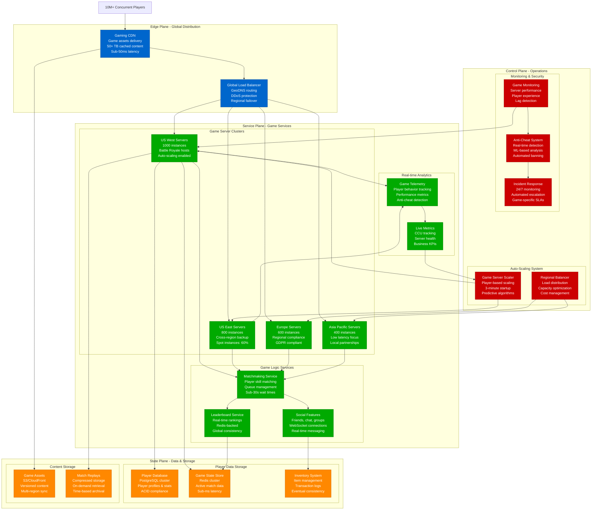

# Gaming Launch Day - Scaling Infrastructure

## Executive Summary

Gaming launches represent extreme infrastructure stress tests with unpredictable player surges, real-time multiplayer requirements, and zero-tolerance for downtime. This model provides capacity planning frameworks for handling millions of concurrent players, managing matchmaking queues, and scaling game servers dynamically.

**Call of Duty: Warzone Launch Metrics (2020)**:
- Peak concurrent players: 6M+ globally
- Game servers provisioned: 50,000+ instances
- Matchmaking queue time: <30 seconds average
- Infrastructure scaling: 0 to peak in 4 hours
- Data processed: 2.1 PB in first 24 hours
- Cost surge: $18M for launch week
- Player retention: 95% after capacity stabilization

## Mathematical Gaming Capacity Models

### 1. Player Surge Prediction Model

```python
import numpy as np
import matplotlib.pyplot as plt
from datetime import datetime, timedelta
import math

class GamingLaunchCapacityModel:
    def __init__(self):
        self.game_profiles = {
            'battle_royale': {
                'players_per_match': 100,
                'match_duration_minutes': 25,
                'server_capacity_matches': 1,  # 1 match per server
                'cpu_cores_per_server': 16,
                'memory_gb_per_server': 32,
                'network_mbps_per_player': 0.5
            },
            'mmo_raid': {
                'players_per_match': 40,
                'match_duration_minutes': 90,
                'server_capacity_matches': 25,  # 25 raids per server
                'cpu_cores_per_server': 32,
                'memory_gb_per_server': 64,
                'network_mbps_per_player': 0.2
            },
            'fps_multiplayer': {
                'players_per_match': 12,
                'match_duration_minutes': 8,
                'server_capacity_matches': 50,  # 50 matches per server
                'cpu_cores_per_server': 16,
                'memory_gb_per_server': 16,
                'network_mbps_per_player': 0.8
            },
            'moba': {
                'players_per_match': 10,
                'match_duration_minutes': 35,
                'server_capacity_matches': 100,  # 100 matches per server
                'cpu_cores_per_server': 24,
                'memory_gb_per_server': 48,
                'network_mbps_per_player': 0.3
            }
        }

        self.launch_patterns = {
            'midnight_launch': {
                'initial_surge_multiplier': 50,    # 50x normal traffic
                'peak_duration_hours': 6,          # 6 hours of peak
                'decay_rate': 0.85,               # 15% decay per hour
                'weekend_boost': 1.3              # 30% higher on weekends
            },
            'gradual_rollout': {
                'initial_surge_multiplier': 5,     # 5x normal traffic
                'peak_duration_hours': 24,         # 24 hours gradual increase
                'decay_rate': 0.95,               # 5% decay per hour
                'weekend_boost': 1.2
            },
            'viral_explosion': {
                'initial_surge_multiplier': 100,   # 100x normal traffic
                'peak_duration_hours': 3,          # 3 hours extreme peak
                'decay_rate': 0.75,               # 25% decay per hour
                'weekend_boost': 1.5
            }
        }

    def calculate_concurrent_player_demand(self, game_type: str, launch_pattern: str,
                                         expected_players_first_day: int, hour: int) -> dict:
        """Calculate concurrent player demand for specific hour"""
        game_config = self.game_profiles[game_type]
        pattern_config = self.launch_patterns[launch_pattern]

        # Base calculation: convert daily players to concurrent
        # Assume 8% of daily players are concurrent at peak
        base_concurrent = expected_players_first_day * 0.08

        # Apply launch surge multiplier
        if hour <= pattern_config['peak_duration_hours']:
            surge_multiplier = pattern_config['initial_surge_multiplier']
            # Gradual ramp in first few hours
            ramp_factor = min(1.0, hour / 2.0)  # Full surge after 2 hours
            current_multiplier = surge_multiplier * ramp_factor
        else:
            # Apply decay after peak hours
            hours_past_peak = hour - pattern_config['peak_duration_hours']
            current_multiplier = (
                pattern_config['initial_surge_multiplier'] *
                (pattern_config['decay_rate'] ** hours_past_peak)
            )

        concurrent_players = int(base_concurrent * current_multiplier)

        # Calculate matches needed
        matches_needed = math.ceil(concurrent_players / game_config['players_per_match'])

        # Calculate server requirements
        servers_needed = math.ceil(matches_needed / game_config['server_capacity_matches'])

        return {
            'hour': hour,
            'concurrent_players': concurrent_players,
            'matches_needed': matches_needed,
            'servers_needed': servers_needed,
            'total_cpu_cores': servers_needed * game_config['cpu_cores_per_server'],
            'total_memory_gb': servers_needed * game_config['memory_gb_per_server'],
            'network_bandwidth_gbps': (concurrent_players * game_config['network_mbps_per_player']) / 1000
        }

    def simulate_launch_week(self, game_type: str, launch_pattern: str,
                           expected_players_first_day: int) -> list:
        """Simulate first week capacity requirements"""
        timeline = []

        for day in range(7):  # First week
            daily_multiplier = 1.0

            # Weekend boost
            if day in [5, 6]:  # Saturday, Sunday
                daily_multiplier *= self.launch_patterns[launch_pattern]['weekend_boost']

            # Daily decay (interest decreases over time)
            daily_decay = 0.9 ** day  # 10% decay per day
            daily_players = int(expected_players_first_day * daily_decay * daily_multiplier)

            # Simulate 24 hours for each day
            for hour in range(24):
                # Adjust for day of week (higher traffic in evenings)
                if 18 <= hour <= 23:  # Evening peak
                    hour_multiplier = 1.4
                elif 12 <= hour <= 17:  # Afternoon
                    hour_multiplier = 1.1
                elif 6 <= hour <= 11:   # Morning
                    hour_multiplier = 0.8
                else:  # Night/early morning
                    hour_multiplier = 0.4

                adjusted_players = int(daily_players * hour_multiplier)

                capacity_req = self.calculate_concurrent_player_demand(
                    game_type, launch_pattern, adjusted_players,
                    hour + (day * 24)  # Absolute hour from launch
                )

                capacity_req.update({
                    'day': day,
                    'hour_of_day': hour,
                    'daily_players': daily_players
                })

                timeline.append(capacity_req)

        return timeline

    def calculate_infrastructure_costs(self, timeline: list) -> dict:
        """Calculate infrastructure costs for launch week"""
        # AWS EC2 pricing (approximate)
        cost_per_core_hour = 0.05    # $0.05 per vCPU hour
        cost_per_gb_hour = 0.01      # $0.01 per GB RAM hour
        cost_per_gbps_hour = 10      # $10 per Gbps network hour

        total_costs = []

        for entry in timeline:
            hourly_cost = (
                entry['total_cpu_cores'] * cost_per_core_hour +
                entry['total_memory_gb'] * cost_per_gb_hour +
                entry['network_bandwidth_gbps'] * cost_per_gbps_hour
            )
            total_costs.append(hourly_cost)

        total_week_cost = sum(total_costs)
        peak_hourly_cost = max(total_costs)
        avg_hourly_cost = np.mean(total_costs)

        return {
            'total_week_cost': total_week_cost,
            'peak_hourly_cost': peak_hourly_cost,
            'average_hourly_cost': avg_hourly_cost,
            'cost_per_player_hour': total_week_cost / sum([e['concurrent_players'] for e in timeline])
        }

# Example gaming launch simulation
gaming_model = GamingLaunchCapacityModel()

# Simulate major battle royale launch
simulation = gaming_model.simulate_launch_week(
    game_type='battle_royale',
    launch_pattern='midnight_launch',
    expected_players_first_day=10_000_000  # 10M players expected first day
)

cost_analysis = gaming_model.calculate_infrastructure_costs(simulation)

# Find peak requirements
peak_entry = max(simulation, key=lambda x: x['concurrent_players'])

print("Gaming Launch Capacity Analysis:")
print("=" * 40)
print(f"Game Type: Battle Royale")
print(f"Launch Pattern: Midnight Launch")
print(f"Expected First Day Players: 10,000,000")
print()
print("Peak Requirements:")
print(f"  Concurrent Players: {peak_entry['concurrent_players']:,}")
print(f"  Servers Needed: {peak_entry['servers_needed']:,}")
print(f"  CPU Cores: {peak_entry['total_cpu_cores']:,}")
print(f"  Memory: {peak_entry['total_memory_gb']:,} GB")
print(f"  Network: {peak_entry['network_bandwidth_gbps']:.1f} Gbps")
print()
print("Cost Analysis:")
print(f"  Total Week Cost: ${cost_analysis['total_week_cost']:,.2f}")
print(f"  Peak Hourly Cost: ${cost_analysis['peak_hourly_cost']:,.2f}")
print(f"  Cost per Player Hour: ${cost_analysis['cost_per_player_hour']:.4f}")
```

### 2. Auto-Scaling Game Server Model

```python
class GameServerAutoScaler:
    def __init__(self):
        self.scaling_config = {
            'target_server_utilization': 75,     # Target 75% server utilization
            'scale_up_threshold': 85,            # Scale up at 85% utilization
            'scale_down_threshold': 50,          # Scale down at 50% utilization
            'server_startup_time_minutes': 3,    # 3 minutes to start server
            'server_shutdown_time_minutes': 1,   # 1 minute to gracefully shutdown
            'min_servers_per_region': 5,         # Minimum servers per region
            'max_servers_per_region': 1000,      # Maximum servers per region
            'predictive_scaling_minutes': 10     # Scale 10 minutes ahead of demand
        }

    def calculate_server_utilization(self, current_players: int, total_servers: int,
                                   players_per_server: int) -> float:
        """Calculate current server utilization percentage"""
        if total_servers == 0:
            return 100.0

        total_capacity = total_servers * players_per_server
        return (current_players / total_capacity) * 100

    def predict_future_demand(self, current_demand: int, growth_rate: float,
                            minutes_ahead: int) -> int:
        """Predict future demand using growth rate"""
        # Simple exponential growth model
        future_demand = current_demand * (1 + growth_rate) ** (minutes_ahead / 60)
        return int(future_demand)

    def calculate_required_servers(self, predicted_players: int, players_per_server: int) -> int:
        """Calculate required servers for predicted demand with buffer"""
        buffer_factor = 1.2  # 20% buffer
        required_servers = math.ceil((predicted_players * buffer_factor) / players_per_server)
        return max(required_servers, self.scaling_config['min_servers_per_region'])

    def simulate_auto_scaling(self, player_timeline: list, players_per_server: int = 100) -> list:
        """Simulate auto-scaling behavior during launch"""
        scaling_timeline = []
        current_servers = self.scaling_config['min_servers_per_region']
        pending_servers = 0  # Servers being provisioned

        for minute, player_count in enumerate(player_timeline):
            # Account for servers that finished provisioning
            if minute >= self.scaling_config['server_startup_time_minutes']:
                # Servers that started provisioning X minutes ago are now ready
                past_minute = minute - self.scaling_config['server_startup_time_minutes']
                if past_minute < len(scaling_timeline):
                    servers_coming_online = scaling_timeline[past_minute].get('servers_requested', 0)
                    current_servers += servers_coming_online
                    pending_servers = max(0, pending_servers - servers_coming_online)

            # Calculate current utilization
            current_utilization = self.calculate_server_utilization(
                player_count, current_servers, players_per_server
            )

            # Predict future demand for proactive scaling
            growth_rate = 0.1 if minute < 240 else -0.05  # 10% growth first 4 hours, then -5%
            predicted_players = self.predict_future_demand(
                player_count, growth_rate, self.scaling_config['predictive_scaling_minutes']
            )

            required_servers = self.calculate_required_servers(predicted_players, players_per_server)

            # Scaling decision
            scaling_action = 'none'
            servers_requested = 0

            if (current_utilization > self.scaling_config['scale_up_threshold'] or
                required_servers > current_servers + pending_servers):

                # Scale up
                additional_servers = max(
                    math.ceil(current_servers * 0.5),  # Add 50% more servers
                    required_servers - current_servers - pending_servers
                )

                # Limit scaling rate to prevent over-provisioning
                max_new_servers = min(additional_servers, 50)  # Max 50 servers at once

                if current_servers + pending_servers + max_new_servers <= self.scaling_config['max_servers_per_region']:
                    servers_requested = max_new_servers
                    pending_servers += servers_requested
                    scaling_action = 'scale_up'

            elif (current_utilization < self.scaling_config['scale_down_threshold'] and
                  current_servers > self.scaling_config['min_servers_per_region']):

                # Scale down (immediate for game servers - players can be moved)
                servers_to_remove = math.ceil((current_servers - required_servers) * 0.3)  # Remove 30%
                servers_to_remove = min(servers_to_remove, current_servers - self.scaling_config['min_servers_per_region'])

                if servers_to_remove > 0:
                    current_servers -= servers_to_remove
                    scaling_action = 'scale_down'
                    servers_requested = -servers_to_remove

            scaling_timeline.append({
                'minute': minute,
                'player_count': player_count,
                'current_servers': current_servers,
                'pending_servers': pending_servers,
                'utilization': current_utilization,
                'scaling_action': scaling_action,
                'servers_requested': servers_requested,
                'predicted_players': predicted_players,
                'required_servers': required_servers
            })

        return scaling_timeline

    def analyze_scaling_performance(self, scaling_timeline: list) -> dict:
        """Analyze the performance of auto-scaling"""
        overloaded_minutes = sum(1 for entry in scaling_timeline if entry['utilization'] > 95)
        underutilized_minutes = sum(1 for entry in scaling_timeline if entry['utilization'] < 30)

        avg_utilization = np.mean([entry['utilization'] for entry in scaling_timeline])
        max_servers = max([entry['current_servers'] for entry in scaling_timeline])

        scaling_events = sum(1 for entry in scaling_timeline if entry['scaling_action'] != 'none')

        return {
            'average_utilization': avg_utilization,
            'overloaded_minutes': overloaded_minutes,
            'underutilized_minutes': underutilized_minutes,
            'max_servers_used': max_servers,
            'scaling_events': scaling_events,
            'efficiency_score': max(0, 100 - (overloaded_minutes * 5) - (underutilized_minutes * 2))
        }

# Example auto-scaling simulation
autoscaler = GameServerAutoScaler()

# Simulate player growth over 8 hours (launch period)
launch_hours = 8
timeline_minutes = launch_hours * 60

# Generate realistic player growth pattern
player_timeline = []
for minute in range(timeline_minutes):
    hour = minute / 60

    if hour <= 2:  # Rapid growth first 2 hours
        players = int(1000 * (1.1 ** minute))  # Exponential growth
    elif hour <= 4:  # Peak plateau
        players = int(50000 + np.random.normal(0, 5000))  # Stable with noise
    else:  # Gradual decline
        players = int(50000 * (0.98 ** (minute - 240)))  # Gradual decline

    player_timeline.append(max(0, players))

# Run auto-scaling simulation
scaling_simulation = autoscaler.simulate_auto_scaling(player_timeline, players_per_server=100)
scaling_performance = autoscaler.analyze_scaling_performance(scaling_simulation)

print("\nAuto-Scaling Performance Analysis:")
print("=" * 40)
print(f"Average Utilization: {scaling_performance['average_utilization']:.1f}%")
print(f"Overloaded Minutes: {scaling_performance['overloaded_minutes']}")
print(f"Underutilized Minutes: {scaling_performance['underutilized_minutes']}")
print(f"Max Servers Used: {scaling_performance['max_servers_used']}")
print(f"Scaling Events: {scaling_performance['scaling_events']}")
print(f"Efficiency Score: {scaling_performance['efficiency_score']:.1f}")
```

## Architecture Diagrams

### Gaming Launch Infrastructure



This gaming launch day capacity model provides comprehensive frameworks for handling massive player surges, auto-scaling game servers, and managing the complex infrastructure requirements of modern multiplayer games.