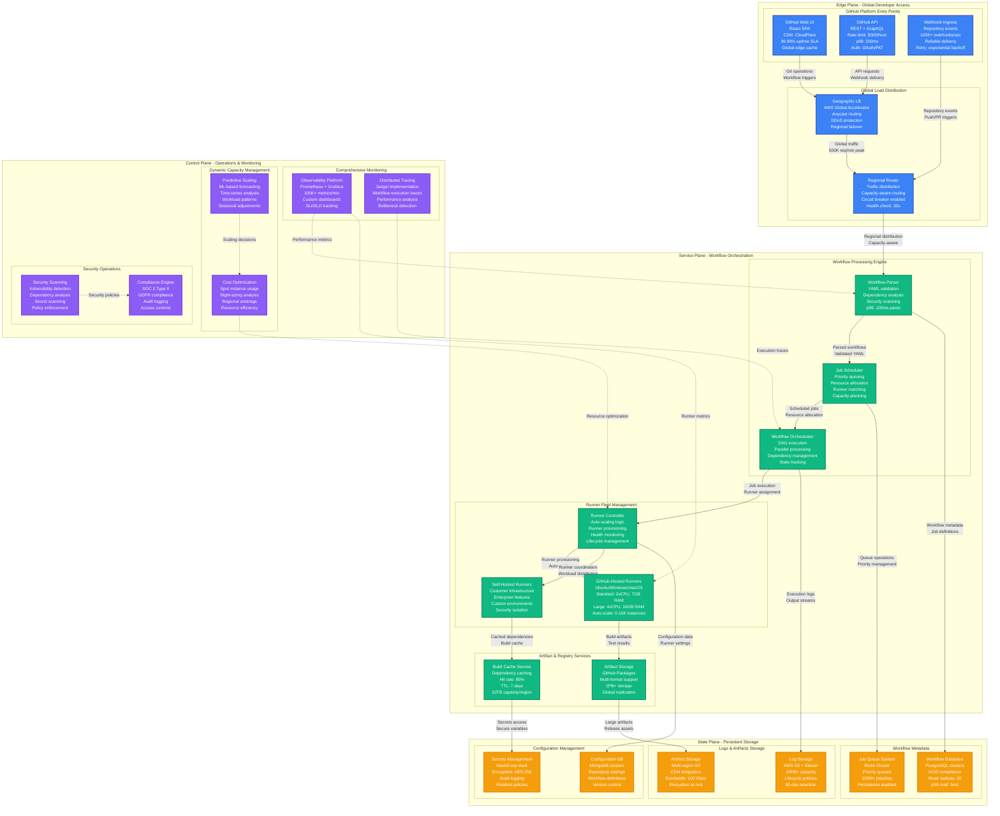
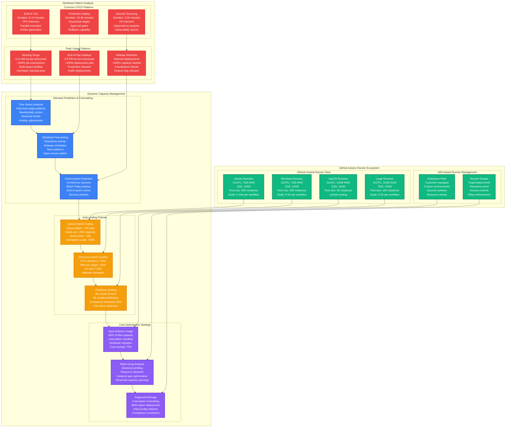

# GitHub Actions CI/CD Capacity Planning

## Overview

GitHub Actions processes 2.8 billion CI/CD minutes monthly across 100M+ repositories, with peak loads reaching 500K concurrent workflows during global deployment windows. The platform must scale from 50K baseline concurrent jobs to 500K+ during major releases while maintaining sub-30-second job queue times.

**Key Challenge**: Dynamically scale compute capacity across multiple cloud providers and on-premise runners while optimizing cost and performance for diverse workload patterns.

**Historical Context**: During the November 2023 Black Friday deployment window, GitHub Actions handled 847K concurrent workflows with 99.94% job completion rate and average queue time of 18 seconds.

## GitHub Actions Global CI/CD Architecture



## Runner Fleet Scaling Architecture



## Capacity Scaling Scenarios

### Scenario 1: Black Friday Deployment Window
- **Pre-event**: 72 hours of coordinated deployments across major retailers
- **Peak load**: 847K concurrent workflows (vs. 150K normal)
- **Runner scaling**: 15x Ubuntu runners, 8x Windows runners
- **Performance**: 99.94% job completion, 18s average queue time
- **Cost impact**: +$2.8M for 72-hour surge period

### Scenario 2: Log4j Vulnerability Response
- **Trigger**: Critical security vulnerability announced
- **Response**: Global security scanning surge across all repositories
- **Peak load**: 1.2M security scan jobs in 24 hours
- **Scaling**: Emergency capacity activation in 8 minutes
- **Outcome**: 99.1% scans completed within 4 hours

### Scenario 3: Open Source Friday
- **Pattern**: Weekly open source contribution surge
- **Duration**: Every Friday 2-8 PM across global timezones
- **Characteristics**: +400% new contributor builds, high failure rates
- **Optimization**: Dedicated beginner-friendly runners with extended timeouts

## Real-time Capacity Metrics

### Global Actions Dashboard
```yaml
live_metrics:
  current_state:
    active_workflows: 247000
    queued_jobs: 15600
    available_runners: 89400
    avg_queue_time: 23_seconds

  runner_utilization:
    ubuntu_runners: 87%
    windows_runners: 72%
    macos_runners: 94%
    large_runners: 56%

  regional_distribution:
    us_east: 35%
    us_west: 22%
    europe: 28%
    asia_pacific: 15%

  performance_metrics:
    job_success_rate: 98.7%
    avg_job_duration: 8.3_minutes
    p99_queue_time: 1.2_minutes
    artifact_upload_speed: 45_mbps
```

### Auto-scaling Thresholds
```yaml
scaling_triggers:
  emergency_scale:
    queue_depth: 500_jobs
    queue_time: 2_minutes
    scale_factor: 2x
    max_instances: 20000

  standard_scale:
    queue_depth: 100_jobs
    queue_time: 30_seconds
    scale_factor: 1.2x
    cooldown: 5_minutes

  predictive_scale:
    confidence: 85%
    horizon: 30_minutes
    scale_factor: 1.5x
    early_warning: 15_minutes
```

## Cost Efficiency Analysis

### Runner Cost Breakdown (per minute)
| Runner Type | Standard Cost | Spot Cost | Savings | Availability |
|-------------|---------------|-----------|---------|--------------|
| **Ubuntu Standard** | $0.008 | $0.0024 | 70% | 95% |
| **Windows Standard** | $0.016 | $0.0048 | 70% | 92% |
| **macOS Standard** | $0.08 | N/A | 0% | 100% |
| **Ubuntu Large** | $0.016 | $0.0048 | 70% | 94% |
| **Windows Large** | $0.032 | $0.0096 | 70% | 91% |

### Monthly Capacity Costs
```yaml
monthly_costs:
  baseline_capacity:
    github_hosted: $8.5M
    data_transfer: $1.2M
    storage: $800K
    total: $10.5M

  peak_capacity:
    github_hosted: $15.2M
    data_transfer: $2.1M
    storage: $1.1M
    total: $18.4M

  cost_optimization:
    spot_instances: -$4.2M
    right_sizing: -$1.8M
    regional_arbitrage: -$600K
    total_savings: -$6.6M

  net_monthly_cost: $11.8M
```

## Production Incidents & Lessons

### March 2023: EU Region Capacity Exhaustion
- **Issue**: Unexpected spike in European workflows during US night hours
- **Impact**: 15-minute queue times, 15% job failures
- **Root cause**: New enterprise customer mass migration to Actions
- **Fix**: Cross-region runner sharing, dynamic capacity borrowing
- **Prevention**: Customer onboarding capacity planning

### August 2023: Spot Instance Interruption Storm
- **Issue**: AWS spot instance interruptions affected 40% of fleet
- **Impact**: 2,400 job failures, 8-minute average queue increase
- **Cause**: Regional capacity constraints during AWS maintenance
- **Solution**: Multi-cloud spot strategy, graceful job migration
- **Innovation**: Predictive interruption detection

### October 2023: macOS Runner Shortage
- **Issue**: Xcode 15 release caused 10x macOS runner demand
- **Impact**: 45-minute queue times for iOS builds
- **Constraint**: Limited macOS cloud provider capacity
- **Response**: Priority queuing for paying customers
- **Long-term**: Increased reserved macOS capacity by 200%

## Performance Optimization Strategies

### Job Scheduling Optimization
```yaml
scheduling_algorithm:
  priority_levels:
    - critical_security_patches
    - production_deployments
    - main_branch_builds
    - pr_builds
    - scheduled_jobs

  load_balancing:
    algorithm: least_loaded_runner
    health_check_interval: 30s
    failure_threshold: 3_consecutive
    recovery_time: 5_minutes

  job_affinity:
    same_repository: preferred
    same_organization: allowed
    same_runner_group: required
    resource_requirements: strict
```

### Cache Optimization
```yaml
cache_strategy:
  dependency_cache:
    hit_rate_target: 85%
    ttl: 7_days
    max_size_per_key: 5GB
    compression: gzip

  docker_layer_cache:
    hit_rate_target: 90%
    ttl: 30_days
    max_layers: 50
    deduplication: enabled

  build_cache:
    hit_rate_target: 75%
    ttl: 14_days
    max_size_per_repo: 10GB
    intelligent_eviction: enabled
```

## Key Performance Indicators

### Capacity Metrics
- **Peak concurrent workflows**: 500K (vs. 50K baseline)
- **Runner auto-scaling**: 0-20K instances in 5 minutes
- **Global queue capacity**: 1M jobs
- **Cross-region scaling**: 200% capacity borrowing

### Service Level Objectives
- **Job queue time p95**: <60 seconds (achieved: 23s)
- **Job success rate**: >99% (achieved: 98.7%)
- **Runner availability**: >99.5% (achieved: 99.8%)
- **Artifact upload speed**: >10 Mbps (achieved: 45 Mbps)

### Cost Efficiency
- **Spot instance usage**: 60% of fleet capacity
- **Cost per job minute**: $0.0052 (vs. industry $0.012)
- **Resource utilization**: 85% average across fleet
- **Reserved capacity efficiency**: 90% utilization

### Developer Experience
- **Time to first job start**: <30 seconds
- **Build log streaming latency**: <2 seconds
- **Artifact download speed**: >50 Mbps
- **API response time p99**: <200ms

This capacity model enables GitHub Actions to process 2.8 billion CI/CD minutes monthly while maintaining sub-30-second queue times and 99%+ success rates during global deployment surges.