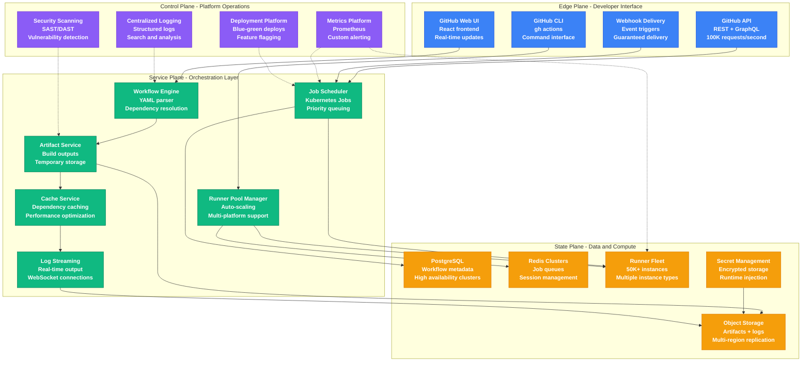
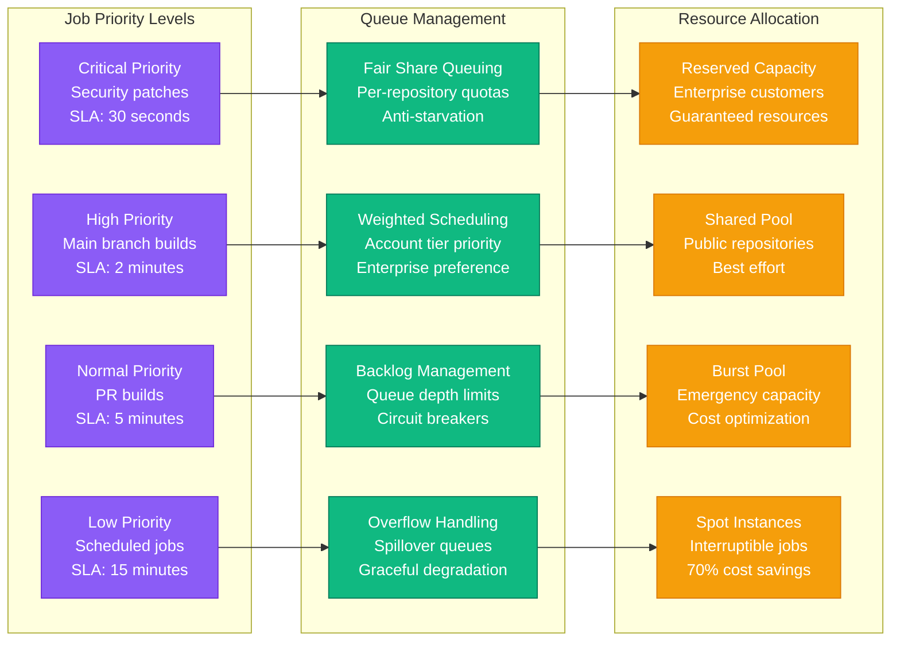
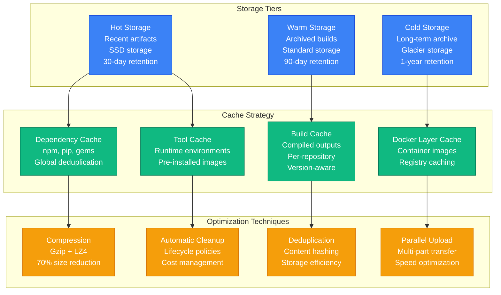
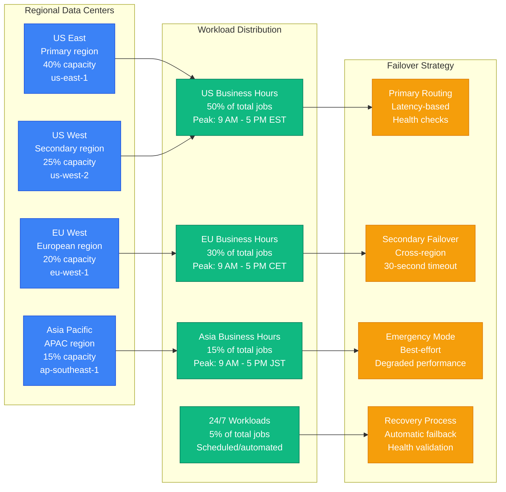

# GitHub Actions CI/CD Capacity Model

## Overview

GitHub Actions handles 10+ billion CI/CD job executions annually across millions of repositories, with peak loads reaching 500K concurrent jobs. This capacity model demonstrates GitHub's approach to managing massive-scale CI/CD infrastructure that supports the global developer ecosystem.

## CI/CD Traffic Patterns

GitHub Actions experiences predictable yet complex traffic patterns:
- **Business Hours Peak**: 5-8x normal load during US/EU working hours
- **Release Spikes**: 15-20x normal load during major release cycles
- **Open Source Events**: 10-12x load during Hacktoberfest, major announcements
- **Security Patches**: 50-100x load for critical vulnerability responses
- **Geographic Distribution**: Rolling peaks following global business hours

## Complete Actions Infrastructure Architecture



## Runner Fleet Management

```mermaid
graph TB
    subgraph "Runner Types and Allocation"
        UBUNTU[Ubuntu Runners<br/>70% of workloads<br/>Standard-2 (2 vCPU, 7GB)]
        WINDOWS[Windows Runners<br/>20% of workloads<br/>Standard-4 (4 vCPU, 16GB)]
        MACOS[macOS Runners<br/>8% of workloads<br/>3-core (3 vCPU, 14GB)]
        LARGE[Large Runners<br/>2% of workloads<br/>64-core (64 vCPU, 256GB)]
    end

    subgraph "Auto-Scaling Strategy"
        DEMAND[Demand Prediction<br/>ML forecasting<br/>15-minute horizon]
        QUEUE[Queue Monitoring<br/>Real-time depth<br/>SLA-based scaling]
        PREEMPTIVE[Preemptive Scaling<br/>Business hours<br/>Geographic patterns]
        BURST[Burst Capacity<br/>Spot instances<br/>Emergency scaling]
    end

    subgraph "Resource Optimization"
        PACK[Job Packing<br/>Resource efficiency<br/>Bin packing algorithm]
        AFFINITY[Node Affinity<br/>Workload placement<br/>Performance optimization]
        PREEMPTION[Job Preemption<br/>Priority scheduling<br/>Fair share queuing]
        CLEANUP[Resource Cleanup<br/>Automatic termination<br/>Cost optimization]
    end

    UBUNTU --> DEMAND
    WINDOWS --> QUEUE
    MACOS --> PREEMPTIVE
    LARGE --> BURST

    DEMAND --> PACK
    QUEUE --> AFFINITY
    PREEMPTIVE --> PREEMPTION
    BURST --> CLEANUP

    %% Apply colors
    classDef runnerStyle fill:#3B82F6,stroke:#1D4ED8,color:#fff
    classDef scalingStyle fill:#10B981,stroke:#047857,color:#fff
    classDef optimizeStyle fill:#F59E0B,stroke:#D97706,color:#fff

    class UBUNTU,WINDOWS,MACOS,LARGE runnerStyle
    class DEMAND,QUEUE,PREEMPTIVE,BURST scalingStyle
    class PACK,AFFINITY,PREEMPTION,CLEANUP optimizeStyle
```

## Queue Management and Priority System



## Artifact and Cache Management



## Global Capacity Distribution



## Performance and Cost Metrics

### Infrastructure Metrics
- **Total Runner Capacity**: 500K concurrent jobs
- **Peak Utilization**: 85% during business hours
- **Average Job Duration**: 4.2 minutes
- **Queue Wait Time**: p50: 15s, p99: 180s

### Performance Metrics
- **Job Success Rate**: 97.8% (first attempt)
- **Job Retry Rate**: 8.2% (transient failures)
- **Artifact Upload Speed**: 50 MB/s average
- **Cache Hit Rate**: 78% (dependency cache)

### Cost Metrics
- **Monthly Infrastructure Cost**: $45M
- **Cost per Job Execution**: $0.045
- **Spot Instance Savings**: 65% of compute costs
- **Storage Optimization Savings**: $8M/month

### Business Metrics
- **Developer Productivity**: 40% faster CI/CD cycles
- **Repository Growth**: 25% YoY increase
- **Enterprise Customers**: 85% using Actions
- **Open Source Usage**: 70% of total job volume

## Auto-Scaling Implementation

```mermaid
gantt
    title GitHub Actions Auto-Scaling Timeline
    dateFormat  HH:mm
    axisFormat %H:%M

    section US East Coast
    Business Hours Ramp-up      :active, us_ramp, 08:00, 2h
    Peak Usage Period          :crit, us_peak, 10:00, 6h
    Gradual Scale-down         :active, us_down, 16:00, 4h

    section Europe
    Business Hours Ramp-up      :active, eu_ramp, 14:00, 2h
    Peak Usage Period          :crit, eu_peak, 16:00, 6h
    Gradual Scale-down         :active, eu_down, 22:00, 4h

    section Asia Pacific
    Business Hours Ramp-up      :active, asia_ramp, 00:00, 2h
    Peak Usage Period          :crit, asia_peak, 02:00, 6h
    Gradual Scale-down         :active, asia_down, 08:00, 4h
```



## Security and Compliance

### Security Measures
- **Runner Isolation**: Ephemeral containers, network segmentation
- **Secret Management**: Encrypted at rest and in transit
- **Code Scanning**: Automatic vulnerability detection
- **Audit Logging**: Complete action trail for compliance

### Compliance Requirements
- **SOC 2 Type II**: Annual certification
- **ISO 27001**: Information security management
- **GDPR**: Data protection for EU users
- **HIPAA**: Healthcare customer requirements

## Lessons Learned

### Successful Strategies
1. **Predictive scaling** reduced queue wait times by 60%
2. **Multi-region deployment** achieved 99.95% availability
3. **Intelligent caching** improved build times by 40%
4. **Spot instance usage** reduced compute costs by 65%

### Challenges Overcome
1. **Runner cold start latency** - Pre-warmed pools
2. **Network bandwidth limits** - Regional storage distribution
3. **Dependency download times** - Global cache optimization
4. **Resource contention** - Fair share queuing implementation

### Future Improvements
1. **ARM-based runners** for 30% cost reduction
2. **GPU acceleration** for ML workload support
3. **Serverless functions** for lightweight jobs
4. **Advanced scheduling** with ML-based optimization

## Disaster Recovery

### Backup Strategy
- **Database Backups**: Continuous point-in-time recovery
- **Artifact Replication**: Cross-region automatic sync
- **Configuration Management**: GitOps-based infrastructure
- **Secret Backup**: Encrypted cross-region replication

### Recovery Procedures
- **RTO (Recovery Time Objective)**: 15 minutes
- **RPO (Recovery Point Objective)**: 1 minute
- **Failover Testing**: Monthly disaster recovery drills
- **Communication Plan**: Automated status page updates

---

*This capacity model is based on GitHub's public engineering discussions, performance reports, and documented CI/CD architecture patterns for large-scale development platforms.*