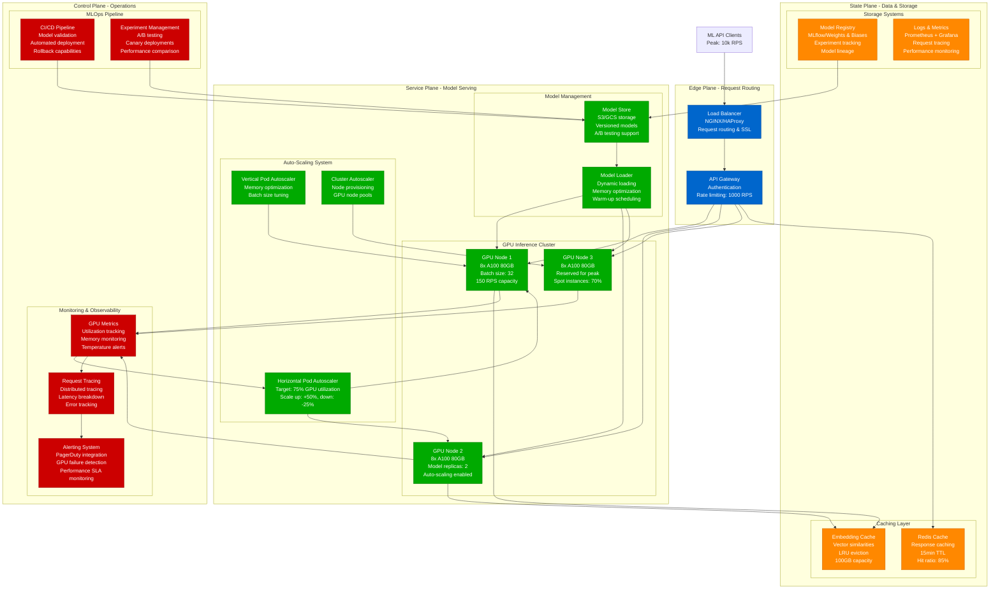

# ML Model Serving - GPU Capacity Planning

## Executive Summary

ML model serving requires precise GPU capacity planning to balance inference latency, throughput, and cost efficiency. This model provides mathematical frameworks for sizing GPU clusters, optimizing batch processing, and managing dynamic scaling for production ML workloads.

**OpenAI ChatGPT Infrastructure Metrics (2023)**:
- GPU cluster size: 25,000+ A100 GPUs
- Peak inference requests: 100M+ daily
- Average latency: 850ms (including network)
- Model size: 175B parameters (GPT-3.5)
- GPU utilization: 82% average
- Cost per token: $0.000004 (optimization target)
- Infrastructure cost: $50M+ monthly

## Mathematical GPU Capacity Models

### 1. GPU Inference Capacity Model

```python
import numpy as np
import matplotlib.pyplot as plt
from dataclasses import dataclass
from typing import Dict, List, Tuple
import math

@dataclass
class GPUSpecs:
    name: str
    memory_gb: float
    compute_tflops: float
    memory_bandwidth_gbps: float
    hourly_cost: float
    power_consumption_watts: float

class MLServingCapacityModel:
    def __init__(self):
        self.gpu_specs = {
            'a100_80gb': GPUSpecs('A100 80GB', 80, 312, 2039, 3.20, 400),
            'a100_40gb': GPUSpecs('A100 40GB', 40, 312, 1555, 2.40, 400),
            'v100_32gb': GPUSpecs('V100 32GB', 32, 125, 900, 1.85, 300),
            'h100_80gb': GPUSpecs('H100 80GB', 80, 989, 3350, 4.50, 700),
            't4_16gb': GPUSpecs('T4 16GB', 16, 65, 300, 0.45, 70)
        }

        self.model_profiles = {
            'gpt_3_5_turbo': {
                'parameters': 175_000_000_000,
                'memory_per_param_bytes': 2,  # FP16
                'compute_per_token_tflops': 0.36,
                'context_length': 4096,
                'avg_tokens_per_request': 150
            },
            'llama2_70b': {
                'parameters': 70_000_000_000,
                'memory_per_param_bytes': 2,
                'compute_per_token_tflops': 0.14,
                'context_length': 4096,
                'avg_tokens_per_request': 200
            },
            'stable_diffusion_xl': {
                'parameters': 3_500_000_000,
                'memory_per_param_bytes': 4,  # FP32 for image generation
                'compute_per_image_tflops': 45,
                'image_resolution': '1024x1024',
                'avg_inference_steps': 50
            },
            'bert_large': {
                'parameters': 340_000_000,
                'memory_per_param_bytes': 2,
                'compute_per_token_tflops': 0.001,
                'context_length': 512,
                'avg_tokens_per_request': 128
            }
        }

    def calculate_model_memory_requirements(self, model_profile: Dict) -> Dict:
        """Calculate memory requirements for loading a model"""
        base_memory_gb = (
            model_profile['parameters'] *
            model_profile['memory_per_param_bytes']
        ) / (1024**3)

        # Add overhead for KV cache, gradients, optimizer states
        kv_cache_overhead = 0.2  # 20% for KV cache
        framework_overhead = 0.15  # 15% for framework overhead
        safety_buffer = 0.1  # 10% safety buffer

        total_memory_gb = base_memory_gb * (
            1 + kv_cache_overhead + framework_overhead + safety_buffer
        )

        return {
            'base_model_memory_gb': base_memory_gb,
            'total_memory_required_gb': total_memory_gb,
            'kv_cache_memory_gb': base_memory_gb * kv_cache_overhead,
            'framework_overhead_gb': base_memory_gb * framework_overhead
        }

    def calculate_inference_throughput(self, gpu_type: str, model_name: str, batch_size: int = 1) -> Dict:
        """Calculate inference throughput for given GPU and model"""
        gpu = self.gpu_specs[gpu_type]
        model = self.model_profiles[model_name]
        memory_req = self.calculate_model_memory_requirements(model)

        # Check if model fits in GPU memory
        memory_fits = memory_req['total_memory_required_gb'] <= gpu.memory_gb

        if not memory_fits:
            return {
                'memory_fits': False,
                'error': f"Model requires {memory_req['total_memory_required_gb']:.1f}GB, GPU has {gpu.memory_gb}GB"
            }

        # Calculate compute-bound vs memory-bound performance
        if 'compute_per_token_tflops' in model:
            # Text models (per token)
            compute_time_per_token = model['compute_per_token_tflops'] / gpu.compute_tflops
            memory_time_per_token = (
                model['avg_tokens_per_request'] * model['memory_per_param_bytes'] * model['parameters']
            ) / (gpu.memory_bandwidth_gbps * 1024**3)

            bottleneck_time = max(compute_time_per_token, memory_time_per_token)
            tokens_per_second = batch_size / bottleneck_time
            requests_per_second = tokens_per_second / model['avg_tokens_per_request']

            return {
                'memory_fits': True,
                'tokens_per_second': tokens_per_second,
                'requests_per_second': requests_per_second,
                'batch_size': batch_size,
                'bottleneck': 'compute' if compute_time_per_token > memory_time_per_token else 'memory',
                'latency_ms': (1 / requests_per_second) * 1000,
                'gpu_utilization': min(100, (bottleneck_time * tokens_per_second / gpu.compute_tflops) * 100)
            }

        else:
            # Image models (per image)
            compute_time_per_image = model['compute_per_image_tflops'] / gpu.compute_tflops
            images_per_second = batch_size / compute_time_per_image

            return {
                'memory_fits': True,
                'images_per_second': images_per_second,
                'requests_per_second': images_per_second,
                'batch_size': batch_size,
                'latency_ms': (1 / images_per_second) * 1000,
                'gpu_utilization': min(100, (compute_time_per_image * images_per_second / gpu.compute_tflops) * 100)
            }

    def optimize_batch_size(self, gpu_type: str, model_name: str, target_latency_ms: float = 1000) -> Dict:
        """Find optimal batch size for given latency target"""
        best_batch_size = 1
        best_throughput = 0
        batch_analysis = []

        for batch_size in [1, 2, 4, 8, 16, 32, 64, 128]:
            result = self.calculate_inference_throughput(gpu_type, model_name, batch_size)

            if not result.get('memory_fits', False):
                break

            if result['latency_ms'] <= target_latency_ms:
                throughput = result['requests_per_second']
                if throughput > best_throughput:
                    best_throughput = throughput
                    best_batch_size = batch_size

                batch_analysis.append({
                    'batch_size': batch_size,
                    'throughput_rps': throughput,
                    'latency_ms': result['latency_ms'],
                    'gpu_utilization': result['gpu_utilization']
                })

        return {
            'optimal_batch_size': best_batch_size,
            'optimal_throughput_rps': best_throughput,
            'batch_analysis': batch_analysis
        }

    def calculate_cluster_requirements(self, workload_spec: Dict) -> Dict:
        """Calculate GPU cluster requirements for given workload"""
        target_rps = workload_spec['target_requests_per_second']
        model_name = workload_spec['model_name']
        latency_sla_ms = workload_spec.get('latency_sla_ms', 1000)
        gpu_type = workload_spec.get('preferred_gpu_type', 'a100_80gb')

        # Optimize batch size for latency SLA
        batch_optimization = self.optimize_batch_size(gpu_type, model_name, latency_sla_ms)

        if not batch_optimization['batch_analysis']:
            # Try smaller GPU if model doesn't fit
            gpu_alternatives = ['a100_40gb', 'v100_32gb', 't4_16gb']
            for alt_gpu in gpu_alternatives:
                batch_optimization = self.optimize_batch_size(alt_gpu, model_name, latency_sla_ms)
                if batch_optimization['batch_analysis']:
                    gpu_type = alt_gpu
                    break

        optimal_rps_per_gpu = batch_optimization['optimal_throughput_rps']

        # Calculate required GPUs with safety buffer
        safety_buffer = 1.2  # 20% safety buffer
        required_gpus = math.ceil((target_rps * safety_buffer) / optimal_rps_per_gpu)

        # Calculate costs
        gpu_spec = self.gpu_specs[gpu_type]
        hourly_cost = required_gpus * gpu_spec.hourly_cost
        monthly_cost = hourly_cost * 24 * 30

        return {
            'model_name': model_name,
            'gpu_type': gpu_type,
            'required_gpus': required_gpus,
            'optimal_batch_size': batch_optimization['optimal_batch_size'],
            'rps_per_gpu': optimal_rps_per_gpu,
            'total_cluster_rps': required_gpus * optimal_rps_per_gpu,
            'utilization_percentage': (target_rps / (required_gpus * optimal_rps_per_gpu)) * 100,
            'cost_analysis': {
                'hourly_cost': hourly_cost,
                'monthly_cost': monthly_cost,
                'cost_per_request': hourly_cost / (required_gpus * optimal_rps_per_gpu * 3600)
            },
            'performance_metrics': {
                'latency_ms': (1 / optimal_rps_per_gpu) * 1000 * batch_optimization['optimal_batch_size'],
                'gpu_memory_utilization': self.calculate_memory_utilization(gpu_type, model_name)
            }
        }

    def calculate_memory_utilization(self, gpu_type: str, model_name: str) -> float:
        """Calculate GPU memory utilization percentage"""
        gpu = self.gpu_specs[gpu_type]
        model = self.model_profiles[model_name]
        memory_req = self.calculate_model_memory_requirements(model)

        return (memory_req['total_memory_required_gb'] / gpu.memory_gb) * 100

# Example usage
ml_capacity_model = MLServingCapacityModel()

# Define workload requirements
workload_requirements = {
    'model_name': 'gpt_3_5_turbo',
    'target_requests_per_second': 1000,
    'latency_sla_ms': 800,
    'preferred_gpu_type': 'a100_80gb'
}

# Calculate cluster requirements
cluster_analysis = ml_capacity_model.calculate_cluster_requirements(workload_requirements)

print("ML Model Serving Cluster Analysis:")
print("=" * 45)
print(f"Model: {cluster_analysis['model_name']}")
print(f"GPU Type: {cluster_analysis['gpu_type']}")
print(f"Required GPUs: {cluster_analysis['required_gpus']}")
print(f"Optimal Batch Size: {cluster_analysis['optimal_batch_size']}")
print(f"Total Cluster RPS: {cluster_analysis['total_cluster_rps']:.1f}")
print(f"Utilization: {cluster_analysis['utilization_percentage']:.1f}%")
print(f"Monthly Cost: ${cluster_analysis['cost_analysis']['monthly_cost']:,.2f}")
print(f"Cost per Request: ${cluster_analysis['cost_analysis']['cost_per_request']:.6f}")
```

### 2. Dynamic Scaling and Auto-Scaling Model

```python
class MLAutoScalingModel:
    def __init__(self):
        self.scaling_policies = {
            'scale_up_threshold_utilization': 75,   # Scale up at 75% utilization
            'scale_down_threshold_utilization': 30, # Scale down at 30% utilization
            'scale_up_cooldown_minutes': 5,         # Wait 5 min before next scale up
            'scale_down_cooldown_minutes': 15,      # Wait 15 min before scale down
            'max_scale_up_percentage': 50,          # Max 50% increase at once
            'max_scale_down_percentage': 25,        # Max 25% decrease at once
            'min_replicas': 2,                      # Minimum replicas for HA
            'max_replicas': 100                     # Maximum replicas limit
        }

    def simulate_auto_scaling(self, traffic_pattern: List[float], duration_hours: int = 24) -> List[Dict]:
        """Simulate auto-scaling behavior over time"""
        timeline = []
        current_replicas = self.scaling_policies['min_replicas']
        last_scale_action_minute = 0

        for minute in range(duration_hours * 60):
            # Get current traffic (RPS)
            hour_index = minute // 60
            current_rps = traffic_pattern[hour_index % len(traffic_pattern)]

            # Calculate current utilization (assume 10 RPS per replica capacity)
            rps_per_replica = 10
            current_utilization = (current_rps / (current_replicas * rps_per_replica)) * 100

            # Determine if scaling action is needed
            scaling_action = 'none'
            new_replicas = current_replicas

            # Check cooldown periods
            minutes_since_last_action = minute - last_scale_action_minute

            if (current_utilization > self.scaling_policies['scale_up_threshold_utilization'] and
                minutes_since_last_action >= self.scaling_policies['scale_up_cooldown_minutes']):

                # Scale up
                scale_factor = 1 + (self.scaling_policies['max_scale_up_percentage'] / 100)
                new_replicas = min(
                    int(current_replicas * scale_factor),
                    self.scaling_policies['max_replicas']
                )
                scaling_action = 'scale_up'
                last_scale_action_minute = minute

            elif (current_utilization < self.scaling_policies['scale_down_threshold_utilization'] and
                  minutes_since_last_action >= self.scaling_policies['scale_down_cooldown_minutes']):

                # Scale down
                scale_factor = 1 - (self.scaling_policies['max_scale_down_percentage'] / 100)
                new_replicas = max(
                    int(current_replicas * scale_factor),
                    self.scaling_policies['min_replicas']
                )
                scaling_action = 'scale_down'
                last_scale_action_minute = minute

            current_replicas = new_replicas

            # Calculate costs and performance
            gpu_cost_per_hour = 3.20  # A100 80GB cost
            current_cost_per_hour = current_replicas * gpu_cost_per_hour

            timeline.append({
                'minute': minute,
                'hour': minute / 60,
                'current_rps': current_rps,
                'replicas': current_replicas,
                'utilization': current_utilization,
                'scaling_action': scaling_action,
                'hourly_cost': current_cost_per_hour,
                'capacity_rps': current_replicas * rps_per_replica
            })

        return timeline

    def analyze_scaling_efficiency(self, timeline: List[Dict]) -> Dict:
        """Analyze the efficiency of the auto-scaling simulation"""
        total_cost = sum([entry['hourly_cost'] for entry in timeline]) / 60  # Convert to hourly
        avg_utilization = np.mean([entry['utilization'] for entry in timeline])
        max_replicas = max([entry['replicas'] for entry in timeline])
        min_replicas = min([entry['replicas'] for entry in timeline])
        scaling_events = sum([1 for entry in timeline if entry['scaling_action'] != 'none'])

        # Calculate over-provisioning waste
        over_provisioned_capacity = sum([
            max(0, entry['capacity_rps'] - entry['current_rps'])
            for entry in timeline
        ])

        total_capacity_hours = sum([entry['capacity_rps'] for entry in timeline]) / 60
        waste_percentage = (over_provisioned_capacity / 60) / total_capacity_hours * 100

        return {
            'total_daily_cost': total_cost * 24,
            'average_utilization': avg_utilization,
            'max_replicas_used': max_replicas,
            'min_replicas_used': min_replicas,
            'scaling_events': scaling_events,
            'capacity_waste_percentage': waste_percentage,
            'efficiency_score': max(0, 100 - waste_percentage - (scaling_events * 2))  # Penalty for excessive scaling
        }

# Example auto-scaling simulation
autoscaler = MLAutoScalingModel()

# Daily traffic pattern (RPS by hour)
daily_traffic = [
    20, 15, 12, 10, 8, 12,           # 00-06: Low traffic
    25, 40, 70, 95, 120, 140,        # 06-12: Morning ramp
    160, 180, 200, 185, 170, 150,    # 12-18: Peak hours
    120, 100, 80, 60, 40, 25         # 18-24: Evening decline
]

# Run simulation
scaling_timeline = autoscaler.simulate_auto_scaling(daily_traffic, 24)
efficiency_analysis = autoscaler.analyze_scaling_efficiency(scaling_timeline)

print("\nAuto-Scaling Simulation Results:")
print("=" * 35)
print(f"Daily Cost: ${efficiency_analysis['total_daily_cost']:.2f}")
print(f"Average Utilization: {efficiency_analysis['average_utilization']:.1f}%")
print(f"Scaling Events: {efficiency_analysis['scaling_events']}")
print(f"Capacity Waste: {efficiency_analysis['capacity_waste_percentage']:.1f}%")
print(f"Efficiency Score: {efficiency_analysis['efficiency_score']:.1f}")
```

## Architecture Diagrams

### ML Model Serving Infrastructure



This ML Model Serving GPU capacity planning model provides comprehensive frameworks for optimizing GPU infrastructure, managing costs, and ensuring performance SLAs for production ML workloads.