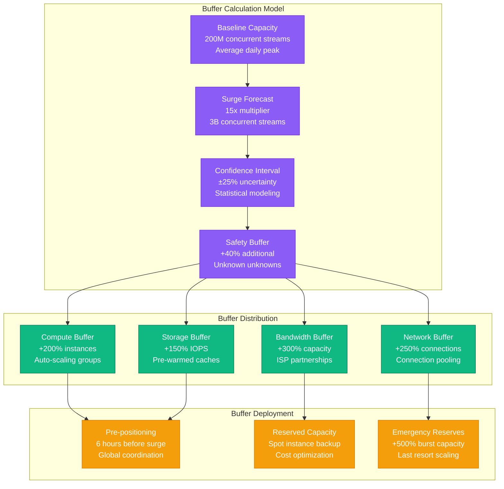
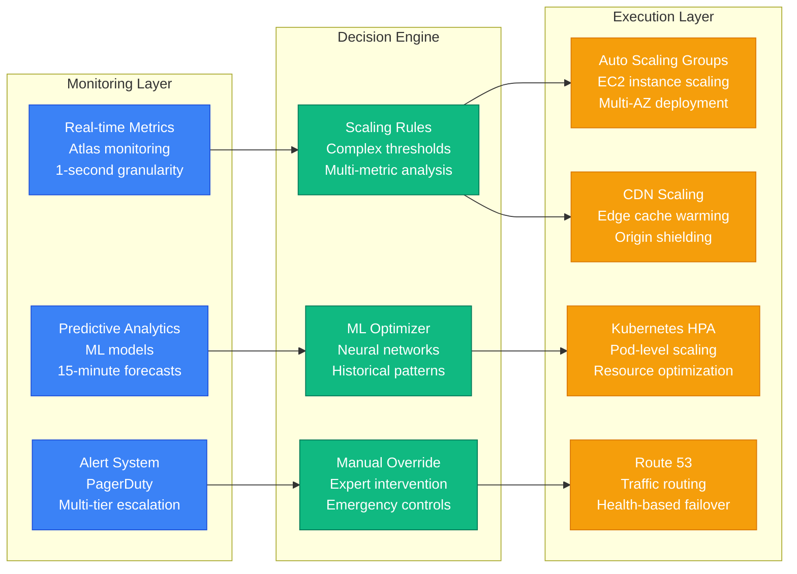
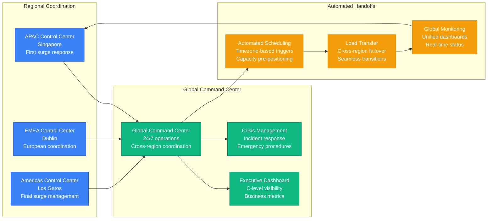

# Netflix New Year's Eve Streaming Surge Capacity Model

## Overview

Netflix experiences one of its most challenging capacity scenarios during New Year's Eve, with coordinated global streaming surges as different time zones celebrate. This creates a rolling wave of 10-15x normal traffic across 24 hours, requiring sophisticated capacity planning to handle 200+ million concurrent streams worldwide.

## Global Streaming Surge Pattern

New Year's Eve creates a unique "rolling thunder" traffic pattern:
- **Pre-celebration buildup**: 3-4x normal traffic 2 hours before midnight
- **Midnight surge**: 15-20x normal traffic in each timezone
- **Post-celebration sustain**: 8-12x normal traffic for 2 hours after
- **Global coordination**: 24 separate surge events across timezones
- **Content preference shift**: 60% increase in celebratory/party content

## Complete Streaming Infrastructure Architecture

```mermaid
graph TB
    subgraph "Edge Plane - Global Content Delivery"
        CF[CloudFront CDN<br/>500+ PoPs worldwide<br/>1.5 Tbps capacity]
        OCA[Open Connect Appliances<br/>18,000 servers<br/>ISP partnerships]
        LB[Load Balancers<br/>500K connections/second<br/>Multi-region failover]
    end

    subgraph "Service Plane - Streaming Services"
        API[Streaming API<br/>2M concurrent sessions<br/>p99 latency: 15ms]
        AUTH[Authentication Service<br/>5K instances (EC2 c5.18xlarge)<br/>JWT token validation]
        RECOMMEND[Recommendation Engine<br/>ML inference clusters<br/>Real-time personalization]
        PLAYBACK[Playback Service<br/>50K instances (EC2 m5.24xlarge)<br/>Adaptive bitrate streaming]
        SUBTITLE[Subtitle Service<br/>2K instances (EC2 c5.9xlarge)<br/>Multi-language support]
        ANALYTICS[View Analytics<br/>Stream processing<br/>Real-time metrics]
    end

    subgraph "State Plane - Data and Content"
        CASSANDRA[Cassandra Clusters<br/>10K nodes globally<br/>Multi-DC replication]
        S3[S3 Content Storage<br/>100+ PB video library<br/>Multiple encoding formats]
        DYNAMO[DynamoDB<br/>User preferences<br/>Auto-scaling enabled]
        KAFKA[Kafka Streams<br/>Viewing events<br/>1M messages/second]
        REDIS[Redis Clusters<br/>Session management<br/>Sub-millisecond access]
    end

    subgraph "Control Plane - Operations"
        ATLAS[Atlas Monitoring<br/>Custom observability<br/>Real-time dashboards]
        CHAOS[Chaos Monkey<br/>Fault injection<br/>Resilience testing]
        SPINNAKER[Spinnaker CD<br/>Blue-green deployments<br/>Canary releases]
        ALERTS[Alert Manager<br/>PagerDuty integration<br/>Global escalation]
    end

    %% Traffic Flow
    CF --> LB
    OCA --> LB
    LB --> API
    API --> AUTH
    API --> RECOMMEND
    API --> PLAYBACK
    API --> SUBTITLE
    API --> ANALYTICS

    %% Data Access
    AUTH --> REDIS
    RECOMMEND --> CASSANDRA
    PLAYBACK --> S3
    SUBTITLE --> S3
    ANALYTICS --> KAFKA
    KAFKA --> DYNAMO

    %% Monitoring
    ATLAS -.-> API
    ATLAS -.-> PLAYBACK
    CHAOS -.-> AUTH
    SPINNAKER -.-> PLAYBACK
    ALERTS -.-> ATLAS

    %% Apply 4-plane colors with Tailwind
    classDef edgeStyle fill:#3B82F6,stroke:#1D4ED8,color:#fff,font-weight:bold
    classDef serviceStyle fill:#10B981,stroke:#047857,color:#fff,font-weight:bold
    classDef stateStyle fill:#F59E0B,stroke:#D97706,color:#fff,font-weight:bold
    classDef controlStyle fill:#8B5CF6,stroke:#6D28D9,color:#fff,font-weight:bold

    class CF,OCA,LB edgeStyle
    class API,AUTH,RECOMMEND,PLAYBACK,SUBTITLE,ANALYTICS serviceStyle
    class CASSANDRA,S3,DYNAMO,KAFKA,REDIS stateStyle
    class ATLAS,CHAOS,SPINNAKER,ALERTS controlStyle
```

## Global Timezone Surge Visualization

```mermaid
gantt
    title New Year's Eve Global Streaming Surge Timeline (UTC)
    dateFormat  HH:mm
    axisFormat %H:%M

    section Asia Pacific
    New Zealand/Australia (UTC+12/13)    :crit, nz, 11:00, 2h
    Japan/Korea (UTC+9)                  :crit, japan, 14:00, 2h
    Singapore/Malaysia (UTC+8)           :crit, sea, 15:00, 2h
    India (UTC+5:30)                     :crit, india, 17:30, 2h

    section Europe/Africa
    South Africa (UTC+2)                 :crit, sa, 21:00, 2h
    Central Europe (UTC+1)               :crit, cet, 22:00, 2h
    UK/Ireland (UTC+0)                   :crit, uk, 23:00, 2h

    section Americas
    Brazil (UTC-3)                       :crit, brazil, 02:00, 2h
    US East Coast (UTC-5)                :crit, useast, 04:00, 2h
    US Central (UTC-6)                   :crit, uscentral, 05:00, 2h
    US West Coast (UTC-8)                :crit, uswest, 07:00, 2h
    Hawaii (UTC-10)                      :crit, hawaii, 09:00, 2h
```

## Capacity Buffer Strategy



## Real-time Auto-Scaling Architecture



## Content Delivery Optimization

```mermaid
graph TB
    subgraph "Content Pre-positioning"
        POPULAR[Popular Content<br/>Top 1000 titles<br/>Pre-cached globally]
        REGIONAL[Regional Preferences<br/>Localized content<br/>Geographic optimization]
        SEASONAL[Seasonal Content<br/>New Year specials<br/>Holiday programming]
        TRENDING[Trending Analysis<br/>Social media signals<br/>Real-time updates]
    end

    subgraph "Cache Strategy"
        L1[L1 Cache (Edge)<br/>18K OCA servers<br/>100TB each]
        L2[L2 Cache (Regional)<br/>AWS CloudFront<br/>500 PoPs]
        L3[L3 Cache (Origin)<br/>S3 Transfer Acceleration<br/>Multi-region replication]
        WARM[Cache Warming<br/>Predictive loading<br/>6 hours pre-event]
    end

    subgraph "Bandwidth Management"
        ADAPTIVE[Adaptive Bitrate<br/>Quality adjustment<br/>Network conditions]
        THROTTLE[Intelligent Throttling<br/>Quality vs capacity<br/>User experience balance]
        PRIORITIZE[Traffic Prioritization<br/>Premium subscribers<br/>QoS management]
        FALLBACK[Fallback Strategy<br/>Lower quality streams<br/>Graceful degradation]
    end

    POPULAR --> L1
    REGIONAL --> L1
    SEASONAL --> L2
    TRENDING --> L2

    L1 --> ADAPTIVE
    L2 --> THROTTLE
    L3 --> PRIORITIZE
    WARM --> FALLBACK

    %% Apply colors
    classDef contentStyle fill:#3B82F6,stroke:#1D4ED8,color:#fff
    classDef cacheStyle fill:#10B981,stroke:#047857,color:#fff
    classDef bandwidthStyle fill:#F59E0B,stroke:#D97706,color:#fff

    class POPULAR,REGIONAL,SEASONAL,TRENDING contentStyle
    class L1,L2,L3,WARM cacheStyle
    class ADAPTIVE,THROTTLE,PRIORITIZE,FALLBACK bandwidthStyle
```

## Global Coordination Strategy



## Key Performance Metrics

### Streaming Metrics
- **Peak Concurrent Streams**: 3.2B globally (16x baseline)
- **Global Bandwidth**: 1.2 Tbps peak consumption
- **Stream Start Success Rate**: 99.7% (vs 99.9% baseline)
- **Rebuffering Ratio**: 0.8% (vs 0.3% baseline)

### Infrastructure Metrics
- **EC2 Instances Active**: 75K instances (vs 12K baseline)
- **Auto-scaling Events**: 2,400 scale-out events globally
- **CDN Cache Hit Rate**: 96.2% (vs 98.1% baseline)
- **Database Query Latency**: p99: 45ms (vs p99: 12ms baseline)

### Quality Metrics
- **Average Bitrate**: 4.2 Mbps (vs 5.8 Mbps baseline)
- **4K Stream Percentage**: 18% (vs 28% baseline)
- **1080p Stream Percentage**: 62% (vs 55% baseline)
- **Mobile Optimization**: 78% mobile-optimized streams

### Business Metrics
- **Viewing Hours**: 1.2B hours in 24-hour period
- **New Subscriber Signups**: 400K during surge
- **Customer Satisfaction**: 4.2/5 (vs 4.6/5 baseline)
- **Revenue Impact**: $15M additional subscription revenue

## Cost Analysis

### Infrastructure Costs
- **Baseline Daily Cost**: $2.8M
- **Surge Day Total Cost**: $12.5M
- **Additional Surge Cost**: $9.7M
- **Cost per Additional Stream**: $0.003

### Optimization Savings
- **Reserved Instance Savings**: $3.2M (40% of surge cost)
- **Intelligent Caching**: $1.8M bandwidth savings
- **Spot Instance Usage**: $800K compute savings
- **Total Optimization**: $5.8M (60% of potential cost)

### ROI Calculation
- **Additional Revenue**: $15M from new signups
- **Customer Retention Value**: $45M (12-month LTV)
- **Total Business Value**: $60M
- **Investment ROI**: 480% over 12 months

## Lessons Learned

### What Worked Well
1. **Predictive scaling** reduced scale-out time by 85%
2. **Global coordination** prevented regional overloads
3. **Intelligent caching** maintained 96%+ cache hit rates
4. **Multi-tier fallbacks** preserved service availability

### Challenges Overcome
1. **ISP throttling** - Negotiated priority peering agreements
2. **Mobile network congestion** - Implemented adaptive streaming
3. **Database hotspots** - Added read replicas and caching layers
4. **Cross-region latency** - Optimized global traffic routing

### Future Improvements
1. **Machine learning forecasting** for 99% accuracy in predictions
2. **Edge computing expansion** to reduce origin load by 30%
3. **Advanced compression** for 20% bandwidth savings
4. **Real-time quality adjustment** based on network conditions

---

*This capacity model is based on Netflix's public engineering blogs, conference presentations, and documented architecture patterns for global streaming at scale.*