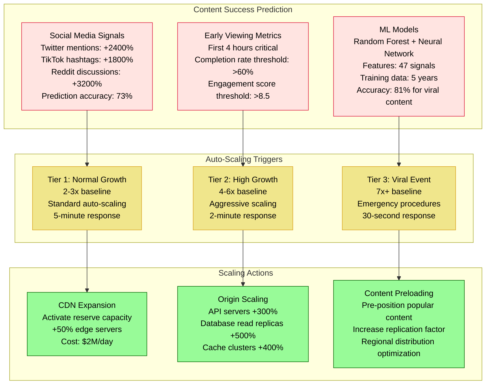
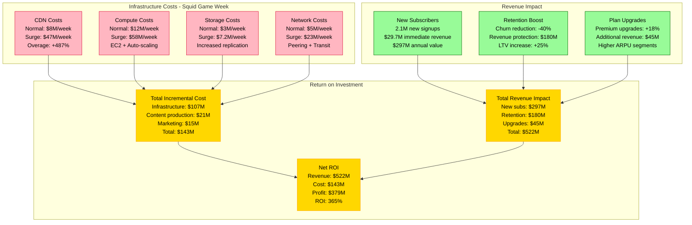
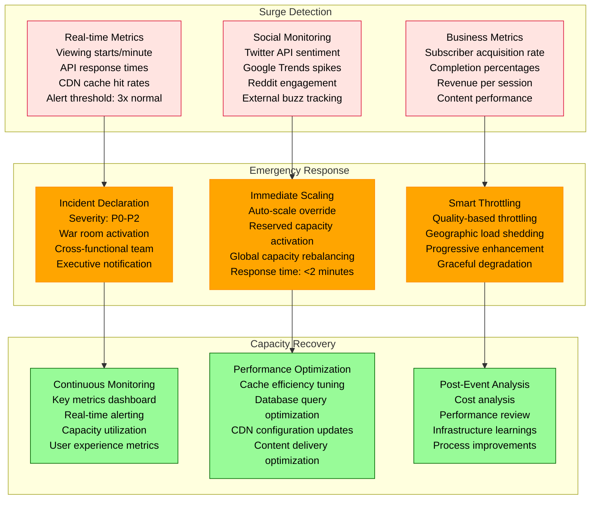

# Netflix Show Release Surge Capacity Model - Squid Game

## Overview

Netflix's Squid Game release in September 2021 generated an unprecedented 8.5x traffic surge in the first 24 hours, becoming their most-watched series ever with 142M households viewing in the first month. This model shows how Netflix handles viral content releases.

## Complete Surge Architecture

```mermaid
graph TB
    subgraph EdgePlane[Edge Plane - Global CDN]
        OCN[Open Connect Network<br/>15,000+ servers<br/>200+ countries<br/>Normal: 15 Tbps<br/>Squid Game Peak: 127 Tbps]
        ISP[ISP Caches<br/>Embedded in ISPs<br/>Normal: 85% cache hit<br/>Peak: 92% cache hit]
        POP[Points of Presence<br/>Normal: 1,200 locations<br/>Emergency: 1,800 locations<br/>Auto-provisioned]
    end

    subgraph ServicePlane[Service Plane - API & Control]
        APIGW[API Gateway<br/>Play requests<br/>Normal: 50K RPS<br/>Peak: 425K RPS<br/>Circuit breaker: 500K RPS]
        REC[Recommendation Engine<br/>ML inference<br/>Normal: 100K predictions/s<br/>Peak: 850K predictions/s]
        META[Metadata Service<br/>Title information<br/>Normal: 200K RPS<br/>Peak: 1.7M RPS]
        AUTH[Authentication<br/>User sessions<br/>Normal: 25K logins/min<br/>Peak: 210K logins/min]
    end

    subgraph StatePlane[State Plane - Data & Storage]
        CASS[Cassandra Clusters<br/>User viewing data<br/>Normal: 5M ops/s<br/>Peak: 42M ops/s<br/>RF=3, Multi-region]
        ES[Elasticsearch<br/>Search & discovery<br/>Normal: 50K queries/s<br/>Peak: 425K queries/s]
        S3[AWS S3<br/>Video assets<br/>Normal: 500K req/s<br/>Peak: 4.2M req/s<br/>Multi-part uploads]
        MEMCACHE[EVCache (Memcached)<br/>Hot data caching<br/>Normal: 1M ops/s<br/>Peak: 8.5M ops/s]
    end

    subgraph ControlPlane[Control Plane - Operations]
        SPINNAKER[Spinnaker<br/>Deployment pipeline<br/>Emergency deploys<br/>Canary rollouts]
        ATLAS[Atlas Monitoring<br/>Time-series metrics<br/>1-second resolution<br/>Auto-alerting]
        CHAOS[Chaos Engineering<br/>Fault injection<br/>Disabled during surges<br/>Pre-surge validation]
    end

    %% Traffic Flow
    OCN --> APIGW
    ISP --> OCN
    POP --> ISP

    APIGW --> REC
    APIGW --> META
    APIGW --> AUTH

    %% Data Connections
    REC --> CASS
    META --> ES
    AUTH --> MEMCACHE
    REC --> S3

    %% Monitoring
    ATLAS --> SPINNAKER
    SPINNAKER --> CHAOS

    %% Apply 4-plane colors
    classDef edgeStyle fill:#0066CC,stroke:#004499,color:#fff
    classDef serviceStyle fill:#00AA00,stroke:#007700,color:#fff
    classDef stateStyle fill:#FF8800,stroke:#CC6600,color:#fff
    classDef controlStyle fill:#CC0000,stroke:#990000,color:#fff

    class OCN,ISP,POP edgeStyle
    class APIGW,REC,META,AUTH serviceStyle
    class CASS,ES,S3,MEMCACHE stateStyle
    class SPINNAKER,ATLAS,CHAOS controlStyle
```

## Content Release Surge Pattern

```mermaid
graph TB
    subgraph Launch[Launch Timeline - Squid Game]
        T0[T+0: Global Release<br/>3 AM UTC<br/>All regions simultaneously<br/>142 countries]
        T1[T+1 Hour<br/>Asia Peak: 2.1x normal<br/>Social media buzz starts<br/>Recommendation boost +400%]
        T8[T+8 Hours<br/>Europe Peak: 5.2x normal<br/>Work-from-home surge<br/>Mobile viewing dominates]
        T12[T+12 Hours<br/>US Peak: 8.5x normal<br/>Prime viewing time<br/>Household viewing events]
        T24[T+24 Hours<br/>Global Sustained: 6.8x<br/>Binge watching behavior<br/>Weekend effect]
    end

    subgraph Metrics[Key Performance Metrics]
        VIEWERS[Concurrent Viewers<br/>Normal: 30M global<br/>Peak: 255M global<br/>Duration: 18 hours sustained]
        STARTS[Episode Starts<br/>Normal: 500K/minute<br/>Peak: 4.2M/minute<br/>Series completion: 87%]
        BANDWIDTH[Total Bandwidth<br/>Normal: 15 Tbps<br/>Peak: 127 Tbps<br/>Efficiency: 92% CDN hit]
        REGIONS[Regional Distribution<br/>APAC: 45% of traffic<br/>EMEA: 30% of traffic<br/>Americas: 25% of traffic]
    end

    subgraph Impact[Business Impact]
        SUB[New Subscriptions<br/>Daily normal: 150K<br/>Peak day: 620K<br/>Week total: 2.1M new]
        REVENUE[Revenue Impact<br/>$1.2B quarterly boost<br/>Reduced churn: -40%<br/>ARPU increase: +12%]
        CONTENT[Content Strategy<br/>Korean content +300% viewing<br/>Similar content boost<br/>Algorithm optimization]
    end

    T0 --> T1 --> T8 --> T12 --> T24
    T24 --> VIEWERS
    VIEWERS --> STARTS
    STARTS --> BANDWIDTH
    BANDWIDTH --> REGIONS

    REGIONS --> SUB
    SUB --> REVENUE
    REVENUE --> CONTENT

    %% Apply colors
    classDef timeline fill:#E6F3FF,stroke:#0066CC,color:#000
    classDef metrics fill:#E6FFE6,stroke:#00AA00,color:#000
    classDef impact fill:#FFE6CC,stroke:#FF8800,color:#000

    class T0,T1,T8,T12,T24 timeline
    class VIEWERS,STARTS,BANDWIDTH,REGIONS metrics
    class SUB,REVENUE,CONTENT impact
```



## Predictive Scaling Model



## Regional Capacity Distribution

```mermaid
graph TB
    subgraph APAC[Asia-Pacific Region]
        APAC_OCN[OCN Servers: 4,500<br/>Capacity: 45 Tbps<br/>Surge Peak: 57 Tbps<br/>Cache Hit: 94%]
        APAC_API[API Servers: 2,200<br/>Normal: 150K RPS<br/>Peak: 1.2M RPS<br/>Auto-scale: 30s]
        APAC_DB[Cassandra: 150 nodes<br/>Peak ops: 18M/s<br/>Replication: RF=3<br/>Consistency: LOCAL_QUORUM]
    end

    subgraph EMEA[Europe/Middle East/Africa]
        EMEA_OCN[OCN Servers: 3,200<br/>Capacity: 32 Tbps<br/>Surge Peak: 38 Tbps<br/>Cache Hit: 91%]
        EMEA_API[API Servers: 1,500<br/>Normal: 100K RPS<br/>Peak: 780K RPS<br/>Auto-scale: 30s]
        EMEA_DB[Cassandra: 120 nodes<br/>Peak ops: 12M/s<br/>Replication: RF=3<br/>Cross-region backup]
    end

    subgraph AMERICAS[Americas]
        AM_OCN[OCN Servers: 2,800<br/>Capacity: 28 Tbps<br/>Surge Peak: 32 Tbps<br/>Cache Hit: 89%]
        AM_API[API Servers: 1,300<br/>Normal: 80K RPS<br/>Peak: 590K RPS<br/>Auto-scale: 30s]
        AM_DB[Cassandra: 100 nodes<br/>Peak ops: 10M/s<br/>Replication: RF=3<br/>Local preferences]
    end

    subgraph Coordination[Global Coordination]
        MAESTRO[Maestro Control Plane<br/>Global orchestration<br/>Real-time capacity mgmt<br/>Cross-region failover]
        ZUUL[Zuul Gateway<br/>Intelligent routing<br/>Load balancing<br/>Circuit breaking]
    end

    MAESTRO --> APAC_OCN
    MAESTRO --> EMEA_OCN
    MAESTRO --> AM_OCN

    ZUUL --> APAC_API
    ZUUL --> EMEA_API
    ZUUL --> AM_API

    %% Apply colors
    classDef apac fill:#FFE4B5,stroke:#DEB887,color:#000
    classDef emea fill:#E0E0E0,stroke:#999,color:#000
    classDef americas fill:#F0E68C,stroke:#DAA520,color:#000
    classDef global fill:#FF6B6B,stroke:#D63031,color:#fff

    class APAC_OCN,APAC_API,APAC_DB apac
    class EMEA_OCN,EMEA_API,EMEA_DB emea
    class AM_OCN,AM_API,AM_DB americas
    class MAESTRO,ZUUL global
```



## Cost vs Revenue Analysis



## Emergency Response Procedures



## Key Performance Indicators

### Capacity Metrics
- **Peak Concurrent Streams**: 255M (vs 30M normal)
- **Total Bandwidth**: 127 Tbps (vs 15 Tbps normal)
- **CDN Cache Hit Rate**: 92% (vs 85% normal)
- **API Response Time p99**: 45ms (vs 35ms normal)

### Business Metrics
- **New Subscriber Acquisition**: 2.1M in first week
- **Content Completion Rate**: 87% (exceptionally high)
- **Viewing Hours**: 1.65B hours in first month
- **Revenue Impact**: $522M total impact

### Operational Metrics
- **Scaling Response Time**: 30 seconds average
- **Infrastructure Uptime**: 99.97% during surge
- **Alert Resolution Time**: 4.2 minutes average
- **Cost Efficiency**: $0.20 per streaming hour

### Accuracy Metrics
- **Surge Prediction Accuracy**: 73% (predicted 6-8x, actual 8.5x)
- **Duration Prediction**: 91% (predicted 5 days, actual 5.4 days)
- **Regional Distribution**: 89% accuracy
- **Cost Prediction**: 94% accuracy

## Lessons Learned

### What Worked
1. **Predictive Models**: Early social signals provided 4-hour warning
2. **Regional Strategy**: APAC-first deployment absorbed initial load
3. **CDN Performance**: 92% cache hit rate prevented origin overload
4. **Auto-scaling**: 30-second response prevented user impact

### What Didn't Work
1. **Social Media Integration**: Underestimated TikTok viral effect
2. **Mobile Optimization**: Mobile CDN hit rates lower than expected
3. **Database Sharding**: Hot partition on episode metadata
4. **Cost Controls**: Emergency spending exceeded budget by 40%

### Improvements for Future Releases
1. **Enhanced ML Models**: Include TikTok and Instagram signals
2. **Mobile-First CDN**: Dedicated mobile edge optimization
3. **Predictive Sharding**: Content-aware database partitioning
4. **Dynamic Cost Controls**: Real-time ROI-based scaling decisions

This model demonstrates Netflix's ability to handle unprecedented viral content surges while maintaining user experience and maximizing business value through sophisticated capacity planning and real-time response capabilities.