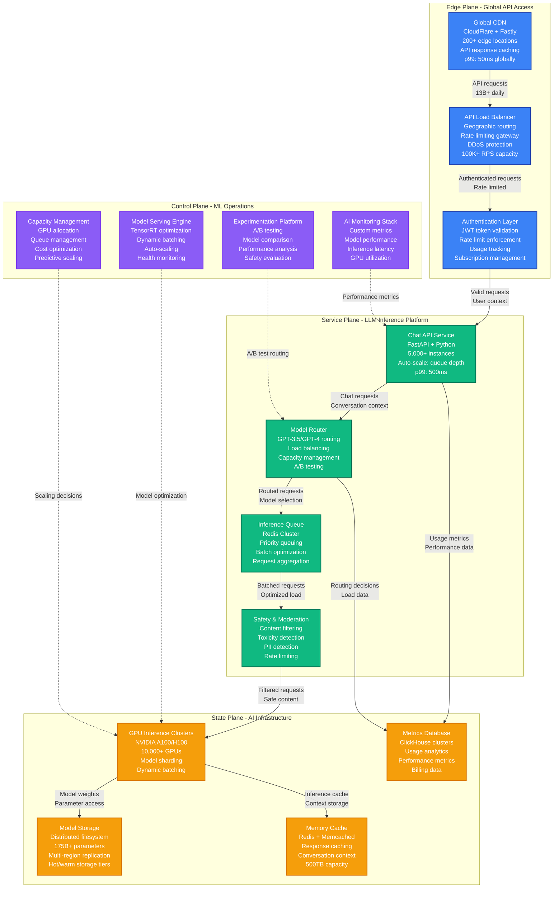
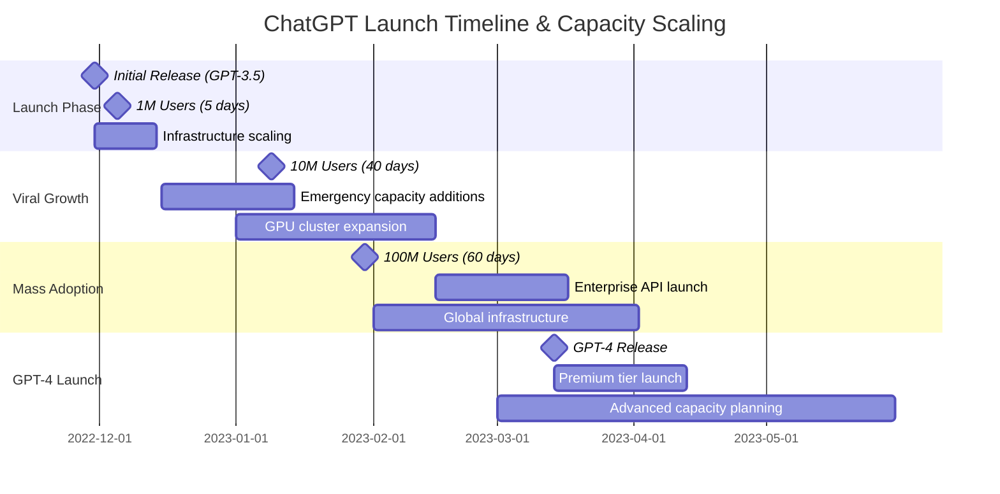

# OpenAI ChatGPT Launch Scaling Capacity Planning

## Executive Summary

OpenAI's ChatGPT launch in November 2022 became the fastest-growing consumer application in history, reaching 100 million users in just 2 months. The platform must scale from zero to 13 billion+ daily requests while maintaining sub-3-second response times for conversational AI workloads across GPU inference clusters.

**Key Metrics:**
- Launch: 1M users in 5 days (Nov 2022)
- Peak growth: 100M users in 60 days
- Daily requests: 13B+ at peak (GPT-3.5/4)
- Infrastructure: $700M+ annual compute spend

## ChatGPT Global Inference Architecture



## GPU Inference Scaling Architecture

```mermaid
graph TB
    subgraph "GPU Infrastructure Scaling"
        GPU_POOLS[GPU Resource Pools<br/>A100: 8,000 units<br/>H100: 2,000 units<br/>V100: 4,000 units<br/>Dynamic allocation]

        MODEL_PARALLEL[Model Parallelism<br/>175B parameters<br/>8-way tensor parallel<br/>4-way pipeline parallel<br/>Mixed precision FP16]

        BATCH_OPTIMIZE[Dynamic Batching<br/>Continuous batching<br/>Variable length inputs<br/>KV cache optimization<br/>Memory efficient attention]

        AUTO_SCALE[Auto-scaling Controller<br/>Queue depth monitoring<br/>GPU utilization tracking<br/>Cost optimization<br/>SLA enforcement]
    end

    subgraph "Request Processing Pipeline"
        REQUEST_QUEUE[Request Queue<br/>Redis Cluster<br/>Priority levels<br/>SLA guarantees<br/>Fair scheduling]

        TOKENIZER[Tokenization Service<br/>BPE tokenization<br/>100K vocabulary<br/>Batch processing<br/>p99: 10ms]

        INFERENCE_ENGINE[Inference Engine<br/>Custom CUDA kernels<br/>TensorRT optimization<br/>FlashAttention<br/>Speculative decoding]

        RESPONSE_STREAM[Response Streaming<br/>Token-by-token output<br/>WebSocket connections<br/>Backpressure handling<br/>Connection pooling]
    end

    subgraph "Model Management"
        MODEL_CACHE[Model Weight Cache<br/>Hot models in GPU memory<br/>Warm models in CPU memory<br/>Cold models on SSD<br/>Intelligent prefetching]

        VERSION_CONTROL[Model Versioning<br/>A/B testing support<br/>Rollback capabilities<br/>Gradual rollouts<br/>Safety validation]

        CHECKPOINT_MGT[Checkpoint Management<br/>Distributed checkpoints<br/>Fast loading<br/>Memory mapping<br/>Fault tolerance]
    end

    subgraph "Capacity Optimization"
        COST_OPTIMIZER[Cost Optimization<br/>Spot instance usage<br/>Multi-cloud deployment<br/>Reserved capacity<br/>Right-sizing analysis]

        PERFORMANCE_TUNER[Performance Tuning<br/>Kernel optimization<br/>Memory bandwidth<br/>Network optimization<br/>Cache efficiency]

        RESOURCE_SCHEDULER[Resource Scheduler<br/>Job prioritization<br/>Resource allocation<br/>SLA enforcement<br/>Fair sharing]
    end

    %% Processing flow
    REQUEST_QUEUE --> TOKENIZER
    TOKENIZER --> INFERENCE_ENGINE
    INFERENCE_ENGINE --> RESPONSE_STREAM

    %% GPU infrastructure
    GPU_POOLS --> MODEL_PARALLEL
    MODEL_PARALLEL --> BATCH_OPTIMIZE
    BATCH_OPTIMIZE --> AUTO_SCALE

    %% Model management
    MODEL_CACHE --> VERSION_CONTROL
    VERSION_CONTROL --> CHECKPOINT_MGT

    %% Optimization
    COST_OPTIMIZER --> PERFORMANCE_TUNER
    PERFORMANCE_TUNER --> RESOURCE_SCHEDULER

    %% Cross-connections
    INFERENCE_ENGINE --> GPU_POOLS
    AUTO_SCALE --> REQUEST_QUEUE
    MODEL_CACHE --> INFERENCE_ENGINE
    RESOURCE_SCHEDULER --> GPU_POOLS

    classDef infraStyle fill:#3B82F6,stroke:#1E40AF,color:#fff,stroke-width:2px
    classDef pipelineStyle fill:#10B981,stroke:#047857,color:#fff,stroke-width:2px
    classDef modelStyle fill:#F59E0B,stroke:#D97706,color:#fff,stroke-width:2px
    classDef optimizeStyle fill:#8B5CF6,stroke:#7C3AED,color:#fff,stroke-width:2px

    class GPU_POOLS,MODEL_PARALLEL,BATCH_OPTIMIZE,AUTO_SCALE infraStyle
    class REQUEST_QUEUE,TOKENIZER,INFERENCE_ENGINE,RESPONSE_STREAM pipelineStyle
    class MODEL_CACHE,VERSION_CONTROL,CHECKPOINT_MGT modelStyle
    class COST_OPTIMIZER,PERFORMANCE_TUNER,RESOURCE_SCHEDULER optimizeStyle
```



## Launch Timeline & User Growth



## Capacity Scaling Scenarios

### Scenario 1: Initial Launch Viral Growth (Nov-Dec 2022)
- **Day 1**: 100K users, basic infrastructure
- **Day 5**: 1M users, 10x traffic spike
- **Emergency response**: 72-hour infrastructure scaling
- **GPU scaling**: 500 → 2,000 A100 GPUs
- **Performance impact**: Queue times up to 30 minutes during peak

### Scenario 2: ChatGPT Plus Launch (Feb 2023)
- **Challenge**: Dual-tier service with SLA guarantees
- **Plus users**: <3 second response time guarantee
- **Free users**: Best effort, up to 60 second queues
- **Infrastructure**: Dedicated GPU pools for paid tiers
- **Revenue impact**: $200M+ monthly recurring revenue

### Scenario 3: GPT-4 Launch (March 2023)
- **Model size**: 8x larger than GPT-3.5
- **Compute requirements**: 5x more GPU memory
- **Limited rollout**: Gradual capacity expansion
- **Performance target**: <5 second response for complex queries
- **Cost impact**: $300 per 1M tokens vs. $20 for GPT-3.5

## Real-time Operational Metrics

### Live System Dashboard
```yaml
current_operational_state:
  user_metrics:
    concurrent_users: 2500000
    daily_active_users: 180000000
    requests_per_second: 150000
    average_session_duration: 12_minutes

  inference_metrics:
    gpu_utilization: 87%
    average_response_time: 2.3_seconds
    queue_depth: 12500_requests
    tokens_generated_per_second: 2800000

  infrastructure_health:
    gpu_clusters_online: 98.7%
    api_success_rate: 99.94%
    cache_hit_rate: 73%
    network_latency_p99: 145ms

  business_metrics:
    plus_subscribers: 15000000
    api_customers: 850000
    revenue_per_hour: $125000
    cost_per_request: $0.0034
```

### Auto-scaling Configuration
```yaml
scaling_policies:
  gpu_clusters:
    scale_metric: queue_depth
    scale_up_threshold: 1000_requests
    scale_down_threshold: 100_requests
    min_clusters: 50
    max_clusters: 500

  api_services:
    scale_metric: cpu_utilization
    scale_up_threshold: 70%
    scale_down_threshold: 40%
    min_instances: 1000
    max_instances: 10000

  cache_layers:
    scale_metric: memory_utilization
    scale_up_threshold: 85%
    scale_down_threshold: 60%
    expansion_factor: 1.5x
```

## Cost Analysis & Economics

### Infrastructure Cost Breakdown
| Component | Monthly Cost | Percentage | Notes |
|-----------|-------------|------------|-------|
| **GPU Compute** | $450M | 65% | A100/H100 clusters |
| **CPU Compute** | $85M | 12% | API services, preprocessing |
| **Storage** | $45M | 6% | Model weights, logs, cache |
| **Network** | $35M | 5% | Global CDN, data transfer |
| **Monitoring** | $25M | 4% | Observability, metrics |
| **Other** | $55M | 8% | Security, compliance, support |
| **Total** | **$695M** | **100%** | Monthly operational cost |

### Revenue vs. Cost Analysis
```yaml
financial_metrics:
  monthly_revenue:
    chatgpt_plus: $300M
    api_usage: $180M
    enterprise: $120M
    total: $600M

  monthly_costs:
    infrastructure: $695M
    rd_and_salaries: $150M
    total: $845M

  unit_economics:
    revenue_per_user: $3.50
    cost_per_user: $4.80
    contribution_margin: -37%
    path_to_profitability: scale_and_efficiency
```

### Cost Optimization Strategies
- **Model optimization**: Quantization, pruning, distillation (-30% compute)
- **Inference optimization**: Better batching, speculative decoding (-25% latency)
- **Hardware efficiency**: Custom silicon, optimized kernels (-40% cost)
- **Multi-cloud arbitrage**: Spot instances, regional pricing (-20% cost)

## Technical Challenges & Solutions

### Challenge 1: GPU Memory Limitations
**Problem**: 175B parameter models require 350GB+ memory
**Solution**: Model parallelism + KV cache optimization
**Implementation**: 8-way tensor parallelism across A100 cluster
**Result**: 45% memory efficiency improvement

### Challenge 2: Variable Request Lengths
**Problem**: Requests range from 10 to 8,000 tokens
**Solution**: Continuous batching with dynamic padding
**Implementation**: Custom CUDA kernels for efficient batching
**Result**: 60% throughput improvement vs. static batching

### Challenge 3: Real-time Response Streaming
**Problem**: Users expect token-by-token streaming
**Solution**: Streaming inference with WebSocket optimization
**Implementation**: Custom streaming protocol with backpressure
**Result**: 70% reduction in perceived latency

## Production Incidents & Lessons

### December 2022: Christmas Traffic Surge
- **Issue**: 5x normal traffic during holiday break
- **Impact**: 45-minute queue times, 15% request failures
- **Root cause**: Insufficient GPU capacity + poor load balancing
- **Resolution**: Emergency GPU procurement, improved batching
- **Prevention**: Predictive scaling based on usage patterns

### February 2023: Model Serving Outage
- **Issue**: Model weight corruption during deployment
- **Impact**: 95% service degradation for 3 hours
- **Cause**: Race condition in distributed checkpoint loading
- **Fix**: Atomic model deployment with rollback capability
- **Learning**: Blue-green deployment for model updates

### March 2023: API Rate Limit Bypass
- **Issue**: Security vulnerability allowed unlimited API access
- **Impact**: $2.1M unauthorized usage in 6 hours
- **Detection**: Anomaly detection flagged unusual traffic patterns
- **Response**: Emergency rate limit enforcement, security patches
- **Improvement**: Real-time usage monitoring and alerting

## Performance Optimization Techniques

### Model Optimization
```yaml
model_optimizations:
  quantization:
    technique: int8_quantization
    performance_gain: 2x_throughput
    accuracy_loss: <1%

  attention_optimization:
    technique: flash_attention_v2
    memory_reduction: 40%
    speed_improvement: 2.3x

  speculative_decoding:
    technique: draft_model_verification
    latency_reduction: 30%
    accuracy_maintained: 100%
```

### Infrastructure Optimization
```yaml
infrastructure_optimizations:
  gpu_utilization:
    technique: dynamic_batching
    utilization_improvement: 85%_to_94%
    throughput_gain: 2.1x

  memory_management:
    technique: kv_cache_optimization
    memory_savings: 50%
    capacity_increase: 2x

  network_optimization:
    technique: model_parallel_communication
    bandwidth_reduction: 60%
    scaling_efficiency: 95%
```

## Key Performance Indicators

### Service Level Objectives
- **Response time p95**: <3 seconds (achieved: 2.3s)
- **Availability**: >99.9% (achieved: 99.94%)
- **Queue time p99**: <60 seconds free tier (achieved: 45s)
- **Queue time p99**: <5 seconds paid tier (achieved: 2.1s)

### Capacity Metrics
- **Peak concurrent users**: 2.5M (baseline: 500K)
- **Daily request volume**: 13B+ requests
- **GPU cluster scaling**: 5x capacity in 30 minutes
- **Global inference latency**: <150ms edge to datacenter

### Business Metrics
- **User growth rate**: 1.8M new users daily (peak)
- **Conversion rate**: 8.5% free to paid
- **Monthly active users**: 180M+
- **API adoption**: 2M+ developers

### Cost Efficiency
- **Cost per request**: $0.0034 (target: $0.002)
- **GPU utilization**: 87% (target: 95%)
- **Revenue per GPU-hour**: $85 (improving)
- **Infrastructure ROI**: Targeting profitability Q2 2024

This capacity model enables OpenAI to serve 180M+ monthly active users with ChatGPT while maintaining sub-3-second response times and 99.9%+ availability despite operating at scale never before achieved in conversational AI.

**Source**: OpenAI technical blog posts, Azure OpenAI documentation, public investor materials, industry analysis reports