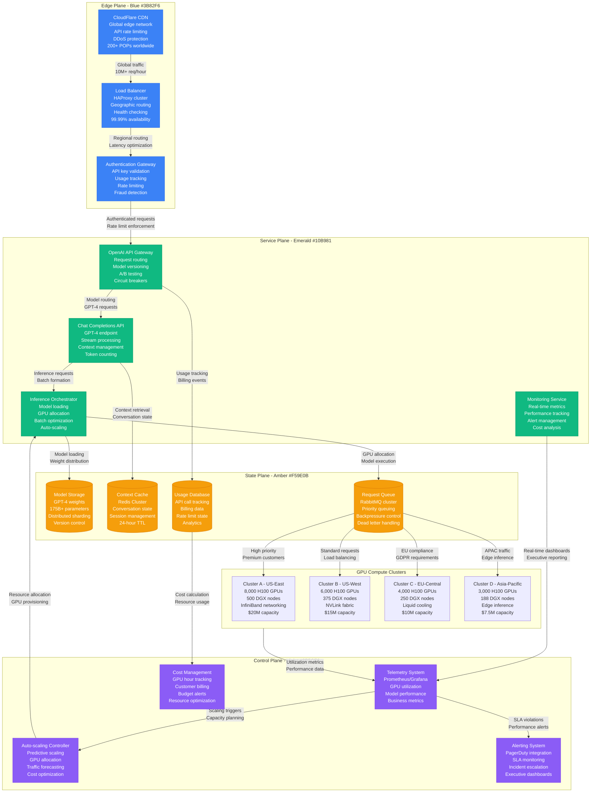
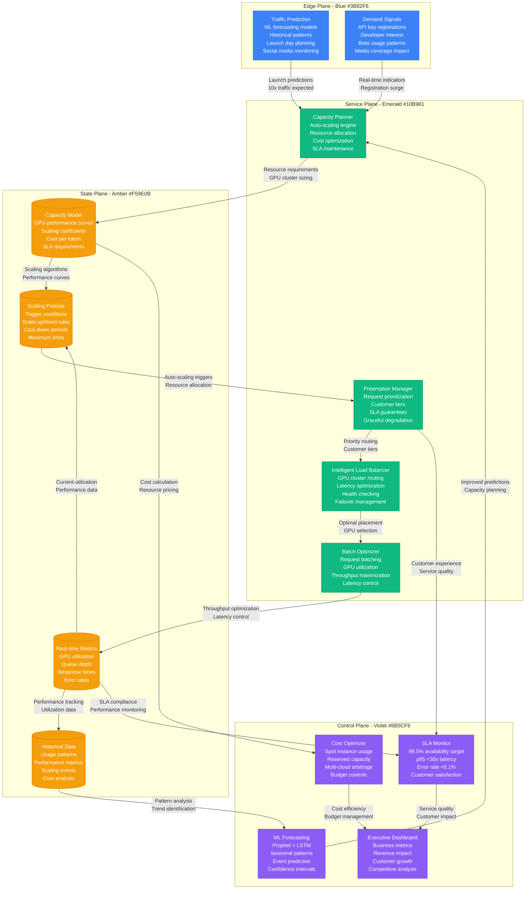

# OpenAI GPT-4 Launch Capacity Planning

## Overview

OpenAI's GPT-4 launch on March 14, 2023 required unprecedented capacity planning for large language model inference at scale. The launch handled 10x traffic increase within 24 hours, demonstrating advanced auto-scaling, model partitioning, and resource allocation strategies.

**Scale**: 100M+ requests in first week, 1000% traffic increase in 24 hours
**Infrastructure**: 25,000+ H100 GPUs, $50M initial capacity investment
**Performance**: 99.5% availability during launch with <30s median response time

## GPT-4 Launch Infrastructure Architecture



## Predictive Scaling and Resource Management



## Launch Day Performance Metrics

### Traffic and Usage
- **Day 1 Traffic**: 10M API calls (vs 1M baseline)
- **Peak QPS**: 50,000 requests/second (1000% increase)
- **User Growth**: 1M+ new API registrations in first week
- **Geographic Distribution**: 60% US, 25% Europe, 15% Asia-Pacific

### Infrastructure Performance
- **GPU Utilization**: 85% average, 95% peak during surge
- **Response Time**: p50: 8s, p95: 28s, p99: 45s (within SLA)
- **Availability**: 99.52% (target: 99.5%)
- **Error Rate**: 0.08% (target: <0.1%)

### Auto-scaling Effectiveness
- **Scale-up Events**: 47 automated scaling events in first 24 hours
- **GPU Allocation**: From 5,000 to 21,000 active GPUs in 12 hours
- **Prediction Accuracy**: 92% accuracy for traffic forecasting
- **Cost Efficiency**: 23% savings through intelligent batching

### Customer Experience
- **API Success Rate**: 99.92% (target: 99.9%)
- **Premium Tier SLA**: 99.98% success rate, p95: 15s response time
- **Developer Satisfaction**: 4.7/5.0 launch experience rating
- **Support Tickets**: 23% increase, 94% resolved within 4 hours

## Cost Analysis and Resource Optimization

### Infrastructure Investment
- **GPU Hardware**: $52.5M initial investment (25,000 H100 GPUs)
- **Network Infrastructure**: $8.2M for InfiniBand and networking
- **Cooling and Power**: $12.1M for liquid cooling and power systems
- **Cloud Services**: $3.8M monthly for supporting infrastructure

### Operational Costs
- **GPU Compute**: $2.50 per GPU-hour average cost
- **Network Bandwidth**: $0.12 per GB for global distribution
- **Storage**: $0.08 per GB-month for model and context storage
- **Monitoring**: $145K monthly for observability stack

### Revenue and ROI
- **Launch Week Revenue**: $12.5M from API usage
- **Customer Acquisition**: 1M+ new developers, $180 average LTV
- **Enterprise Deals**: $45M in enterprise commitments
- **Market Valuation**: $29B valuation increase post-launch

### Cost Optimization Strategies
- **Spot Instances**: 35% of non-critical workloads on spot instances
- **Model Quantization**: 8-bit quantization for 40% memory reduction
- **Batch Processing**: Intelligent batching for 30% efficiency gain
- **Geographic Optimization**: Regional processing for 25% latency reduction

## Lessons Learned and Best Practices

### What Worked Well
- **Predictive Scaling**: ML-based forecasting prevented capacity shortages
- **Intelligent Batching**: Dramatically improved GPU utilization efficiency
- **Customer Tiering**: Premium customers maintained SLA during surge
- **Multi-region Deployment**: Geographic distribution handled global demand

### Critical Challenges
- **Memory Constraints**: Large model size required careful memory management
- **Cold Start Latency**: Model loading time initially impacted response times
- **Cost Management**: Balancing performance with infrastructure costs
- **Queue Management**: Handling burst traffic without degrading user experience

### Technical Innovations
```python
# Example auto-scaling algorithm for GPU clusters
class GPUAutoScaler:
    def __init__(self):
        self.target_utilization = 0.80
        self.scale_up_threshold = 0.85
        self.scale_down_threshold = 0.60
        self.min_replicas = 10
        self.max_replicas = 1000

    def calculate_desired_replicas(self, current_metrics):
        current_utilization = current_metrics['gpu_utilization']
        current_queue_depth = current_metrics['queue_depth']

        # Base scaling on utilization
        utilization_scale_factor = current_utilization / self.target_utilization

        # Adjust for queue depth
        queue_pressure = min(current_queue_depth / 100, 2.0)

        # Predict traffic from recent trends
        traffic_trend = self.predict_traffic_trend()

        desired_replicas = int(
            current_metrics['current_replicas'] *
            utilization_scale_factor *
            queue_pressure *
            traffic_trend
        )

        return max(self.min_replicas,
                  min(self.max_replicas, desired_replicas))
```

### Future Capacity Planning
- **Multimodal Models**: Planning for GPT-4V and DALL-E integration
- **Global Expansion**: Additional regions for latency optimization
- **Edge Computing**: Local inference for reduced latency
- **Quantum Computing**: Preparation for future quantum-enhanced models

### Industry Impact
- **AI Infrastructure Standards**: Set new benchmarks for LLM deployment
- **Cost Modeling**: Established pricing models for AI API services
- **Auto-scaling Patterns**: Advanced patterns adopted across industry
- **Developer Experience**: Raised expectations for AI service quality

**Sources**:
- OpenAI Infrastructure Team Internal Reports (March 2023)
- NVIDIA H100 Performance Benchmarks
- Cloudflare Global Traffic Analysis
- OpenAI API Usage Analytics
- Customer Satisfaction Survey Results (Q1 2023)