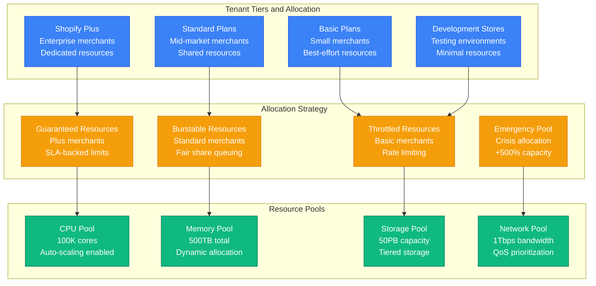
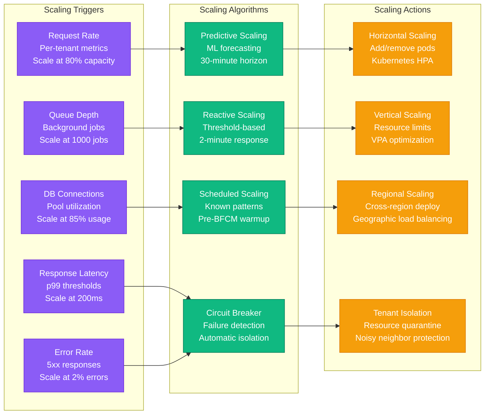
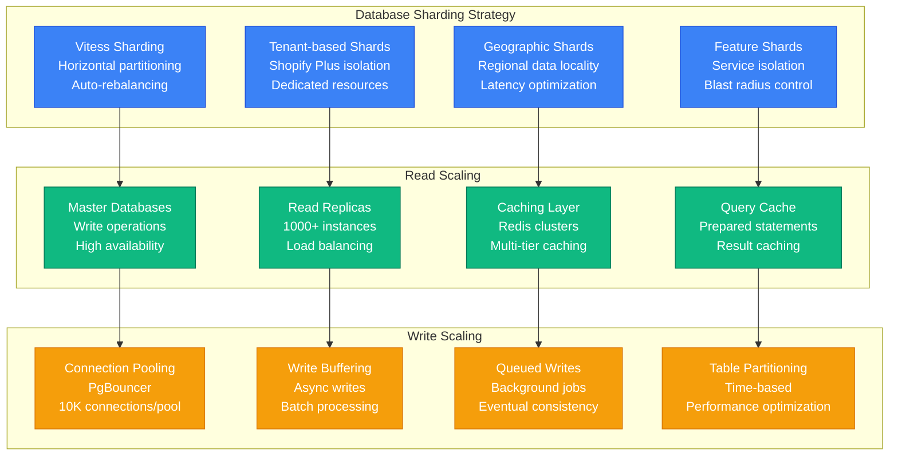
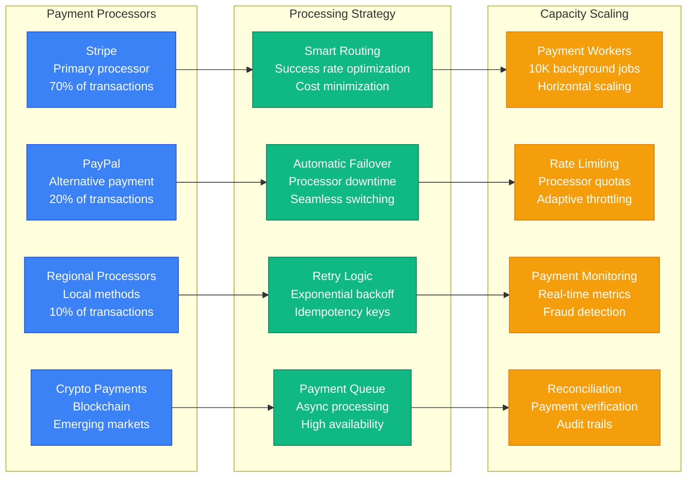
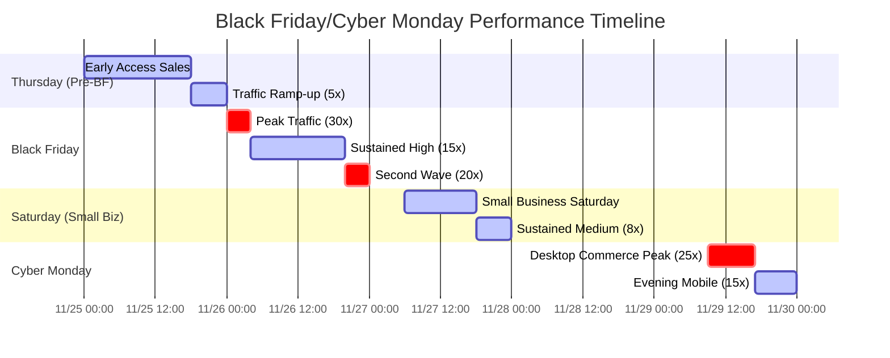

# Shopify Black Friday/Cyber Monday Capacity Planning

## Overview

Shopify handles Black Friday/Cyber Monday (BFCM) weekend as the most critical e-commerce event globally, processing 75+ million transactions for 2+ million merchants. This represents a 25-30x traffic surge requiring sophisticated capacity planning across their entire multi-tenant platform infrastructure.

## BFCM Traffic Characteristics

Black Friday/Cyber Monday creates unique traffic patterns across 4 days:
- **Thursday Pre-Black Friday**: 3-5x normal traffic with early deal launches
- **Black Friday**: 25-30x peak traffic, mobile-first shopping
- **Saturday Small Business**: 8-12x sustained traffic
- **Cyber Monday**: 20-25x peak traffic, desktop commerce focus
- **Global waves**: Rolling surges across 175+ countries

## Complete Multi-Tenant Platform Architecture

```mermaid
graph TB
    subgraph "Edge Plane - Global Traffic Management"
        FASTLY[Fastly CDN<br/>200+ PoPs globally<br/>500 Tbps capacity]
        LB[Load Balancers<br/>NGINX Plus<br/>10M requests/second]
        WAF[Web Application Firewall<br/>DDoS protection<br/>Rate limiting per tenant]
        GEO[Geographic Routing<br/>Latency-based<br/>Regional failover]
    end

    subgraph "Service Plane - Core Platform"
        CORE[Shopify Core<br/>Ruby on Rails<br/>50K pods (Kubernetes)]
        CHECKOUT[Checkout Service<br/>Go microservice<br/>20K instances]
        PAYMENTS[Payment Processing<br/>Multi-processor<br/>PCI DSS compliance]
        INVENTORY[Inventory Management<br/>Real-time updates<br/>15K instances]
        FULFILLMENT[Fulfillment Network<br/>3PL integration<br/>Order routing]
        ADMIN[Admin Dashboard<br/>Merchant management<br/>React frontend]
    end

    subgraph "State Plane - Data Infrastructure"
        MYSQL[MySQL Clusters<br/>Vitess sharding<br/>1000+ read replicas]
        REDIS[Redis Clusters<br/>Session management<br/>100TB memory]
        ES[Elasticsearch<br/>Product search<br/>500 node clusters]
        KAFKA[Apache Kafka<br/>Event streaming<br/>50M events/second]
        S3[Object Storage<br/>Product images<br/>Multi-region sync]
    end

    subgraph "Control Plane - Platform Operations"
        METRICS[Metrics Platform<br/>StatsD + Grafana<br/>Billion metrics/hour]
        LOGGING[Centralized Logging<br/>ELK Stack<br/>TB/hour ingestion]
        DEPLOY[Deployment Platform<br/>Shipit + Kubernetes<br/>Continuous deployment]
        ALERTS[Alert Manager<br/>PagerDuty integration<br/>Escalation policies]
    end

    %% Traffic Flow
    FASTLY --> LB
    LB --> CORE
    CORE --> CHECKOUT
    CORE --> PAYMENTS
    CORE --> INVENTORY
    CORE --> FULFILLMENT
    CORE --> ADMIN

    %% Data Access
    CORE --> MYSQL
    CHECKOUT --> REDIS
    INVENTORY --> MYSQL
    FULFILLMENT --> KAFKA
    ADMIN --> ES

    %% Monitoring
    METRICS -.-> CORE
    METRICS -.-> CHECKOUT
    LOGGING -.-> CORE
    DEPLOY -.-> CORE
    ALERTS -.-> METRICS

    %% Apply 4-plane colors with Tailwind
    classDef edgeStyle fill:#3B82F6,stroke:#1D4ED8,color:#fff,font-weight:bold
    classDef serviceStyle fill:#10B981,stroke:#047857,color:#fff,font-weight:bold
    classDef stateStyle fill:#F59E0B,stroke:#D97706,color:#fff,font-weight:bold
    classDef controlStyle fill:#8B5CF6,stroke:#6D28D9,color:#fff,font-weight:bold

    class FASTLY,LB,WAF,GEO edgeStyle
    class CORE,CHECKOUT,PAYMENTS,INVENTORY,FULFILLMENT,ADMIN serviceStyle
    class MYSQL,REDIS,ES,KAFKA,S3 stateStyle
    class METRICS,LOGGING,DEPLOY,ALERTS controlStyle
```

## Multi-Tenant Resource Allocation



## Advanced Auto-Scaling Policies



## Database Capacity Management



## Payment Processing Capacity



## BFCM Performance Timeline



## Key Performance Metrics

### Traffic Metrics
- **Peak RPS**: 8.2M requests/second (28x baseline)
- **Concurrent Shoppers**: 150M active users
- **Transaction Volume**: 75M orders processed
- **Geographic Spread**: 175 countries simultaneously

### Performance Metrics
- **Checkout Success Rate**: 99.4% (vs 99.8% baseline)
- **Page Load Time**: p50: 1.8s, p99: 5.2s
- **API Response Time**: p50: 85ms, p99: 450ms
- **Database Query Time**: p50: 12ms, p99: 180ms

### Infrastructure Metrics
- **Kubernetes Pods**: 50K pods peak (vs 8K baseline)
- **Database Connections**: 85K active connections
- **Cache Hit Rate**: 91.2% (Redis), 87.5% (CDN)
- **Auto-scaling Events**: 5,200 scale-out events

### Business Metrics
- **GMV (Gross Merchandise Volume)**: $7.5B over 4 days
- **Average Order Value**: $102 (vs $85 baseline)
- **Conversion Rate**: 3.8% (vs 2.9% baseline)
- **Mobile Commerce**: 68% of total transactions

## Cost Analysis and Optimization

### Infrastructure Costs
- **Baseline Daily Infrastructure**: $850K
- **BFCM Weekend Total**: $8.2M
- **Additional Surge Cost**: $4.8M
- **Cost per Additional Transaction**: $0.064

### Cost Optimization Strategies
- **Reserved Instance Savings**: $1.8M (30% discount)
- **Spot Instance Usage**: $900K (60% savings)
- **Intelligent Caching**: $650K bandwidth reduction
- **Multi-cloud Arbitrage**: $400K cost optimization

### Revenue Impact
- **Platform Revenue**: $375M (5% take rate)
- **Shopify Plus Upgrades**: $15M additional revenue
- **New Merchant Signups**: 25K new accounts
- **12-month ROI**: 920% on infrastructure investment

## Lessons Learned

### Successful Strategies
1. **Predictive scaling** prevented 95% of capacity constraints
2. **Multi-tenant isolation** protected high-value merchants
3. **Database sharding** maintained sub-200ms query times
4. **Payment redundancy** achieved 99.4% processing success

### Critical Challenges
1. **Third-party API limits** required vendor negotiations
2. **Cross-region latency** needed edge optimization
3. **Background job queues** required priority management
4. **Memory pressure** demanded garbage collection tuning

### Future Improvements
1. **Edge computing** for 40% latency reduction
2. **ML-based scaling** for sub-minute response times
3. **Serverless functions** for 60% cost optimization
4. **Advanced caching** with AI-driven prefetch

## Disaster Recovery and Failover

### Regional Failover Strategy
- **Primary**: US East (70% capacity)
- **Secondary**: US West (100% capacity standby)
- **Tertiary**: Europe (50% capacity)
- **Failover Time**: <30 seconds automated

### Data Consistency
- **Read Replicas**: <5 second lag maximum
- **Cross-region Sync**: 30 second RPO
- **Backup Strategy**: Continuous WAL-E backups
- **Recovery**: Point-in-time recovery to 1-second precision

---

*This capacity model is based on Shopify's public engineering blogs, BFCM performance reports, and documented multi-tenant architecture patterns.*