# Shopify Flash Sale Capacity Planning

## Overview

Shopify handles massive flash sale events where merchants experience 50-100x normal traffic within minutes. The platform must scale from 80K baseline TPS to 4M+ TPS during major sales events while maintaining 99.99% payment processing reliability and sub-200ms checkout latencies.

**Key Challenge**: Scale checkout infrastructure, inventory management, and payment processing for 10M+ concurrent shoppers attempting to purchase limited inventory items.

**Historical Context**: During the 2023 Black Friday Cyber Monday weekend, Shopify processed $9.3 billion in sales with peak traffic of 3.8M TPS and 99.99% checkout success rate despite 47x normal load.

## Flash Sale Infrastructure Architecture

```mermaid
graph TB
    subgraph EdgePlane[Edge Plane - Global E-commerce Traffic]
        direction TB

        subgraph GlobalCDN[E-commerce CDN Network]
            SHOPIFY_CDN[Shopify CDN<br/>500+ edge locations<br/>Product images: 99% cache<br/>Static assets: 100 Tbps<br/>p99: 20ms globally]

            CLOUDFLARE_ECOM[CloudFlare E-commerce<br/>Bot protection<br/>DDoS mitigation<br/>Queue management<br/>Geographic routing]
        end

        subgraph TrafficManagement[Traffic Management Layer]
            QUEUE_SYSTEM[Smart Queue System<br/>Virtual waiting rooms<br/>Fair queuing algorithm<br/>Estimated wait times<br/>Mobile-optimized]

            LOAD_BALANCER[Global Load Balancer<br/>AWS ALB + Route53<br/>Health-based routing<br/>Session stickiness<br/>Auto-failover: 30s]
        end
    end

    subgraph ServicePlane[Service Plane - E-commerce Engine]
        direction TB

        subgraph StorefrontServices[Storefront Services]
            STOREFRONT_API[Storefront API<br/>GraphQL + REST<br/>12,000 instances<br/>Auto-scale: 70% CPU<br/>p99: 150ms]

            PRODUCT_CATALOG[Product Catalog<br/>Product search<br/>Inventory display<br/>Price calculation<br/>Real-time updates]

            CART_SERVICE[Cart Service<br/>Session management<br/>Cart persistence<br/>Price calculations<br/>Tax computation]
        end

        subgraph CheckoutServices[Checkout Infrastructure]
            CHECKOUT_API[Checkout API<br/>Ruby on Rails<br/>8,000 instances<br/>Critical path optimization<br/>p99: 200ms]

            INVENTORY_ENGINE[Inventory Engine<br/>Real-time stock tracking<br/>Reservation system<br/>Oversell prevention<br/>Conflict resolution]

            PAYMENT_GATEWAY[Payment Gateway<br/>Multi-processor routing<br/>Stripe + Braintree + more<br/>Fraud detection<br/>99.99% uptime SLA]
        end

        ifrastructure[Order Infrastructure]
            ORDER_SERVICE[Order Service<br/>Order creation<br/>Fulfillment routing<br/>Status tracking<br/>Event publishing]

            NOTIFICATION_HUB[Notification Hub<br/>Order confirmations<br/>Email + SMS<br/>Push notifications<br/>Real-time updates]

            ANALYTICS_ENGINE[Real-time Analytics<br/>Sales tracking<br/>Conversion metrics<br/>Performance monitoring<br/>Business intelligence]
        end
    end

    subgraph StatePlane[State Plane - E-commerce Data Management]
        direction TB

        subgraph ProductData[Product & Inventory Data]
            PRODUCT_DB[Product Database<br/>PostgreSQL clusters<br/>Product catalog<br/>Pricing rules<br/>Variant management]

            INVENTORY_DB[Inventory Database<br/>Redis + PostgreSQL<br/>Real-time stock levels<br/>Reservation tracking<br/>Multi-location inventory]
        end

        subgraph TransactionData[Transaction & Order Data]
            ORDER_DB[Order Database<br/>PostgreSQL<br/>ACID compliance<br/>Order history<br/>Financial records]

            PAYMENT_DB[Payment Database<br/>Encrypted storage<br/>PCI compliance<br/>Transaction logs<br/>Audit trails]
        end

        subgraph CustomerData[Customer & Session Data]
            CUSTOMER_DB[Customer Database<br/>MongoDB clusters<br/>Customer profiles<br/>Shopping behavior<br/>Preferences]

            SESSION_STORE[Session Store<br/>Redis clusters<br/>Cart data<br/>Session state<br/>Shopping context]
        end

        subgraph CachingInfrastructure[Multi-Tier Caching]
            REDIS_CACHE[Redis Cache Clusters<br/>Product data cache<br/>Pricing cache<br/>Inventory cache<br/>1TB+ memory]

            MEMCACHED[Memcached<br/>Query result cache<br/>API response cache<br/>Fragment cache<br/>TTL: 5-3600 seconds]
        end
    end

    subgraph ControlPlane[Control Plane - E-commerce Operations]
        direction TB

        subgraph MonitoringStack[Real-time Monitoring]
            ECOMMERCE_MONITORING[E-commerce Monitoring<br/>Custom metrics platform<br/>Business KPIs<br/>Technical metrics<br/>Real-time dashboards]

            REVENUE_TRACKING[Revenue Tracking<br/>Real-time sales data<br/>Conversion funnels<br/>Cart abandonment<br/>Performance correlation]
        end

        subgraph CapacityManagement[Flash Sale Capacity Management]
            SALE_PREDICTOR[Sale Predictor<br/>Merchant event calendar<br/>Historical patterns<br/>Marketing spend analysis<br/>Viral coefficient tracking]

            AUTO_SCALER[Auto-scaling Engine<br/>Predictive scaling<br/>Reactive scaling<br/>Circuit breakers<br/>Load shedding]
        end

        subgraph MerchantSupport[Merchant Support Operations]
            MERCHANT_DASHBOARD[Merchant Dashboard<br/>Real-time sales<br/>Traffic analytics<br/>Performance alerts<br/>Capacity recommendations]

            SUPPORT_ESCALATION[Support Escalation<br/>24/7 merchant support<br/>Technical escalation<br/>Performance issues<br/>Revenue protection]
        end
    end

    %% Traffic flow with e-commerce specific metrics
    SHOPIFY_CDN -->|"Product images<br/>Static assets"| QUEUE_SYSTEM
    CLOUDFLARE_ECOM -->|"Filtered traffic<br/>Bot protection"| LOAD_BALANCER

    QUEUE_SYSTEM -->|"Queued users<br/>Rate limited"| STOREFRONT_API
    LOAD_BALANCER -->|"Distributed load<br/>Health routing"| PRODUCT_CATALOG

    STOREFRONT_API -->|"Product browse<br/>Search queries"| CART_SERVICE
    PRODUCT_CATALOG -->|"Product data<br/>Inventory check"| CHECKOUT_API
    CART_SERVICE -->|"Cart operations<br/>Price calculation"| INVENTORY_ENGINE

    CHECKOUT_API -->|"Checkout flow<br/>Payment processing"| PAYMENT_GATEWAY
    INVENTORY_ENGINE -->|"Stock reservation<br/>Conflict resolution"| ORDER_SERVICE
    PAYMENT_GATEWAY -->|"Payment success<br/>Order creation"| NOTIFICATION_HUB

    ORDER_SERVICE -->|"Order data<br/>Fulfillment events"| ANALYTICS_ENGINE
    NOTIFICATION_HUB -->|"Customer notifications<br/>Order updates"| ANALYTICS_ENGINE

    %% Data persistence connections
    STOREFRONT_API -->|"Product queries<br/>Catalog reads"| PRODUCT_DB
    PRODUCT_CATALOG -->|"Inventory checks<br/>Stock levels"| INVENTORY_DB
    CART_SERVICE -->|"Cart persistence<br/>Session data"| SESSION_STORE

    CHECKOUT_API -->|"Order creation<br/>Transaction data"| ORDER_DB
    PAYMENT_GATEWAY -->|"Payment records<br/>Transaction logs"| PAYMENT_DB
    ORDER_SERVICE -->|"Customer data<br/>Order history"| CUSTOMER_DB

    %% Caching layer connections
    PRODUCT_DB -->|"Product cache<br/>Catalog data"| REDIS_CACHE
    INVENTORY_DB -->|"Stock cache<br/>Real-time levels"| REDIS_CACHE
    ORDER_DB -->|"Query cache<br/>Order data"| MEMCACHED

    SESSION_STORE -->|"Hot session data<br/>Active carts"| REDIS_CACHE
    CUSTOMER_DB -->|"Profile cache<br/>Preferences"| MEMCACHED

    %% Monitoring and control
    ECOMMERCE_MONITORING -.->|"Performance metrics"| STOREFRONT_API
    ECOMMERCE_MONITORING -.->|"Checkout metrics"| CHECKOUT_API
    REVENUE_TRACKING -.->|"Business metrics"| ANALYTICS_ENGINE

    SALE_PREDICTOR -.->|"Scaling predictions"| AUTO_SCALER
    AUTO_SCALER -.->|"Resource scaling"| STOREFRONT_API
    AUTO_SCALER -.->|"Database scaling"| PRODUCT_DB

    MERCHANT_DASHBOARD -.->|"Merchant insights"| SUPPORT_ESCALATION
    SUPPORT_ESCALATION -.->|"Issue escalation"| ECOMMERCE_MONITORING

    %% Styling with 4-plane colors
    classDef edgeStyle fill:#3B82F6,stroke:#1E40AF,color:#fff,stroke-width:2px
    classDef serviceStyle fill:#10B981,stroke:#047857,color:#fff,stroke-width:2px
    classDef stateStyle fill:#F59E0B,stroke:#D97706,color:#fff,stroke-width:2px
    classDef controlStyle fill:#8B5CF6,stroke:#6D28D9,color:#fff,stroke-width:2px

    class SHOPIFY_CDN,CLOUDFLARE_ECOM,QUEUE_SYSTEM,LOAD_BALANCER edgeStyle
    class STOREFRONT_API,PRODUCT_CATALOG,CART_SERVICE,CHECKOUT_API,INVENTORY_ENGINE,PAYMENT_GATEWAY,ORDER_SERVICE,NOTIFICATION_HUB,ANALYTICS_ENGINE serviceStyle
    class PRODUCT_DB,INVENTORY_DB,ORDER_DB,PAYMENT_DB,CUSTOMER_DB,SESSION_STORE,REDIS_CACHE,MEMCACHED stateStyle
    class ECOMMERCE_MONITORING,REVENUE_TRACKING,SALE_PREDICTOR,AUTO_SCALER,MERCHANT_DASHBOARD,SUPPORT_ESCALATION controlStyle
```

## Flash Sale Event Management

```mermaid
graph TB
    subgraph SaleEventTypes[Flash Sale Event Categories & Scaling]
        direction TB

        subgraph ScheduledSales[Scheduled Flash Sales - Predictable Surges]
            BLACK_FRIDAY[Black Friday Sales<br/>Peak: 3.8M TPS<br/>Duration: 72 hours<br/>Global coordination<br/>+4700% traffic spike]

            CYBER_MONDAY[Cyber Monday<br/>Peak: 2.9M TPS<br/>Duration: 24 hours<br/>Digital focus<br/>+3200% conversion rate]

            PRIME_DAY[Prime Day Style Events<br/>Peak: 2.1M TPS<br/>Duration: 48 hours<br/>Merchant-specific<br/>+2800% sales volume]
        end

        subgraph InfluencerSales[Influencer-Driven Sales - Viral Surges]
            CELEBRITY_DROPS[Celebrity Product Drops<br/>Peak: 1.8M TPS<br/>Duration: 15-60 minutes<br/>Unpredictable timing<br/>+8000% spike in seconds]

            TIKTOK_VIRAL[TikTok Viral Products<br/>Peak: 1.2M TPS<br/>Duration: 2-8 hours<br/>Organic growth<br/>+5000% organic traffic]

            INFLUENCER_CODE[Influencer Discount Codes<br/>Peak: 900K TPS<br/>Duration: 24-48 hours<br/>Social media driven<br/>+1500% conversion]
        end

        subgraph LimitedDrops[Limited Edition Drops - Inventory Constrained]
            SNEAKER_DROPS[Sneaker Releases<br/>Peak: 2.4M TPS<br/>Duration: 5-30 minutes<br/>High failure tolerance<br/>+10000% traffic in minutes]

            LUXURY_DROPS[Luxury Limited Editions<br/>Peak: 800K TPS<br/>Duration: 60-180 minutes<br/>Premium experience<br/>+3000% high-value orders]

            TECH_LAUNCHES[Tech Product Launches<br/>Peak: 1.5M TPS<br/>Duration: 2-6 hours<br/>Global launches<br/>+4500% pre-order volume]
        end
    end

    subgraph CapacityStrategy[Dynamic Capacity Strategy]
        direction TB

        subgraph PredictiveScaling[Predictive Capacity Management]
            MARKETING_ANALYSIS[Marketing Spend Analysis<br/>Ad spend correlation<br/>Campaign performance<br/>Audience reach<br/>Conversion predictions]

            SOCIAL_LISTENING[Social Media Listening<br/>Buzz detection<br/>Influencer mentions<br/>Viral coefficient<br/>Trending products]

            MERCHANT_INTEL[Merchant Intelligence<br/>Inventory levels<br/>Marketing campaigns<br/>Previous sale performance<br/>Seasonal patterns]
        end

        subgraph ReactiveScaling[Reactive Scaling Systems]
            TRAFFIC_SPIKES[Traffic Spike Detection<br/>Real-time monitoring<br/>Anomaly detection<br/>Threshold triggers<br/>Auto-scaling activation]

            QUEUE_MANAGEMENT[Queue Management<br/>Virtual waiting rooms<br/>Fair queuing<br/>Capacity protection<br/>User experience optimization]

            CIRCUIT_BREAKERS[Circuit Breaker System<br/>Service protection<br/>Graceful degradation<br/>Non-critical feature disable<br/>Core checkout priority]
        end

        subgraph LoadShedding[Intelligent Load Shedding]
            FEATURE_TOGGLE[Feature Toggles<br/>Non-essential features<br/>Advanced analytics<br/>Recommendation engines<br/>Third-party integrations]

            GEOGRAPHIC_SHED[Geographic Load Shedding<br/>Region-based limiting<br/>Bot traffic filtering<br/>Suspicious user blocking<br/>Capacity preservation]

            MERCHANT_PRIORITY[Merchant Prioritization<br/>Plus plan priority<br/>Revenue-based queuing<br/>Historical performance<br/>Support tier routing]
        end
    end

    subgraph InventoryManagement[Real-time Inventory Management]
        direction TB

        subgraph StockTracking[Stock Level Tracking]
            REALTIME_INVENTORY[Real-time Inventory<br/>Atomic operations<br/>Conflict resolution<br/>Oversell prevention<br/>Multi-location sync]

            RESERVATION_SYSTEM[Reservation System<br/>Cart reservation timer<br/>Payment window<br/>Inventory release<br/>Fairness algorithms]
        end

        subgraph DemandPrediction[Demand Prediction & Distribution]
            DEMAND_FORECAST[Demand Forecasting<br/>ML prediction models<br/>Historical patterns<br/>Social signals<br/>Marketing impact]

            INVENTORY_ALLOCATION[Inventory Allocation<br/>Geographic distribution<br/>Demand-based allocation<br/>Fairness algorithms<br/>Revenue optimization]
        end
    end

    %% Sale type connections
    BLACK_FRIDAY --> MARKETING_ANALYSIS
    CYBER_MONDAY --> SOCIAL_LISTENING
    PRIME_DAY --> MERCHANT_INTEL

    CELEBRITY_DROPS --> TRAFFIC_SPIKES
    TIKTOK_VIRAL --> QUEUE_MANAGEMENT
    INFLUENCER_CODE --> CIRCUIT_BREAKERS

    SNEAKER_DROPS --> FEATURE_TOGGLE
    LUXURY_DROPS --> GEOGRAPHIC_SHED
    TECH_LAUNCHES --> MERCHANT_PRIORITY

    %% Capacity strategy flow
    MARKETING_ANALYSIS --> TRAFFIC_SPIKES
    SOCIAL_LISTENING --> QUEUE_MANAGEMENT
    MERCHANT_INTEL --> CIRCUIT_BREAKERS

    TRAFFIC_SPIKES --> FEATURE_TOGGLE
    QUEUE_MANAGEMENT --> GEOGRAPHIC_SHED
    CIRCUIT_BREAKERS --> MERCHANT_PRIORITY

    %% Inventory connections
    REALTIME_INVENTORY --> DEMAND_FORECAST
    RESERVATION_SYSTEM --> INVENTORY_ALLOCATION

    %% Cross-connections
    CELEBRITY_DROPS --> REALTIME_INVENTORY
    SNEAKER_DROPS --> RESERVATION_SYSTEM
    BLACK_FRIDAY --> DEMAND_FORECAST

    %% Styling
    classDef scheduledStyle fill:#10B981,stroke:#047857,color:#fff,stroke-width:2px
    classDef influencerStyle fill:#EC4899,stroke:#DB2777,color:#fff,stroke-width:2px
    classDef limitedStyle fill:#F59E0B,stroke:#D97706,color:#fff,stroke-width:2px
    classDef predictiveStyle fill:#3B82F6,stroke:#1E40AF,color:#fff,stroke-width:2px
    classDef reactiveStyle fill:#EF4444,stroke:#DC2626,color:#fff,stroke-width:2px
    classDef sheddingStyle fill:#8B5CF6,stroke:#6D28D9,color:#fff,stroke-width:2px
    classDef inventoryStyle fill:#6B7280,stroke:#4B5563,color:#fff,stroke-width:2px

    class BLACK_FRIDAY,CYBER_MONDAY,PRIME_DAY scheduledStyle
    class CELEBRITY_DROPS,TIKTOK_VIRAL,INFLUENCER_CODE influencerStyle
    class SNEAKER_DROPS,LUXURY_DROPS,TECH_LAUNCHES limitedStyle
    class MARKETING_ANALYSIS,SOCIAL_LISTENING,MERCHANT_INTEL predictiveStyle
    class TRAFFIC_SPIKES,QUEUE_MANAGEMENT,CIRCUIT_BREAKERS reactiveStyle
    class FEATURE_TOGGLE,GEOGRAPHIC_SHED,MERCHANT_PRIORITY sheddingStyle
    class REALTIME_INVENTORY,RESERVATION_SYSTEM,DEMAND_FORECAST,INVENTORY_ALLOCATION inventoryStyle
```



## Capacity Scaling Scenarios

### Scenario 1: Kylie Cosmetics Surprise Drop
- **Trigger**: Instagram announcement at 3 PM PST
- **Traffic surge**: 0 to 1.8M TPS in 4 minutes
- **Inventory**: 50K units sold out in 11 minutes
- **Queue peak**: 2.3M users in virtual waiting room
- **Performance**: 99.97% checkout success rate despite 8000% traffic spike

### Scenario 2: Supreme x Nike Collaboration
- **Pre-announcement**: 2 weeks of hype building
- **Launch strategy**: Global coordinated release at 11 AM EST
- **Peak load**: 2.4M TPS sustained for 15 minutes
- **Inventory challenge**: 500 units across 200 variants
- **Innovation**: Fairness algorithm to prevent bot dominance

### Scenario 3: Black Friday 2023 Weekend
- **Duration**: 72-hour sustained high load
- **Peak traffic**: 3.8M TPS during "doorbuster" hours
- **Global coordination**: Staggered sales across 24 time zones
- **Revenue**: $9.3 billion GMV processed
- **Infrastructure**: 12x normal capacity maintained for 72 hours

## Real-time Flash Sale Metrics

### Live Sale Dashboard
```yaml
flash_sale_metrics:
  current_performance:
    transactions_per_second: 1800000
    checkout_success_rate: 99.97%
    average_checkout_time: 1.8_seconds
    queue_wait_time: 45_seconds

  inventory_status:
    total_inventory: 125000_units
    sold_units: 87300_units
    availability_percentage: 30.2%
    projected_sellout: 18_minutes

  infrastructure_health:
    api_latency_p99: 145ms
    database_cpu_usage: 78%
    cache_hit_rate: 96.8%
    payment_processor_success: 99.99%

  business_impact:
    revenue_per_minute: $2400000
    conversion_rate: 23.4%
    cart_abandonment: 12.8%
    repeat_customer_rate: 34.2%
```

### Auto-scaling Triggers
```yaml
scaling_configuration:
  traffic_based:
    tps_threshold: 200000
    scale_factor: 1.5x
    max_instances: 25000
    scale_time: 2_minutes

  queue_based:
    queue_depth: 10000_users
    priority_scaling: enabled
    waiting_room_capacity: 5000000
    estimated_wait_calculation: dynamic

  inventory_based:
    low_stock_threshold: 20%
    scarcity_mode: enabled
    checkout_timeout: 5_minutes
    reservation_priority: fifo

  revenue_based:
    revenue_spike: 1000%
    merchant_tier_priority: enabled
    payment_redundancy: triple
    financial_protection: maximum
```

## Cost-Revenue Analysis

### Flash Sale Economics
| Sale Type | Infrastructure Cost | Revenue Generated | Profit Margin | ROI |
|-----------|--------------------|--------------------|---------------|-----|
| **Black Friday** | $1.8M/72h | $9.3B GMV | 2.3% take rate | 11,600% |
| **Celebrity Drop** | $450K/4h | $850M GMV | 2.8% take rate | 5,200% |
| **Sneaker Release** | $280K/30min | $120M GMV | 3.1% take rate | 1,300% |
| **Tech Launch** | $650K/6h | $2.1B GMV | 2.5% take rate | 8,000% |

### Infrastructure Cost Scaling
```yaml
flash_sale_costs:
  baseline_hourly: $125000
  surge_multipliers:
    2x_traffic: $250000  # +100%
    5x_traffic: $500000  # +300%
    10x_traffic: $875000  # +600%
    20x_traffic: $1500000  # +1100%
    50x_traffic: $3200000  # +2460%

  cost_optimization:
    reserved_capacity: 60%_baseline
    spot_instances: 30%_surge_capacity
    auto_shutdown: 15_minutes_post_sale
    cdn_efficiency: 95%_cache_hit

  revenue_correlation:
    break_even_multiplier: 1.2x_traffic
    optimal_roi_range: 5x_to_15x_traffic
    diminishing_returns: above_20x_traffic
```

## Production Incidents & Lessons

### November 2022: Travis Scott McDonald's Merchandise
- **Issue**: Unexpected social media viral moment caused instant 12,000% traffic spike
- **Impact**: Checkout API overwhelmed, 45% transaction failures for 8 minutes
- **Root cause**: No predictive scaling for organic viral events
- **Fix**: Real-time social media monitoring with auto-scaling triggers
- **Prevention**: Viral event detection algorithms

### December 2022: Pokemon Card Flash Sale
- **Issue**: Bot traffic overwhelmed inventory reservation system
- **Impact**: Legitimate customers couldn't complete purchases
- **Duration**: 35 minutes before bot detection improved
- **Solution**: Enhanced bot detection with ML-based behavioral analysis
- **Innovation**: Human verification checkpoint for high-value limited items

### March 2023: Taylor Swift Merchandise Drop
- **Issue**: Global fan coordination overwhelmed international payment processing
- **Impact**: 15% payment failures in non-US regions for 25 minutes
- **Cause**: Currency conversion service capacity limits
- **Response**: Emergency payment processor diversification
- **Learning**: Geographic payment capacity planning for global fandoms

## Performance Optimization Strategies

### Checkout Flow Optimization
```yaml
checkout_optimization:
  single_page_checkout: true
  prefilled_customer_data: enabled
  saved_payment_methods: prioritized
  guest_checkout_option: always_available
  address_autocomplete: google_maps_api
  tax_calculation: pre_computed_cache
  shipping_rates: real_time_api
  inventory_check: atomic_operations

performance_targets:
  page_load_time: <1_second
  checkout_completion: <30_seconds
  payment_processing: <3_seconds
  order_confirmation: <5_seconds
```

### Database Optimization for Flash Sales
```yaml
database_optimization:
  connection_pooling:
    max_connections: 10000_per_instance
    connection_timeout: 30_seconds
    pool_overflow: 200%_emergency

  read_replicas:
    baseline_replicas: 10
    auto_scale_max: 50
    lag_threshold: 100ms
    failover_time: 15_seconds

  caching_strategy:
    product_data: 24_hour_ttl
    inventory_data: 30_second_ttl
    pricing_data: 10_minute_ttl
    customer_data: 1_hour_ttl

  query_optimization:
    index_strategy: covering_indexes
    query_cache: enabled
    slow_query_threshold: 100ms
    explain_plan_monitoring: continuous
```

## Key Performance Indicators

### Flash Sale Success Metrics
- **Checkout success rate**: >99.95% (achieved: 99.97%)
- **Page load time p99**: <2 seconds (achieved: 1.2s)
- **Payment processing time**: <5 seconds (achieved: 1.8s)
- **Inventory accuracy**: >99.99% (achieved: 99.998%)

### Capacity Metrics
- **Peak TPS handling**: 4M+ (achieved: 3.8M)
- **Auto-scale response**: <2 minutes (achieved: 90 seconds)
- **Queue management**: 5M+ concurrent users
- **Global latency p99**: <300ms (achieved: 245ms)

### Business Impact
- **GMV during flash sales**: 47% of total quarterly revenue
- **Customer acquisition**: 35% new customers during major sales
- **Merchant satisfaction**: 4.8/5 during flash sale events
- **Revenue per flash sale hour**: $125M average

This capacity model enables Shopify to handle the world's largest flash sale events, processing billions in GMV while maintaining sub-200ms checkout performance and 99.99% payment reliability.